::: {.lecture-meta}
**Reading** Prince, *Understanding Deep Learning*, Chapter 1 (pp. 1–16) and Chapter 2 (pp. 17–24) &nbsp;·&nbsp;
**UDL notebook** 1.1 (Background mathematics)
:::

::: {.callout-important appearance="simple"}
## Assignment A1 — Foundations
A formative notebook spanning Weeks 1 and 2: the learning paradigms, the
supervised recipe, and the Appendix B algebra behind one layer. Every task ends
in a self-check that tells you at once whether the idea landed.

- **[▶ Open A1 in Google Colab](https://colab.research.google.com/github/harunpirim/IMSE774-NeuralNetworks/blob/main/assignments/A1-foundations.ipynb)** — nothing to install.

In Colab choose **File → Save a copy in Drive** before you start. When you are
done, **Runtime → Run all**, then **File → Download → Download .ipynb** and
upload that file on Blackboard under **Assignment A1**, named
`A1_<lastname>.ipynb`. The deadline is posted on Blackboard.
:::

::: {.callout-note appearance="simple"}
## How to read the references in these notes
Every section below opens with the section number and page range it covers in
Prince, *Understanding Deep Learning* (MIT Press, 2024). Page numbers are those
of the printed book. Figures taken from the textbook are captioned with their
original figure number and page; figures generated by the code in this page are
ours. A complete cross-reference table appears in @sec-reference-map.
:::

## Learning Objectives

By the end of this week you should be able to:

1. Place artificial intelligence, machine learning, deep learning, and deep neural networks in the correct containment relationship.
2. Distinguish supervised, unsupervised, and reinforcement learning, and classify a new problem into one of them.
3. Tell regression, multivariate regression, binary classification, and multiclass classification apart from the shape of the output.
4. Explain what makes an input hard — size, variable length, and internal structure — and why that shapes model design.
5. Say precisely what a *model*, its *parameters*, a *loss function*, *training*, and *inference* are.
6. Explain what latent variables buy a generative model.
7. State the temporal credit assignment problem and the exploration–exploitation trade-off.
8. Discuss the five ethical concerns Prince raises and give a concrete example of each.
9. Work 1D linear regression end to end: model, loss surface, gradient descent, test error.

```{python}
#| label: setup
#| code-fold: true
#| code-summary: "Plotting setup (click to expand)"

import numpy as np
import matplotlib.pyplot as plt
import torch

torch.manual_seed(774)
np.random.seed(774)

plt.rcParams.update({
    "figure.figsize": (7, 4),
    "figure.dpi": 130,
    "axes.spines.top": False,
    "axes.spines.right": False,
    "axes.grid": True,
    "grid.alpha": 0.25,
    "font.size": 10,
    "axes.titlesize": 11,
    "axes.labelsize": 10,
    "legend.frameon": False,
})

NDSU_GREEN = "#005643"
NDSU_GOLD  = "#FFC72C"
ACCENT     = "#C1121F"
```

---

## Four Words That Are Not Synonyms

*Prince, Chapter 1 opening, pp. 1–2.*

The field comes with a stack of terms that get used interchangeably in press
coverage and should not be.

**Artificial intelligence** is concerned with building systems that simulate
intelligent behavior. It is a broad church that includes logic, search, and
probabilistic reasoning — approaches that involve no learning at all.

**Machine learning** is the subset of AI that "learns to make decisions by
fitting mathematical models to observed data" (p. 1). Prince notes dryly that
this area "has seen explosive growth and is now (incorrectly) almost synonymous
with the term AI."

A **deep neural network** is one particular type of machine learning model.

**Deep learning** is what we call the act of fitting such a network to data.

So the containment is strict: deep learning sits inside machine learning, which
sits inside artificial intelligence. @fig-udl-1-1 is the picture to keep in your
head for the rest of the semester.

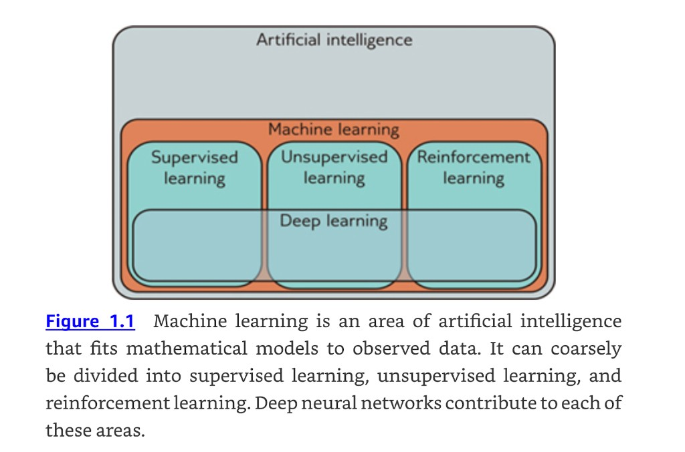{#fig-udl-1-1 width=78%}

Machine learning divides coarsely into three areas — **supervised**,
**unsupervised**, and **reinforcement** learning — and, at the time of writing,
the leading method in all three is a deep network. That three-way split
organizes both the textbook and this course.

::: {.callout-tip appearance="simple"}
## What this book is, and is not
Prince describes the book as "neither terribly theoretical (there are no proofs)
nor extremely practical (there is almost no code)" (p. 1). The goal is the
underlying ideas. These notes add the code back in, because writing the thing
down in PyTorch is often what makes the idea stick.
:::

## Supervised Learning

*Prince §1.1, pp. 1–7.*

A supervised learning model **defines a mapping from input data to an output
prediction**. That one sentence is the whole definition; the rest of §1.1 asks
what the inputs look like, what the outputs look like, what sits in between, and
what "training" means.

### Regression and classification

*Prince §1.1.1, p. 2; figure on p. 3.*

In every supervised problem there is a meaningful real-world input — a sentence,
a sound file, an image — which gets **encoded as a vector of numbers**. That
vector is the model input. The model maps it to an output vector, which is then
translated back into a meaningful real-world prediction. For now the model is a
black box that ingests numbers and returns numbers.

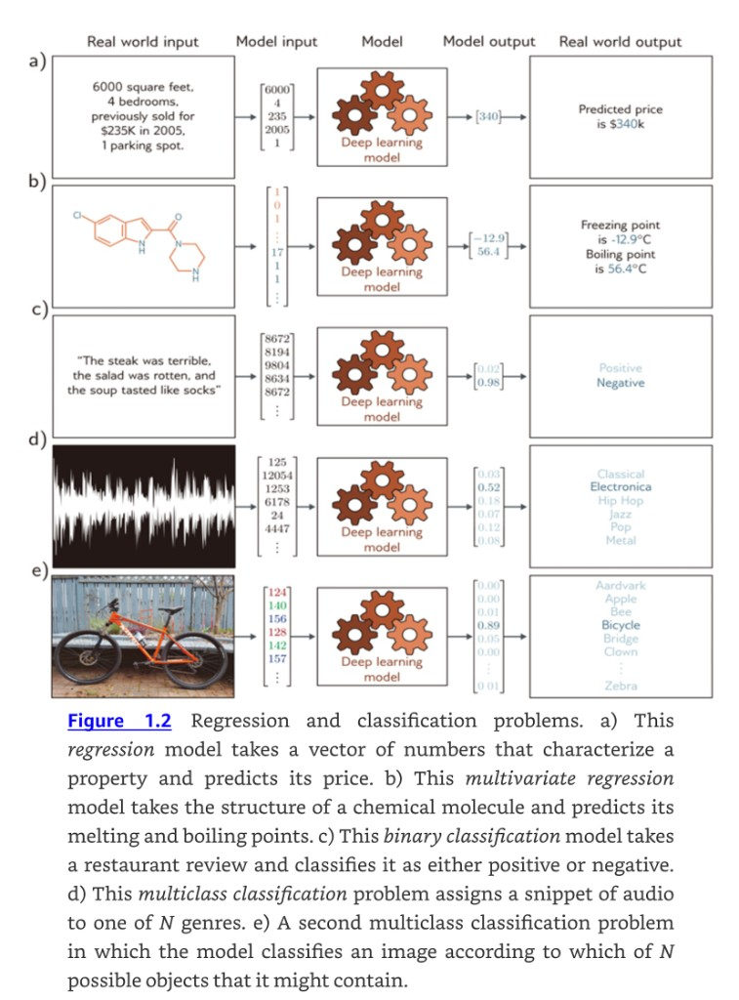{#fig-udl-1-2 width=62%}

The five panels of @fig-udl-1-2 cover the standard taxonomy. What separates them
is entirely the **shape and meaning of the output vector**:

| Panel | Task | Output | Problem type |
|:--|:--|:--|:--|
| a | House price from property features | one continuous number | regression |
| b | Melting and boiling point from molecular structure | two continuous numbers | multivariate regression |
| c | Restaurant review sentiment | probabilities over 2 categories | binary classification |
| d | Music genre from an audio clip | probabilities over $N$ categories | multiclass classification |
| e | Object identity from an image | probabilities over $N$ categories | multiclass classification |

: The taxonomy of @fig-udl-1-2, as described on p. 2. {tbl-colwidths="[8,40,28,24]"}

Two things worth pinning down. A **regression** model returns a continuous
number rather than a category assignment; it becomes **multivariate** regression
as soon as it predicts more than one number. A **classification** model returns
a vector of length $N$ containing the probabilities that the input belongs to
each of the $N$ categories — binary when $N = 2$, multiclass when $N > 2$.

### Inputs are the hard part

*Prince §1.1.2, pp. 2–4.*

The five inputs in @fig-udl-1-2 look superficially alike once they are vectors,
but they differ in ways that will drive every architectural decision in this
course.

**Tabular data has no internal structure.** The house price input is a
fixed-length vector of property characteristics. If we permute the entries and
retrain, we expect the same predictions. Nothing is lost by scrambling the order.

**Text is variable length and order matters.** A review may be any number of
words long, and, as Prince puts it, "*my wife ate the chicken* is not the same as
*the chicken ate my wife*." The text must be encoded numerically first; the
book's running example uses a fixed vocabulary of 10,000 words and simply
concatenates the word indices.

**Audio is fixed length but enormous.** Digital audio is usually sampled at
44.1 kHz with 16-bit integers, so a ten-second clip is 441,000 numbers.

**Images are enormous *and* two-dimensional.** The input is the concatenated RGB
values at every pixel, but the structure is naturally 2D: two pixels above and
below one another are closely related even though they are far apart in the
flattened input vector. Convolutional networks (Chapter 10) exist to exploit
exactly this.

**Molecules have neither fixed size nor a natural ordering.** A molecule
contains varying numbers of atoms connected in different ways, so the model must
ingest the geometric structure as well as the constituent atoms. Graph neural
networks (Chapter 13) exist for this case.

Put some numbers on it:

```{python}
#| label: input-sizes

modalities = [
    ("House features (tabular)",      5,                 "fixed, unstructured"),
    ("Restaurant review, ~40 words",  40,                "variable length, ordered"),
    ("10 s audio @ 44.1 kHz",         10 * 44_100,       "fixed, 1D sequence"),
    ("224x224 RGB image",             224 * 224 * 3,     "fixed, 2D grid"),
    ("1080p video, 5 s @ 30 fps",     5*30*1920*1080*3,  "fixed, 3D grid"),
]

print(f"{'input':<32}{'numbers in':>14}   structure")
print("-" * 78)
for name, dim, structure in modalities:
    print(f"{name:<32}{dim:>14,}   {structure}")
```

The last row is why "just flatten it and use a fully connected layer" stops
being an option almost immediately. A single dense layer mapping that video to
1,000 hidden units would need over 900 billion parameters.

### What is actually in the black box

*Prince §1.1.3, pp. 4–5; figure on p. 4.*

Consider predicting a child's height from their age. The machine learning model
is a mathematical equation describing how average height varies as a function of
age — the cyan curve in @fig-udl-1-3. Run an age of 10 years through it and it
returns a height of 139 cm.

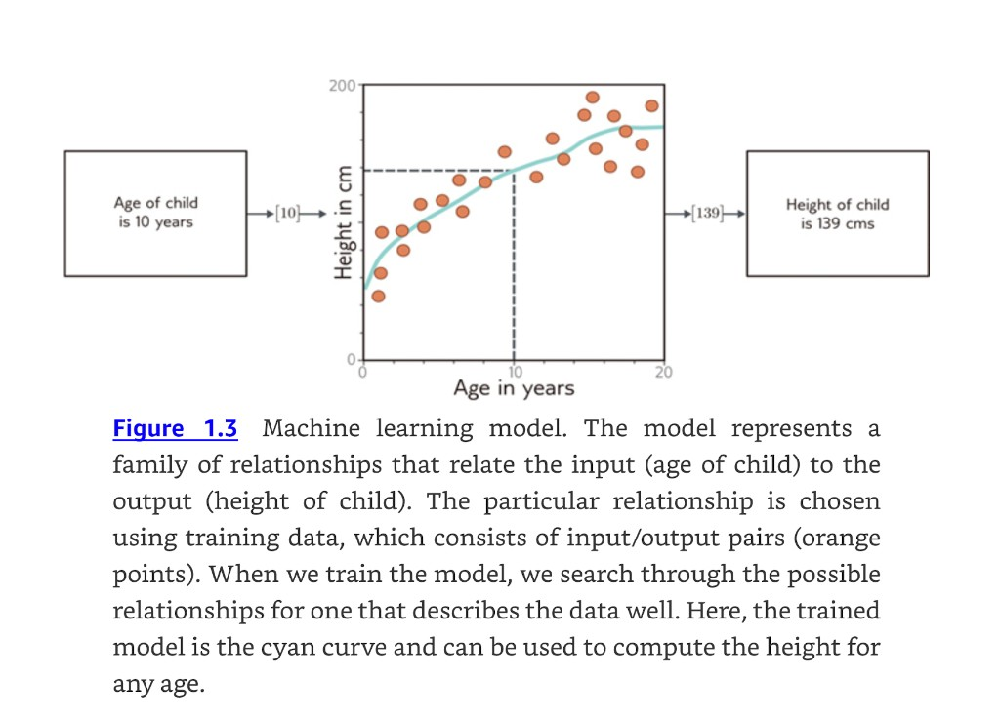{#fig-udl-1-3 width=80%}

The subtlety, and it is the single most important idea in the chapter, is that
the model is not *one* curve. The model represents a **family of equations** — a
family of different cyan curves. The particular member of the family is chosen
using **training data**, the input/output pairs shown as orange points.

> When we talk about training or fitting a model, we mean that we search through
> the family of possible equations (possible cyan curves) relating input to
> output to find the one that describes the training data most accurately.
>
> --- Prince, p. 5

Those input/output pairs "take the role of a teacher or supervisor for the
training process, and this gives rise to the term supervised learning" (p. 5).
The music classifier in @fig-udl-1-2**d** needs a large number of audio clips
whose genre a human expert has already labeled. Labels are expensive, and that expense
is a large part of why unsupervised methods matter.

### Why deep networks

*Prince §1.1.4, p. 5.*

Deep neural networks are a particularly useful family of equations for two
reasons that pull in opposite directions and yet somehow coexist:

1. They represent **an extremely broad family** of input/output relationships.
2. It is nonetheless **easy to search** that family for the relationship that
   describes the training data.

Broad families are usually hard to search and easy-to-search families are
usually narrow. Getting both is the reason deep learning works at all, and
Chapters 6, 7, and 20 return to why.

Deep networks also handle every input difficulty listed above — very large,
variable length, internally structured — and can produce single real numbers,
multiple numbers, or probabilities over two or more classes. Prince adds that
"it is probably hard to imagine equations with these properties, and the reader
should endeavor to suspend disbelief for now." Chapter 3 makes it concrete.

### Structured outputs

*Prince §1.1.5, pp. 5–7; figure on p. 6.*

Outputs can be as large and structured as inputs.

{#fig-udl-1-4 width=70%}

The five panels split into two groups, and the split matters.

In @fig-udl-1-4**a** and **b** the output is high-dimensional and structured, but
that structure is **closely tied to the input** and can therefore be exploited:
if a pixel is labeled "cow," a neighboring pixel with a similar RGB value
probably carries the same label. Panel (a) is multivariate *binary
classification* (one label per pixel); panel (b) is multivariate *regression*
(one depth per pixel).

In @fig-udl-1-4**c–e** the output structure is **not** tied so closely to the
input, and these are harder for two distinct reasons:

- **The output may be genuinely ambiguous.** There are many valid French
  translations of an English sentence, and many images compatible with any
  caption.
- **The output has its own grammar.** Not all strings of words are valid
  sentences; not all collections of RGB values are plausible images. We have to
  learn the mapping *and* respect the grammar of the output space.

The resolution is the hinge of the chapter: that grammar can be learned
**without output labels**, by learning the statistics of a large corpus. Which
takes us to unsupervised learning.

## Unsupervised Learning

*Prince §1.2, pp. 7–11.*

> Constructing a model from input data without corresponding output labels is
> termed unsupervised learning; the absence of output labels means there can be
> no "supervision." Rather than learning a mapping from input to output, the
> goal is to describe or understand the structure of the data.
>
> --- Prince, p. 7

### Generative models

*Prince §1.2.1, pp. 7–9; figures on pp. 8–9.*

The book focuses on **generative** unsupervised models: models that learn to
synthesize new data examples statistically indistinguishable from the training
data. Some describe the probability distribution over the input data explicitly
and generate by sampling from it; others merely learn a mechanism for producing
new examples without ever writing the distribution down. That distinction
separates, for example, variational autoencoders from GANs (Chapter 14).

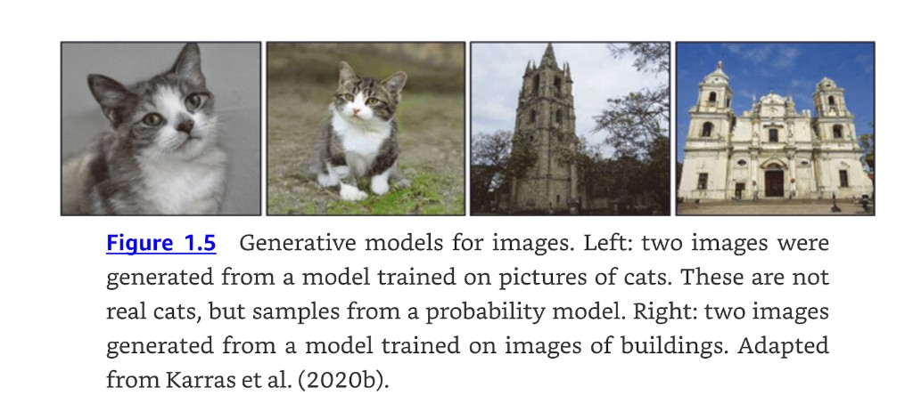{#fig-udl-1-5 width=85%}

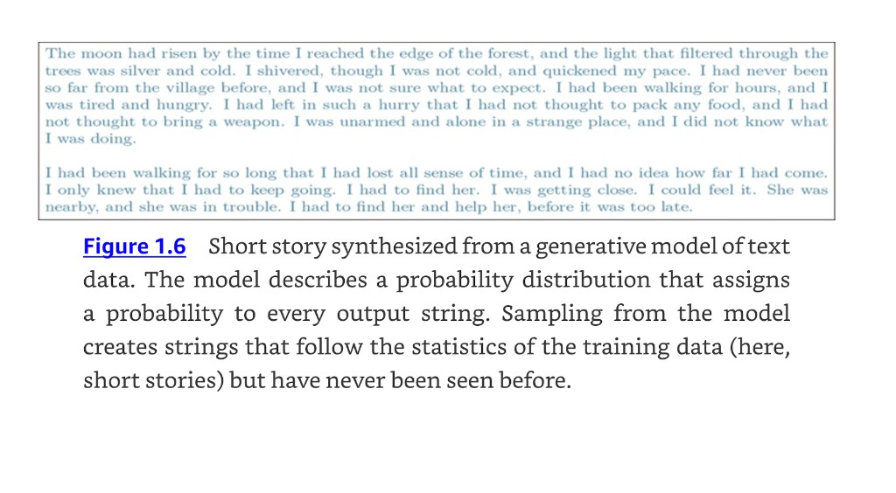{#fig-udl-1-6 width=85%}

Generative models can also synthesize data **under the constraint that some
outputs are predetermined**, which is called *conditional generation*.
@fig-udl-1-7-8 shows the two canonical cases: image inpainting, where the
unmasked pixels must stay fixed, and text completion, where the prefix is given.

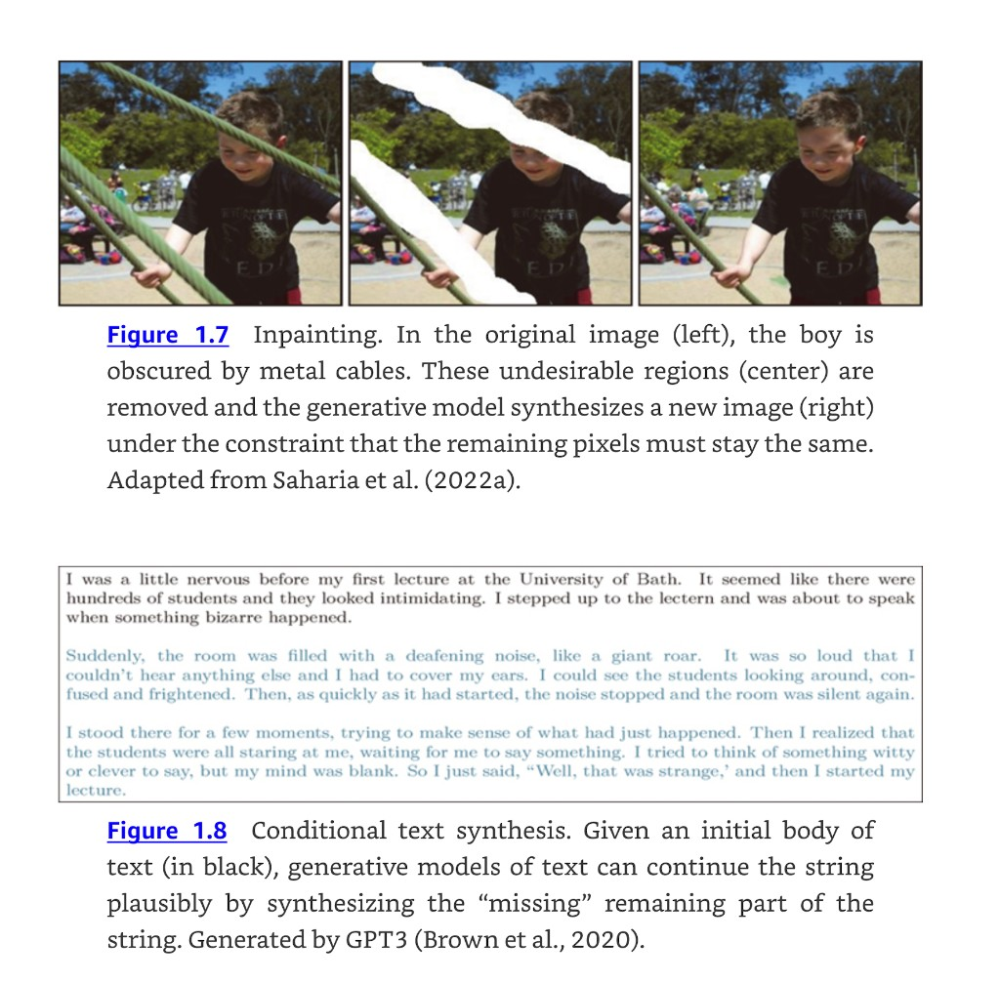{#fig-udl-1-7-8 width=76%}

::: {.callout-important}
## The warning attached to figure 1.8
Prince is explicit about how to read fluent generated text (p. 7): modern
generative models of text are so powerful that they "can appear intelligent,"
because given a body of text followed by a question the model can fill in the
answer by generating the most likely completion of the document. "However, in
reality, the model only knows about the statistics of language and does not
understand the significance of its answers."

This is a 2023 sentence about GPT-3, and how much of it still holds is a live
argument that we will pick up in Week 12. Read it now as a discipline: an
output that reads well is evidence about the model's language statistics, not
about its understanding.
:::

### Latent variables

*Prince §1.2.2, pp. 9–11; figures on pp. 9–10.*

Some generative models exploit an observation about real data: **the data are
lower dimensional than the raw number of observed variables suggests.** The
number of valid, meaningful English sentences is vastly smaller than the number
of strings you get by drawing words at random. Real-world images are a tiny
subset of what you get by drawing random RGB values per pixel, because real
images are generated by physical processes.

@fig-udl-1-9 makes the physical-process argument concrete. The human face has
roughly 42 muscles, so most of the variation across images of the same person in
the same lighting can be described with about 42 numbers — far fewer than the
number of pixels.

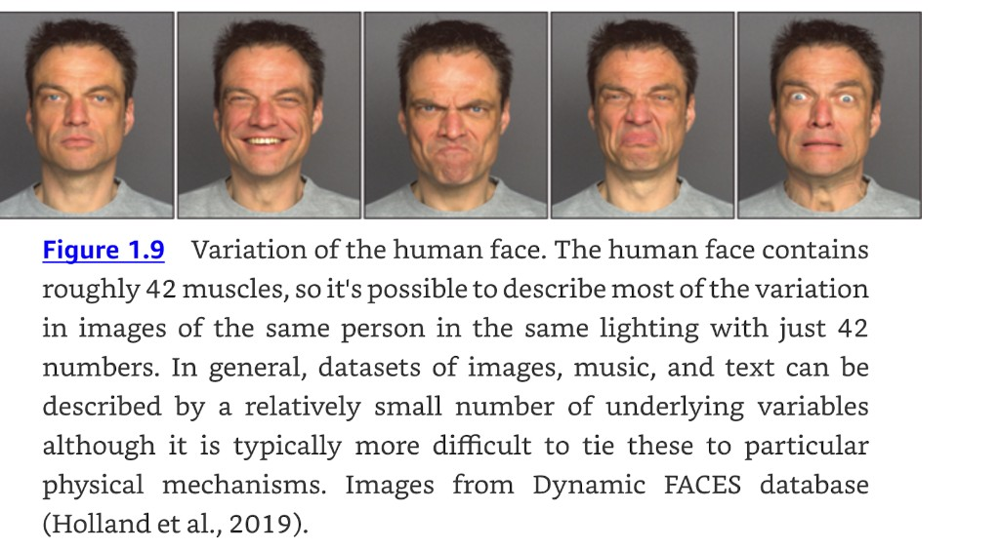{#fig-udl-1-9 width=85%}

The following is a cheap way to feel how tiny the subset of "real" images is.
Every panel below is a legitimate point in the space of $32 \times 32$ RGB
images. None of them will ever be a photograph.

```{python}
#| label: fig-random-images
#| fig-cap: "Eight uniformly random 32x32 RGB images. The space of such images has $256^{3072}$ elements; the images a camera can produce occupy a vanishingly small, highly structured region of it. Generative models are in the business of finding that region."

rng = np.random.default_rng(774)
fig, axes = plt.subplots(1, 8, figsize=(11, 1.6))
for ax in axes:
    ax.imshow(rng.integers(0, 256, size=(32, 32, 3), dtype=np.uint8))
    ax.set_xticks([]); ax.set_yticks([]); ax.grid(False)
plt.tight_layout()
plt.show()

n_pixels = 32 * 32 * 3
print(f"images in the space : 256^{n_pixels}  (about 10^{n_pixels * np.log10(256):.0f})")
print(f"atoms in the universe: about 10^80")
```

This leads to the central construction: describe each data example using a
smaller number of underlying **latent variables**, and let the deep network
describe the mapping from latent variables to data. The latent variables are
given a simple probability distribution **by design** — typically a standard
normal. Then generating a new example is two steps: sample a latent vector from
the simple distribution, push it through the network.

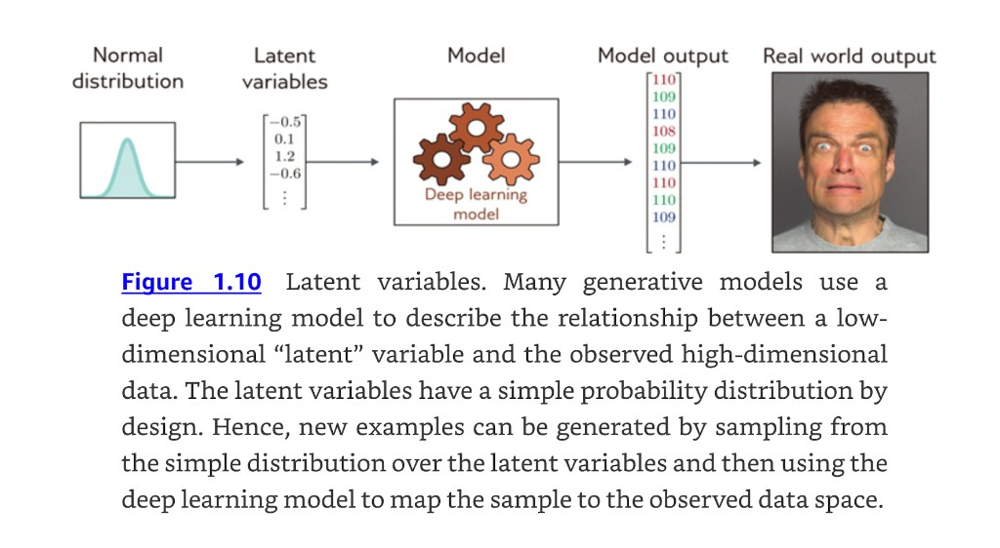{#fig-udl-1-10 width=85%}

Latents also give us new ways to *manipulate* real data. Find the latent
variables underpinning two real examples, interpolate between them in latent
space, and map the intermediate points back to data space. The result is a
sequence of plausible examples mixing the characteristics of both, which is not
at all what you get from interpolating in pixel space.

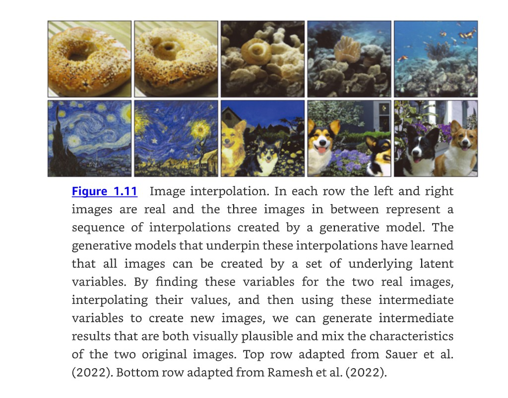{#fig-udl-1-11 width=76%}

### Connecting supervised and unsupervised learning

*Prince §1.2.3, p. 11; figure on p. 11.*

Latent variable models feed back into supervised problems with structured
outputs. Rather than mapping a caption directly to an image, learn a relation
between the latents that explain the text and the latents that explain the
image. Prince lists three advantages (p. 11):

1. **Fewer pairs needed.** The inputs and outputs are now low dimensional.
2. **More plausible outputs.** Any sensible latent value should decode into
   something that looks like a real example.
3. **Multiple valid answers.** Inject randomness into the latent-to-latent
   mapping or the latent-to-image mapping, and one caption yields many images —
   which is the honest response to an ambiguous task.

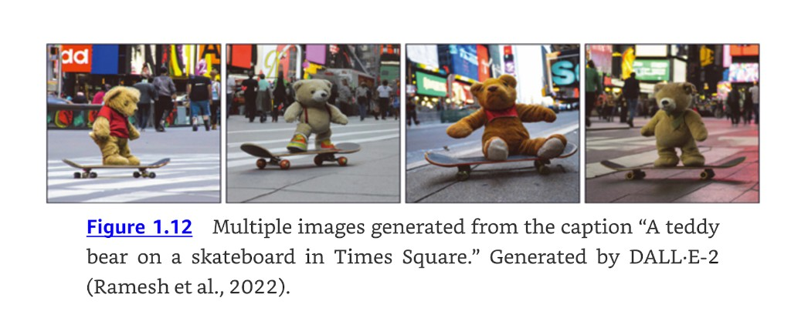{#fig-udl-1-12 width=85%}

## Reinforcement Learning

*Prince §1.3, pp. 11–13; figure on p. 13.*

The third paradigm introduces an **agent** that lives in a world and can perform
certain actions at each time step. Actions change the state of the system,
though not necessarily deterministically, and can produce **rewards**. The goal
is to learn to choose actions that lead to high rewards on average.

Two complications define the field.

**The temporal credit assignment problem.** The reward may arrive long after the
action that earned it, so attributing reward to action is not straightforward.
Teaching a robot to walk, we might reward it for reaching checkpoints on an
obstacle course; reaching a checkpoint takes many joint movements and it is
unclear which of them mattered. In chess with a single reward for winning, the
problem is extreme: the system must work out which of dozens of moves were
instrumental.

**The exploration–exploitation trade-off.** A robot may discover it can make
progress by lying on its side and pushing with one leg. This yields rewards, but
far more slowly than balancing and walking. Should it exploit what it knows or
explore for something better? Prince frames it as: "should it follow this
strategy (exploit what it knows), or should it try different actions to see if
it can improve (explore other opportunities)?" (p. 12).

The smallest experiment that shows the trade-off is a multi-armed bandit: $k$
levers with unknown mean payoffs, and a policy that picks the best-known lever
with probability $1 - \epsilon$ and a random lever otherwise.

```{python}
#| label: fig-bandit
#| fig-cap: "Ten-armed bandit averaged over 300 runs. The purely greedy agent ($\\epsilon = 0$) locks onto whichever arm happened to pay out first and then stops learning, flat at roughly 36% optimal. Both exploring agents beat it. Over this horizon $\\epsilon = 0.1$ is ahead on both measures because it identifies the best arm quickly, but it keeps paying a 10% exploration tax forever. $\\epsilon = 0.01$ is still climbing at step 1,000 and overtakes it eventually, since its tax is only 1%."

def run_bandit(eps, n_runs=300, k=10, steps=1000, seed=0):
    rng = np.random.default_rng(seed)
    q_true = rng.normal(0, 1, size=(n_runs, k))   # true mean payoff per arm
    best = q_true.argmax(axis=1)
    Q = np.zeros((n_runs, k))                     # running estimates
    N = np.zeros((n_runs, k))                     # pull counts
    runs = np.arange(n_runs)
    avg_reward, pct_optimal = np.zeros(steps), np.zeros(steps)

    for t in range(steps):
        explore = rng.random(n_runs) < eps
        a = np.where(explore, rng.integers(0, k, n_runs), Q.argmax(axis=1))
        r = rng.normal(q_true[runs, a], 1.0)
        N[runs, a] += 1
        Q[runs, a] += (r - Q[runs, a]) / N[runs, a]
        avg_reward[t] = r.mean()
        pct_optimal[t] = (a == best).mean()

    return avg_reward, pct_optimal

fig, axes = plt.subplots(1, 2, figsize=(10, 3.4))
for eps, color in [(0.0, ACCENT), (0.01, NDSU_GREEN), (0.1, "#1864AB")]:
    reward, optimal = run_bandit(eps)
    label = "greedy ($\\epsilon = 0$)" if eps == 0 else f"$\\epsilon = {eps}$"
    axes[0].plot(reward, color=color, lw=1.2, label=label)
    axes[1].plot(100 * optimal, color=color, lw=1.2, label=label)

axes[0].set_xlabel("step"); axes[0].set_ylabel("average reward")
axes[0].set_title("Reward earned"); axes[0].legend(fontsize=8)
axes[1].set_xlabel("step"); axes[1].set_ylabel("% optimal action")
axes[1].set_title("Best arm chosen"); axes[1].legend(fontsize=8)
plt.tight_layout()
plt.show()
```

Where does deep learning enter? One route is to use a deep network to map the
observed world state to an action. That mapping is called a **policy**, and the
network a **policy network**. For the robot it maps sensor measurements to joint
movements; for chess it maps the board position to a move.

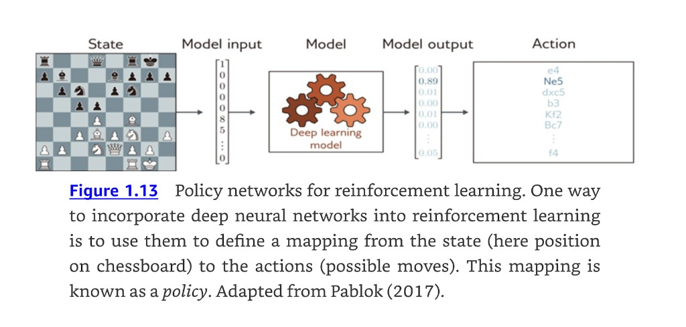{#fig-udl-1-13 width=85%}

::: {.callout-note appearance="simple"}
Reinforcement learning is Chapter 19 of the textbook and is not a graded topic
in this course, but the vocabulary — agent, state, action, reward, policy —
recurs whenever we discuss how language models are aligned after pretraining.
:::

## Ethics

*Prince §1.4, pp. 12–14.*

Prince argues that it "would be irresponsible to write this book without
discussing the ethical implications of artificial intelligence," and that the
technology will change the world at least as much as electricity, the internal
combustion engine, the transistor, or the internet. He then notes that
"scientists and engineers are often unrealistically optimistic about the
outcomes of their work, and the potential for harm is just as great."

Five concerns, with the citations the book gives:

| Concern | The argument | Prince's pointer |
|:--|:--|:--|
| **Bias and fairness** | A system trained on historical salary data reproduces historical bias — it will probably predict that women should be paid less than men. Careless algorithmic decision-making entrenches or aggravates existing bias. | Binns (2018) |
| **Explainability** | Systems with billions of parameters make decisions we cannot account for by inspection. *Local* explanations — why *this* decision — are moderately successful; whether fully transparent complex systems are possible at all is unknown. | Grennan et al. (2022) |
| **Weaponizing AI** | Every significant technology has been applied to war, directly or indirectly. AI is arguably the most powerful ever built and is already being deployed militarily. | Heikkilä (2022) |
| **Concentrating power** | The world's most powerful companies are not investing out of benevolence. Deep learning concentrates power in the few organizations that control it, and automation disproportionately affects lower-paid workers. | David (2015) |
| **Existential risk** | The major existential risks all stem from technology. We should be cautious about building systems more capable and extensible than ourselves — in the best case that puts vast power in the owners' hands, in the worst we cannot control or even understand it. | Tegmark (2018) |

: The five concerns of Prince §1.4, pp. 13–14. {tbl-colwidths="[16,64,20]"}

The list is not exhaustive. Prince also names surveillance, disinformation,
privacy violations, fraud, financial market manipulation, and the climate cost
of training. His historical argument is the one worth sitting with: the online
community of the eighties and early nineties could hardly have predicted spam,
fake news, online harassment, doxxing, or radicalization. Harms from new
technology tend to arrive in forms nobody modeled.

::: {.callout-warning}
## What he asks of us specifically
Prince addresses instructors and students directly (p. 14): "If you are a
professor teaching from this book, you are encouraged to raise these issues with
your students. If you are a student taking a course where this is not done, then
lobby your professor to make this happen."

Consider this section that request being honored, and the invitation standing
all semester. The online course at
[ethics-of-ai.mooc.fi](https://ethics-of-ai.mooc.fi/) is the introductory
resource the book recommends.
:::

## How the Book and the Course Are Organized

*Prince §1.5–§1.7, pp. 15–16.*

The book's structure follows the structure of Chapter 1, and our schedule
follows the book.

| Chapters | Content | Our weeks |
|:--|:--|:--|
| 2–9 | The supervised learning pipeline: shallow and deep networks, how to train them, how to measure and improve performance | 1–9 |
| 10–13 | Architectural variations used across all three paradigms: convolutional networks, residual connections, transformers | 10–13 |
| 14–18 | Unsupervised learning: GANs, variational autoencoders, normalizing flows, diffusion models | 14–15 |
| 19 | Deep reinforcement learning (necessarily superficial, by the author's own description) | not covered |
| 20 | Open questions: why are deep networks easy to train, why do they generalize, why so many parameters, do they need to be deep — plus double descent, grokking, and lottery tickets | woven through |
| 21 | Ethics and deep learning | woven through |

: Book structure from §1.5, p. 15, mapped onto the [course schedule](../schedule.qmd). {tbl-colwidths="[14,66,20]"}

On **how to read it** (§1.7, p. 16): each chapter has a main body, a notes
section, and problems. The main body is self-contained. The notes give
historical development and pointers for further reading and are less
self-contained. Problems are referenced in the margin at the point they should
be attempted, and starred problems have answers on the
[UDL website](https://udlbook.github.io/udlbook/). Prince quotes Pólya —
"Mathematics, you see, is not a spectator sport" — and recommends attempting
problems as you go. Notebook 1.1 on background mathematics is the one to work
through this week if you are rusty.

Chapter 1 itself has no problems; the exercises below are ours plus the
Chapter 2 problem set.

## Supervised Learning, Formalized

*Prince §2.1, pp. 17–18.*

Session 2 turns the informal account of §1.1 into notation we will use for the
rest of the semester.

We want a model that takes an input $\mathbf{x}$ and produces a prediction
$\mathbf{y}$:

$$
\mathbf{y} = \mathbf{f}[\mathbf{x}].
$$ {#eq-model-bare}

Computing $\mathbf{y}$ from $\mathbf{x}$ is called **inference**.

The model is an equation of fixed form, so it represents a *family* of relations
rather than one. Which member of the family we get is determined by the
**parameters** $\boldsymbol{\phi}$, so we should really write:

$$
\mathbf{y} = \mathbf{f}[\mathbf{x}, \boldsymbol{\phi}].
$$ {#eq-model}

**Training** means finding parameters that make sensible predictions. We use a
training dataset of $I$ input/output pairs $\{\mathbf{x}_i, \mathbf{y}_i\}$ and
quantify the mismatch with a scalar **loss** $L[\boldsymbol{\phi}]$. Training is
then a minimization:

$$
\hat{\boldsymbol{\phi}} = \operatorname*{argmin}_{\boldsymbol{\phi}} \big[ L[\boldsymbol{\phi}] \big].
$$ {#eq-argmin}

Afterwards we run the model on **separate test data** to see how well it
generalizes to examples it did not see during training.

::: {.callout-note}
## Notation
Prince uses square brackets $f[\cdot]$ for function application, reserving
parentheses for grouping. Vectors are bold lowercase, matrices bold uppercase.
The loss also depends on the training data, so strictly it is
$L[\{\mathbf{x}_i, \mathbf{y}_i\}, \boldsymbol{\phi}]$, but that is cumbersome
and the data are dropped by convention (p. 18, footnote 1). Appendix A collects
the full notation.
:::

## Linear Regression: The Whole Recipe in Miniature

*Prince §2.2, pp. 18–22; figures on pp. 19–23.*

Everything above appears in the simplest possible model, which is worth walking
through completely because every later chapter is a variation on it.

### The model

*Prince §2.2.1, p. 18.*

$$
y = f[x, \boldsymbol{\phi}] = \phi_0 + \phi_1 x.
$$ {#eq-linear}

Two parameters, $\boldsymbol{\phi} = [\phi_0, \phi_1]^T$: a $y$-intercept and a
slope. @eq-linear defines a family of input/output relations — all possible
lines — and the parameters pick the member.

### The loss

*Prince §2.2.2, pp. 19–21.*

Mismatch is the deviation between the prediction $f[x_i, \boldsymbol{\phi}]$ and
the ground truth $y_i$. Sum the squares over all $I$ pairs:

$$
L[\boldsymbol{\phi}] = \sum_{i=1}^{I} \big( f[x_i, \boldsymbol{\phi}] - y_i \big)^2
                     = \sum_{i=1}^{I} \big( \phi_0 + \phi_1 x_i - y_i \big)^2.
$$ {#eq-least-squares}

This is the **least-squares loss**. Squaring makes the direction of the
deviation irrelevant — a point above the line is as wrong as a point below it —
and there are theoretical reasons for the choice that Chapter 5 supplies.
Training is @eq-argmin applied to @eq-least-squares.

```{python}
#| label: fig-lr-fits
#| fig-cap: "Our version of Prince figures 2.2a–d, p. 20. Panel (a) is the training data, $I = 12$ input/output pairs. Panels (b)–(d) show three choices of $\\boldsymbol{\\phi}$; orange dashed lines are the deviations whose squares are summed in @eq-least-squares. The losses span more than two orders of magnitude, and the ordering matches the visual quality of the fits."

I = 12
x = np.linspace(0.05, 0.95, I)
y = 0.5 + 1.1 * x + np.random.normal(0, 0.08, I)

def loss(phi0, phi1):
    return np.sum((phi0 + phi1 * x - y) ** 2)

candidates = [(0.15, 0.40), (1.55, -0.70), (0.52, 1.07)]
grid = np.linspace(0, 1, 100)

fig, axes = plt.subplots(1, 4, figsize=(11.5, 2.9), sharex=True, sharey=True)
axes[0].scatter(x, y, s=26, color=ACCENT, zorder=3)
axes[0].set_title("a) training data $\\{x_i, y_i\\}$")
axes[0].set_ylabel("$y$")

for ax, letter, (p0, p1) in zip(axes[1:], "bcd", candidates):
    ax.scatter(x, y, s=26, color=ACCENT, zorder=3)
    ax.plot(grid, p0 + p1 * grid, color=NDSU_GREEN, lw=2)
    ax.vlines(x, y, p0 + p1 * x, color="darkorange", ls="--", lw=1.1)
    ax.set_title(f"{letter}) $L = {loss(p0, p1):.2f}$")

for ax in axes:
    ax.set_xlabel("$x$")
    ax.set_ylim(-0.3, 2.0)
plt.tight_layout()
plt.show()
```

With only two parameters we can evaluate the loss for every combination and look
at the whole thing as a surface.

### Training

*Prince §2.2.3, p. 22; figure on p. 23.*

Finding the parameters that minimize the loss is called **model fitting**,
**training**, or **learning**. The basic method: initialize randomly, then
improve by "walking downhill" on the loss surface. Measure the gradient at the
current position, step in the most steeply downhill direction, repeat until the
gradient is flat.

```{python}
#| label: fig-lr-loss-surface
#| fig-cap: "Our version of Prince figures 2.3 and 2.4, pp. 21 and 23. Left: the loss @eq-least-squares as a heatmap over the two parameters, with the three candidate lines from @fig-lr-fits marked. Right: gradient descent from a random start, stepping downhill perpendicular to the contours toward the minimum (white star); markers are every tenth step. The valley is long and narrow, so most of the 250 steps are spent creeping along its floor rather than descending into it — an early glimpse of the conditioning problems Chapter 6 confronts."

p0_grid, p1_grid = np.meshgrid(np.linspace(-0.5, 2.0, 220),
                               np.linspace(-1.5, 2.5, 220))
L = ((p0_grid[..., None] + p1_grid[..., None] * x - y) ** 2).sum(axis=-1)

def grad(phi0, phi1):
    resid = phi0 + phi1 * x - y
    return 2 * resid.sum(), 2 * (resid * x).sum()

path = [(-0.3, 2.3)]
lr, n_steps = 0.05, 250
for _ in range(n_steps):
    g0, g1 = grad(*path[-1])
    path.append((path[-1][0] - lr * g0, path[-1][1] - lr * g1))
path = np.array(path)

# Least squares has a closed form, so we know the exact answer to compare against.
A = np.column_stack([np.ones(I), x])
phi_star = np.linalg.lstsq(A, y, rcond=None)[0]

fig, axes = plt.subplots(1, 2, figsize=(10.5, 3.9))
for ax in axes:
    im = ax.pcolormesh(p0_grid, p1_grid, L, cmap="magma", shading="auto")
    ax.contour(p0_grid, p1_grid, L, levels=14, colors="white", linewidths=0.5, alpha=0.5)
    ax.set_xlabel("$\\phi_0$ (intercept)")
    ax.grid(False)
axes[0].set_ylabel("$\\phi_1$ (slope)")

for (p0, p1), letter in zip(candidates, "bcd"):
    axes[0].plot(p0, p1, "o", color="white", ms=8, mec="k", mew=0.8, zorder=4)
    axes[0].annotate(letter, (p0, p1), textcoords="offset points", xytext=(8, 5),
                     color="white", fontweight="bold")
axes[0].set_title("Loss surface, with the three candidates")

axes[1].plot(path[:, 0], path[:, 1], color=NDSU_GOLD, lw=1.4, zorder=4)
axes[1].plot(path[::10, 0], path[::10, 1], "o", color=NDSU_GOLD, ms=3.5, zorder=4)
axes[1].plot(*phi_star, "*", color="white", ms=18, mec="k", mew=0.8, zorder=5)
axes[1].set_title(f"Gradient descent, {n_steps} steps")
fig.colorbar(im, ax=axes, label="$L[\\boldsymbol{\\phi}]$", pad=0.02)
plt.show()

print(f"gradient descent, {n_steps} steps : phi0 = {path[-1, 0]:.4f}, phi1 = {path[-1, 1]:.4f}")
print(f"closed-form least squares  : phi0 = {phi_star[0]:.4f}, phi1 = {phi_star[1]:.4f}")
```

The iterative approach is unnecessary here — linear regression has a closed-form
solution, which is why the two lines of output agree. We use gradient descent
anyway because it generalizes to models where no closed form exists and where
there are far too many parameters to evaluate the loss on a grid. Chapter 6
makes this precise.

Here is the same fit in PyTorch, which is how every model in this course will
actually be written:

```{python}
#| label: lr-pytorch

import torch.nn as nn

X = torch.tensor(x, dtype=torch.float32).unsqueeze(1)
Y = torch.tensor(y, dtype=torch.float32).unsqueeze(1)

model = nn.Linear(1, 1)              # exactly equation (2.4)
opt = torch.optim.SGD(model.parameters(), lr=0.1)
loss_fn = nn.MSELoss()

for epoch in range(2000):
    opt.zero_grad()
    loss_fn(model(X), Y).backward()
    opt.step()

print(f"PyTorch : phi0 = {model.bias.item():.4f}, phi1 = {model.weight.item():.4f}")
print(f"exact   : phi0 = {phi_star[0]:.4f}, phi1 = {phi_star[1]:.4f}")
```

### Testing

*Prince §2.2.4, p. 22.*

Training loss tells us nothing on its own. We compute the loss on a **separate
set of test data** to see how the model performs in the real world. How well
accuracy generalizes depends on two things:

- **How representative and complete the training data is.**
- **How expressive the model is.** A line may be unable to capture the true
  relationship, which is **underfitting**. A very expressive model may instead
  describe statistical peculiarities of the training data that are atypical,
  producing unusual predictions, which is **overfitting**.

Chapter 8 measures this properly and Chapter 9 fights it with regularization.

## Summary

*Prince §2.3, p. 22.*

Machine learning fits mathematical models to observed data and splits into
supervised, unsupervised, and reinforcement learning; deep networks are the
leading method in all three.

A supervised model is a function $\mathbf{y} = \mathbf{f}[\mathbf{x},
\boldsymbol{\phi}]$ relating inputs to outputs, where $\boldsymbol{\phi}$ selects
one relationship out of a family. To train it we define a loss
$L[\boldsymbol{\phi}]$ over a training set $\{\mathbf{x}_i, \mathbf{y}_i\}$
quantifying the mismatch between predictions and observed outputs, and search
for the parameters that minimize it. We then evaluate on separate test data.

Unsupervised learning drops the output labels and asks instead for the structure
of the data. Generative models synthesize new examples; the ones built on latent
variables assume the data lie near a low-dimensional manifold and use a deep
network to map simple latents to complex data.

Reinforcement learning adds an agent, actions, and delayed rewards, and inherits
two problems the other paradigms do not have: temporal credit assignment and the
exploration–exploitation trade-off.

**Next:** Chapter 3 replaces the straight line of @eq-linear with a shallow
neural network, which is only slightly more complicated but describes a
vastly larger family of relationships.

---

## Exercises

::: {.callout-note appearance="minimal"}
Chapter 1 of Prince has no problem set. Problems 1–5 below are ours; problems
6–8 are Prince problems 2.1–2.3 (p. 24). Starred UDL problems have answers on
the [UDL website](https://udlbook.github.io/udlbook/).
:::

**1.** For each of the following, say whether it is supervised, unsupervised, or
reinforcement learning, and if supervised, which of the four output types in
@fig-udl-1-2 it uses. (a) Predicting remaining useful life of a bearing from
vibration spectra. (b) Clustering warehouse SKUs by demand pattern. (c) Choosing
which machine to run next on a shop floor to minimize makespan. (d) Flagging a
weld as pass/fail from an X-ray image. (e) Generating a synthetic defect image
to augment a small training set.

**2.** Prince says tabular data has "no internal structure; if we change the
order of the inputs and build a new model, then we expect the model prediction
to remain the same" (p. 2). Explain why the same statement is false for the
image in @fig-udl-1-2**e**, and name the property of images that a convolutional
network exploits instead.

**3.** @fig-udl-1-4 splits into two groups: (a)–(b), where output structure is
tied closely to the input, and (c)–(e), where it is not. Place these three tasks
in the correct group and justify each: optical character recognition on a scanned
page; predicting a protein's 3D structure from its amino acid sequence;
generating a product description from a photograph.

**4.** The face in @fig-udl-1-9 is argued to need roughly 42 numbers because the
face has roughly 42 muscles. Give the analogous argument for a dataset of
photographs of a single manufactured part on a fixed inspection rig, and estimate
the latent dimension. What breaks your estimate?

**5.** Pick one of the five concerns in §1.4 and one deep learning application in
your own field. Write a paragraph identifying a concrete way that concern could
materialize, and one design or process decision that would reduce it. Be
specific enough that someone could disagree with you.

**6. (UDL 2.1)** To walk downhill on the loss function @eq-least-squares we need
its gradient with respect to $\phi_0$ and $\phi_1$. Derive expressions for
$\partial L / \partial \phi_0$ and $\partial L / \partial \phi_1$, and check them
against the `grad` function in the code above.

**7. (UDL 2.2)** Show that the minimum of the loss function can be found in
closed form by setting the derivatives from the previous problem to zero and
solving. Note where this argument fails for more complex models — which is why
we use iterative methods.

**8. (UDL 2.3\*)** Reformulate linear regression as a generative model, so
$x = g[y, \boldsymbol{\phi}] = \phi_0 + \phi_1 y$. What is the new loss function?
Find $y = g^{-1}[x, \boldsymbol{\phi}]$, which is what we would use for
inference. Will this model make the same predictions as the discriminative
version on a given dataset? Fit a line to three points both ways in code and
compare.

**9. Computational.** Re-run the bandit experiment in @fig-bandit with
$\epsilon \in \{0, 0.01, 0.1, 0.5\}$ for 20,000 steps. Which $\epsilon$ leads at
step 100, at step 1,000, and at the end? Find roughly where $\epsilon = 0.01$
overtakes $\epsilon = 0.1$, and explain both the crossover and why
$\epsilon = 0.5$ never competes, in terms of the exploration–exploitation
trade-off.

**10. Computational.** Add a single outlier at $(0.5, 5.0)$ to the linear
regression data and re-fit. How much do $\phi_0$ and $\phi_1$ move? Explain
using the squaring in @eq-least-squares, then try minimizing the sum of absolute
deviations instead and compare.

---

## Textbook Reference Map {#sec-reference-map}

Every part of this page, mapped to Prince, *Understanding Deep Learning*
(MIT Press, 2024) [@prince2024]. Page numbers are those of the printed book.

| This page | Prince section | Pages | Figures used |
|:--|:--|:--:|:--|
| Four Words That Are Not Synonyms | Ch. 1 opening | 1–2 | 1.1 (p. 2) |
| Supervised Learning | §1.1 | 1–7 | — |
| — Regression and classification | §1.1.1 | 2 | 1.2 (p. 3) |
| — Inputs are the hard part | §1.1.2 | 2–4 | — |
| — What is actually in the black box | §1.1.3 | 4–5 | 1.3 (p. 4) |
| — Why deep networks | §1.1.4 | 5 | — |
| — Structured outputs | §1.1.5 | 5–7 | 1.4 (p. 6) |
| Unsupervised Learning | §1.2 | 7 | — |
| — Generative models | §1.2.1 | 7–9 | 1.5, 1.6, 1.7 (p. 8); 1.8 (p. 9) |
| — Latent variables | §1.2.2 | 9–11 | 1.9 (p. 9); 1.10, 1.11 (p. 10) |
| — Connecting supervised and unsupervised | §1.2.3 | 11 | 1.12 (p. 11) |
| Reinforcement Learning | §1.3, §1.3.1 | 11–13 | 1.13 (p. 13) |
| Ethics | §1.4 | 12–14 | — |
| How the Book and the Course Are Organized | §1.5, §1.6, §1.7 | 15–16 | — |
| Supervised Learning, Formalized | §2.1 | 17–18 | — |
| Linear Regression: The Whole Recipe | §2.2 | 18–22 | 2.1 (p. 19), 2.2 (p. 20), 2.3 (p. 21), 2.4 (p. 23) |
| — The model | §2.2.1 | 18 | — |
| — The loss | §2.2.2 | 19–21 | — |
| — Training | §2.2.3 | 22 | — |
| — Testing | §2.2.4 | 22 | — |
| Summary | §2.3 | 22 | — |
| Exercises 6–8 | Problems 2.1–2.3 | 24 | — |

: {tbl-colwidths="[34,18,10,38]"}

Equations on this page correspond to Prince as follows: @eq-model-bare is his
(2.1), @eq-model is (2.2), @eq-argmin is (2.3), @eq-linear is (2.4), and
@eq-least-squares is (2.5). His (2.6) is @eq-argmin applied to
@eq-least-squares.

::: {.callout-note appearance="simple"}
## Figure credits
Figures 1.1–1.13 are reproduced unaltered from Prince, *Understanding Deep
Learning* (MIT Press, 2024), which is distributed under a Creative Commons
CC-BY-NC-ND license, and are used here for non-commercial classroom instruction.
Original sources credited within the figures: Noh et al. (2015); Cordts et al.
(2016); Karras et al. (2020b); Saharia et al. (2022a); Brown et al. (2020);
Holland et al. (2019), Dynamic FACES database; Sauer et al. (2022); Ramesh et
al. (2022); Pablok (2017). All other figures on this page are generated by the
code shown.
:::

---

## Further Reading

The book's own recommendations, from §1.6 (p. 15):

- Prince, *Understanding Deep Learning*, Chapters 1–2 [@prince2024] — the assigned reading. Notebook 1.1 covers the background mathematics.
- Goodfellow, Bengio & Courville, *Deep Learning* [@goodfellow2016] — the book Prince describes as the one he intends this to succeed. Excellent, but predates the recent advances.
- Murphy, *Probabilistic Machine Learning* (2022, 2023) — the most up-to-date encyclopedic treatment of machine learning generally.
- Bishop, *Pattern Recognition and Machine Learning* (2006) — older, still excellent and relevant.
- Prince, *Computer Vision: Models, Learning, and Inference* (2012) — same notation as the textbook; thorough introduction to probability and latent variable models, available online.
- Deisenroth, Faisal & Ong, *Mathematics for Machine Learning* (2020) — the background mathematics reference if Appendix B moves too fast.
- Zhang et al., *Dive into Deep Learning* (2023) — a coding-first alternative presentation.
- Sutton & Barto, *Reinforcement Learning: An Introduction* (2018) — the definitive reinforcement learning text, if @fig-bandit interested you.

On ethics:

- The online course at [ethics-of-ai.mooc.fi](https://ethics-of-ai.mooc.fi/), recommended in §1.4.
- Prince, Chapter 21, which returns to ethics with the technical vocabulary of the intervening chapters in hand.
