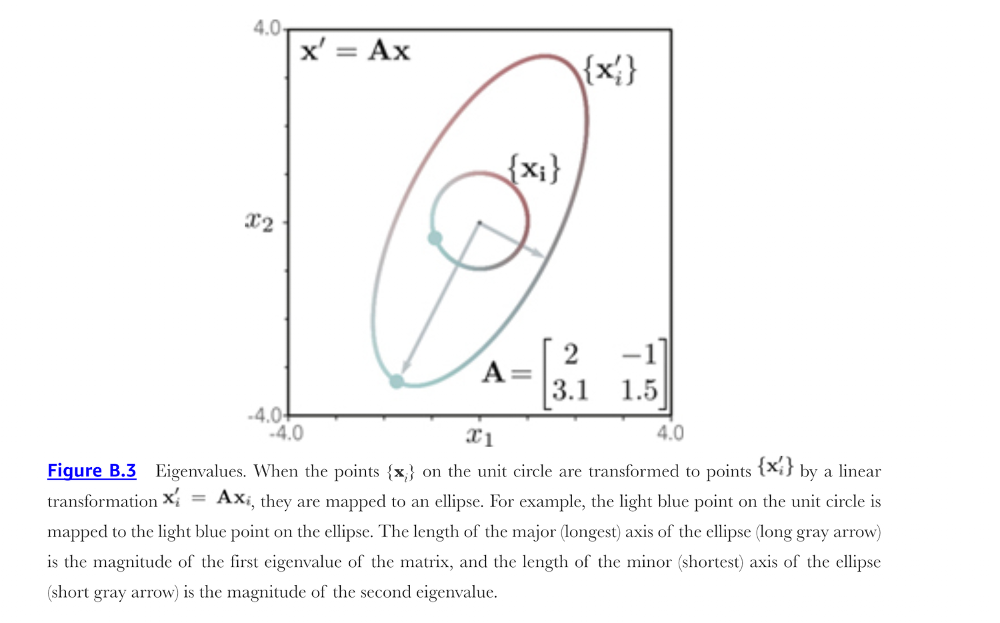
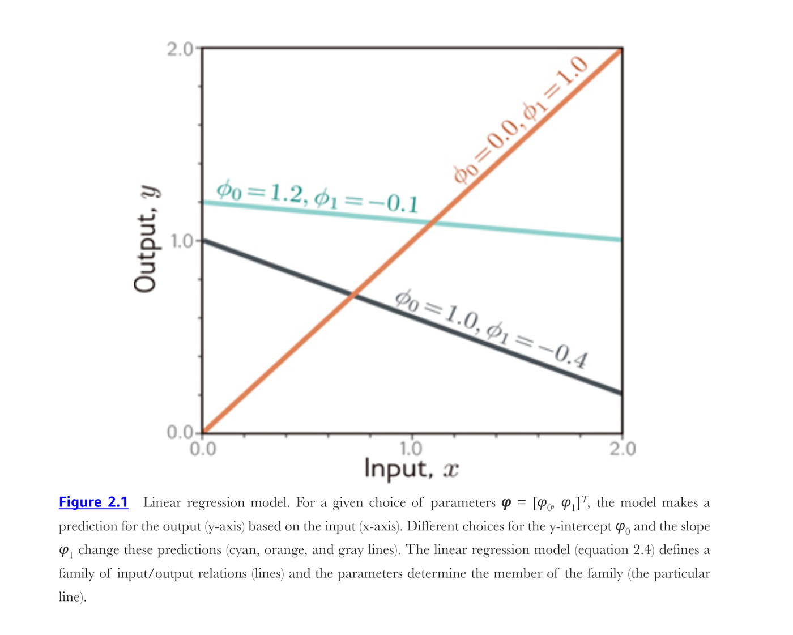
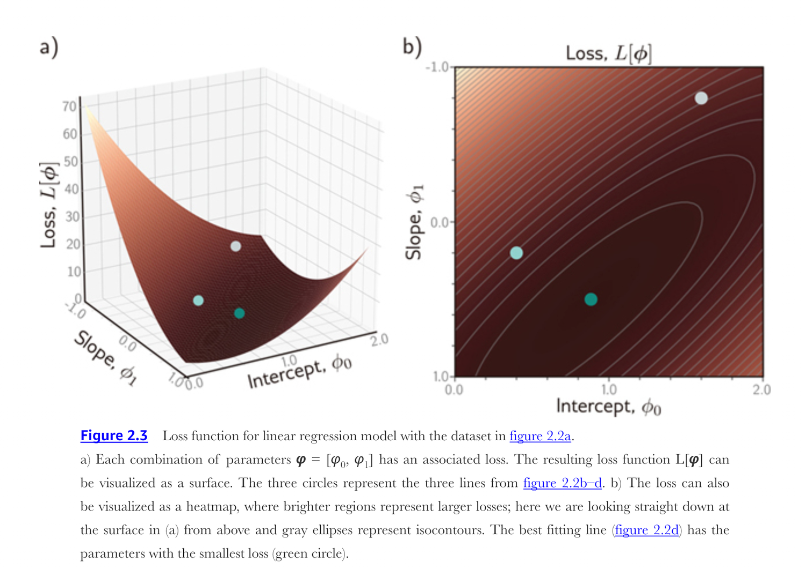
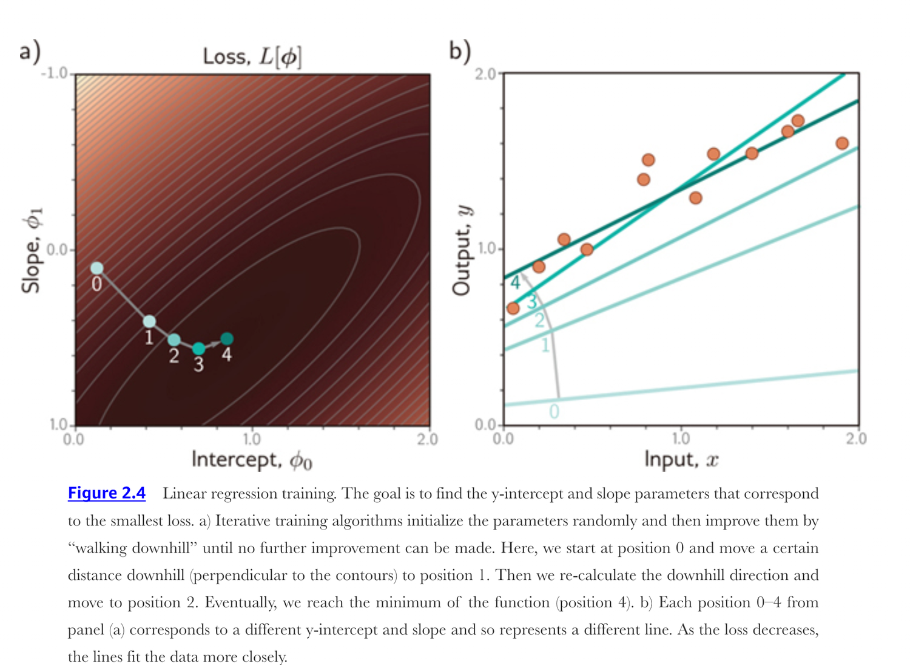

::: {.lecture-meta}
**Reading** Prince, *Understanding Deep Learning*, Appendix B (§B.3–§B.5); Chapter 2 revisited (pp. 17–24) &nbsp;·&nbsp;
**UDL notebooks** 1.1, 2.1
:::

::: {.callout-note appearance="simple"}
## How to read the references in these notes
Every section opens with the section it covers in Prince, *Understanding Deep
Learning* (MIT Press, 2024). Chapter references carry printed page numbers;
Appendix B is cited by section number. Figures taken from the textbook are
captioned with their original figure number; figures generated for this note
are ours. A complete cross-reference table appears in
@sec-reference-map.
:::

## Learning Objectives

By the end of this week you should be able to:

1. Read and write the book's vector, matrix, and tensor notation, and build each object in both NumPy and PyTorch.
2. Compute transposes, norms, matrix products, dot products, and inverses, and say what each one costs.
3. Explain what the eigenspectrum, determinant, and trace tell you about the geometry of a linear map.
4. Recognize diagonal, triangular, orthogonal, and permutation matrices, and exploit the shortcut each one offers.
5. Write a system of linear equations as $\mathbf{y} = \boldsymbol{\phi}_0 + \boldsymbol{\Phi}\mathbf{z}$, and find that same form inside a PyTorch layer.
6. State the shape of $\partial \mathbf{y} / \partial \mathbf{x}$ for scalar, vector, and matrix arguments, and obtain it with automatic differentiation.
7. Restate supervised learning as picking one member of a family $\mathbf{f}[\mathbf{x}, \boldsymbol{\phi}]$, define the least-squares loss, and train 1D linear regression three different ways.
8. Explain, using the eigenspectrum of the loss surface, why rescaling an input changes how fast gradient descent converges.

::: {.callout-tip}
## The code lives in a notebook
This page shows the figures and results; the Python behind them is not printed
here. All of it — every cell, in the order the note uses it — is in a notebook
you can open in the browser with nothing to install:

- **[▶ Open the Week 2 notebook in Google Colab](https://colab.research.google.com/github/harunpirim/IMSE774-NeuralNetworks/blob/main/notebooks/week02-math-background.ipynb)** — all of this page's code, in order.
- **[▶ UDL notebook 1.1 — Background mathematics](https://colab.research.google.com/github/udlbook/udlbook/blob/main/Notebooks/Chap01/1_1_BackgroundMathematics.ipynb)** — Prince's own exercises on linear functions, derivatives, and sums.
- **[▶ UDL notebook 2.1 — Supervised learning](https://colab.research.google.com/github/udlbook/udlbook/blob/main/Notebooks/Chap02/2_1_Supervised_Learning.ipynb)** — the 1D linear regression fit of §2.2, by hand.

Colab gives you a Python environment with NumPy, matplotlib, and PyTorch
already installed. In Colab, run a cell with **Shift+Enter**; `!pip install`
anything else you need. If you prefer to work locally, `pip install -r
requirements.txt` from the [course
repository](https://github.com/harunpirim/IMSE774-NeuralNetworks) gives you the
same environment.
:::

```{python}
#| label: setup
#| code-fold: true
#| code-summary: "Plotting setup (click to expand)"

import numpy as np
import matplotlib.pyplot as plt
import torch

torch.manual_seed(774)
np.random.seed(774)

plt.rcParams.update({
    "figure.figsize": (7, 4),
    "figure.dpi": 130,
    "axes.spines.top": False,
    "axes.spines.right": False,
    "axes.grid": True,
    "grid.alpha": 0.25,
    "font.size": 10,
    "axes.titlesize": 11,
    "axes.labelsize": 10,
    "legend.frameon": False,
})

NDSU_GREEN = "#005643"
NDSU_GOLD  = "#FFC72C"
ACCENT     = "#C1121F"
```

---

## Why an Appendix Gets a Whole Week

Prince puts the mathematics in an appendix because the book is about ideas, not
about linear algebra. We spend a week on it anyway, for a practical reason: from
Chapter 3 onward, every model in this course is a stack of the object in
@eq-linear-matrix with a nonlinearity dropped between the layers. If
$\boldsymbol{\Phi}\mathbf{z}$ and $\partial \mathbf{y}/\partial \mathbf{x}$ are
comfortable, the rest of the semester is about *which* $\boldsymbol{\Phi}$ and
*how* to find it. If they are not, every chapter will feel like notation.

So this note takes Appendix B one section at a time and writes each definition
as code you can run. Then it returns to Chapter 2 and does supervised learning again, this
time with the matrix machinery in hand.

---

## Vectors, Matrices, and Tensors

*Prince §B.3.*

A **vector** $\mathbf{x} \in \mathbb{R}^{D}$ is a one-dimensional array of $D$
numbers, which we always take to be arranged in a column. A **matrix**
$\mathbf{Y} \in \mathbb{R}^{D_1 \times D_2}$ is a two-dimensional array with
$D_1$ rows and $D_2$ columns. A **tensor** $\mathbf{z} \in \mathbb{R}^{D_1
\times D_2 \dots \times D_N}$ is an $N$-dimensional array.

Prince flags the terminological trap himself: all three of these are stored in
objects called "tensors" in PyTorch and TensorFlow. In this course, *tensor*
means whichever of the three the shape says it is, and the shape is the thing
to check first when code misbehaves.

```{python}
#| label: shapes

x = np.array([1.0, 2.0, 3.0])                  # vector in R^3
Y = np.array([[1.0, 2.0, 3.0],
              [4.0, 5.0, 6.0]])                # matrix in R^{2x3}
Z = np.arange(24, dtype=float).reshape(2, 3, 4)  # 3D tensor

for name, obj in [("x", x), ("Y", Y), ("Z", Z)]:
    print(f"{name}: shape {obj.shape}, ndim {obj.ndim}, {obj.size} numbers")

# PyTorch calls all three "tensors" -- only the shape distinguishes them.
xt, Yt, Zt = torch.tensor(x), torch.tensor(Y), torch.tensor(Z)
print("\ntorch types:", type(xt).__name__, type(Yt).__name__, type(Zt).__name__)
print("torch shapes:", tuple(xt.shape), tuple(Yt.shape), tuple(Zt.shape))
```

::: {.callout-note}
## Notation
Prince writes function application with square brackets, $f[\cdot]$, reserving
parentheses for grouping. Vectors are bold lowercase, matrices bold uppercase,
and scalars plain. Parameters are collected in $\boldsymbol{\phi}$. We follow
that convention everywhere, including in variable names in the code.
:::

A column vector is a matrix with one column, but NumPy's one-dimensional arrays
are neither rows nor columns until you say so. That ambiguity is the single most
common source of shape bugs in student code, so it is worth being deliberate:

```{python}
#| label: column-vs-row

v = np.array([1.0, 2.0, 3.0])
print("1-D array      :", v.shape, "-- neither row nor column")
print("explicit column:", v.reshape(-1, 1).shape)
print("explicit row   :", v.reshape(1, -1).shape)

# The difference is not cosmetic: broadcasting treats these completely differently.
print("\ncolumn - row gives an outer difference:")
print(v.reshape(-1, 1) - v.reshape(1, -1))
```

### Transpose

*Prince §B.3.1.*

The transpose $\mathbf{A}^T \in \mathbb{R}^{D_2 \times D_1}$ of a matrix
$\mathbf{A} \in \mathbb{R}^{D_1 \times D_2}$ reflects it about the principal
diagonal, so the $k^{th}$ column becomes the $k^{th}$ row. Transposing a product
reverses the order:

$$
(\mathbf{A}\mathbf{B})^T = \mathbf{B}^T \mathbf{A}^T.
$$ {#eq-transpose-product}

The transpose of a column vector is a row vector and vice versa. Checking
@eq-transpose-product on a random product:

```{python}
#| label: transpose

A = np.random.randn(3, 4)
B = np.random.randn(4, 2)

print("A:", A.shape, " B:", B.shape, " AB:", (A @ B).shape, " (AB)^T:", (A @ B).T.shape)
print("(AB)^T == B^T A^T :", np.allclose((A @ B).T, B.T @ A.T))
print("A^T B^T is not even defined:", A.T.shape, "x", B.T.shape)
```

The order reversal is not a convention you have to remember; it is forced by the
shapes. $\mathbf{A}^T\mathbf{B}^T$ would ask a $4 \times 3$ matrix to multiply a
$2 \times 4$ one, which is not a legal product.

### Vector and matrix norms

*Prince §B.3.2.*

For a vector $\mathbf{z}$, the $\ell_p$ norm is

$$
\lVert \mathbf{z} \rVert_p = \left( \sum_{d=1}^{D} \lvert z_d \rvert^{p} \right)^{1/p}.
$$ {#eq-lp-norm}

When $p = 2$ this is the length of the vector — the **Euclidean norm**, which is
so much the default in deep learning that the subscript is usually dropped and
it is written $\lVert \mathbf{z} \rVert$. When $p = \infty$ the operator returns
the largest absolute entry. The same idea extends to matrices: the $\ell_2$ norm
of a matrix $\mathbf{Z}$ is the **Frobenius norm**,

$$
\lVert \mathbf{Z} \rVert_F = \left( \sum_{i=1}^{I} \sum_{j=1}^{J} \lvert z_{ij} \rvert^{2} \right)^{1/2},
$$ {#eq-frobenius}

which is just the Euclidean norm of the matrix flattened into one long vector.
The three vector norms of $\mathbf{z} = [3, -4, 12]^T$, and the two readings of
the Frobenius norm:

```{python}
#| label: norms

z = np.array([3.0, -4.0, 12.0])
for p in [1, 2, np.inf]:
    print(f"||z||_{p!s:<4} = {np.linalg.norm(z, p):.4f}")

Z = np.array([[1.0, 2.0], [3.0, 4.0]])
print("\n||Z||_F              =", round(np.linalg.norm(Z, "fro"), 4))
print("Euclidean norm of the flattened matrix =", round(np.linalg.norm(Z.ravel()), 4))
```

Which $p$ you choose changes what "small" means, and that has consequences we
will meet again in Chapter 9, where a norm added to the loss is what
regularization *is*. @fig-norm-balls shows the shape of the set of vectors whose
norm equals one under each choice.

```{python}
#| label: fig-norm-balls
#| fig-cap: "The unit ball $\\{\\mathbf{z} : \\lVert\\mathbf{z}\\rVert_p = 1\\}$ in two dimensions for three values of $p$. The $\\ell_1$ ball has corners on the axes, which is why an $\\ell_1$ penalty drives parameters exactly to zero and produces sparse solutions; the $\\ell_2$ ball is round, so it shrinks every parameter but zeroes none; the $\\ell_\\infty$ ball is the square that bounds the largest single entry."

theta = np.linspace(0, 2 * np.pi, 721)
dirs = np.stack([np.cos(theta), np.sin(theta)])       # unit directions, shape (2, 721)

def unit_ball(p):
    """Rescale each direction so that its p-norm is exactly one."""
    if np.isinf(p):
        scale = np.max(np.abs(dirs), axis=0)
    else:
        scale = np.sum(np.abs(dirs) ** p, axis=0) ** (1 / p)
    return dirs / scale

fig, ax = plt.subplots(figsize=(4.6, 4.6))
for p, label, color in [(1, r"$p = 1$", ACCENT),
                        (2, r"$p = 2$", NDSU_GREEN),
                        (np.inf, r"$p = \infty$", "#4C6EF5")]:
    ball = unit_ball(p)
    ax.plot(ball[0], ball[1], color=color, lw=2, label=label)

ax.set_aspect("equal")
ax.set_xlim(-1.45, 1.45); ax.set_ylim(-1.45, 1.45)
ax.set_xlabel("$z_1$"); ax.set_ylabel("$z_2$")
ax.legend(loc="upper right")
ax.set_title("Unit balls of three $\\ell_p$ norms")
plt.show()
```

### Products

*Prince §B.3.3–§B.3.4.*

The product $\mathbf{C} = \mathbf{A}\mathbf{B}$ of matrices $\mathbf{A} \in
\mathbb{R}^{D_1 \times D_2}$ and $\mathbf{B} \in \mathbb{R}^{D_2 \times D_3}$ is
the matrix $\mathbf{C} \in \mathbb{R}^{D_1 \times D_3}$ with entries

$$
C_{ij} = \sum_{d=1}^{D_2} A_{id} B_{dj}.
$$ {#eq-matmul}

The **dot product** of two vectors $\mathbf{a}, \mathbf{b} \in \mathbb{R}^{D}$
is the scalar

$$
\mathbf{a}^T \mathbf{b} = \mathbf{b}^T \mathbf{a} = \sum_{d=1}^{D} a_d b_d,
$$ {#eq-dot}

and it is proportional to the two lengths and the cosine of the angle
$\theta$ between the vectors:

$$
\mathbf{a}^T \mathbf{b} = \lVert \mathbf{a} \rVert \, \lVert \mathbf{b} \rVert \cos[\theta].
$$ {#eq-dot-angle}

@eq-dot-angle is worth committing to memory. It is why a dot product is the
natural way to ask "how aligned are these two things?", and it is the operation
at the heart of the attention mechanism in Chapter 12. Written out as a loop,
@eq-matmul reproduces what the `@` operator does, and @eq-dot-angle recovers the
angle between two vectors:

```{python}
#| label: products

A = np.random.randn(3, 4)
B = np.random.randn(4, 2)

# Equation (B.10) written out literally, then the same thing vectorized.
C_loop = np.zeros((3, 2))
for i in range(3):
    for j in range(2):
        C_loop[i, j] = sum(A[i, d] * B[d, j] for d in range(4))

print("(B.10) as an explicit loop matches the @ operator:",
      np.allclose(C_loop, A @ B))

a = np.array([2.0, 1.0, 0.0])
b = np.array([1.0, 3.0, 1.0])
dot = a @ b
cos_theta = dot / (np.linalg.norm(a) * np.linalg.norm(b))
print(f"\na . b            = {dot:.4f}")
print(f"||a|| ||b|| cos t = {np.linalg.norm(a) * np.linalg.norm(b) * cos_theta:.4f}")
print(f"angle between them = {np.degrees(np.arccos(cos_theta)):.2f} degrees")
```

### Inverse

*Prince §B.3.5.*

A square matrix $\mathbf{A}$ may or may not have an inverse $\mathbf{A}^{-1}$
with $\mathbf{A}^{-1}\mathbf{A} = \mathbf{A}\mathbf{A}^{-1} = \mathbf{I}$. A
matrix with no inverse is **singular**. Inverses of products, like transposes,
reverse:

$$
(\mathbf{A}\mathbf{B})^{-1} = \mathbf{B}^{-1} \mathbf{A}^{-1}.
$$ {#eq-inverse-product}

Inverting a $D \times D$ matrix in general takes $\mathcal{O}[D^3]$ operations,
which is the reason so much of numerical linear algebra is about avoiding it.

```{python}
#| label: inverse

M = np.random.randn(4, 4)
N = np.random.randn(4, 4)
print("(MN)^-1 == N^-1 M^-1 :", np.allclose(np.linalg.inv(M @ N),
                                            np.linalg.inv(N) @ np.linalg.inv(M)))

# A singular matrix: the third column is the sum of the first two.
S = np.array([[1.0, 2.0, 3.0],
              [4.0, 5.0, 9.0],
              [7.0, 8.0, 15.0]])
print("det(S) =", round(float(np.linalg.det(S)), 12), " -> singular, no inverse")

print("\nCost of a D x D inverse, in units of elementary operations:")
print(f"{'D':>7} {'D^3':>18} {'relative to D=10':>20}")
for D in [10, 100, 1_000, 10_000]:
    print(f"{D:>7} {D**3:>18,} {D**3 / 10**3:>20,.0f}x")
```

Ten thousand inputs is a small image, and a dense $10{,}000 \times 10{,}000$
inverse is a trillion operations. This is why we will never invert anything in
this course: we will solve, factorize, or — from Chapter 6 onward — walk downhill
instead.

### Subspaces

*Prince §B.3.6.*

Consider $\mathbf{A} \in \mathbb{R}^{D_1 \times D_2}$. The product
$\mathbf{A}\mathbf{x}$ is the $D_2$ columns of $\mathbf{A}$ weighted by the
$D_2$ entries of $\mathbf{x}$, so the set of reachable outputs is exactly the
**linear subspace spanned by the columns** — the **column space**. The part of
the input space that gets crushed to nothing, $\{\mathbf{x} : \mathbf{A}\mathbf{x}
= \mathbf{0}\}$, is the **nullspace**.

::: {.callout-important}
## Read the inequality in §B.3.6 carefully
The passage says the product cannot reach the whole output space when there are
*more* columns than rows. The sentence that follows it — and the geometry — give
the correct condition: $\mathbf{A}\mathbf{x}$ reaches only the span of the
columns, so it fails to fill $\mathbb{R}^{D_1}$ when the column space has
dimension less than $D_1$, which for a full-rank matrix means $D_2 < D_1$: a
tall, "portrait" matrix. A wide matrix ($D_2 > D_1$) covers the output space but
pays for it with a nullspace of dimension at least $D_2 - D_1$. The output
below checks both cases.
:::

```{python}
#| label: subspaces

tall = np.array([[1.0, 0.0],          # 3x2: two columns, three-dimensional output
                 [0.0, 1.0],
                 [1.0, 1.0]])
wide = np.array([[1.0, 0.0, 1.0],     # 2x3: three columns, two-dimensional output
                 [0.0, 1.0, 1.0]])

for name, A in [("tall (3x2)", tall), ("wide (2x3)", wide)]:
    D1, D2 = A.shape
    rank = np.linalg.matrix_rank(A)
    print(f"{name}: rank {rank}, column space is {rank}-D inside R^{D1}, "
          f"nullspace is {D2 - rank}-D inside R^{D2}")

# The tall matrix maps all of R^2 onto a single plane in R^3: every output
# satisfies the same linear constraint, here x1 + x2 - x3 = 0.
pts = tall @ np.random.randn(2, 5)
print("\nresiduals of x1 + x2 - x3 for five random outputs:",
      np.round(pts[0] + pts[1] - pts[2], 12))

# The wide matrix reaches everything in R^2, but it has a direction it destroys.
null_dir = np.array([1.0, 1.0, -1.0])
print("wide @ nullspace direction =", wide @ null_dir)
```

### Eigenspectrum, determinant, and trace

*Prince §B.3.7–§B.3.8.*

Multiply every point on the unit circle by a $2 \times 2$ matrix and the circle
becomes an ellipse, as in @fig-udl-b-3. The radii of the major and minor axes
record how much the transformation stretches space in its most and least
expanded directions. In higher dimensions a $D$-dimensional sphere maps to a
$D$-dimensional ellipsoid and the same reading applies.

{#fig-udl-b-3 width=76%}

The **spectral norm** of a square matrix is its largest absolute eigenvalue: the
largest change in magnitude the matrix can apply to a unit-length vector, and
hence the Lipschitz constant of the transformation. The set of eigenvalues is
the **eigenspectrum**, and it tells us about the magnitude of the scaling
applied across all directions. Two scalars summarize that information:

- The **determinant** $\lvert \mathbf{A} \rvert$ is the product of the
  eigenvalues, so it is related to the average scaling the matrix applies.
  Matrices with small absolute determinants shrink vectors; matrices with large
  ones grow them. A singular matrix has determinant zero, and there is then at
  least one direction that gets mapped to the origin — exactly the nullspace of
  §B.3.6.
- The **trace** is the sum of the diagonal entries, and also the sum of the
  eigenvalues.

```{python}
#| label: fig-ellipse
#| fig-cap: "Our version of @fig-udl-b-3, using the same matrix. Left: the unit circle. Right: its image, with the two grey arrows drawn along the semi-axes of the ellipse. The lengths printed under the figure confirm what the picture shows: the semi-axis lengths are the *singular values* of $\\mathbf{A}$, and their product is $\\lvert\\det \\mathbf{A}\\rvert$, the factor by which area is scaled."

A = np.array([[2.0, -1.0],
              [3.1, 1.5]])

theta = np.linspace(0, 2 * np.pi, 721)
circle = np.stack([np.cos(theta), np.sin(theta)])
ellipse = A @ circle

U, S, Vt = np.linalg.svd(A)

fig, axes = plt.subplots(1, 2, figsize=(9.2, 4.4))
axes[0].plot(circle[0], circle[1], color=NDSU_GREEN, lw=2)
axes[0].set_title(r"unit circle $\{\mathbf{x}_i\}$")

axes[1].plot(ellipse[0], ellipse[1], color=ACCENT, lw=2)
for k in range(2):
    axis = U[:, k] * S[k]
    axes[1].annotate("", xy=axis, xytext=(0, 0),
                     arrowprops=dict(arrowstyle="->", color="0.35", lw=1.6))
    axes[1].annotate(f"$\\sigma_{k+1} = {S[k]:.2f}$", xy=axis * 0.55,
                     textcoords="offset points", xytext=(6, 6), color="0.25")
axes[1].set_title(r"image $\{\mathbf{x}'_i\} = \mathbf{A}\mathbf{x}_i$")

for ax in axes:
    ax.set_aspect("equal")
    ax.set_xlim(-4, 4); ax.set_ylim(-4, 4)
    ax.set_xlabel("$x_1$"); ax.set_ylabel("$x_2$")
plt.tight_layout()
plt.show()

radii = np.linalg.norm(ellipse, axis=0)
eigvals = np.linalg.eigvals(A)
print(f"longest / shortest radius measured on the ellipse : {radii.max():.4f} / {radii.min():.4f}")
print(f"singular values of A                              : {S[0]:.4f} / {S[1]:.4f}")
print(f"eigenvalues of A                                  : {eigvals[0]:.4f}, {eigvals[1]:.4f}")
print(f"|det A| = {abs(np.linalg.det(A)):.4f}   product of singular values = {S.prod():.4f}"
      f"   product of |eigenvalues| = {np.abs(eigvals).prod():.4f}")
print(f"trace A = {np.trace(A):.4f}   sum of eigenvalues = {eigvals.sum().real:.4f}")
```

::: {.callout-important}
## Axis lengths are singular values
The figure's caption describes the axis lengths as the eigenvalue magnitudes.
For this particular $\mathbf{A}$ the eigenvalues are complex — the matrix
rotates as well as stretches — and the printed output shows the semi-axes
matching the *singular values* $3.77$ and $1.62$ instead, while both eigenvalues
have modulus $2.47$. The two coincide when $\mathbf{A}$ is symmetric, which is
the case that matters most for us: the loss surfaces of @sec-conditioning are
governed by a symmetric matrix, and there eigenvalues and singular values are
the same numbers. The determinant identity holds either way, and is a good check
to keep in your pocket.
:::

---

## Special Types of Matrix

*Prince §B.4.*

Inverting a general $\mathbf{A} \in \mathbb{R}^{D \times D}$ costs
$\mathcal{O}[D^3]$, as does computing its determinant. Matrices with structure
are much cheaper, and a surprising amount of practical numerical work consists of
arranging for the matrices you have to be one of these.

| Type | Structure | What it buys |
|:--|:--|:--|
| Diagonal | zeros off the principal diagonal | inverse is $1/d_{ii}$ entrywise; $\lvert\mathbf{A}\rvert = \prod_i d_{ii}$ |
| Identity | diagonal of ones | its own inverse; determinant one |
| Triangular | zeros above (lower) or below (upper) the diagonal | invertible in $\mathcal{O}[D^2]$; determinant is the product of the diagonal |
| Orthogonal | rotation and reflection about the origin | $\mathbf{A}^{-1} = \mathbf{A}^{T}$; all $\lvert\lambda_i\rvert = 1$; $\lvert\mathbf{A}\rvert = \pm 1$ |
| Permutation | one entry equal to one in each row and column | orthogonal, so $\mathbf{A}^{-1} = \mathbf{A}^{T}$; $\lvert\mathbf{A}\rvert = \pm 1$ |

: The four structured matrices of Prince §B.4.1–§B.4.4. {tbl-colwidths="[16,44,40]"}

An orthogonal matrix maps the circle of @fig-udl-b-3 to another circle of the
same radius, rotated and possibly reflected — which is exactly why all its
eigenvalues have magnitude one. A permutation matrix is a special case: it
permutes the entries of a vector, as in Prince's example (B.16),

$$
\begin{bmatrix} 0 & 1 & 0 \\ 0 & 0 & 1 \\ 1 & 0 & 0 \end{bmatrix}
\begin{bmatrix} a \\ b \\ c \end{bmatrix} =
\begin{bmatrix} b \\ c \\ a \end{bmatrix}.
$$ {#eq-permutation}

Each shortcut in the table, checked in turn:

```{python}
#| label: special-matrices

D = 5
d = np.random.uniform(1.0, 3.0, D)
Diag = np.diag(d)
print("diagonal : inverse is the reciprocal :",
      np.allclose(np.linalg.inv(Diag), np.diag(1 / d)),
      "| det == product of diagonal :", np.isclose(np.linalg.det(Diag), d.prod()))

Lower = np.tril(np.random.randn(D, D) + 3 * np.eye(D))
print("triangular: det == product of diagonal :",
      np.isclose(np.linalg.det(Lower), np.diag(Lower).prod()))

# A QR factorization is a convenient source of an orthogonal matrix.
Q, _ = np.linalg.qr(np.random.randn(D, D))
print("orthogonal: A^-1 == A^T :", np.allclose(np.linalg.inv(Q), Q.T),
      "| |eigenvalues| :", np.round(np.abs(np.linalg.eigvals(Q)), 6),
      "| det :", round(float(np.linalg.det(Q)), 6))

P = np.array([[0.0, 1.0, 0.0],
              [0.0, 0.0, 1.0],
              [1.0, 0.0, 0.0]])
abc = np.array(["a", "b", "c"])
print("\npermutation (B.16):", (P @ np.array([1.0, 2.0, 3.0])),
      "->", abc[np.argmax(P, axis=1)])
print("permutation: P^-1 == P^T :", np.allclose(np.linalg.inv(P), P.T))
```

---

## Linear Equations in Matrix Form {#sec-linear-matrix}

*Prince §B.4.5–§B.4.6.*

Linear algebra is the mathematics of **linear functions**, which have the form

$$
f[z_1, z_2, \dots z_D] = \phi_1 z_1 + \phi_2 z_2 + \dots \phi_D z_D,
$$ {#eq-linear-fn}

where $\phi_1, \dots, \phi_D$ are the parameters that define the function. We
almost always add a constant $\phi_0$ to the right-hand side. Strictly that
makes the function **affine** rather than linear, but machine learning calls it
linear anyway, and so will we.

Now take a collection of such functions,

$$
\begin{aligned}
y_1 &= \phi_{10} + \phi_{11} z_1 + \phi_{12} z_2 + \phi_{13} z_3 \\
y_2 &= \phi_{20} + \phi_{21} z_1 + \phi_{22} z_2 + \phi_{23} z_3 \\
y_3 &= \phi_{30} + \phi_{31} z_1 + \phi_{32} z_2 + \phi_{33} z_3,
\end{aligned}
$$ {#eq-linear-system}

and stack them:

$$
\begin{bmatrix} y_1 \\ y_2 \\ y_3 \end{bmatrix} =
\begin{bmatrix} \phi_{10} \\ \phi_{20} \\ \phi_{30} \end{bmatrix} +
\begin{bmatrix}
\phi_{11} & \phi_{12} & \phi_{13} \\
\phi_{21} & \phi_{22} & \phi_{23} \\
\phi_{31} & \phi_{32} & \phi_{33}
\end{bmatrix}
\begin{bmatrix} z_1 \\ z_2 \\ z_3 \end{bmatrix},
$$ {#eq-linear-matrix-full}

or, for short,

$$
\mathbf{y} = \boldsymbol{\phi}_0 + \boldsymbol{\Phi}\mathbf{z},
\qquad y_i = \phi_{i0} + \sum_{j=1}^{3} \phi_{ij} z_j.
$$ {#eq-linear-matrix}

::: {.callout-note appearance="simple"}
The printed equation (B.18) opens its third row with $\phi_{20}$ where the
matrix form (B.19) has $\phi_{30}$. @eq-linear-system above is written with
$\phi_{30}$, which is what the rest of the appendix — and the notebook —
assume.
:::

@eq-linear-matrix is the single most important object in this course. Every
fully connected layer of every network from Chapter 3 onward computes exactly
this and then applies a nonlinearity to the result. `torch.nn.Linear` *is*
@eq-linear-matrix: its `weight` attribute is $\boldsymbol{\Phi}$ and its `bias`
is $\boldsymbol{\phi}_0$.

```{python}
#| label: linear-matrix-form

Phi0 = np.array([0.5, -1.0, 2.0])                 # phi_10, phi_20, phi_30
Phi  = np.array([[1.0, -2.0,  0.5],
                 [0.0,  1.5, -1.0],
                 [2.0,  0.0,  0.25]])
z = np.array([1.0, 2.0, -1.0])

# Equation (B.18), one scalar equation at a time.
y_scalar = np.array([Phi0[i] + sum(Phi[i, j] * z[j] for j in range(3)) for i in range(3)])

# Equation (B.19), all at once.
y_matrix = Phi0 + Phi @ z

print("scalar form :", y_scalar)
print("matrix form :", y_matrix)
print("identical   :", np.allclose(y_scalar, y_matrix))

# The same equation, as a PyTorch layer.
layer = torch.nn.Linear(3, 3)
with torch.no_grad():
    layer.weight.copy_(torch.tensor(Phi, dtype=torch.float32))
    layer.bias.copy_(torch.tensor(Phi0, dtype=torch.float32))

y_torch = layer(torch.tensor(z, dtype=torch.float32))
print("nn.Linear   :", y_torch.detach().numpy())
```

A layer applied to a whole batch of inputs is the same equation with
$\mathbf{z}$ replaced by a matrix whose columns are the examples — which is why
training on a batch of 256 costs barely more than training on one:

```{python}
#| label: batched-linear

Zbatch = np.random.randn(3, 256)                   # 256 inputs, one per column
Ybatch = Phi0[:, None] + Phi @ Zbatch              # broadcasting adds phi_0 to every column
print("input batch :", Zbatch.shape, " output batch:", Ybatch.shape)
print("column 7 matches the single-input computation:",
      np.allclose(Ybatch[:, 7], Phi0 + Phi @ Zbatch[:, 7]))
```

---

## Matrix Calculus {#sec-matrix-calculus}

*Prince §B.5.*

If $y = f[x]$ is a scalar function of a scalar, the derivative $\partial y /
\partial x$ says how $y$ changes for a small change in $x$. The same idea
extends upward, and the only thing to keep straight is the *shape* of the
answer:

| Function | Argument | Derivative $\partial y / \partial \mathbf{x}$ |
|:--|:--|:--|
| $y = \mathrm{f}[\mathbf{x}]$, $y \in \mathbb{R}$ | $\mathbf{x} \in \mathbb{R}^{D}$ | a $D$-dimensional vector with $i^{th}$ element $\partial y / \partial x_i$ |
| $\mathbf{y} = \mathbf{f}[\mathbf{x}]$, $\mathbf{y} \in \mathbb{R}^{D_y}$ | $\mathbf{x} \in \mathbb{R}^{D_x}$ | a $D_x \times D_y$ matrix with element $(i, j)$ equal to $\partial y_j / \partial x_i$ — the **Jacobian**, sometimes written $\nabla_{\mathbf{x}}\mathbf{y}$ |
| $\mathbf{y} = \mathbf{f}[\mathbf{X}]$, $\mathbf{y} \in \mathbb{R}^{D_y}$ | $\mathbf{X} \in \mathbb{R}^{D_1 \times D_2}$ | a 3D tensor of the $\partial y_j / \partial x_{ik}$ |

: The three shapes of derivative in Prince §B.5. {tbl-colwidths="[30,24,46]"}

These have superficially similar forms to the scalar case:

$$
y = ax \quad \longrightarrow \quad \frac{\partial y}{\partial x} = a,
$$ {#eq-deriv-scalar}

and

$$
\mathbf{y} = \mathbf{A}\mathbf{x} \quad \longrightarrow \quad \frac{\partial \mathbf{y}}{\partial \mathbf{x}} = \mathbf{A}^{T}.
$$ {#eq-deriv-matrix}

::: {.callout-important}
## Why the transpose in @eq-deriv-matrix
Prince's table puts $\partial y_j / \partial x_i$ at position $(i, j)$: inputs
index the rows, outputs the columns. That is **denominator layout**, and it is
what makes the answer $\mathbf{A}^T$ rather than $\mathbf{A}$. PyTorch,
JAX, and most autodiff libraries use the opposite (**numerator**) layout, so
`jacobian` returns $\mathbf{A}$. Neither is wrong; they are transposes of each
other. When a gradient in your code has the wrong shape, layout is the first
thing to suspect.
:::

The Jacobian of $\mathbf{y} = \mathbf{A}\mathbf{x}$, and the derivative of a
scalar function of a vector:

```{python}
#| label: jacobians

A_t = torch.tensor([[2.0, -1.0, 0.5],
                    [3.1,  1.5, -2.0]])              # 2 x 3, so D_y = 2, D_x = 3
x0 = torch.tensor([0.4, -1.2, 2.0])

J = torch.autograd.functional.jacobian(lambda v: A_t @ v, x0)
print("torch jacobian shape (numerator layout, D_y x D_x):", tuple(J.shape))
print("equals A            :", torch.allclose(J, A_t))
print("its transpose is Prince's dy/dx = A^T, shape", tuple(J.T.shape))

# Scalar-valued function of a vector: the derivative is a vector of the same size.
x = torch.tensor([1.0, -2.0, 3.0], requires_grad=True)
y = (x ** 2).sum()                                    # y = ||x||^2, so dy/dx = 2x
y.backward()
print("\nd/dx of ||x||^2 :", x.grad.numpy(), " expected 2x :", (2 * x).detach().numpy())
```

Automatic differentiation is what makes deep learning practical: we write the
forward computation, and the library assembles the derivative by applying the
chain rule to the operations we used. Chapter 7 opens up the machinery. For now
it is enough to trust it — and to verify it, which is what the two lines below
do, on the object we actually care about: the gradient of a loss.

```{python}
#| label: autograd-vs-analytic

X = torch.randn(20, 3)
y_obs = torch.randn(20)
phi = torch.zeros(3, requires_grad=True)

loss = ((X @ phi - y_obs) ** 2).sum()
loss.backward()

analytic = 2 * X.T @ (X @ phi.detach() - y_obs)      # dL/dphi = 2 X^T (X phi - y)
print("autograd :", phi.grad.numpy().round(4))
print("analytic :", analytic.numpy().round(4))
print("agree    :", torch.allclose(phi.grad, analytic, atol=1e-5))
```

### Probability, briefly

*Prince, Appendix C; used from Chapter 5 onward.*

Probability lives in Appendix C rather than Appendix B, and we will need it
properly in Week 5, where loss functions turn out to be maximum likelihood in
disguise. Four things carry us until then: a **joint** distribution
$\Pr(x, y)$, the **marginal** obtained by summing or integrating one variable
away, the **conditional** $\Pr(y \mid x) = \Pr(x, y) / \Pr(x)$, and the
**expectation** $\mathbb{E}[f[x]] = \int f[x]\Pr(x)\,dx$, which in code is
usually just an average over samples.

```{python}
#| label: expectation

samples = np.random.normal(loc=2.0, scale=1.5, size=100_000)
print(f"E[x]   sampled {samples.mean():.4f}   exact 2.0000")
print(f"E[x^2] sampled {(samples ** 2).mean():.4f}   exact {2.0**2 + 1.5**2:.4f}")
```

---

## Supervised Learning, Revisited

*Prince §2.1, pp. 17–18.*

With the notation settled, Chapter 2 reads differently the second time. A
supervised model is a function that takes an input and returns a prediction,

$$
\mathbf{y} = \mathbf{f}[\mathbf{x}],
$$ {#eq-model-bare}

and running it to get $\mathbf{y}$ from $\mathbf{x}$ is called **inference**.
The model is just a mathematical equation of fixed form, so it describes a whole
*family* of possible relationships between inputs and outputs; the
**parameters** $\boldsymbol{\phi}$ specify which member of that family we have:

$$
\mathbf{y} = \mathbf{f}[\mathbf{x}, \boldsymbol{\phi}].
$$ {#eq-model}

To **train** or **learn** a model is to find parameters that describe the true
relationship. A learning algorithm takes a training set of $I$ input/output
pairs $\{\mathbf{x}_i, \mathbf{y}_i\}$ and manipulates $\boldsymbol{\phi}$ until
the inputs predict their corresponding outputs as closely as possible. We
measure "as closely as possible" with a scalar **loss** $L[\boldsymbol{\phi}]$
and minimize it:

$$
\hat{\boldsymbol{\phi}} = \operatorname*{argmin}_{\boldsymbol{\phi}} \big[ L[\boldsymbol{\phi}] \big].
$$ {#eq-argmin}

If the loss is small after this minimization, we have found parameters that
predict the training outputs accurately. That is not the same as a useful model,
so we then run it on separate **test data** to see how well it *generalizes* to
examples it did not observe during training. If that performance is adequate, we
are ready to deploy.

Three verbs, in order, for the rest of the semester: **train**, then **test**,
then **infer**.

## Linear Regression, in Matrix Form

*Prince §2.2, pp. 18–22.*

### The model

*Prince §2.2.1, p. 18; figure on p. 19.*

A 1D linear regression model describes the relationship between input $x$ and
output $y$ as a straight line:

$$
y = f[x, \boldsymbol{\phi}] = \phi_0 + \phi_1 x.
$$ {#eq-linear}

This is @eq-linear-fn with $D = 1$, and it has two parameters:
$\boldsymbol{\phi} = [\phi_0, \phi_1]^T$, a $y$-intercept and a slope.
@fig-udl-2-1 shows the family: @eq-linear defines all possible lines, and the
parameters pick one.

{#fig-udl-2-1 width=68%}

### The loss

*Prince §2.2.2, pp. 19–21; figures on pp. 20–21.*

The loss quantifies the mismatch between predictions and observations. Sum the
squared deviations over the $I$ training pairs:

$$
L[\boldsymbol{\phi}] = \sum_{i=1}^{I} \big( f[x_i, \boldsymbol{\phi}] - y_i \big)^2
                     = \sum_{i=1}^{I} \big( \phi_0 + \phi_1 x_i - y_i \big)^2.
$$ {#eq-least-squares}

@fig-udl-2-2 shows three candidate lines against the same twelve points, with the
deviations drawn as dashed verticals and the resulting loss printed above each
panel. The visual quality of the fit and the value of the loss agree, which is
the whole point: the loss is a number that stands in for "looks right".

{#fig-udl-2-2 width=76%}

Because the model has only two parameters, the loss can be drawn in full, as a
surface over $(\phi_0, \phi_1)$ or as a heatmap seen from above. @fig-udl-2-3
does both. Every point in those pictures is one line in @fig-udl-2-2, and the
bottom of the bowl is the best line.

{#fig-udl-2-3 width=82%}

Training is @eq-argmin applied to @eq-least-squares:

$$
\hat{\boldsymbol{\phi}} = \operatorname*{argmin}_{\boldsymbol{\phi}}
\left[ \sum_{i=1}^{I} \big( \phi_0 + \phi_1 x_i - y_i \big)^2 \right].
$$ {#eq-lr-train}

### The same loss, in matrix form

Now use Appendix B. Stack the $I$ inputs into a **design matrix** $\mathbf{X}
\in \mathbb{R}^{I \times 2}$ whose first column is all ones and whose second
column holds the inputs. Then all $I$ predictions are one matrix–vector product,
$\mathbf{X}\boldsymbol{\phi}$, and @eq-least-squares becomes a squared Euclidean
norm:

$$
L[\boldsymbol{\phi}] = \lVert \mathbf{X}\boldsymbol{\phi} - \mathbf{y} \rVert^2 .
$$ {#eq-lr-matrix}

Differentiating with the rules of §B.5 and setting the result to zero gives the
**normal equations** $\mathbf{X}^T\mathbf{X}\hat{\boldsymbol{\phi}} =
\mathbf{X}^T\mathbf{y}$, which is Prince's problem 2.2 done in two lines instead
of a page of algebra. The gradient we will need in a moment is

$$
\frac{\partial L}{\partial \boldsymbol{\phi}} = 2\mathbf{X}^T(\mathbf{X}\boldsymbol{\phi} - \mathbf{y}).
$$ {#eq-lr-gradient}

Here is a small process dataset to fit: the cure temperature of a composite
panel against the tensile strength of the finished part.

```{python}
#| label: lr-data

I = 24
temp = np.random.uniform(140, 200, I)                      # cure temperature, deg C
strength = 12.0 + 0.42 * temp + np.random.normal(0, 2.5, I)  # tensile strength, MPa

X = np.column_stack([np.ones(I), temp])                    # design matrix, I x 2
print("design matrix:", X.shape, " first two rows:\n", X[:2])
print("\nnormal equations X^T X phi = X^T y:")
print("X^T X =\n", np.round(X.T @ X, 2))
```

### Training, three ways

*Prince §2.2.3, p. 22; figure on p. 23.*

The process of finding the parameters that minimize the loss is called **model
fitting**, **training**, or **learning**. The basic method is to choose the
initial parameters randomly and then improve them by "walking downhill" on the
loss function until we reach the bottom: measure the gradient of the surface at
the current position, take a step in the most steeply downhill direction, and
repeat until the gradient is flat and we can improve no further. @fig-udl-2-4
shows five such steps, and the five lines they correspond to.

{#fig-udl-2-4 width=82%}

Linear regression does not actually need the iterative approach — it has a
closed-form solution — but every model after Chapter 3 does, so it is worth
running all three and comparing what comes back.

```{python}
#| label: lr-three-ways

# 1. Closed form: solve the normal equations. Note that we *solve*, never invert.
phi_closed = np.linalg.solve(X.T @ X, X.T @ strength)

# 2. Gradient descent, using equation (B.21) via the gradient in @eq-lr-gradient.
def gradient_descent(X, y, lr, n_steps):
    phi = np.zeros(X.shape[1])
    history = []
    for _ in range(n_steps):
        phi = phi - lr * (2 * X.T @ (X @ phi - y))
        history.append(np.sum((X @ phi - y) ** 2))
    return phi, np.array(history)

phi_gd, _ = gradient_descent(X, strength, lr=1e-6, n_steps=20_000)

# 3. PyTorch: the same model as one nn.Linear layer, trained by autograd.
Xt = torch.tensor(temp, dtype=torch.float32).unsqueeze(1)
Yt = torch.tensor(strength, dtype=torch.float32).unsqueeze(1)

model = torch.nn.Linear(1, 1)                     # exactly equation (2.4)
opt = torch.optim.Adam(model.parameters(), lr=0.1)
loss_fn = torch.nn.MSELoss()
for _ in range(4_000):
    opt.zero_grad()
    loss_fn(model(Xt), Yt).backward()
    opt.step()

print(f"{'method':<22}{'phi_0':>10}{'phi_1':>10}{'loss':>12}")
for name, p in [("closed form", phi_closed),
                ("gradient descent", phi_gd),
                ("PyTorch (Adam)", np.array([model.bias.item(), model.weight.item()]))]:
    print(f"{name:<22}{p[0]:>10.4f}{p[1]:>10.4f}{np.sum((X @ p - strength) ** 2):>12.4f}")
```

The closed form and PyTorch land on the same line. Plain gradient descent, given
a learning rate that looks perfectly reasonable, does not: after twenty thousand
steps its slope is still nearly 30% too large, its intercept is nowhere near the
right value, and its loss sits about a third above the minimum. That failure is
not a bug and it is not cured by being patient. It is the most useful thing on
this page, so the next section takes it apart.

### Why the iterative methods struggle {#sec-conditioning}

The loss @eq-lr-matrix is a quadratic bowl, and the matrix that describes its
curvature is $\partial^2 L / \partial \boldsymbol{\phi}^2 = 2\mathbf{X}^T
\mathbf{X}$ — symmetric, so §B.3.7's eigenvalues and singular values coincide
here. Its eigenspectrum *is* the shape of the bowl: the largest eigenvalue is
the curvature in the steepest direction, the smallest is the curvature along the
floor of the valley, and their ratio is the **condition number**. Gradient
descent is stable only for step sizes below $2/\lambda_{\max}$, and it makes
progress along the valley floor at a rate set by $\lambda_{\min}$. A large ratio
therefore means a step size chosen small enough to be safe is far too small to
make progress.

Cure temperature runs from 140 to 200, so the second column of $\mathbf{X}$ is
enormous compared to the column of ones, and the bowl is a knife-edge ravine.
**Standardizing** the input — subtracting the mean and dividing by the standard
deviation — makes the two columns orthogonal and equal in length, which turns
the ravine into a perfectly round bowl.

```{python}
#| label: fig-conditioning
#| fig-cap: "Left and centre: contours of $\\log_{10} L$ over the two parameters, drawn on square, equal-aspect windows so the two are directly comparable. Gold is 400 gradient descent steps from the origin; the white star is the closed-form optimum. With the raw input the minimum sits in a hairline ravine and the descent stalls on its floor after one plunge; standardized, the bowl is circular, so every step points straight at the star and the path is a single line through it -- the slight overshoot is the step size sitting deliberately close to the stability limit $2/\\lambda_{\\max}$. Right: loss against iteration, log-log, with the closed-form optimum as the dashed line."

z = (temp - temp.mean()) / temp.std()
Xz = np.column_stack([np.ones(I), z])

for name, M in [("raw", X), ("standardized", Xz)]:
    ev = np.linalg.eigvalsh(2 * M.T @ M)
    print(f"{name:<14} Hessian eigenvalues {ev[0]:12.4f} {ev[1]:14.4f}"
          f"   condition number {ev[1] / ev[0]:12.1f}")

ev_raw = np.linalg.eigvalsh(2 * X.T @ X)
ev_std = np.linalg.eigvalsh(2 * Xz.T @ Xz)
lr_raw, lr_std = 0.9 * 2 / ev_raw[1], 0.9 * 2 / ev_std[1]

n_steps = 2_000
phi_raw, hist_raw = gradient_descent(X,  strength, lr=lr_raw, n_steps=n_steps)
phi_std, hist_std = gradient_descent(Xz, strength, lr=lr_std, n_steps=n_steps)

best = np.sum((X @ phi_closed - strength) ** 2)
reached = [int(np.argmax(h <= best * 1.01)) + 1 if (h <= best * 1.01).any() else None
           for h in (hist_raw, hist_std)]
print(f"\nlargest stable step size -- raw: {lr_raw:.3e}, standardized: {lr_std:.3e}")
print(f"steps to get within 1% of the optimum -- raw: {reached[0]}, standardized: {reached[1]}")

def descent_path(M, lr, n=400):
    """The first n gradient descent steps, starting from the origin."""
    path = [np.zeros(2)]
    for _ in range(n):
        path.append(path[-1] - lr * (2 * M.T @ (M @ path[-1] - strength)))
    return np.array(path)

fig, axes = plt.subplots(1, 3, figsize=(12.4, 3.8))

for ax, (title, M, lr) in zip(axes[:2], [("raw input", X, lr_raw),
                                         ("standardized input", Xz, lr_std)]):
    phi_hat = np.linalg.solve(M.T @ M, M.T @ strength)
    path = descent_path(M, lr)

    # A square, equal-aspect window centred on the path, so that a condition
    # number of one really does look like a circle.
    corners = np.vstack([path, phi_hat])
    centre = 0.5 * (corners.min(axis=0) + corners.max(axis=0))
    half = 0.7 * (corners.max(axis=0) - corners.min(axis=0)).max() + 0.5
    lo, hi = centre - half, centre + half

    g0, g1 = np.meshgrid(np.linspace(lo[0], hi[0], 250),
                         np.linspace(lo[1], hi[1], 250))
    Lg = ((g0[..., None] + g1[..., None] * M[:, 1] - strength) ** 2).sum(axis=-1)
    ax.contourf(g0, g1, np.log10(Lg), levels=25, cmap="magma")
    ax.contour(g0, g1, np.log10(Lg), levels=12, colors="white", linewidths=0.4, alpha=0.5)

    ax.plot(path[:, 0], path[:, 1], color=NDSU_GOLD, lw=1.6)
    ax.plot(path[::20, 0], path[::20, 1], "o", color=NDSU_GOLD, ms=3)
    ax.plot(*phi_hat, "*", color="white", ms=16, mec="k", mew=0.7)
    ax.set_title(f"{title}: $\\kappa = {np.linalg.cond(M.T @ M):.3g}$")
    ax.set_xlabel("$\\phi_0$"); ax.set_ylabel("$\\phi_1$")
    ax.set_aspect("equal")
    ax.grid(False)

steps = np.arange(1, n_steps + 1)
axes[2].plot(steps, hist_raw, color=ACCENT, label="raw")
axes[2].plot(steps, hist_std, color=NDSU_GREEN, label="standardized")
axes[2].axhline(best, color="0.4", ls="--", lw=1, label="closed form")
axes[2].set_xscale("log"); axes[2].set_yscale("log")
axes[2].set_xlabel("gradient descent step"); axes[2].set_ylabel("$L[\\boldsymbol{\\phi}]$")
axes[2].set_title("convergence")
axes[2].legend()
plt.tight_layout()
plt.show()
```

Every trick in Chapter 7 — initialization schemes, normalization layers,
momentum, Adam — exists to fight the effect this cell demonstrates on two
parameters. Standardizing your inputs is the cheapest version of that fight, and
it costs two lines.

### Testing

*Prince §2.2.4, p. 22.*

Having trained the model, we want to know how it will perform in the real world,
so we compute the loss on a **separate set of test data**. How well accuracy
generalizes depends partly on how representative and complete the training data
is, and partly on how expressive the model is. A model as simple as a line may be
unable to capture the true relationship, which is **underfitting**. A very
expressive model may instead describe statistical peculiarities of the training
data that are atypical, leading to unusual predictions, which is **overfitting**.

To see both, fit polynomials of three different degrees to our twenty-four
panels and then score each one on a fresh batch of two hundred parts from the
same process. Degree 1 is @eq-linear; degree 0 is a horizontal line, which cannot
represent a trend at all; degree 12 has enough freedom to weave through most of
the training points.

```{python}
#| label: fig-under-overfit
#| fig-cap: "Underfitting, fitting, and overfitting on the same 24 training panels (filled) and 200 fresh test panels (open). The constant model cannot represent the trend it is being asked to learn. The line recovers it. The degree-12 polynomial threads the training points more closely than the line does -- its training loss is the lowest of the three -- and is useless everywhere else. Mean squared losses are printed above each panel."

# A fresh batch of parts off the same process, as an honest test set.
temp_test = np.random.uniform(140, 200, 200)
strength_test = 12.0 + 0.42 * temp_test + np.random.normal(0, 2.5, 200)

# Standardize using the *training* statistics only -- the test set must never
# leak into the fit, and the conditioning section above says why scaling matters.
mu, sigma = temp.mean(), temp.std()
z_train = (temp - mu) / sigma
z_test = (temp_test - mu) / sigma
z_grid = (np.linspace(138, 202, 400) - mu) / sigma

fig, axes = plt.subplots(1, 3, figsize=(12.4, 3.8), sharey=True)
for ax, (degree, label) in zip(axes, [(0, "underfitting"),
                                      (1, "the right model"),
                                      (12, "overfitting")]):
    coef = np.polyfit(z_train, strength, degree)
    train_loss = np.mean((np.polyval(coef, z_train) - strength) ** 2)
    test_loss = np.mean((np.polyval(coef, z_test) - strength_test) ** 2)

    ax.scatter(temp_test, strength_test, s=10, facecolors="none",
               edgecolors="0.65", linewidths=0.6, zorder=2)
    ax.scatter(temp, strength, s=34, color=ACCENT, zorder=3)
    ax.plot(np.linspace(138, 202, 400), np.polyval(coef, z_grid),
            color=NDSU_GREEN, lw=2, zorder=4)
    ax.set_title(f"degree {degree}: {label}\ntrain {train_loss:.2f}   test {test_loss:,.2f}")
    ax.set_xlabel("cure temperature (°C)")

axes[0].set_ylabel("tensile strength (MPa)")
axes[0].set_ylim(strength.min() - 12, strength.max() + 12)
plt.tight_layout()
plt.show()
```

The ordering of those six numbers is the whole of Chapter 8 in miniature.
Training loss falls monotonically as the model gets more expressive, so it cannot
be used to choose a model. Test loss falls and then rises, and the model we want
is at the bottom of that curve. Notice also how violently the degree-12 test loss
blows up: most of the damage happens near the edges of the temperature range,
where a high-degree polynomial has nothing holding it down. Chapter 9 answers
this with regularization; for now the practical rule is that a model must be
scored on data it has never seen. We were able to make more parts here; when you
cannot, you hold part of the dataset back instead, which is what Chapter 8 is
about.

---

## Summary

*Prince §2.3, p. 22, and Appendix B.*

Appendix B gives us four things we will use every week. Vectors, matrices, and
tensors are arrays distinguished only by how many indices they carry.
Norms measure size, dot products measure alignment, and the eigenspectrum,
determinant, and trace summarize what a linear map does to space. Structured
matrices — diagonal, triangular, orthogonal, permutation — replace
$\mathcal{O}[D^3]$ work with something cheaper. And a system of linear equations
collapses to $\mathbf{y} = \boldsymbol{\phi}_0 + \boldsymbol{\Phi}\mathbf{z}$,
which is exactly what one layer of a neural network computes.

Matrix calculus tells us the *shape* of a derivative before we compute it, and
autodiff computes it for us; the only trap is layout, where Prince's
$\partial\mathbf{y}/\partial\mathbf{x} = \mathbf{A}^T$ and PyTorch's Jacobian
$\mathbf{A}$ are transposes of one another.

A supervised model is a function $\mathbf{y} = \mathbf{f}[\mathbf{x},
\boldsymbol{\phi}]$ relating inputs to outputs, with $\boldsymbol{\phi}$
selecting one member of a family. To train it, we define a loss
$L[\boldsymbol{\phi}]$ over a training set $\{\mathbf{x}_i, \mathbf{y}_i\}$
quantifying the mismatch between the model's predictions and the observed
outputs, then search for the parameters that minimize it. We evaluate on
separate test data to see how it generalizes.

Linear regression has the obvious drawback that it can only describe the
relationship between input and output as a straight line. Chapters 3–9 expand on
these ideas: shallow neural networks are only slightly more complex than linear
regression but describe a much larger family of input/output relationships, and
deep networks are just as expressive but describe complex functions with fewer
parameters and work better in practice. Chapter 5 investigates loss functions for
different tasks and reveals the theoretical underpinnings of the least-squares
loss; Chapters 6 and 7 discuss the training process; Chapter 8 discusses how to
measure model performance; and Chapter 9 considers regularization techniques,
which aim to improve that performance.

::: {.callout-note appearance="simple"}
## Discriminative and generative models
The models $\mathbf{y} = \mathbf{f}[\mathbf{x}, \boldsymbol{\phi}]$ in Chapter 2
are **discriminative**: they predict an output from real-world measurements. The
alternative is a **generative** model $\mathbf{x} = \mathbf{g}[\mathbf{y},
\boldsymbol{\phi}]$, which computes the measurements as a function of the output
and lets us build in prior knowledge about how the data were created. Inference
then requires inverting the equation, which may be hard. Prince's verdict, on
p. 23: the advantage gained from exploiting prior knowledge in generative models
"is usually trumped by learning very flexible discriminative models with large
amounts of training data." Problem 2.3 below asks you to try it both ways.
:::

**Next:** Chapter 3 replaces the straight line of @eq-linear with a shallow
neural network — @eq-linear-matrix, followed by a ReLU, followed by
@eq-linear-matrix again.

---

## Exercises

::: {.callout-note appearance="minimal"}
Appendix B has no problem set of its own. Problems 1–7 below are ours; problems
8–10 are Prince's problems 2.1–2.3 (p. 24). Starred UDL problems have published
answers on the [UDL website](https://udlbook.github.io/udlbook/). The
computational problems extend code that is already written for you — start from
the [Colab notebook](https://colab.research.google.com/github/harunpirim/IMSE774-NeuralNetworks/blob/main/notebooks/week02-math-background.ipynb).
:::

**1.** A quality inspection station records 8 sensor readings for each of 500
parts. Write down the shape of the design matrix, of a parameter matrix
$\boldsymbol{\Phi}$ for a layer producing 3 outputs per part, of the bias
$\boldsymbol{\phi}_0$, and of the output. Then state which of
@eq-transpose-product, @eq-matmul, and @eq-linear-matrix you used to check each
one.

**2.** Show that $(\mathbf{A}\mathbf{B}\mathbf{C})^T = \mathbf{C}^T\mathbf{B}^T
\mathbf{A}^T$ using @eq-transpose-product twice. Then explain, in one sentence
about shapes, why no other ordering could be correct.

**3.** Two vibration spectra $\mathbf{a}$ and $\mathbf{b}$ have
$\lVert\mathbf{a}\rVert = 3$, $\lVert\mathbf{b}\rVert = 5$, and $\mathbf{a}^T
\mathbf{b} = 7.5$. What is the angle between them? If a third spectrum
$\mathbf{c} = 4\mathbf{a}$, what are $\mathbf{a}^T\mathbf{c}$ and the angle
between $\mathbf{a}$ and $\mathbf{c}$? Which of these two numbers would you use
to compare spectra of different intensities, and why?

**4.** A matrix $\mathbf{A} \in \mathbb{R}^{3 \times 5}$ maps a 5-dimensional
input to a 3-dimensional output. What is the largest possible dimension of its
column space, and the smallest possible dimension of its nullspace? Give a
concrete consequence for a sensor-fusion model that compresses 5 measurements to
3 features.

**5.** A $2 \times 2$ matrix has $\det[\mathbf{A}] = 0.01$ and trace 2.1. Find
its eigenvalues. Is the transformation better described as a shrink, a stretch,
or a shear? What happens to the unit circle under it?

**6. Computational.** In the notebook, modify the `unit_ball` function behind
@fig-norm-balls to plot
$p = 0.5$ alongside $p = 1$ and $p = 2$. The result is not convex. Read §B.3.2
again and explain which property in @eq-lp-norm fails, and why that matters if
you wanted to use $\lVert\cdot\rVert_{0.5}$ as a regularizer.

**7. Computational.** Take the conditioning experiment in @fig-conditioning and
change the units of the input from degrees Celsius to kelvin (add 273.15). Report
the condition number and the number of steps to converge before and after. Then
explain why the *closed-form* solution is unaffected while gradient descent is
crippled.

**8. (UDL 2.1)** To walk "downhill" on the loss function @eq-least-squares, we
measure its gradient with respect to the parameters $\phi_0$ and $\phi_1$.
Calculate expressions for the slopes $\partial L / \partial \phi_0$ and
$\partial L / \partial \phi_1$. Check them against @eq-lr-gradient by evaluating
both on the cure-temperature data.

**9. (UDL 2.2)** Show that the minimum of the loss function can be found in
closed form by setting the expressions for the derivatives from problem 8 to zero
and solving for $\phi_0$ and $\phi_1$. Confirm that your answer is the normal
equations of @eq-lr-matrix. Note that this works for linear regression but not
for more complex models; this is why we use iterative model fitting methods like
gradient descent.

**10. (UDL 2.3\*)** Consider reformulating linear regression as a generative
model, so we have $x = g[y, \boldsymbol{\phi}] = \phi_0 + \phi_1 y$. What is the
new loss function? Find an expression for the inverse function $y = g^{-1}[x,
\boldsymbol{\phi}]$ that we would use to perform inference. Will this model make
the same predictions as the discriminative version for a given training dataset
$\{x_i, y_i\}$? One way to establish this is to write code that fits a line to
three data points using both methods and see if the result is the same.

---

## Textbook Reference Map {#sec-reference-map}

Every part of this page, mapped to Prince, *Understanding Deep Learning*
(MIT Press, 2024) [@prince2024]. Chapter page numbers are those of the printed
book; Appendix B is cited by section.

| This page | Prince section | Pages | Figures used |
|:--|:--|:--:|:--|
| Vectors, Matrices, and Tensors | §B.3 | App. B | — |
| — Transpose | §B.3.1 | App. B | — |
| — Vector and matrix norms | §B.3.2 | App. B | — |
| — Products | §B.3.3, §B.3.4 | App. B | — |
| — Inverse | §B.3.5 | App. B | — |
| — Subspaces | §B.3.6 | App. B | — |
| — Eigenspectrum, determinant, and trace | §B.3.7, §B.3.8 | App. B | B.3 |
| Special Types of Matrix | §B.4.1–§B.4.4 | App. B | — |
| Linear Equations in Matrix Form | §B.4.5, §B.4.6 | App. B | — |
| Matrix Calculus | §B.5 | App. B | — |
| — Probability, briefly | App. C (preview) | App. C | — |
| Supervised Learning, Revisited | §2.1 | 17–18 | — |
| Linear Regression, in Matrix Form | §2.2 | 18–22 | — |
| — The model | §2.2.1 | 18 | 2.1 (p. 19) |
| — The loss | §2.2.2 | 19–21 | 2.2 (p. 20), 2.3 (p. 21) |
| — Training, three ways | §2.2.3 | 22 | 2.4 (p. 23) |
| — Testing | §2.2.4 | 22 | — |
| Summary | §2.3 and Notes | 22–23 | — |
| Exercises 8–10 | Problems 2.1–2.3 | 24 | — |

: {tbl-colwidths="[34,20,12,34]"}

Equations on this page correspond to Prince as follows: @eq-transpose-product is
his (B.7), @eq-lp-norm is (B.8), @eq-frobenius is (B.9), @eq-matmul is (B.10),
@eq-dot is (B.11), @eq-dot-angle is (B.12), @eq-inverse-product is (B.13),
@eq-permutation is (B.16), @eq-linear-fn is (B.17), @eq-linear-system is (B.18),
@eq-linear-matrix-full and @eq-linear-matrix are (B.19), @eq-deriv-scalar is
(B.20), and @eq-deriv-matrix is (B.21). From Chapter 2, @eq-model-bare is his
(2.1), @eq-model is (2.2), @eq-argmin is (2.3), @eq-linear is (2.4),
@eq-least-squares is (2.5), and @eq-lr-train is (2.6). @eq-lr-matrix and
@eq-lr-gradient are the matrix forms of (2.5) and of the answer to his problem
2.1; they do not appear in the book.

::: {.callout-note appearance="simple"}
## Figure credits
Figure B.3 and figures 2.1–2.4 are reproduced unaltered from Prince,
*Understanding Deep Learning* (MIT Press, 2024), which is distributed under a
Creative Commons CC-BY-NC-ND license, and are used here for non-commercial
classroom instruction. All other figures on this page are generated by the code
in this week's notebook.
:::

---

## Further Reading

- Prince, *Understanding Deep Learning*, Appendix B and Chapter 2 [@prince2024] — the assigned reading.
- **[▶ UDL notebook 1.1 — Background mathematics](https://colab.research.google.com/github/udlbook/udlbook/blob/main/Notebooks/Chap01/1_1_BackgroundMathematics.ipynb)** and **[▶ UDL notebook 2.1 — Supervised learning](https://colab.research.google.com/github/udlbook/udlbook/blob/main/Notebooks/Chap02/2_1_Supervised_Learning.ipynb)** — Prince's own Colab notebooks for this material.
- **[▶ This week's notebook](https://colab.research.google.com/github/harunpirim/IMSE774-NeuralNetworks/blob/main/notebooks/week02-math-background.ipynb)** — every cell above, in one Colab file.
- Deisenroth, Faisal & Ong, *Mathematics for Machine Learning* (2020) — the book to open if Appendix B moves too fast. Chapters 2–5 cover everything on this page at length, and it is free online.
- Strang, *Introduction to Linear Algebra* — the standard reference for subspaces, the four fundamental subspaces, and eigendecomposition.
- Petersen & Pedersen, *The Matrix Cookbook* — a lookup table of matrix derivatives; the companion to §B.5 when you need an identity in a hurry.
- Trefethen & Bau, *Numerical Linear Algebra* — why we solve rather than invert, and what a condition number really costs.
- The [PyTorch tensor tutorial](https://pytorch.org/tutorials/beginner/basics/tensorqs_tutorial.html) and [autograd tutorial](https://pytorch.org/tutorials/beginner/basics/autogradqs_tutorial.html) — the official versions of the code in this note.
