::: {.lecture-meta}
**Reading** Prince, *Understanding Deep Learning*, Chapter 3 (pp. 25–40) &nbsp;·&nbsp;
**UDL notebooks** 3.1–3.4
:::

::: {.callout-note appearance="simple"}
## How to read the references in these notes
Every section below opens with the section number and page range it covers in
Prince, *Understanding Deep Learning* (MIT Press, 2024). Page numbers are those
of the printed book. Figures taken from the textbook are captioned with their
original figure number and page; figures generated by the code behind this page
are ours. A complete cross-reference table appears in @sec-reference-map.
:::

## Learning Objectives

By the end of this week you should be able to:

1. Write down a shallow network as an explicit equation and identify every parameter in it.
2. Explain why a ReLU network computes a **continuous piecewise linear** function, locate the joints, and read off the slope of any region from the activation pattern.
3. State the universal approximation theorem precisely, and say what it does *not* promise.
4. Extend the model to several outputs and several inputs, and describe the geometry: shared joints, clipped planes, convex polytopes.
5. Count the linear regions a shallow network can produce, and explain why that count explodes with input dimension.
6. Write the general shallow network in matrix form, count its parameters, and explain why the activation must be nonlinear.
7. Use the standard vocabulary (layers, units, pre-activations, weights, biases, MLP, fully connected) without hesitation.
8. Implement and fit a shallow network in PyTorch, and recover its joints from the trained parameters.

::: {.callout-tip}
## The code lives in a notebook
This page shows the figures and results; the Python behind them is not printed
here. All of it — every cell, in the order the note uses it — is in a notebook
you can open in the browser with nothing to install:

- **[▶ Open the Week 3 notebook in Google Colab](https://colab.research.google.com/github/harunpirim/IMSE774-NeuralNetworks/blob/main/notebooks/week03-shallow-networks.ipynb)** — all of this page's code, in order.
- **[▶ UDL notebook 3.1 — Shallow networks I](https://colab.research.google.com/github/udlbook/udlbook/blob/main/Notebooks/Chap03/3_1_Shallow_Networks_I.ipynb)** — build the ten-parameter network of @eq-shallow-example by hand.
- **[▶ UDL notebook 3.2 — Shallow networks II](https://colab.research.google.com/github/udlbook/udlbook/blob/main/Notebooks/Chap03/3_2_Shallow_Networks_II.ipynb)** — two inputs and several outputs.
- **[▶ UDL notebook 3.3 — Shallow network regions](https://colab.research.google.com/github/udlbook/udlbook/blob/main/Notebooks/Chap03/3_3_Shallow_Network_Regions.ipynb)** — count the linear regions.
- **[▶ UDL notebook 3.4 — Activation functions](https://colab.research.google.com/github/udlbook/udlbook/blob/main/Notebooks/Chap03/3_4_Activation_Functions.ipynb)** — the alternatives to the ReLU.

Colab gives you a Python environment with NumPy, matplotlib, and PyTorch
already installed. In Colab, run a cell with **Shift+Enter**. If you prefer to
work locally, `pip install -r requirements.txt` from the [course
repository](https://github.com/harunpirim/IMSE774-NeuralNetworks) gives you the
same environment.
:::

```{python}
#| label: setup
#| code-fold: true
#| code-summary: "Plotting setup (click to expand)"

import numpy as np
import matplotlib.pyplot as plt
import torch
import torch.nn as nn

torch.manual_seed(774)
np.random.seed(774)

plt.rcParams.update({
    "figure.figsize": (7, 4),
    "figure.dpi": 130,
    "axes.spines.top": False,
    "axes.spines.right": False,
    "axes.grid": True,
    "grid.alpha": 0.25,
    "font.size": 10,
    "axes.titlesize": 11,
    "axes.labelsize": 10,
    "legend.frameon": False,
})

NDSU_GREEN = "#005643"
NDSU_GOLD  = "#FFC72C"
ACCENT     = "#C1121F"
```

---

## Why We Need More Than a Line

*Prince, Chapter 3 opening, p. 25.*

Chapter 2 gave us 1D linear regression, $y = \phi_0 + \phi_1 x$. It has two
parameters and it can only ever describe a straight line. That is a severe
restriction: almost nothing we care about is linear, and the cure-temperature
data of Week 2 was chosen precisely because a line happened to be the right
model for it.

The fix is not to abandon linear functions but to **stack them around a
nonlinearity**. A shallow network computes several linear functions of the
input, bends each one with an activation function, and then takes a linear
combination of the results. That single sandwich — linear, nonlinear, linear —
describes piecewise linear functions, and Prince's claim for the chapter is that
these are "expressive enough to approximate arbitrarily complex relationships
between multi-dimensional inputs and outputs" (p. 25). This week shows why.

## The Example Network

*Prince §3.1, pp. 25–26; figures on p. 26.*

Shallow networks are functions $\mathbf{y} = \mathbf{f}[\mathbf{x},
\boldsymbol{\phi}]$ with parameters $\boldsymbol{\phi}$ that map multivariate
inputs to multivariate outputs. Prince defers the full definition to §3.4 and
starts with the smallest interesting case: scalar input, scalar output, three
hidden units, and ten parameters
$\boldsymbol{\phi} = \{\phi_0, \phi_1, \phi_2, \phi_3, \theta_{10}, \theta_{11}, \theta_{20}, \theta_{21}, \theta_{30}, \theta_{31}\}$:

$$
y = f[x, \boldsymbol{\phi}] = \phi_0
  + \phi_1\, a[\theta_{10} + \theta_{11}x]
  + \phi_2\, a[\theta_{20} + \theta_{21}x]
  + \phi_3\, a[\theta_{30} + \theta_{31}x].
$$ {#eq-shallow-example}

Read @eq-shallow-example in three steps:

1. Compute three **linear functions** of the input, $\theta_{d0} + \theta_{d1}x$ for $d = 1, 2, 3$.
2. Pass each through an **activation function** $a[\cdot]$.
3. **Weight** the three results by $\phi_1, \phi_2, \phi_3$, sum them, and add the offset $\phi_0$.

The activation function completes the description. There are many choices, but
the most common is the **rectified linear unit**, or ReLU:

$$
a[z] = \mathrm{ReLU}[z] = \begin{cases} 0 & z < 0 \\ z & z \geq 0. \end{cases}
$$ {#eq-relu}

It returns the input when the input is positive and zero otherwise: it clips
negative values to zero (@fig-udl-3-1).

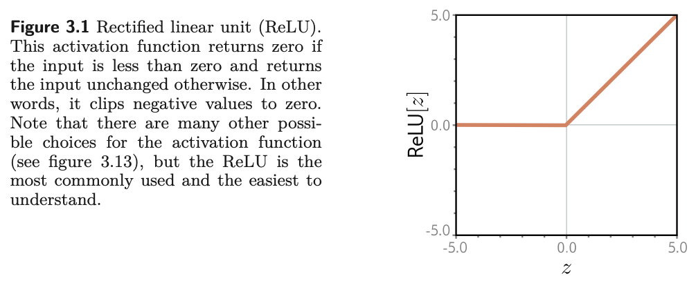{#fig-udl-3-1 width=80%}

::: {.callout-note}
## Notation
Following Prince, $\theta_{d\bullet}$ are the parameters feeding *into* hidden
unit $d$, and $\phi_\bullet$ are the parameters feeding *out of* the hidden
layer into the output. The first subscript indexes the destination unit and the
second the source, with $0$ meaning the offset. Square brackets $a[\cdot]$
denote function application, reserving parentheses for grouping.
:::

It is not obvious which family of input/output relations @eq-shallow-example
represents, and that is the question the rest of §3.1 answers. But everything
from Chapter 2 already applies. The equation is a **family** of functions, and
the ten parameters pick one member (@fig-udl-3-2). Given the parameters we can
perform **inference** by evaluating the equation at an input. Given a training
set $\{x_i, y_i\}_{i=1}^{I}$ we can define a least-squares loss $L[\boldsymbol{\phi}]$
exactly as in Week 2, and **training** means searching for the
$\hat{\boldsymbol{\phi}}$ that minimizes it. Nothing about the recipe changed;
only the family did.

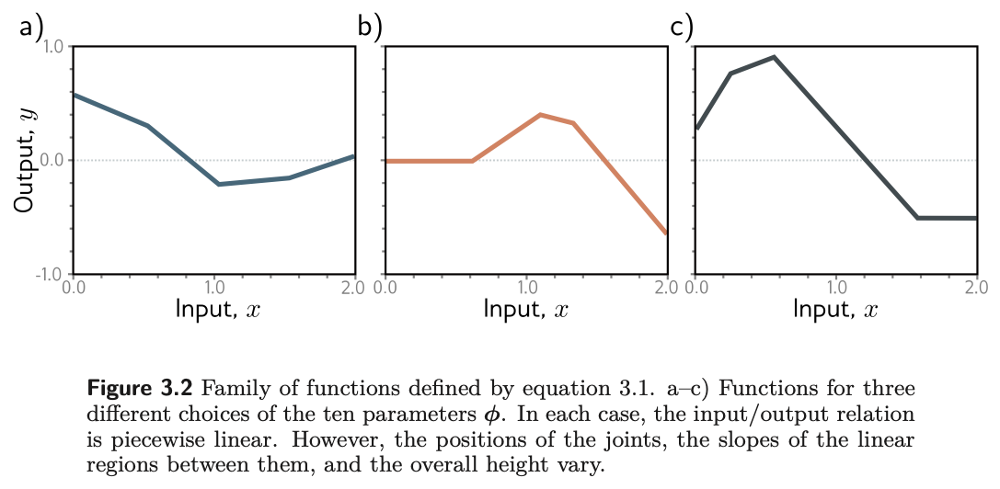{#fig-udl-3-2 width=80%}

### Where the bends come from

*Prince §3.1.1, pp. 26–27; figure on p. 28.*

@Eq-shallow-example represents a family of **continuous piecewise linear
functions with up to four linear regions**. To see why, split the computation in
two. First name the intermediate quantities, which Prince calls the **hidden
units**:

$$
h_1 = a[\theta_{10} + \theta_{11}x], \qquad
h_2 = a[\theta_{20} + \theta_{21}x], \qquad
h_3 = a[\theta_{30} + \theta_{31}x].
$$ {#eq-hidden-units}

Then the output is a linear function of them:

$$
y = \phi_0 + \phi_1 h_1 + \phi_2 h_2 + \phi_3 h_3.
$$ {#eq-output-linear}

@Fig-udl-3-3 shows the flow of computation that produces the function in
@fig-udl-3-2**a**. Each hidden unit contains a line $\theta_{\bullet 0} +
\theta_{\bullet 1} x$, and the ReLU clips that line below zero. The places where
the three lines cross zero become the three **joints** of the final output. The
clipped lines are weighted by $\phi_1, \phi_2, \phi_3$, summed, and shifted by
$\phi_0$, which controls the overall height.

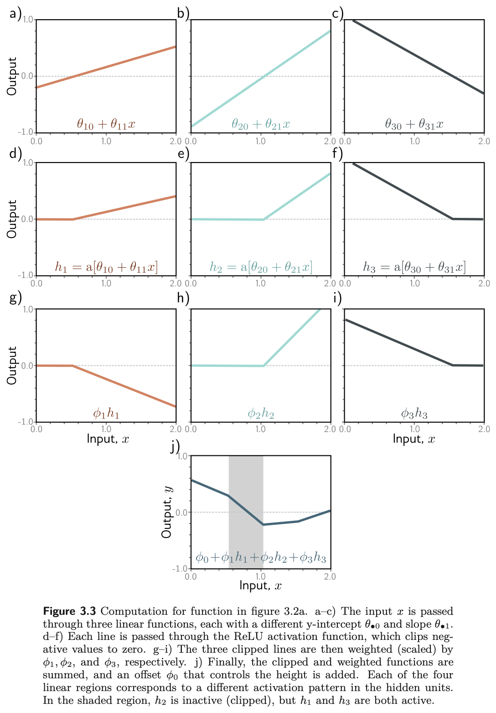{#fig-udl-3-3 width=70%}

@Fig-decomposition is our version of the same picture, built from the exact
parameters Prince gives for it in problem 3.8 (p. 40):
$\boldsymbol{\phi} = \{-0.23, -1.3, 1.3, 0.66, -0.2, 0.4, -0.9, 0.9, 1.1, -0.7\}$.
Having the numbers lets us check every claim below rather than read it off a
plot.

```{python}
#| label: fig-decomposition
#| fig-cap: "Our version of Prince figure 3.3, using the parameters he lists in problem 3.8. Top row: the three lines $\\theta_{d0} + \\theta_{d1}x$. Middle row: each one clipped by the ReLU. Bottom row: the clipped lines weighted by $\\phi_1, \\phi_2, \\phi_3$. The dotted verticals are the three joints, at $x = 0.5$, $1$, and $1.57$: each hidden unit contributes exactly one, where its line crosses zero."
#| fig-height: 7

# Prince's parameters for figure 3.3, listed in problem 3.8 (p. 40).
phi0 = -0.23
phi  = np.array([-1.3, 1.3, 0.66])                 # phi_1, phi_2, phi_3
theta = np.array([[-0.2,  0.4],                    # theta_10, theta_11
                  [-0.9,  0.9],                    # theta_20, theta_21
                  [ 1.1, -0.7]])                   # theta_30, theta_31

x = np.linspace(0, 2, 500)
pre = theta[:, 0:1] + theta[:, 1:2] * x            # (3, 500) pre-activations
act = np.maximum(pre, 0)                           # (3, 500) activations
wgt = phi[:, None] * act                           # weighted activations
y   = phi0 + wgt.sum(axis=0)

joints = -theta[:, 0] / theta[:, 1]
colors = [ACCENT, "#1864AB", NDSU_GREEN]

fig, axes = plt.subplots(3, 3, figsize=(9.5, 7.5), sharex=True)
for d in range(3):
    axes[0, d].plot(x, pre[d], color=colors[d], lw=2)
    axes[0, d].axhline(0, color="k", lw=0.6)
    axes[0, d].set_title(rf"$\theta_{{{d+1}0}} + \theta_{{{d+1}1}}x$")
    axes[1, d].plot(x, act[d], color=colors[d], lw=2)
    axes[1, d].set_title(rf"$h_{d+1} = a[\theta_{{{d+1}0}} + \theta_{{{d+1}1}}x]$")
    axes[2, d].plot(x, wgt[d], color=colors[d], lw=2)
    axes[2, d].axhline(0, color="k", lw=0.6)
    axes[2, d].set_title(rf"$\phi_{d+1} h_{d+1}$")
    axes[2, d].set_xlabel("$x$")
for ax in axes.ravel():
    for j in joints:
        ax.axvline(j, color="gray", ls=":", lw=0.9)
    ax.set_ylim(-1.05, 1.05)
plt.tight_layout()
plt.show()
```

```{python}
#| label: fig-assembled
#| fig-cap: "The output of @eq-shallow-example for the same parameters, our version of panel (j) of figure 3.3: the three weighted, clipped lines summed and shifted by $\\phi_0$. Three joints (gold) make four linear regions. In the shaded region $h_1$ and $h_3$ are active and $h_2$ is inactive, so the slope there is $\\theta_{11}\\phi_1 + \\theta_{31}\\phi_3$."

fig, ax = plt.subplots(figsize=(6.5, 3.6))
ax.axvspan(joints[0], joints[1], color=NDSU_GOLD, alpha=0.22, lw=0)
ax.plot(x, y, color="k", lw=2.5)
for j in joints:
    ax.axvline(j, color="gray", ls=":", lw=1)
    ax.plot(j, phi0 + np.sum(phi * np.maximum(theta[:, 0] + theta[:, 1] * j, 0)),
            "o", color=NDSU_GOLD, ms=7, mec="k", mew=0.7, zorder=5)
ax.set_xlabel("$x$"); ax.set_ylabel("$y$")
ax.set_ylim(-1.05, 1.05)
ax.set_title("Four linear regions joined at three joints")
plt.show()
```

Three things to take from @fig-udl-3-3, @fig-decomposition, and @fig-assembled.

**Each hidden unit contributes exactly one joint.** Unit $d$ bends the output
where its pre-activation crosses zero, at $x = -\theta_{d0}/\theta_{d1}$. The
ReLU is linear everywhere else, so no other bends can appear. Three units give
at most three joints and therefore at most four regions.

**Each linear region corresponds to an activation pattern.** In any region,
each hidden unit is either **active** (not clipped) or **inactive** (clipped to
zero), and crossing a joint flips exactly one unit. Prince's shaded region
receives contributions from $h_1$ and $h_3$, which are active, but not from
$h_2$, which is inactive.

**The slope of a region is set by the active units.** It is determined by (i)
the original slopes $\theta_{\bullet 1}$ of the active units and (ii) the weights
$\phi_\bullet$ applied to them. In the shaded region the slope is
$\theta_{11}\phi_1 + \theta_{31}\phi_3$: the slope of panel (g) of @fig-udl-3-3
plus the slope of panel (i). The offset $\phi_0$ never affects slope; it only
slides the whole function up or down.

We can check that slope numerically instead of taking it on faith, and at the
same time check the identity Prince poses as problem 3.9: the slope of the
third region is the sum of the slopes of the first and the fourth. The activation
pattern printed for each region is its signature.

```{python}
#| label: slope-check

def net(xv):
    """Equation (3.1) at a scalar input, with the parameters of figure 3.3."""
    return phi0 + np.sum(phi * np.maximum(theta[:, 0] + theta[:, 1] * xv, 0))

def region_slope(xv):
    active = (theta[:, 0] + theta[:, 1] * xv) > 0
    return float(np.sum(theta[active, 1] * phi[active])), active

h = 1e-6
probes = [0.25, 0.75, 1.3, 1.8]                    # one point inside each region
print(f"{'region':<8}{'x':>6}{'active units':>16}{'slope (theory)':>17}{'slope (measured)':>19}")
slopes = []
for r, xv in enumerate(probes, start=1):
    s, active = region_slope(xv)
    measured = (net(xv + h) - net(xv - h)) / (2 * h)
    slopes.append(s)
    units = ", ".join(f"h{d + 1}" for d in np.where(active)[0]) or "none"
    print(f"{r:<8}{xv:>6.2f}{units:>16}{s:>17.4f}{measured:>19.4f}")
print(f"\nshaded region: theta_11 phi_1 + theta_31 phi_3 = {theta[0, 1] * phi[0] + theta[2, 1] * phi[2]:.4f}")
print(f"problem 3.9  : slope(region 1) + slope(region 4) = {slopes[0] + slopes[3]:.4f},  slope(region 3) = {slopes[2]:.4f}")
```

The last line is not a coincidence of these particular numbers. In region 3 all
three units are active, in region 1 only $h_3$ is, and in region 4 only $h_1$
and $h_2$ are, so the three slopes are $\theta_{31}\phi_3$,
$\theta_{11}\phi_1 + \theta_{21}\phi_2$, and their sum.

::: {.callout-important}
## Only three of the four slopes are free
Each hidden unit contributes one joint, so three units give four regions. But
only three of the four slopes are independent: the fourth is either zero, if
every unit is inactive there, or a sum of slopes from the other regions, as
problem 3.9 shows. Capacity grows with hidden units, but not quite as fast as a
naive count of regions suggests.
:::

### Depicting networks

*Prince §3.1.2, p. 27; figure on p. 29.*

The equation and the picture are the same object. In @fig-udl-3-4**a** the
input is on the left, the three hidden units in the middle, and the output on
the right, with computation flowing left to right. Each of the ten arrows is one
parameter: it multiplies its source and adds the result to its target. The
offsets are handled by extra nodes containing the constant one, so that
$\phi_0$ multiplies one and is added to $y$. In practice the intercepts, the
ReLU symbols, and the parameter names are all omitted, leaving the familiar
circles-and-lines drawing of @fig-udl-3-4**b**, which represents exactly the
same network.

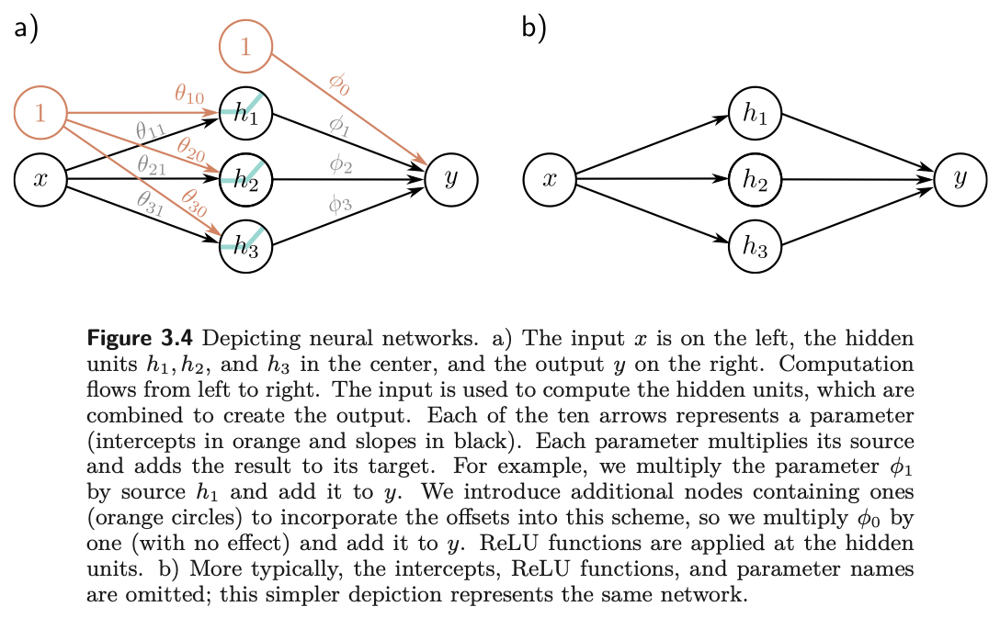{#fig-udl-3-4 width=82%}

## The Universal Approximation Theorem

*Prince §3.2, pp. 29–30; figure on p. 30.*

Now generalize slightly to $D$ hidden units. The $d$-th hidden unit is

$$
h_d = a[\theta_{d0} + \theta_{d1}x],
$$ {#eq-hd}

and the output combines them linearly:

$$
y = \phi_0 + \sum_{d=1}^{D} \phi_d h_d.
$$ {#eq-y-sum}

The number of hidden units is a measure of the network's **capacity**. With
ReLU activations the output has at most $D$ joints, hence is piecewise linear
with at most $D + 1$ linear regions, and as we add hidden units the model can
approximate more complex functions.

Indeed, with enough capacity a shallow network can describe *any* continuous
1D function defined on a compact subset of the real line to arbitrary precision.
The argument is almost visual (@fig-udl-3-5). Every hidden unit we add buys one
more linear region. As the regions become more numerous each covers a shorter
stretch of the input, and on a short enough stretch any continuous function is
well approximated by a line.

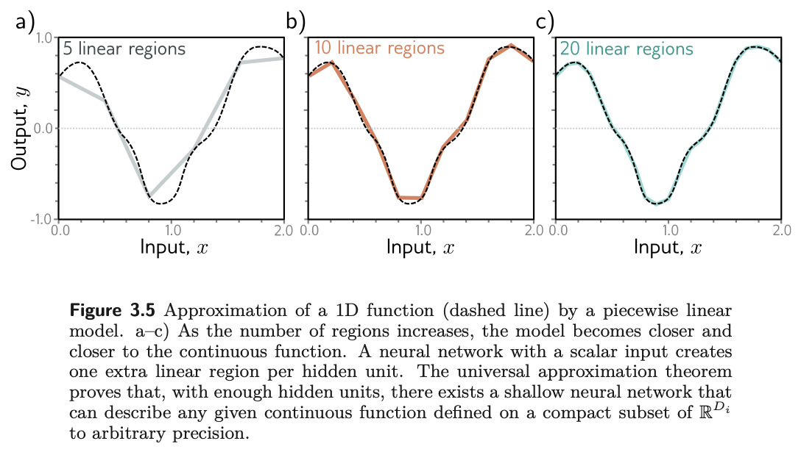{#fig-udl-3-5 width=82%}

::: {.callout-tip}
## Universal approximation theorem
For any continuous function on a compact subset of $\mathbb{R}^{D_i}$ and any
tolerance $\epsilon > 0$, there **exists** a shallow network with a finite number
of hidden units whose output is within $\epsilon$ of that function everywhere on
the set.
:::

@Fig-approx repeats the experiment with a function of our own and a growing
budget of regions, and prints the worst-case error each time. The models shown
are piecewise linear interpolants, which are one member of the family a network
with that many regions can represent; the error they achieve is therefore an
upper bound on what the best such network could do.

```{python}
#| label: fig-approx
#| fig-cap: "A fixed target (dashed) approximated by piecewise linear functions with 3, 7, and 20 regions, which is what a shallow network with 2, 6, and 19 hidden units can produce. The maximum error shrinks steadily as capacity grows, which is the content of the universal approximation theorem; the theorem says nothing about how fast."

def target(x):
    return np.sin(3 * x) + 0.35 * x**2

xs = np.linspace(-2, 2, 1000)
fig, axes = plt.subplots(1, 3, figsize=(10, 3.1), sharey=True)
for ax, n_regions in zip(axes, [3, 7, 20]):
    knots = np.linspace(-2, 2, n_regions + 1)
    approx = np.interp(xs, knots, target(knots))
    err = np.max(np.abs(approx - target(xs)))
    ax.plot(xs, target(xs), "--", color="gray", lw=1.8, label="target")
    ax.plot(xs, approx, color=NDSU_GREEN, lw=2, label="piecewise linear")
    ax.plot(knots, target(knots), "o", color=NDSU_GOLD, ms=4, mec="k", mew=0.5)
    ax.set_title(f"{n_regions} regions · max error {err:.3f}")
    ax.set_xlabel("$x$")
axes[0].set_ylabel("$y$")
axes[0].legend(loc="upper left", fontsize=8)
plt.tight_layout()
plt.show()
```

::: {.callout-important}
## What the theorem does not say
It is an **existence** result, and that is all. It does not say how many hidden
units are needed, which can be astronomically many. It does not say how to find
the parameters, or whether gradient descent will find them, or whether the
result will generalize to data it was not fitted to. The chapter notes (p. 38)
credit the theorem to Cybenko (1989) for sigmoid activations and Hornik (1991)
for a much larger class. Depth, which Chapter 4 takes up, is what makes
universality *practical*.
:::

## Multivariate Inputs and Outputs

*Prince §3.3, pp. 30–33.*

The example so far has one scalar input and one scalar output. The universal
approximation theorem also holds when the network maps a multivariate input
$\mathbf{x} = [x_1, x_2, \ldots, x_{D_i}]^T$ to a multivariate output
$\mathbf{y} = [y_1, y_2, \ldots, y_{D_o}]^T$. Prince extends the model to
several outputs first, then to several inputs, and only then writes the general
definition.

### Several outputs

*Prince §3.3.1, pp. 30–31; figure on p. 31.*

To predict several outputs, use a *different* linear function of the *same*
hidden units for each. A network with a scalar input, four hidden units, and a
two-dimensional output $\mathbf{y} = [y_1, y_2]^T$ has

$$
h_d = a[\theta_{d0} + \theta_{d1}x], \qquad d = 1, \ldots, 4,
$$ {#eq-four-hidden}

and

$$
\begin{aligned}
y_1 &= \phi_{10} + \phi_{11}h_1 + \phi_{12}h_2 + \phi_{13}h_3 + \phi_{14}h_4 \\
y_2 &= \phi_{20} + \phi_{21}h_1 + \phi_{22}h_2 + \phi_{23}h_3 + \phi_{24}h_4.
\end{aligned}
$$ {#eq-multi-out}

The joints in a piecewise linear output depend on where the lines
$\theta_{\bullet 0} + \theta_{\bullet 1}x$ are clipped by the ReLU at the hidden
units. Because $y_1$ and $y_2$ are two linear functions of the *same* four
hidden units, their four joints must be in the same places. The slopes of the
regions and the overall vertical offset can differ (@fig-udl-3-6).

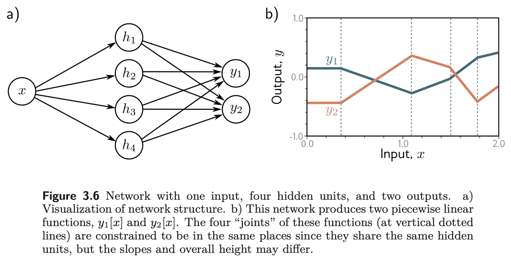{#fig-udl-3-6 width=82%}

```{python}
#| label: fig-shared-joints
#| fig-cap: "Our version of figure 3.6b: two outputs computed from four shared hidden units. The joints (dotted) fall at identical inputs for both outputs, because they are set by the hidden layer alone; only the slopes and heights differ."

#            joints at x = 0.25,       0.6,        1.2,        1.7
th = np.array([[-0.25, 1.0], [0.66, -1.1], [-1.2, 1.0], [1.19, -0.7]])
Phi = np.array([[ 0.1,  1.0, -0.8,  0.5,  0.9],     # phi_10 ... phi_14
                [-0.3, -0.6,  1.2,  0.4, -1.1]])    # phi_20 ... phi_24

x4 = np.linspace(0, 2, 600)
H = np.maximum(th[:, 0:1] + th[:, 1:2] * x4, 0)
Y = Phi[:, 0:1] + Phi[:, 1:] @ H
joints4 = -th[:, 0] / th[:, 1]

fig, ax = plt.subplots(figsize=(6.5, 3.4))
ax.plot(x4, Y[0], color=NDSU_GREEN, lw=2.2, label="$y_1[x]$")
ax.plot(x4, Y[1], color=ACCENT, lw=2.2, label="$y_2[x]$")
for j in joints4:
    ax.axvline(j, color="gray", ls=":", lw=1)
ax.set_xlabel("$x$"); ax.set_ylabel("output"); ax.legend()
ax.set_title("Shared hidden units force shared joint locations")
plt.show()
```

### Several inputs

*Prince §3.3.2, pp. 31–33; figures on pp. 31–32.*

To cope with several inputs, extend the linear relations between the input and
the hidden units so that there is one slope parameter per input. A network with
two inputs $\mathbf{x} = [x_1, x_2]^T$ and a scalar output (@fig-udl-3-7) might
have three hidden units

$$
\begin{aligned}
h_1 &= a[\theta_{10} + \theta_{11}x_1 + \theta_{12}x_2] \\
h_2 &= a[\theta_{20} + \theta_{21}x_1 + \theta_{22}x_2] \\
h_3 &= a[\theta_{30} + \theta_{31}x_1 + \theta_{32}x_2],
\end{aligned}
$$ {#eq-2d-hidden}

combined in the usual way, $y = \phi_0 + \phi_1 h_1 + \phi_2 h_2 + \phi_3 h_3$.

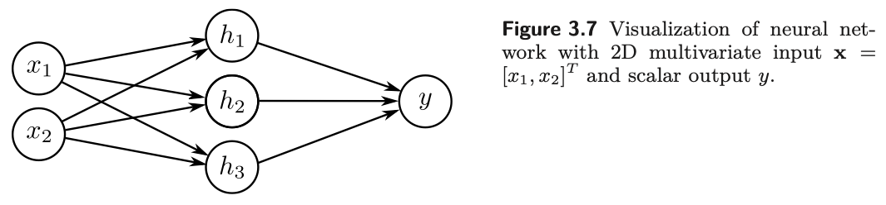{#fig-udl-3-7 width=76%}

@Fig-udl-3-8 shows the processing. Each hidden unit receives a linear
combination of the two inputs, which is an **oriented plane** over the input
space. The ReLU clips the negative part of each plane to zero, along the line
where the plane crosses zero. The clipped planes are then recombined by the
second linear function into a continuous piecewise linear surface made of
**convex polygonal regions**, each with its own activation pattern: in the
central triangle of panel (j), the first and third hidden units are active and
the second is inactive.

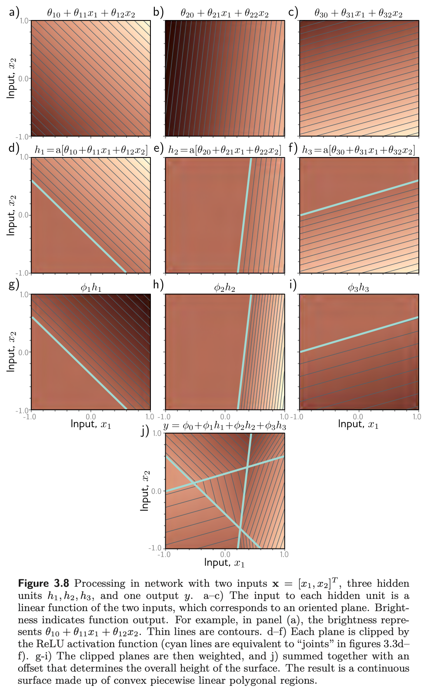{#fig-udl-3-8 width=64%}

Our version of the construction follows, with a count that the book's figure
only shows: sampling the input plane densely and tallying the distinct
activation patterns gives the number of linear regions the three units carve
out.

```{python}
#| label: fig-2d
#| fig-cap: "Our version of figure 3.8 with three hidden units of our own. Left three panels: each hidden unit's activation, a plane clipped along the cyan line where its pre-activation is zero. Right: the weighted sum, a continuous surface of convex polygonal regions, with the three clipping lines carried over. The number printed below the figure counts those regions by their activation patterns."
#| fig-height: 3.2

th2 = np.array([[-0.3,  1.0,  0.6],
                [ 0.2, -0.8,  1.1],
                [-0.5, -0.7, -1.0]])
ph2 = np.array([0.1, 1.0, -0.8, 0.9])

g = np.linspace(-2, 2, 300)
X1, X2 = np.meshgrid(g, g)
pre2 = [t[0] + t[1] * X1 + t[2] * X2 for t in th2]
Hs = [np.maximum(p, 0) for p in pre2]
Z  = ph2[0] + sum(w * h for w, h in zip(ph2[1:], Hs))

fig, axes = plt.subplots(1, 4, figsize=(12, 3.1))
for d, (ax, h) in enumerate(zip(axes[:3], Hs)):
    ax.imshow(h, extent=[-2, 2, -2, 2], origin="lower", cmap="viridis")
    ax.contour(X1, X2, pre2[d], levels=[0], colors="cyan", linewidths=1.8)
    ax.set_title(f"$h_{d+1}$"); ax.set_xlabel("$x_1$"); ax.grid(False)
    if d == 0:
        ax.set_ylabel("$x_2$")
axes[3].imshow(Z, extent=[-2, 2, -2, 2], origin="lower", cmap="magma")
for d in range(3):
    axes[3].contour(X1, X2, pre2[d], levels=[0], colors="cyan", linewidths=1.2, alpha=0.8)
axes[3].set_title("$y$ (weighted sum)"); axes[3].set_xlabel("$x_1$"); axes[3].grid(False)
plt.tight_layout()
plt.show()

patterns = np.stack([p > 0 for p in pre2], axis=-1).reshape(-1, 3)
unique_patterns = np.unique(patterns, axis=0)
print(f"distinct activation patterns on the plane: {len(unique_patterns)}")
for pat in unique_patterns:
    print("   active:", ", ".join(f"h{d + 1}" for d in np.where(pat)[0]) or "none")
```

Three lines in general position cut the plane into seven pieces, and every
piece has a different activation pattern — which is problem 3.18, done by
brute force. Notice that one of the eight conceivable patterns is missing: no
region has all three units active, because the three half-planes on which they
are active have no common point. Regions are cells of a hyperplane
arrangement, not entries in a truth table, and $2^D$ is only an upper bound.

With more than two inputs the picture is impossible to draw but the
interpretation is the same: the output is a continuous piecewise linear
function of the input, and the linear regions are now **convex polytopes** in
the multi-dimensional input space.

### Regions explode with dimension

*Prince §3.3.2, p. 33; figures on p. 34.*

As the input dimension grows, the number of linear regions increases rapidly
(@fig-udl-3-9). To see how rapidly, note that each hidden unit defines a
**hyperplane** separating the part of the input space where it is active from
the part where it is not — the cyan lines of @fig-udl-3-8**d–f**. If we had as
many hidden units as input dimensions $D_i$, we could align each hyperplane
with one coordinate axis (@fig-udl-3-10): two inputs give four quadrants, three
give eight octants, and $D_i$ inputs give $2^{D_i}$ orthants. Shallow networks
usually have more hidden units than input dimensions, so they create more than
$2^{D_i}$ regions.

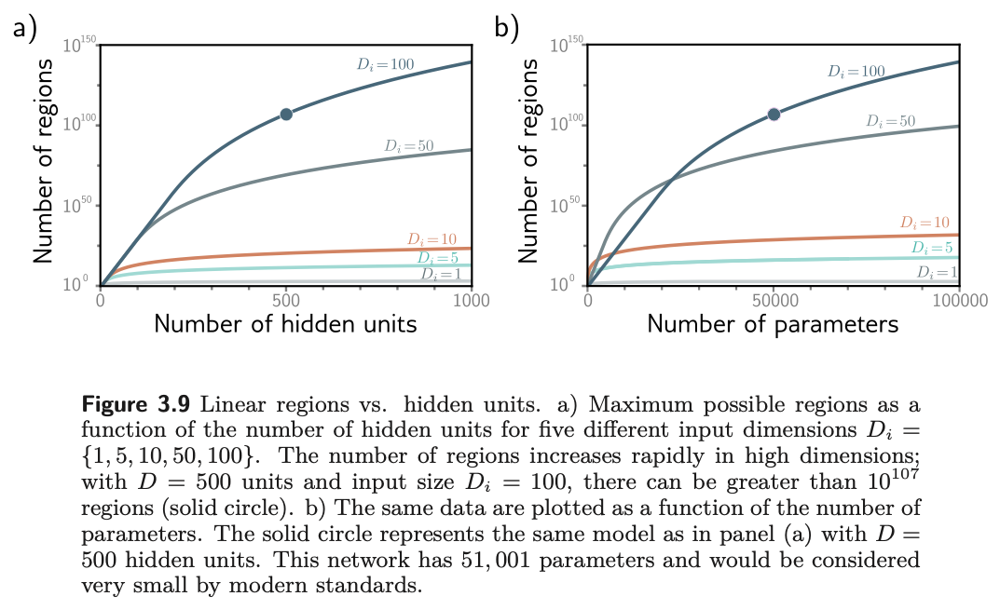{#fig-udl-3-9 width=82%}

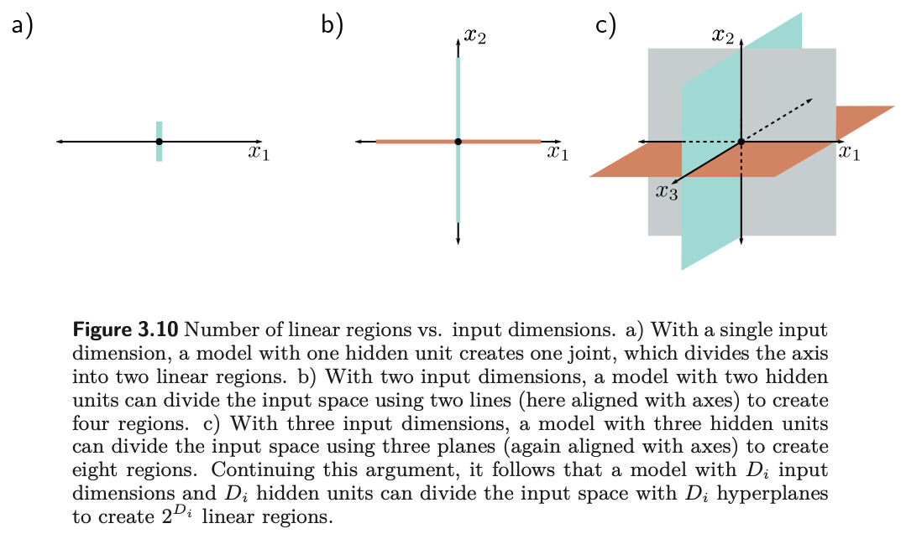{#fig-udl-3-10 width=82%}

The exact maximum comes from a classical result the chapter notes cite
(Zaslavsky, 1975): $D$ hyperplanes partition a $D_i$-dimensional space into at
most

$$
N_r = \sum_{j=0}^{D_i} \binom{D}{j}
$$ {#eq-regions}

regions. For $D_i = 2$ and $D = 3$ that is $1 + 3 + 3 = 7$, the count printed
above. As a rule of thumb, a shallow network with $D > D_i$ creates somewhere
between $2^{D_i}$ and $2^{D}$ regions. @Fig-regions evaluates @eq-regions and
then puts Prince's headline example through it.

```{python}
#| label: fig-regions
#| fig-cap: "Our version of figure 3.9a: the maximum number of linear regions, @eq-regions, against the number of hidden units for five input dimensionalities, on logarithmic axes. In high dimensions the count is astronomical long before the network is large by any modern standard."

from math import comb

D_units = np.arange(1, 1001)
fig, ax = plt.subplots(figsize=(6.5, 3.8))
for Di, c in zip([1, 5, 10, 50, 100], plt.cm.viridis(np.linspace(0.1, 0.9, 5))):
    regions = [sum(comb(int(D), j) for j in range(0, min(Di, int(D)) + 1)) for D in D_units]
    ax.plot(D_units, regions, color=c, lw=2, label=f"$D_i = {Di}$")
ax.plot(500, sum(comb(500, j) for j in range(0, 101)), "o", color="k", ms=6, zorder=5)
ax.set_xscale("log"); ax.set_yscale("log")
ax.set_xlabel("hidden units $D$"); ax.set_ylabel("maximum linear regions $N_r$")
ax.set_title("Linear regions vs. hidden units")
ax.legend(fontsize=8)
plt.show()

n_regions = sum(comb(500, j) for j in range(0, 101))
n_params  = 500 * (100 + 1) + 1 * (500 + 1)
print(f"D = 500 hidden units, D_i = 100 inputs, D_o = 1 output")
print(f"  parameters             : {n_params:,}")
print(f"  maximum linear regions : about 10^{np.log10(float(n_regions)):.0f}")
```

A network with 51,001 parameters is tiny by modern standards, yet it can in
principle express a function with more than $10^{107}$ distinct linear pieces
(the solid circle in @fig-udl-3-9 and @fig-regions). Expressivity is not the
bottleneck in deep learning. Finding the parameters, and having them generalize,
is — which is what Chapters 6 through 9 are about.

## The General Case

*Prince §3.4, pp. 33–35; figure on p. 35.*

We can now define a general shallow network $\mathbf{y} = \mathbf{f}[\mathbf{x},
\boldsymbol{\phi}]$ that maps $\mathbf{x} \in \mathbb{R}^{D_i}$ to $\mathbf{y}
\in \mathbb{R}^{D_o}$ through $D$ hidden units. Each hidden unit is

$$
h_d = a\!\left[\theta_{d0} + \sum_{i=1}^{D_i} \theta_{di} x_i\right],
$$ {#eq-general-hidden}

and the hidden units are combined linearly to make each output:

$$
y_j = \phi_{j0} + \sum_{d=1}^{D} \phi_{jd} h_d,
$$ {#eq-general-output}

where $a[\cdot]$ is a nonlinear activation function and the parameters are
$\boldsymbol{\phi} = \{\theta_{\bullet\bullet}, \phi_{\bullet\bullet}\}$.
@Fig-udl-3-11 shows the case with three inputs, three hidden units, and two
outputs.

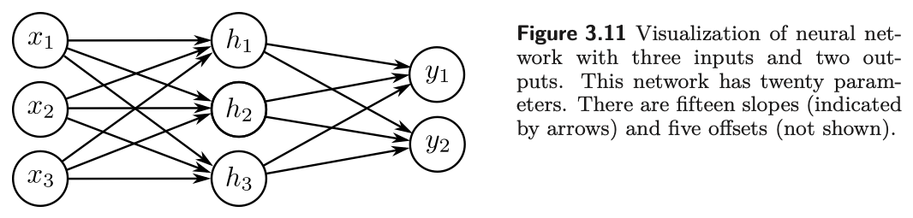{#fig-udl-3-11 width=76%}

In the matrix notation of Week 2 this collapses to two lines. With
$\boldsymbol{\Theta} \in \mathbb{R}^{D \times D_i}$,
$\boldsymbol{\theta}_0 \in \mathbb{R}^{D}$,
$\boldsymbol{\Phi} \in \mathbb{R}^{D_o \times D}$, and
$\boldsymbol{\phi}_0 \in \mathbb{R}^{D_o}$,

$$
\mathbf{h} = a[\boldsymbol{\theta}_0 + \boldsymbol{\Theta}\mathbf{x}],
\qquad
\mathbf{y} = \boldsymbol{\phi}_0 + \boldsymbol{\Phi}\mathbf{h},
$$ {#eq-matrix}

with the activation applied elementwise. Each line is exactly the object
$\mathbf{y} = \boldsymbol{\phi}_0 + \boldsymbol{\Phi}\mathbf{z}$ that Week 2 called
the most important equation in the course; a shallow network is two of them
with a ReLU in between. Counting entries gives the parameter total that problem
3.17 asks for,

$$
D(D_i + 1) + D_o(D + 1),
$$ {#eq-param-count}

which for @fig-udl-3-11 is $3 \cdot 4 + 2 \cdot 4 = 20$: fifteen slopes and five
offsets.

::: {.callout-important}
## The activation must be nonlinear
The activation function is what lets the model describe nonlinear relations
between input and output, so it must be nonlinear itself. With no activation, or
a linear one, @eq-matrix becomes $\mathbf{y} = \boldsymbol{\phi}_0 +
\boldsymbol{\Phi}(\boldsymbol{\theta}_0 + \boldsymbol{\Theta}\mathbf{x})$, which
is a single affine map $\mathbf{x} \mapsto \mathbf{A}\mathbf{x} + \mathbf{b}$.
The hidden layer collapses and you are back to linear regression, however many
units you paid for. Problem 3.1 asks you to say this precisely.
:::

We can confirm the collapse rather than assert it. The following builds a
two-layer network with the identity in place of the ReLU, builds the single
affine map it must equal, and compares them on random inputs.

```{python}
#| label: linear-collapse

Di, D, Do = 4, 32, 2
Theta, theta0 = torch.randn(D, Di), torch.randn(D)
Phi_m, phi0_v = torch.randn(Do, D), torch.randn(Do)

x_test = torch.randn(6, Di)

# Identity "activation": the composition is affine.
h_lin = x_test @ Theta.T + theta0
y_lin = h_lin @ Phi_m.T + phi0_v

# The equivalent single affine map, computed directly.
A = Phi_m @ Theta
b = Phi_m @ theta0 + phi0_v
y_affine = x_test @ A.T + b

print(f"two-layer network with identity activation, D = {D} hidden units")
print(f"max |network output - single affine map| = {float((y_lin - y_affine).abs().max()):.2e}")
```

The difference is floating-point noise: a two-layer linear network *is* a
one-layer linear network, and thirty-two hidden units bought nothing.

With ReLU activations, by contrast, the network divides the input space into
convex polytopes defined by the intersections of the hyperplanes at the joints
of the ReLU functions. Each polytope contains a different linear function. The
polytopes are the same for every output; the linear functions they contain can
differ.

## Terminology

*Prince §3.5, pp. 35–36; figure on p. 36.*

Neural networks come with a great deal of jargon, and Prince closes the chapter
by fixing it. @Fig-udl-3-12 labels the parts, and the table below is the
vocabulary everything later in the course assumes.

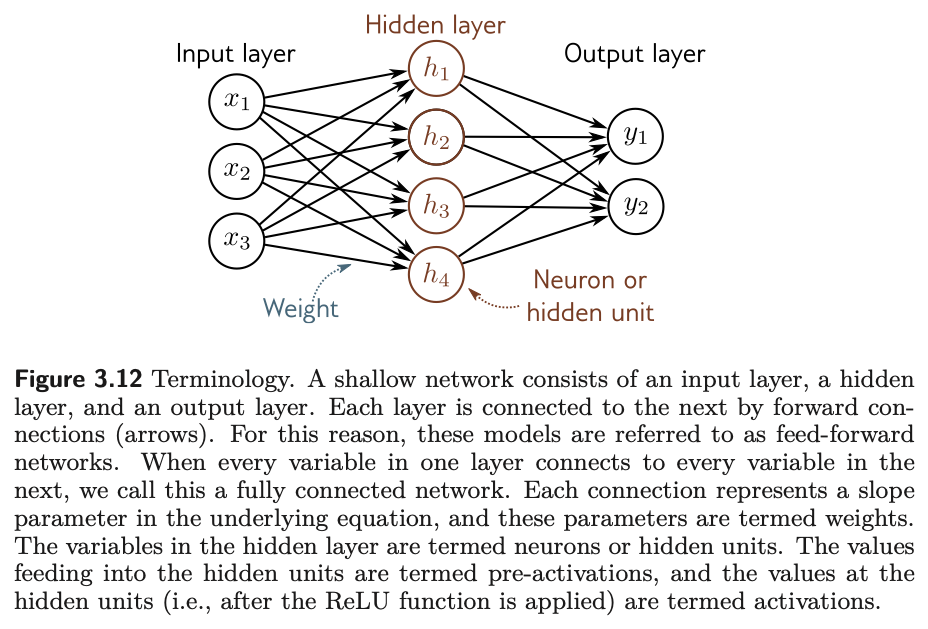{#fig-udl-3-12 width=76%}

| Term | Meaning |
|:--------------------|:-----------------------------------------------------|
| **Input layer** | The inputs $\mathbf{x}$, on the left of the diagram |
| **Hidden layer** | The units $\mathbf{h}$ between input and output |
| **Output layer** | The predictions $\mathbf{y}$ |
| **Neuron**, **hidden unit** | One element of $\mathbf{h}$ |
| **Pre-activation** | The value fed into a hidden unit, *before* the ReLU |
| **Activation** | The value at the hidden unit, *after* the ReLU |
| **Weights** | The slope parameters, one per arrow in the diagram |
| **Biases** | The offset parameters $\theta_{d0}$, $\phi_{j0}$, not drawn |
| **Multi-layer perceptron (MLP)** | Any network with at least one hidden layer |
| **Shallow network** | Exactly one hidden layer (this chapter) |
| **Deep network** | More than one hidden layer (Chapter 4) |
| **Feed-forward** | Connections form an acyclic graph, as in every example here |
| **Fully connected** | Every unit in a layer connects to every unit in the next |

: The vocabulary of Prince §3.5, pp. 35–36. {tbl-colwidths="[30,70]"}

::: {.callout-note}
## Why "neural"?
The chapter notes (p. 36) are candid: the models in this chapter are just
functions, and the connection to biology "is, unfortunately, tenuous." Diagrams
like @fig-udl-3-12 consist of densely connected nodes, which superficially
resembles neurons in a brain, but there is scant evidence that brain
computation works this way, and Prince advises that "it is unhelpful to think
about biology going forward." We follow that advice.
:::

::: {.callout-note}
## Linear, affine, and nonlinear
Strictly, a linear function obeys superposition, $f[\mathbf{a} + \mathbf{b}] =
f[\mathbf{a}] + f[\mathbf{b}]$, which the weighted sum $\phi_1 h_1 + \phi_2 h_2 +
\phi_3 h_3$ satisfies and the version with an offset $\phi_0$ does not; the
latter is properly an **affine** function. Machine learning conflates the two
and calls both linear, and so does this course (chapter notes, p. 39). Every
other function we meet is nonlinear — including the ReLU, and therefore every
network that contains one.
:::

## Beyond the ReLU

*Prince, Chapter 3 notes, pp. 37–38; figure on p. 37.*

The ReLU dates back to Fukushima (1969), but in the early days the logistic
sigmoid and tanh were the standard choices (@fig-udl-3-13**a**). The ReLU was
re-popularized around 2010 (Jarrett et al., 2009; Nair & Hinton, 2010; Glorot et
al., 2011) and is an important part of why modern networks train at all: its
derivative is exactly one for every positive input, whereas the sigmoid and tanh
**saturate**, with derivatives near zero for large inputs of either sign.
Chapter 7 makes the consequences for training precise.

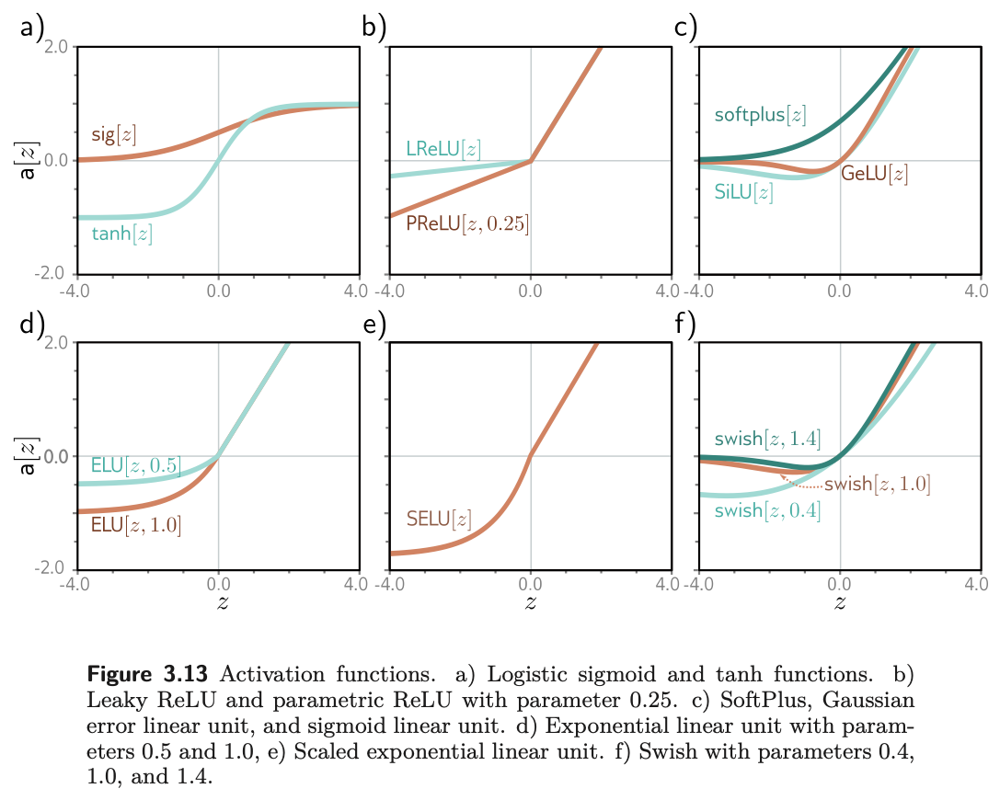{#fig-udl-3-13 width=80%}

The ReLU has a flaw of its own. Its derivative is zero for negative inputs, so
if every training example drives a given unit negative, the gradient with
respect to that unit's incoming weights is locally flat and training cannot
"walk downhill" to fix it. This is the **dying ReLU problem**. Most of the
alternatives in @fig-udl-3-13 are attempts to resolve it while keeping the
ReLU's stable gradient on the positive side: the leaky ReLU gives the negative
side a small slope of 0.1, the parametric ReLU learns that slope, and a family of
smooth functions — SoftPlus, GELU, SiLU, ELU, SELU, and Swish, the last found by
an automated search — round off the kink. @Fig-activations draws a handful of
them in our own style.

```{python}
#| label: fig-activations
#| fig-cap: "A selection of the activation functions in figure 3.13. Left: the saturating sigmoid and tanh, whose gradients vanish at large magnitudes. Right: the ReLU family and two smooth variants, none of which saturates on the positive side. The leaky ReLU and the smooth functions all keep a nonzero gradient for negative inputs, which is their answer to the dying ReLU problem."

z = np.linspace(-4, 4, 500)
acts = {
    "ReLU":       np.maximum(z, 0),
    "Leaky ReLU": np.where(z > 0, z, 0.1 * z),
    "sigmoid":    1 / (1 + np.exp(-z)),
    "tanh":       np.tanh(z),
    "SoftPlus":   np.log1p(np.exp(z)),
    "GELU":       z * 0.5 * (1 + np.tanh(np.sqrt(2 / np.pi) * (z + 0.044715 * z**3))),
}

fig, axes = plt.subplots(1, 2, figsize=(9.5, 3.2), sharex=True)
for name, color in [("sigmoid", ACCENT), ("tanh", NDSU_GREEN)]:
    axes[0].plot(z, acts[name], lw=2, color=color, label=name)
axes[0].set_title("Saturating"); axes[0].legend()
for name, color in [("ReLU", NDSU_GREEN), ("Leaky ReLU", ACCENT), ("SoftPlus", "#1864AB"), ("GELU", NDSU_GOLD)]:
    axes[1].plot(z, acts[name], lw=2, color=color, label=name)
axes[1].set_title("Non-saturating on the positive side"); axes[1].legend()
for ax in axes:
    ax.axhline(0, color="k", lw=0.6); ax.axvline(0, color="k", lw=0.6)
    ax.set_xlabel("$z$")
axes[0].set_ylabel("$a[z]$")
plt.tight_layout()
plt.show()
```

There is no definitive winner. Prince's verdict (p. 38) is that the leaky ReLU,
the parametric ReLU, and the smooth variants give minor gains in particular
situations, and he restricts the rest of the book to the plain ReLU because
the functions it creates can be characterized exactly, in terms of linear
regions. So do we.

## Building One in PyTorch

*Ours; UDL notebooks 3.1 and 3.3.*

Everything above is one `nn.Sequential` call: a `Linear` layer is
$\boldsymbol{\theta}_0 + \boldsymbol{\Theta}\mathbf{x}$, a `ReLU` is $a[\cdot]$,
and a second `Linear` layer is $\boldsymbol{\phi}_0 + \boldsymbol{\Phi}\mathbf{h}$.
We fit a twelve-unit network to noisy samples of a nonlinear function and then
inspect the piecewise linear structure of the trained model. The printed
parameter count is @eq-param-count with $D_i = D_o = 1$.

```{python}
#| label: pytorch-fit

def f_true(x):
    return np.sin(3 * x) + 0.35 * x**2

x_train = np.random.uniform(-2, 2, 200)
y_train = f_true(x_train) + np.random.normal(0, 0.12, x_train.shape)

X = torch.tensor(x_train, dtype=torch.float32).unsqueeze(1)
Y = torch.tensor(y_train, dtype=torch.float32).unsqueeze(1)

D = 12
model = nn.Sequential(
    nn.Linear(1, D),   # theta_0 and Theta: equation (3.11)
    nn.ReLU(),         # a[.]
    nn.Linear(D, 1),   # phi_0 and Phi:     equation (3.12)
)

n_params = sum(p.numel() for p in model.parameters())
print(f"hidden units D = {D},  parameters = {n_params}  "
      f"(formula D(Di + 1) + Do(D + 1) = {D * 2 + 1 * (D + 1)})")

opt = torch.optim.Adam(model.parameters(), lr=0.05)
loss_fn = nn.MSELoss()
history = []
for epoch in range(3000):
    opt.zero_grad()
    loss = loss_fn(model(X), Y)
    loss.backward()
    opt.step()
    history.append(loss.item())
print(f"final training MSE = {history[-1]:.5f}")
```

Because the trained network is a shallow ReLU network, everything in §3.1
applies to it. In particular its joints sit where each hidden unit's
pre-activation crosses zero, at $x = -\theta_{d0}/\theta_{d1}$, which we can
read straight out of the first layer's weights and biases.

```{python}
#| label: fig-fit
#| fig-cap: "Left: a 12-unit shallow network fitted to noisy data by Adam. The learned function is visibly piecewise linear, and the gold markers are its joints, computed from the trained first-layer parameters as $x = -\\theta_{d0}/\\theta_{d1}$. Training has pushed the joints toward the parts of the curve that bend the most. Right: the training loss."

with torch.no_grad():
    xg = torch.linspace(-2.2, 2.2, 800).unsqueeze(1)
    yg = model(xg).squeeze().numpy()
    xg_np = xg.squeeze().numpy()
    W1 = model[0].weight.squeeze().numpy()
    b1 = model[0].bias.numpy()
    learned_joints = -b1 / W1
    learned_joints = learned_joints[(learned_joints > -2.2) & (learned_joints < 2.2)]

fig, axes = plt.subplots(1, 2, figsize=(10, 3.4))
axes[0].scatter(x_train, y_train, s=10, color="gray", alpha=0.55, label="data")
axes[0].plot(xg_np, f_true(xg_np), "--", color=ACCENT, lw=1.6, label="true function")
axes[0].plot(xg_np, yg, color=NDSU_GREEN, lw=2.2, label="network")
axes[0].plot(learned_joints, np.interp(learned_joints, xg_np, yg), "o",
             color=NDSU_GOLD, ms=6, mec="k", mew=0.6, label="joints", zorder=5)
axes[0].set_xlabel("$x$"); axes[0].set_ylabel("$y$")
axes[0].set_title(f"{D} hidden units, {len(learned_joints)} joints in range")
axes[0].legend(fontsize=8)
axes[1].plot(history, color=NDSU_GREEN, lw=1.5)
axes[1].set_yscale("log")
axes[1].set_xlabel("epoch"); axes[1].set_ylabel("MSE")
axes[1].set_title("Training loss")
plt.tight_layout()
plt.show()
```

### Capacity in action

*Ours; a preview of Prince, Chapter 8.*

Increasing $D$ increases the number of available regions, and with it the
model's ability to follow the data, noise included. @Fig-capacity fits the same
data with three, twelve, and a hundred hidden units.

```{python}
#| label: fig-capacity
#| fig-cap: "The same data fitted with 3, 12, and 100 hidden units. Too few regions and the model cannot bend enough; too many and it begins tracing the noise, which the falling training MSE rewards. This is the underfitting-overfitting trade-off of Week 2 again, with the number of hidden units as the capacity knob; Chapters 8 and 9 make it precise."

def fit_shallow(D, epochs=2500, seed=0):
    torch.manual_seed(seed)
    m = nn.Sequential(nn.Linear(1, D), nn.ReLU(), nn.Linear(D, 1))
    o = torch.optim.Adam(m.parameters(), lr=0.05)
    for _ in range(epochs):
        o.zero_grad(); nn.MSELoss()(m(X), Y).backward(); o.step()
    return m

fig, axes = plt.subplots(1, 3, figsize=(10.5, 3.1), sharey=True)
for ax, D_try in zip(axes, [3, 12, 100]):
    m = fit_shallow(D_try)
    with torch.no_grad():
        yy = m(xg).squeeze().numpy()
        mse = nn.MSELoss()(m(X), Y).item()
    ax.scatter(x_train, y_train, s=8, color="gray", alpha=0.45)
    ax.plot(xg_np, yy, color=NDSU_GREEN, lw=2)
    ax.set_title(f"$D = {D_try}$ · training MSE {mse:.4f}")
    ax.set_xlabel("$x$")
axes[0].set_ylabel("$y$")
plt.tight_layout()
plt.show()
```

## Summary

*Prince §3.6, p. 36.*

Shallow neural networks have one hidden layer. They (i) compute several linear
functions of the input, (ii) pass each result through an activation function,
and (iii) take a linear combination of these activations to form the outputs.
With ReLU activations the result is a **continuous piecewise linear** function:
the hyperplanes defined by the hidden units carve the input space into convex
polytopes, and each polytope carries its own linear function. The polytopes are
shared by all the outputs; the linear functions on them are not.

Capacity is set by the number of hidden units. With enough of them a shallow
network can approximate any continuous function on a compact set to arbitrary
precision — but the theorem is silent on how many that takes, on how to find the
parameters, and on whether they will generalize. The number of linear regions
grows explosively with input dimension, so expressivity is rarely the limiting
factor.

**Next:** Chapter 4 stacks hidden layers. The striking result is that depth buys
linear regions *exponentially* faster than width does, which is much of why
"deep" learning, rather than "wide" learning, is what took off. Chapters 5–7
then describe how these models are actually trained.

---

## Exercises

::: {.callout-note appearance="minimal"}
Problem numbers refer to Prince, Chapter 3 (pp. 39–40). Starred UDL problems
have published answers on the [UDL website](https://udlbook.github.io/udlbook/).
The computational problems extend code that is already written for you — start
from the [Colab notebook](https://colab.research.google.com/github/harunpirim/IMSE774-NeuralNetworks/blob/main/notebooks/week03-shallow-networks.ipynb).
:::

**1. (UDL 3.1)** What kind of mapping from input to output would be created if
the activation function in @eq-shallow-example were linear, $a[z] = \psi_0 +
\psi_1 z$? What kind would be created if the activation were removed entirely,
so $a[z] = z$? Relate your answer to the linear-collapse check above.

**2. (UDL 3.2, 3.3\*, and 3.4)** For each of the four linear regions in
@fig-assembled, state which hidden units are active and which are inactive.
Then derive expressions for the positions of the three joints and for the slope
of each region in terms of the ten parameters, and evaluate them with the
parameters of problem 3.8 to confirm the table printed above. Finally, sketch a
version of @fig-decomposition in which the third hidden unit's line has changed
to the one in @fig-udl-3-14**c**, with the other parameters unchanged, and then
check your sketch in the notebook.

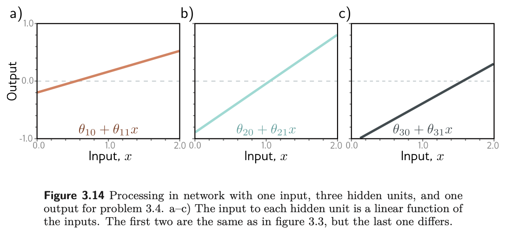{#fig-udl-3-14 width=80%}

**3. (UDL 3.6)** Multiply $\theta_{10}$ and $\theta_{11}$ by a positive constant
$\alpha$ and divide $\phi_1$ by the same $\alpha$. What happens to the function
in @eq-shallow-example? Use the non-negative homogeneity of the ReLU,
$\mathrm{ReLU}[\alpha z] = \alpha\,\mathrm{ReLU}[z]$ for $\alpha > 0$ (problem
3.5). What happens if $\alpha$ is negative?

**4. (UDL 3.7)** Consider fitting @eq-shallow-example with a least-squares loss.
Does the loss have a unique minimum, i.e. a single "best" set of parameters?
Use your answer to the previous problem, and also consider what happens when two
hidden units swap roles.

**5. (UDL 3.10)** A network with one input, one output, and three hidden units
creates up to four linear regions. Under what circumstances does it produce a
function with *fewer* than four?

**6. (UDL 3.11\* and 3.17\*)** How many parameters does the model in
@fig-udl-3-6 have? Then derive @eq-param-count for the general network of
@eq-general-hidden and @eq-general-output, and verify it in PyTorch with
`sum(p.numel() for p in model.parameters())` for $D_i = 2$, $D = 20$, $D_o = 3$.

**7. (UDL 3.15\* and 3.18\*)** What is the maximum number of linear regions the
network of @fig-udl-3-11 can create? Show, using @eq-regions, that the
two-input, three-unit network of @fig-udl-3-8 creates at most seven regions, and
find the maximum when two more hidden units are added.

**8.** A predictive-maintenance model takes a vibration spectrum with $D_i =
64$ frequency bins and predicts remaining useful life with a shallow network of
$D = 256$ hidden units. Write the model in the form of @eq-matrix with the shape
of every matrix and vector, count its parameters, and use @eq-regions to bound
the number of linear regions. Then explain, in two sentences, why the
"expressivity is not the bottleneck" conclusion of §3.3 applies here, and what
the actual bottlenecks are likely to be for a dataset of two hundred failed
bearings.

**9. Computational.** In the notebook, replace `nn.ReLU()` with `nn.Sigmoid()`
in the PyTorch example and refit. Is the fitted function still piecewise linear?
Try to locate the "joints" from the first-layer parameters as @fig-fit does, and
explain what the quantity $-\theta_{d0}/\theta_{d1}$ now means instead.

**10. Computational.** Fix $D = 8$ and train the model in @fig-fit from five
different random seeds. Plot the five fitted functions on one axis, with their
joints. Do the joints land in the same places? Relate what you see to your
answer to problem 4, and to what it implies about the loss surface that Chapter
6 will have to contend with.

---

## Textbook Reference Map {#sec-reference-map}

Every part of this page, mapped to Prince, *Understanding Deep Learning*
(MIT Press, 2024) [@prince2024]. Page numbers are those of the printed book.

| This page | Prince section | Pages | Figures used |
|:--|:--|:--:|:--|
| Why We Need More Than a Line | Ch. 3 opening | 25 | — |
| The Example Network | §3.1 | 25–26 | 3.1, 3.2 (p. 26) |
| — Where the bends come from | §3.1.1 | 26–27 | 3.3 (p. 28) |
| — Depicting networks | §3.1.2 | 27 | 3.4 (p. 29) |
| The Universal Approximation Theorem | §3.2 | 29–30 | 3.5 (p. 30) |
| Multivariate Inputs and Outputs | §3.3 | 30 | — |
| — Several outputs | §3.3.1 | 30–31 | 3.6 (p. 31) |
| — Several inputs | §3.3.2 | 31–33 | 3.7 (p. 31), 3.8 (p. 32) |
| — Regions explode with dimension | §3.3.2 and Notes | 33, 38 | 3.9, 3.10 (p. 34) |
| The General Case | §3.4 | 33–35 | 3.11 (p. 35) |
| Terminology | §3.5 and Notes | 35–36, 39 | 3.12 (p. 36) |
| Beyond the ReLU | Notes | 37–38 | 3.13 (p. 37) |
| Building One in PyTorch | ours; notebooks 3.1, 3.3 | — | — |
| Summary | §3.6 | 36 | — |
| Exercises 1–7 | Problems 3.1–3.7, 3.10, 3.11, 3.15, 3.17, 3.18 | 39–40 | 3.14 (p. 39) |

: {tbl-colwidths="[32,26,10,32]"}

Equations on this page correspond to Prince as follows: @eq-shallow-example is
his (3.1), @eq-relu is (3.2), @eq-hidden-units is (3.3), @eq-output-linear is
(3.4), @eq-hd is (3.5), @eq-y-sum is (3.6), @eq-four-hidden is (3.7),
@eq-multi-out is (3.8), @eq-2d-hidden is (3.9) together with (3.10),
@eq-general-hidden is (3.11), and @eq-general-output is (3.12). @eq-matrix is
the matrix form of (3.11)–(3.12) in the notation of Appendix B, @eq-param-count
is the answer to his problem 3.17, and @eq-regions is the Zaslavsky (1975) bound
quoted in the chapter notes on p. 38; none of these three appears as a numbered
equation in the book.

::: {.callout-note appearance="simple"}
## Figure credits
Figures 3.1–3.14 are reproduced unaltered from Prince, *Understanding Deep
Learning* (MIT Press, 2024), which is distributed under a Creative Commons
CC-BY-NC-ND license, and are used here for non-commercial classroom instruction.
All other figures on this page are generated by the code in this week's
notebook.
:::

---

## Further Reading

- Prince, *Understanding Deep Learning*, Chapter 3 [@prince2024] — the assigned reading. The chapter notes (pp. 36–39) carry the history and the activation-function survey summarized above.
- **[▶ UDL notebooks 3.1–3.4](https://github.com/udlbook/udlbook/tree/main/Notebooks/Chap03)** — Prince's own Colab notebooks for this chapter; links to each are at the top of this page.
- **[▶ This week's notebook](https://colab.research.google.com/github/harunpirim/IMSE774-NeuralNetworks/blob/main/notebooks/week03-shallow-networks.ipynb)** — every cell above, in one Colab file.
- Cybenko (1989) [@cybenko1989] and Hornik (1991) [@hornik1991] — the original universal approximation results, for sigmoid activations and then for a general class.
- Montúfar et al. (2014) [@montufar2014] — the counting argument for linear regions, and the reason Chapter 4 prefers depth to width.
- Nair & Hinton (2010) [@nair2010] — the paper that put the ReLU into the mainstream.
- Goodfellow, Bengio & Courville, *Deep Learning*, Chapter 6 [@goodfellow2016] — a second treatment of feed-forward networks, with more on activation functions and output units.
