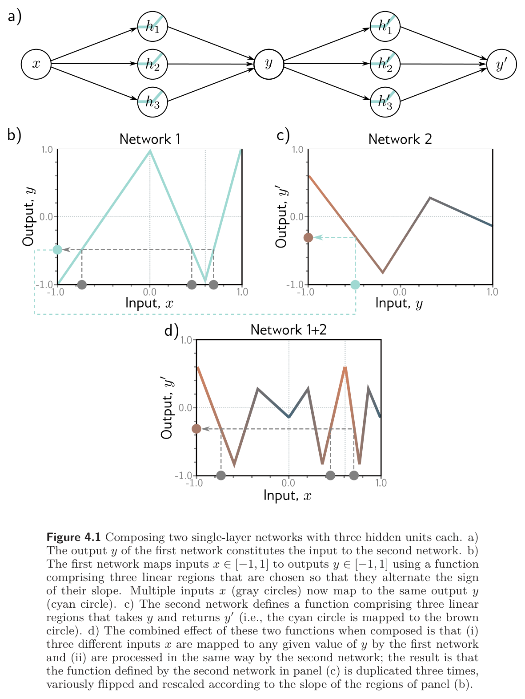
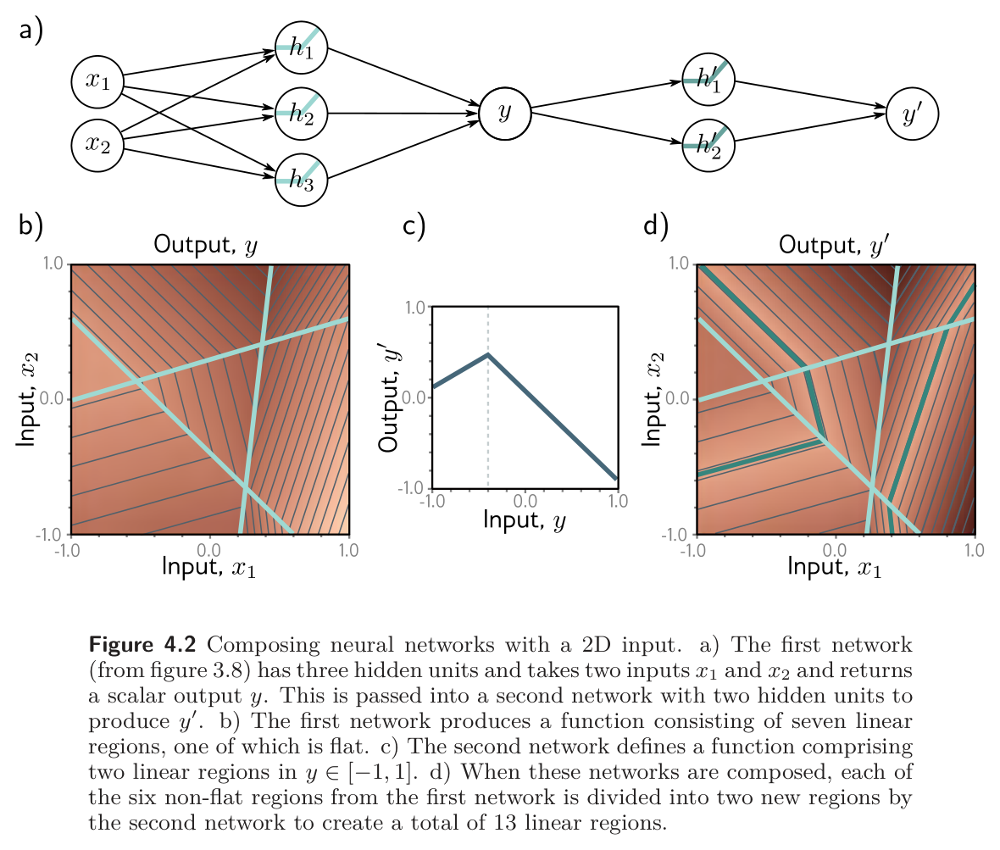
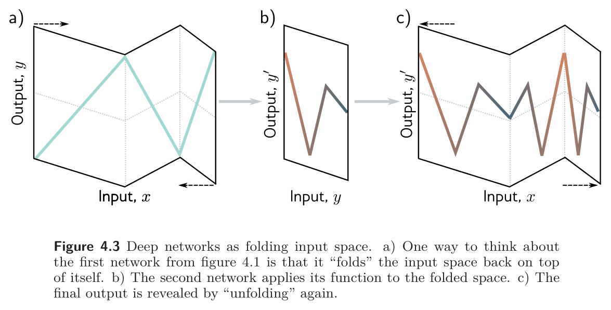
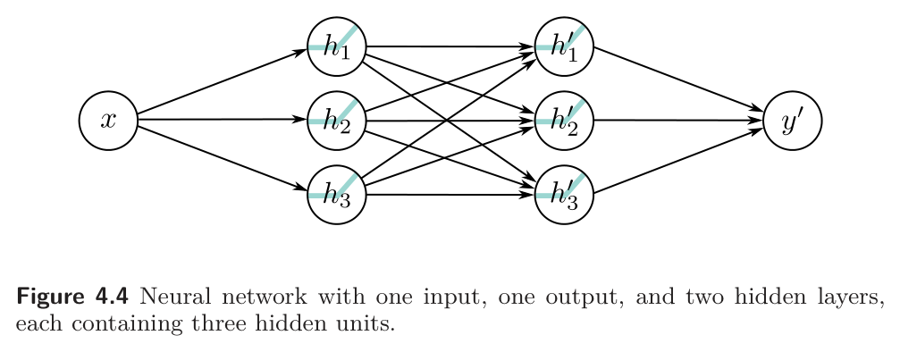
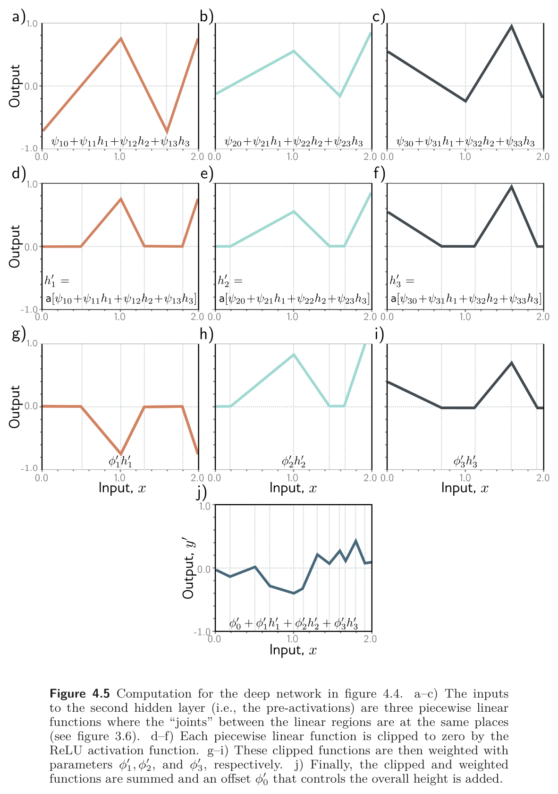
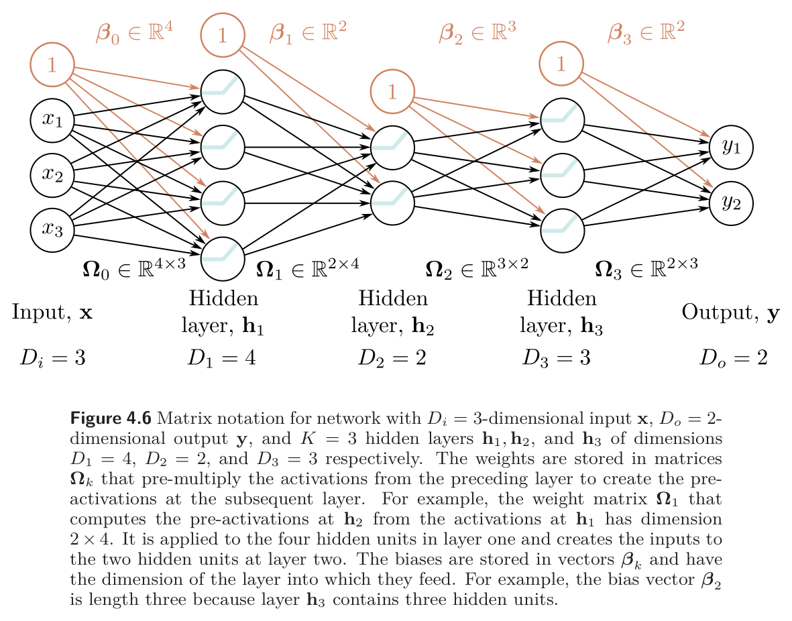
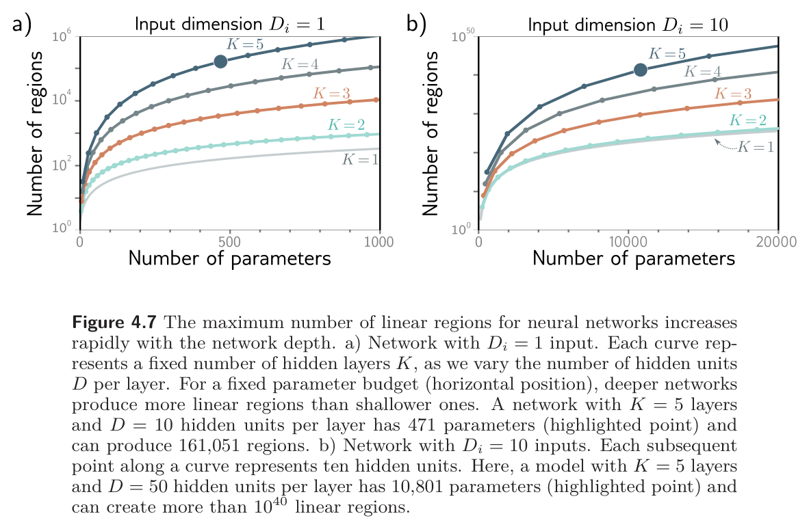
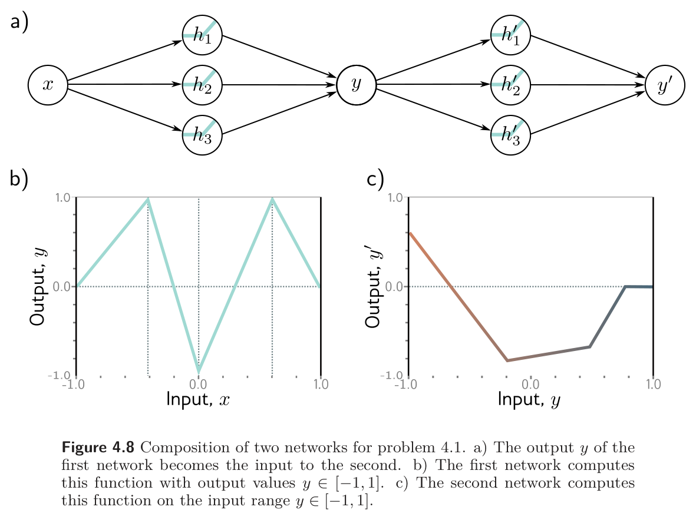
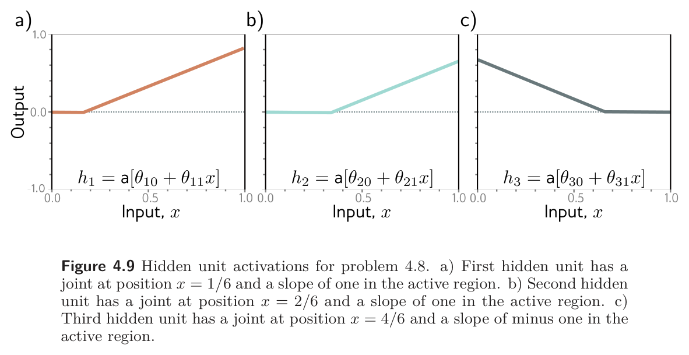

::: {.lecture-meta}
**Reading** Prince, *Understanding Deep Learning*, Chapter 4 (pp. 41–55) &nbsp;·&nbsp;
**UDL notebooks** 4.1–4.3
:::

::: {.callout-important appearance="simple"}
## Assignment A2 — Shallow and Deep Networks
A formative notebook spanning Weeks 3 and 4: joints, activation patterns, and
slopes of a shallow network; counting regions and parameters; composition,
folding, and clipping; the matrix form of a deep network; and what a trained
network actually realizes. Every task ends in a self-check that tells you at
once whether the idea landed.

- **[▶ Open A2 in Google Colab](https://colab.research.google.com/github/harunpirim/IMSE774-NeuralNetworks/blob/main/assignments/A2-shallow-and-deep.ipynb)** — nothing to install.

In Colab choose **File → Save a copy in Drive** before you start. When you are
done, **Runtime → Run all**, then **File → Download → Download .ipynb** and
upload that file on Blackboard under **Assignment A2**, named
`A2_<lastname>.ipynb`. The deadline is posted on Blackboard.
:::

::: {.callout-note appearance="simple"}
## How to read the references in these notes
Every section below opens with the section number and page range it covers in
Prince, *Understanding Deep Learning* (MIT Press, 2024). Page numbers are those
of the printed book. Figures taken from the textbook are captioned with their
original figure number and page; figures generated by the code behind this page
are ours. A complete cross-reference table appears in @sec-reference-map.
:::

## Learning Objectives

By the end of this week you should be able to:

1. Compose two shallow networks, predict how many linear regions the composition has, and explain the result in terms of **folding** the input space.
2. Show that a composition of two shallow networks is a special case of a network with two hidden layers, and say exactly what the general two-layer network can do that the composition cannot.
3. Describe the computation of a two-layer network as **clipping**: pre-activations with shared joints, ReLUs that add new joints, and a final linear recombination.
4. Distinguish parameters from **hyperparameters**, and define width, depth, and capacity.
5. Write a deep network of any depth in the matrix notation $\mathbf{h}_{k+1} = a[\boldsymbol{\beta}_k + \boldsymbol{\Omega}_k \mathbf{h}_k]$, and give the size of every weight matrix and bias vector.
6. Compare shallow and deep networks on approximation power, linear regions per parameter, depth efficiency, structured inputs, and training, and say which of these claims are proved and which are empirical.
7. Build a network of configurable depth in PyTorch, count its realized linear regions, and compare that count with the theoretical maximum.

::: {.callout-tip}
## The code lives in a notebook
This page shows the figures and results; the Python behind them is not printed
here. All of it — every cell, in the order the note uses it — is in a notebook
you can open in the browser with nothing to install:

- **[▶ Open the Week 4 notebook in Google Colab](https://colab.research.google.com/github/harunpirim/IMSE774-NeuralNetworks/blob/main/notebooks/week04-deep-networks.ipynb)** — all of this page's code, in order.
- **[▶ UDL notebook 4.1 — Composing networks](https://colab.research.google.com/github/udlbook/udlbook/blob/main/Notebooks/Chap04/4_1_Composing_Networks.ipynb)** — feed one shallow network into another and watch the regions multiply.
- **[▶ UDL notebook 4.2 — Clipping functions](https://colab.research.google.com/github/udlbook/udlbook/blob/main/Notebooks/Chap04/4_2_Clipping_functions.ipynb)** — the second hidden layer, one panel of figure 4.5 at a time.
- **[▶ UDL notebook 4.3 — Deep networks](https://colab.research.google.com/github/udlbook/udlbook/blob/main/Notebooks/Chap04/4_3_Deep_Networks.ipynb)** — the general matrix form of @eq-general with arbitrary depth.

Colab gives you a Python environment with NumPy, matplotlib, and PyTorch
already installed. In Colab, run a cell with **Shift+Enter**. If you prefer to
work locally, `pip install -r requirements.txt` from the [course
repository](https://github.com/harunpirim/IMSE774-NeuralNetworks) gives you the
same environment.
:::

```{python}
#| label: setup
#| code-fold: true
#| code-summary: "Plotting setup (click to expand)"

import numpy as np
import matplotlib.pyplot as plt
import torch
import torch.nn as nn
from math import comb

torch.manual_seed(774)
np.random.seed(774)

plt.rcParams.update({
    "figure.figsize": (7, 4),
    "figure.dpi": 130,
    "axes.spines.top": False,
    "axes.spines.right": False,
    "axes.grid": True,
    "grid.alpha": 0.25,
    "font.size": 10,
    "axes.titlesize": 11,
    "axes.labelsize": 10,
    "legend.frameon": False,
})

NDSU_GREEN = "#005643"
NDSU_GOLD  = "#FFC72C"
ACCENT     = "#C1121F"
```

---

## Why Go Deep

*Prince, Chapter 4 opening, p. 41.*

Week 3 ended on a strong result and a weak one. The strong result was the
universal approximation theorem: a shallow network with enough hidden units can
describe any continuous function on a compact set to any precision. The weak
result was everything the theorem leaves out. It says nothing about *how many*
hidden units "enough" is, and for some functions the answer is impractically
large.

This chapter introduces **deep** networks, which have more than one hidden
layer. With ReLU activations they still compute continuous piecewise linear
functions, exactly as shallow networks do, so nothing about the *kind* of
function changes. What changes is the exchange rate. Prince's claim for the
chapter is that "deep networks can produce many more linear regions than
shallow networks for a given number of parameters" (p. 41), and hence describe
a broader family of functions in practice, if not in principle. The rest of the
week makes that claim precise, then asks whether it is actually the reason deep
networks work.

## Composing Two Networks

*Prince §4.1, pp. 41–43; figures on pp. 42 and 44.*

The cleanest way into deep networks is to take two shallow networks and feed
the output of the first into the second (@fig-udl-4-1**a**). Each has three
hidden units. The first takes $x$ and returns $y$:

$$
h_1 = a[\theta_{10} + \theta_{11}x], \qquad
h_2 = a[\theta_{20} + \theta_{21}x], \qquad
h_3 = a[\theta_{30} + \theta_{31}x],
$$ {#eq-net1-hidden}

$$
y = \phi_0 + \phi_1 h_1 + \phi_2 h_2 + \phi_3 h_3.
$$ {#eq-net1-out}

The second takes $y$ and returns $y'$, with its own parameters, all primed:

$$
h'_1 = a[\theta'_{10} + \theta'_{11}y], \qquad
h'_2 = a[\theta'_{20} + \theta'_{21}y], \qquad
h'_3 = a[\theta'_{30} + \theta'_{31}y],
$$ {#eq-net2-hidden}

$$
y' = \phi'_0 + \phi'_1 h'_1 + \phi'_2 h'_2 + \phi'_3 h'_3.
$$ {#eq-net2-out}

With ReLU activations the composition is still a piecewise linear function of
$x$. The question is how many pieces. A shallow network with six hidden units
has at most seven regions. The composition, which also has six hidden units,
can have more.

{#fig-udl-4-1 width=68%}

The mechanism is in @fig-udl-4-1**b–d**. Choose the first network so that its
three regions alternate in slope and each one sweeps the whole output range
$y \in [-1, 1]$. Then three different input ranges are mapped onto the *same*
output range, and whatever the second network does to $y \in [-1, 1]$ happens
three times over as $x$ runs from $-1$ to $1$, "variously flipped and rescaled
according to the slope of the regions" (p. 42). The second network's three
regions are copied three times: nine linear regions from six hidden units.

Our version follows, with parameters chosen so that the counts can be checked.
The first network is a zigzag with slopes $3, -3, 3$ and joints at $\pm 1/3$;
the second is any three-region function on $[-1, 1]$. The region count is done
by the method of Week 3: sample the input densely and count distinct activation
patterns across *all six* hidden units, since every linear region of the
composition has its own pattern.

```{python}
#| label: fig-compose
#| fig-cap: "Our version of figure 4.1b–d. Left: the first network maps $x \\in [-1, 1]$ onto $y \\in [-1, 1]$ three times, once per region. Middle: the second network's three-region function of $y$. Right: the composition. The middle panel's shape appears three times across the input, once per region of the first network, alternately reversed; the printed count confirms nine regions from six hidden units."

def shallow(x, theta, phi0, phi):
    """Equations (4.1)-(4.2): a shallow ReLU network at every x. Returns y and the pre-activations."""
    pre = theta[:, 0:1] + theta[:, 1:2] * x[None, :]
    return phi0 + phi @ np.maximum(pre, 0), pre

def count_regions(pre_list):
    """Number of distinct activation patterns across every hidden unit of every layer."""
    patterns = np.concatenate([p > 0 for p in pre_list], axis=0).T
    return len(np.unique(patterns, axis=0))

# Network 1: zigzag on [-1, 1] with slopes 3, -3, 3 and joints at -1/3 and 1/3.
theta_A = np.array([[1.0, 1.0], [1/3, 1.0], [-1/3, 1.0]])
phi0_A, phi_A = -1.0, np.array([3.0, -6.0, 6.0])
# Network 2: a three-region function of y on [-1, 1], joints at -1/2 and 0.3.
theta_B = np.array([[1.0, 1.0], [0.5, 1.0], [-0.3, 1.0]])
phi0_B, phi_B = 0.6, np.array([-2.0, 3.5, -2.5])

x  = np.linspace(-1, 1, 20001)[1:-1]
y,  pre_A = shallow(x, theta_A, phi0_A, phi_A)
yp, pre_B = shallow(y, theta_B, phi0_B, phi_B)
yB_direct, _ = shallow(x, theta_B, phi0_B, phi_B)   # network 2 on its own input axis

fig, axes = plt.subplots(1, 3, figsize=(11, 3.2))
axes[0].plot(x, y, color=NDSU_GREEN, lw=2.2)
axes[0].set_title("Network 1: $y[x]$"); axes[0].set_xlabel("$x$"); axes[0].set_ylabel("$y$")
axes[1].plot(x, yB_direct, color=ACCENT, lw=2.2)
axes[1].set_title("Network 2: $y'[y]$"); axes[1].set_xlabel("$y$"); axes[1].set_ylabel("$y'$")
axes[2].plot(x, yp, color="k", lw=2.2)
axes[2].set_title("Composition: $y'[y[x]]$"); axes[2].set_xlabel("$x$"); axes[2].set_ylabel("$y'$")
for ax in axes:
    ax.set_xlim(-1, 1); ax.set_ylim(-1.05, 1.05)
for j in (-1/3, 1/3):
    axes[0].axvline(j, color="gray", ls=":", lw=1); axes[2].axvline(j, color="gray", ls=":", lw=1)
plt.tight_layout()
plt.show()

print(f"network 1 alone : {count_regions([pre_A]):>2} regions from 3 hidden units")
print(f"network 2 alone : {count_regions([shallow(x, theta_B, phi0_B, phi_B)[1]]):>2} regions from 3 hidden units")
print(f"composition     : {count_regions([pre_A, pre_B]):>2} regions from 6 hidden units")
print(f"shallow, 6 units: at most 7")
```

The same principle applies in higher dimensions (@fig-udl-4-2). There the first
network is the two-input, three-unit network of Week 3, whose output surface has
seven regions, one of them flat. Passing that through a second network with two
regions splits each of the six non-flat regions in two, for thirteen in all.
The flat region is not split, because a constant input gives the second network
nothing to bend.

{#fig-udl-4-2 width=78%}

### Folding the input space

*Prince §4.1, p. 43; figure on p. 44.*

Prince offers a second picture of the same construction (@fig-udl-4-3). The
first network **folds** the input space back on itself, so that several inputs
land on the same output. The second network then draws its function once on the
folded paper. Unfolding reveals that function replicated at every point that had
been stacked together, mirrored at each crease. The picture is worth keeping in
mind for two reasons. It explains where the multiplication of regions comes
from, and it exposes the price: the copies are not independent. The composition
has nine regions but only twenty parameters, and the shapes of the nine pieces
are tied to one another by the fold.

{#fig-udl-4-3 width=82%}

If one fold triples the regions, more folds should multiply them again. @Fig-fold-depth
composes the zigzag network with *itself* $K$ times. Each composition adds three
hidden units and, in the matrix notation of §4.4 below, twelve parameters. The
regions go up by a factor of three each time.

```{python}
#| label: fig-fold-depth
#| fig-cap: "The zigzag network of @fig-compose composed with itself one to four times. Every layer folds the input three ways, so the region count triples with each layer while the hidden-unit count grows by only three. The printed table compares the count of activation patterns with $3^K$ and with the most a shallow network of the same size could manage."

def compose_K(x, K):
    y, pres = x.copy(), []
    for _ in range(K):
        y, pre = shallow(y, theta_A, phi0_A, phi_A)
        pres.append(pre)
    return y, pres

fig, axes = plt.subplots(1, 4, figsize=(12, 2.8), sharey=True)
rows = []
for ax, K in zip(axes, [1, 2, 3, 4]):
    yK, pres = compose_K(x, K)
    n_units, n_par = 3 * K, 3 * 2 + (K - 1) * 3 * 4 + 4
    regions = count_regions(pres)
    ax.plot(x, yK, color=NDSU_GREEN, lw=1.6)
    ax.set_title(f"$K = {K}$: {regions} regions"); ax.set_xlabel("$x$")
    rows.append((K, n_units, n_par, regions, 3 ** K, n_units + 1))
axes[0].set_ylabel("$y$")
plt.tight_layout()
plt.show()

print(f"{'layers K':>9}{'hidden units':>14}{'parameters':>12}{'regions':>9}{'3^K':>6}{'shallow max':>13}")
for K, n_units, n_par, regions, cube, shallow_max in rows:
    print(f"{K:>9}{n_units:>14}{n_par:>12}{regions:>9}{cube:>6}{shallow_max:>13}")
```

Twelve hidden units arranged as four layers of three make eighty-one regions.
Twelve hidden units in a single layer make at most thirteen. That factor is the
whole case for depth in one table, and the caveat that goes with it is in the
figure: the eighty-one pieces are all the same triangle, at four scales. We
return to this in §4.5.

## From Composition to a Deep Network

*Prince §4.2, pp. 43–45; figure on p. 45.*

Composing two networks turns out to be a special case of something simpler. The
output of the first network, @eq-net1-out, is linear in the hidden units
$h_1, h_2, h_3$. The first thing the second network does to $y$, inside the
brackets of @eq-net2-hidden, is also linear. A linear function of a linear
function is linear, so substituting @eq-net1-out into @eq-net2-hidden gives

$$
\begin{aligned}
h'_1 &= a[\theta'_{10} + \theta'_{11}y] = a[\theta'_{10} + \theta'_{11}\phi_0 + \theta'_{11}\phi_1 h_1 + \theta'_{11}\phi_2 h_2 + \theta'_{11}\phi_3 h_3] \\
h'_2 &= a[\theta'_{20} + \theta'_{21}y] = a[\theta'_{20} + \theta'_{21}\phi_0 + \theta'_{21}\phi_1 h_1 + \theta'_{21}\phi_2 h_2 + \theta'_{21}\phi_3 h_3] \\
h'_3 &= a[\theta'_{30} + \theta'_{31}y] = a[\theta'_{30} + \theta'_{31}\phi_0 + \theta'_{31}\phi_1 h_1 + \theta'_{31}\phi_2 h_2 + \theta'_{31}\phi_3 h_3],
\end{aligned}
$$ {#eq-substituted}

which, after renaming the constants, is

$$
\begin{aligned}
h'_1 &= a[\psi_{10} + \psi_{11}h_1 + \psi_{12}h_2 + \psi_{13}h_3] \\
h'_2 &= a[\psi_{20} + \psi_{21}h_1 + \psi_{22}h_2 + \psi_{23}h_3] \\
h'_3 &= a[\psi_{30} + \psi_{31}h_1 + \psi_{32}h_2 + \psi_{33}h_3],
\end{aligned}
$$ {#eq-psi}

with $\psi_{10} = \theta'_{10} + \theta'_{11}\phi_0$, $\psi_{11} =
\theta'_{11}\phi_1$, $\psi_{12} = \theta'_{11}\phi_2$, and so on. The
intermediate variable $y$ has disappeared. What is left is a network with **two
hidden layers**, each of three units, in which every unit of the first layer
feeds every unit of the second (@fig-udl-4-4).

{#fig-udl-4-4 width=70%}

So a two-layer network can represent anything the composition can. It can also
represent more. In @eq-psi the nine slopes $\psi_{11}, \ldots, \psi_{33}$ are
free, whereas in @eq-substituted they are forced to be the **outer product**

$$
\boldsymbol{\Psi} =
\begin{bmatrix} \theta'_{11} \\ \theta'_{21} \\ \theta'_{31} \end{bmatrix}
\begin{bmatrix} \phi_1 & \phi_2 & \phi_3 \end{bmatrix},
$$ {#eq-outer}

a $3 \times 3$ matrix of rank one. The composition squeezes the three hidden
units of the first layer through a single number $y$ before the second layer
sees them; the general two-layer network does not. We can check both halves of
this claim, that the composition equals the two-layer network with the
outer-product $\boldsymbol{\Psi}$, and that this $\boldsymbol{\Psi}$ is
rank-deficient.

```{python}
#| label: outer-product-check

theta1, phi1_0, phi1 = np.array([[-0.2, 0.4], [-0.9, 0.9], [1.1, -0.7]]), -0.23, np.array([-1.3, 1.3, 0.66])
theta2, phi2_0, phi2 = np.array([[0.3, -1.5], [-0.4, 2.0], [0.6, 1.2]]), 0.10, np.array([0.9, -0.7, 0.5])

xs = np.linspace(0, 2, 9)
y_mid, _  = shallow(xs, theta1, phi1_0, phi1)          # first network
y_comp, _ = shallow(y_mid, theta2, phi2_0, phi2)       # ... fed into the second

Psi  = np.outer(theta2[:, 1], phi1)                    # equation (4.6): psi_ij = theta'_i1 phi_j
psi0 = theta2[:, 0] + theta2[:, 1] * phi1_0            # psi_i0 = theta'_i0 + theta'_i1 phi_0
H1 = np.maximum(theta1[:, 0:1] + theta1[:, 1:2] * xs, 0)
H2 = np.maximum(psi0[:, None] + Psi @ H1, 0)
y_deep = phi2_0 + phi2 @ H2                            # two-layer network, equations (4.7)-(4.9)

print(f"max |composition - two-layer network| = {np.abs(y_comp - y_deep).max():.1e}")
print(f"rank of the outer-product Psi         = {np.linalg.matrix_rank(Psi)}   (a free 3x3 Psi has rank up to 3)")
```

## Deep Neural Networks

*Prince §4.3, pp. 45–47; figure on p. 47.*

Now take the general two-layer network of @fig-udl-4-4 at face value. The first
layer is

$$
h_1 = a[\theta_{10} + \theta_{11}x], \qquad
h_2 = a[\theta_{20} + \theta_{21}x], \qquad
h_3 = a[\theta_{30} + \theta_{31}x],
$$ {#eq-layer1}

the second layer is @eq-psi, which we restate as

$$
\begin{aligned}
h'_1 &= a[\psi_{10} + \psi_{11}h_1 + \psi_{12}h_2 + \psi_{13}h_3] \\
h'_2 &= a[\psi_{20} + \psi_{21}h_1 + \psi_{22}h_2 + \psi_{23}h_3] \\
h'_3 &= a[\psi_{30} + \psi_{31}h_1 + \psi_{32}h_2 + \psi_{33}h_3],
\end{aligned}
$$ {#eq-layer2}

and the output is

$$
y' = \phi'_0 + \phi'_1 h'_1 + \phi'_2 h'_2 + \phi'_3 h'_3.
$$ {#eq-out2}

Reading these three equations in order gives a second picture of how depth
builds complexity, this time in terms of **clipping** rather than folding
(@fig-udl-4-5):

1. The first-layer hidden units $h_1, h_2, h_3$ are computed as in Week 3: three lines, each clipped by a ReLU (@eq-layer1).
2. The **pre-activations** of the second layer are three new linear functions of those hidden units, the arguments of the ReLUs in @eq-layer2. At this point we have, in effect, a shallow network with three outputs, and Week 3 told us what that looks like: three piecewise linear functions whose joints are all in the same places (@fig-udl-4-5**a–c**).
3. The second-layer ReLU clips each of these functions wherever it dips below zero. Every crossing is a **new joint** that the first layer did not have (@fig-udl-4-5**d–f**).
4. The output is a linear combination of the clipped functions, @eq-out2 (@fig-udl-4-5**g–j**).

{#fig-udl-4-5 width=66%}

@Fig-clipping is our version, with the first layer taken from Prince's own
figure 3.3 parameters (problem 3.8), so its three joints sit at $x = 0.5$, $1$,
and $1.57$ as they did last week. The second layer's parameters are chosen so
that each pre-activation crosses zero twice inside the plot. The code then
counts the joints layer by layer.

```{python}
#| label: fig-clipping
#| fig-cap: "Our version of figure 4.5. Top row: the three second-layer pre-activations, piecewise linear functions of $x$ that share the first layer's three joints (dotted grey). Second row: each is clipped by a ReLU, which adds a joint (gold) wherever it crosses zero. Third row: the clipped functions weighted by $\\phi'_1, \\phi'_2, \\phi'_3$. Bottom: their sum plus $\\phi'_0$. The output has every joint from both rows."
#| fig-height: 8.5

theta = np.array([[-0.2, 0.4], [-0.9, 0.9], [1.1, -0.7]])      # layer 1: Prince figure 3.3
psi0  = np.array([0.41, -0.45, -0.54])                          # layer 2 biases
Psi   = np.array([[ 1.1, -1.4, -0.9],
                  [-1.0,  1.3,  1.8],
                  [ 1.8,  0.0,  0.6]])                          # layer 2 weights
phi_p0, phi_p = 0.1, np.array([1.0, -0.6, 0.9])                 # output layer

xc = np.linspace(0, 2, 20001)[1:-1]
pre1 = theta[:, 0:1] + theta[:, 1:2] * xc
H1   = np.maximum(pre1, 0)
pre2 = psi0[:, None] + Psi @ H1
H2   = np.maximum(pre2, 0)
W2   = phi_p[:, None] * H2
out  = phi_p0 + W2.sum(axis=0)

joints1 = -theta[:, 0] / theta[:, 1]
joints2 = [xc[np.where(np.diff(np.sign(pre2[i])) != 0)[0]] for i in range(3)]
colors  = [ACCENT, "#1864AB", NDSU_GREEN]

fig = plt.figure(figsize=(9.5, 9))
gs = fig.add_gridspec(4, 3)
rows = [(pre2, r"$\psi_{%d0} + \psi_{%d1}h_1 + \psi_{%d2}h_2 + \psi_{%d3}h_3$"),
        (H2,   r"$h'_%d$ (clipped)"),
        (W2,   r"$\phi'_%d h'_%d$")]
for r, (data, title) in enumerate(rows):
    for d in range(3):
        ax = fig.add_subplot(gs[r, d])
        ax.plot(xc, data[d], color=colors[d], lw=2)
        ax.axhline(0, color="k", lw=0.6)
        for j in joints1:
            ax.axvline(j, color="gray", ls=":", lw=0.9)
        for j in joints2[d]:
            ax.axvline(j, color=NDSU_GOLD, lw=1.4)
        n = d + 1
        ax.set_title(title % ((n,) * title.count("%d")))
        ax.set_ylim(-1.7, 1.7)
        if r == 2:
            ax.set_xlabel("$x$")
ax = fig.add_subplot(gs[3, 1])
ax.plot(xc, out, color="k", lw=2.4)
for j in joints1:
    ax.axvline(j, color="gray", ls=":", lw=0.9)
for js in joints2:
    for j in js:
        ax.axvline(j, color=NDSU_GOLD, lw=1.4)
ax.set_title(r"$y' = \phi'_0 + \phi'_1 h'_1 + \phi'_2 h'_2 + \phi'_3 h'_3$"); ax.set_xlabel("$x$")
plt.tight_layout()
plt.show()

n_new = sum(len(js) for js in joints2)
print(f"joints from layer 1            : {len(joints1)}")
print(f"new joints added by layer 2    : {n_new}  ({', '.join(str(len(js)) for js in joints2)} per unit)")
print(f"linear regions in the output   : {count_regions([pre1, pre2])}  (= 1 + {len(joints1)} + {n_new})")
print(f"shallow network with 6 units   : at most 7")
```

The joint count is the point. Six hidden units in one layer give at most six
joints, and every joint is a zero-crossing of a *line*, so there is exactly one
per unit. Six hidden units in two layers give three joints from the first layer
plus as many from the second as its pre-activations can be made to cross zero,
and those pre-activations are already piecewise linear, so each can cross
several times. New joints multiply rather than add.

::: {.callout-important}
## Two pictures, neither complete
Folding and clipping describe the same computation. Folding shows the
*dependencies* among the regions — the copies made by a fold are tied
together — but hides how the new joints arise. Clipping shows the new joints
but hides the dependencies. Prince is explicit that "both descriptions provide
only partial insight into how deep neural networks operate" (p. 46), and that
what we actually have is still just an equation from $x$ to $y'$. Written out
in full by substituting @eq-layer1 into @eq-layer2 into @eq-out2, it is

$$
\begin{aligned}
y' = \phi'_0
 &+ \phi'_1\, a\big[\psi_{10} + \psi_{11}a[\theta_{10} + \theta_{11}x] + \psi_{12}a[\theta_{20} + \theta_{21}x] + \psi_{13}a[\theta_{30} + \theta_{31}x]\big] \\
 &+ \phi'_2\, a\big[\psi_{20} + \psi_{21}a[\theta_{10} + \theta_{11}x] + \psi_{22}a[\theta_{20} + \theta_{21}x] + \psi_{23}a[\theta_{30} + \theta_{31}x]\big] \\
 &+ \phi'_3\, a\big[\psi_{30} + \psi_{31}a[\theta_{10} + \theta_{11}x] + \psi_{32}a[\theta_{20} + \theta_{21}x] + \psi_{33}a[\theta_{30} + \theta_{31}x]\big],
\end{aligned}
$$ {#eq-nested}

"although this is admittedly rather difficult to understand" (p. 46). The
matrix notation of the next section exists so that nobody has to write it.
:::

### Hyperparameters

*Prince §4.3.1, p. 46.*

Nothing stops us adding a third hidden layer, or a hundredth; modern networks
may have more than a hundred layers with thousands of units in each. Three
words fix the vocabulary. The number of hidden units in a layer is the
network's **width**, the number of hidden layers its **depth**, and the total
number of hidden units is a measure of its **capacity**.

We write $K$ for the number of hidden layers and $D_1, D_2, \ldots, D_K$ for
the number of units in each. These are **hyperparameters**: quantities chosen
*before* the parameters (the slopes and intercepts) are learned. The
distinction matters for how we think about a network. For fixed hyperparameters,
say $K = 2$ and $D_1 = D_2 = 3$, the model is a family of functions and the
parameters select one member. Letting the hyperparameters vary as well, a
neural network is "a family of families of functions relating input to output"
(p. 46). Chapter 8 takes up how to choose them.

## Matrix Notation

*Prince §4.4, pp. 48–49; figure on p. 48.*

A deep network is linear transformations alternating with activation functions,
and that structure is what matrix notation was built for (Appendix B.3;
Week 2). @Eq-layer1, @eq-layer2, and @eq-out2 become

$$
\begin{bmatrix} h_1 \\ h_2 \\ h_3 \end{bmatrix}
= a\!\left[
\begin{bmatrix} \theta_{10} \\ \theta_{20} \\ \theta_{30} \end{bmatrix}
+ \begin{bmatrix} \theta_{11} \\ \theta_{21} \\ \theta_{31} \end{bmatrix} x
\right],
\qquad
\begin{bmatrix} h'_1 \\ h'_2 \\ h'_3 \end{bmatrix}
= a\!\left[
\begin{bmatrix} \psi_{10} \\ \psi_{20} \\ \psi_{30} \end{bmatrix}
+ \begin{bmatrix} \psi_{11} & \psi_{12} & \psi_{13} \\ \psi_{21} & \psi_{22} & \psi_{23} \\ \psi_{31} & \psi_{32} & \psi_{33} \end{bmatrix}
\begin{bmatrix} h_1 \\ h_2 \\ h_3 \end{bmatrix}
\right],
$$ {#eq-matrix-explicit}

and $y' = \phi'_0 + [\phi'_1 \;\; \phi'_2 \;\; \phi'_3]\,[h'_1 \;\; h'_2 \;\; h'_3]^T$,
or more compactly

$$
\mathbf{h} = a[\boldsymbol{\theta}_0 + \boldsymbol{\theta}x], \qquad
\mathbf{h}' = a[\boldsymbol{\psi}_0 + \boldsymbol{\Psi}\mathbf{h}], \qquad
y' = \phi'_0 + \boldsymbol{\phi}'\mathbf{h}',
$$ {#eq-matrix-compact}

where $a[\cdot]$ applies the activation function separately to every element of
its vector argument.

### The general formulation

*Prince §4.4.1, pp. 48–49.*

Primes and a fresh Greek letter per layer do not scale to a hundred layers.
From here on the book, and this course, use one naming scheme for every layer.
The vector of hidden units at layer $k$ is $\mathbf{h}_k$. The biases that feed
layer $k + 1$ are $\boldsymbol{\beta}_k$, and the weights that act on layer $k$
to produce the pre-activations of layer $k + 1$ are $\boldsymbol{\Omega}_k$. A
deep network $\mathbf{y} = \mathbf{f}[\mathbf{x}, \boldsymbol{\phi}]$ with $K$
hidden layers is then

$$
\begin{aligned}
\mathbf{h}_1 &= a[\boldsymbol{\beta}_0 + \boldsymbol{\Omega}_0\mathbf{x}] \\
\mathbf{h}_2 &= a[\boldsymbol{\beta}_1 + \boldsymbol{\Omega}_1\mathbf{h}_1] \\
\mathbf{h}_3 &= a[\boldsymbol{\beta}_2 + \boldsymbol{\Omega}_2\mathbf{h}_2] \\
&\;\;\vdots \\
\mathbf{h}_K &= a[\boldsymbol{\beta}_{K-1} + \boldsymbol{\Omega}_{K-1}\mathbf{h}_{K-1}] \\
\mathbf{y} &= \boldsymbol{\beta}_K + \boldsymbol{\Omega}_K\mathbf{h}_K,
\end{aligned}
$$ {#eq-general}

and the parameters are every one of these matrices and vectors,
$\boldsymbol{\phi} = \{\boldsymbol{\beta}_k, \boldsymbol{\Omega}_k\}_{k=0}^{K}$.
Note that the output line has no activation function: the last step is purely
linear, as it was for the shallow network.

::: {.callout-note}
## Notation
The index on $\boldsymbol{\beta}_k$ and $\boldsymbol{\Omega}_k$ is the layer
they are applied *to*, not the layer they produce: $\boldsymbol{\Omega}_0$ acts
on the input $\mathbf{x}$ (layer zero) and $\boldsymbol{\Omega}_K$ acts on the
last hidden layer to produce $\mathbf{y}$. A network with $K$ hidden layers
therefore has $K + 1$ weight matrices and $K + 1$ bias vectors.
:::

Every size follows from where each object sits (@fig-udl-4-6). If layer $k$
has $D_k$ hidden units, then the bias vector $\boldsymbol{\beta}_{k-1}$ that
feeds it has $D_k$ entries, and the last bias vector $\boldsymbol{\beta}_K$ has
$D_o$ entries, one per output. The first weight matrix $\boldsymbol{\Omega}_0$
is $D_1 \times D_i$, the last, $\boldsymbol{\Omega}_K$, is $D_o \times D_K$, and
each one in between, $\boldsymbol{\Omega}_k$, is $D_{k+1} \times D_k$: rows for
the layer it produces, columns for the layer it consumes.

{#fig-udl-4-6 width=82%}

Finally, the whole network can be written as one nested expression,

$$
\mathbf{y} = \boldsymbol{\beta}_K + \boldsymbol{\Omega}_K\, a\Big[\boldsymbol{\beta}_{K-1} + \boldsymbol{\Omega}_{K-1}\, a\big[\ldots\, \boldsymbol{\beta}_2 + \boldsymbol{\Omega}_2\, a[\boldsymbol{\beta}_1 + \boldsymbol{\Omega}_1\, a[\boldsymbol{\beta}_0 + \boldsymbol{\Omega}_0\mathbf{x}]]\ldots\big]\Big],
$$ {#eq-single}

which is @eq-nested with the subscripts tidied up, and no easier to read. In
PyTorch, though, it is one line. A `Linear` layer *is* $\boldsymbol{\beta}_k +
\boldsymbol{\Omega}_k \mathbf{h}_k$, and its `weight` and `bias` attributes are
the matrix and vector exactly, with the shapes just described. The following
builds the network of @fig-udl-4-6 and prints every shape, which is the check
problem 4.2 asks for.

```{python}
#| label: matrix-shapes

def make_mlp(D_i, widths, D_o):
    """A fully connected ReLU network: equation (4.15) with hidden widths D_1, ..., D_K."""
    layers, d = [], D_i
    for w in widths:
        layers += [nn.Linear(d, w), nn.ReLU()]
        d = w
    layers.append(nn.Linear(d, D_o))
    return nn.Sequential(*layers)

net = make_mlp(D_i=3, widths=[4, 2, 3], D_o=2)     # figure 4.6
linears = [m for m in net if isinstance(m, nn.Linear)]
print(f"{'layer':<8}{'Omega_k shape':>16}{'beta_k size':>13}   reads")
for k, lin in enumerate(linears):
    src = "x" if k == 0 else f"h_{k}"
    dst = "y" if k == len(linears) - 1 else f"h_{k + 1}"
    print(f"k = {k:<4}{str(tuple(lin.weight.shape)):>16}{lin.bias.numel():>13}   {dst} = a[beta_{k} + Omega_{k} {src}]" if dst != "y"
          else f"k = {k:<4}{str(tuple(lin.weight.shape)):>16}{lin.bias.numel():>13}   {dst} = beta_{k} + Omega_{k} {src}")
print(f"\ntotal parameters: {sum(p.numel() for p in net.parameters())}")
```

Row counts match the layer each matrix produces and column counts the layer it
consumes, as the figure says: $\boldsymbol{\Omega}_1$ is $2 \times 4$ because it
turns four units into two. Summing entries gives the parameter count, which
for the general case with $D_i$ inputs, $D_o$ outputs, and widths $D_1, \ldots,
D_K$ is

$$
\underbrace{D_1(D_i + 1)}_{\boldsymbol{\Omega}_0,\, \boldsymbol{\beta}_0}
+ \sum_{k=1}^{K-1} \underbrace{D_{k+1}(D_k + 1)}_{\boldsymbol{\Omega}_k,\, \boldsymbol{\beta}_k}
+ \underbrace{D_o(D_K + 1)}_{\boldsymbol{\Omega}_K,\, \boldsymbol{\beta}_K}.
$$ {#eq-params-general}

## Shallow vs. Deep Networks

*Prince §4.5, pp. 49–51; figure on p. 51.*

Week 3 described shallow networks and this week deep ones. Prince compares them
along five lines, and it is worth being clear about which comparisons are
theorems, which are counting arguments, and which are observations.

### Approximation power

*Prince §4.5.1, p. 50.*

Both can approximate any continuous function. The shallow case is the universal
approximation theorem of Week 3. The deep case follows from it: a two-layer
network contains the composition of two shallow networks as a special case, and
if the second of those computes the identity function (problem 4.7), the deep
network *is* a shallow network. So a deep network with enough capacity can
approximate any continuous function arbitrarily closely. This is a theorem, and
by itself it says nothing about which architecture is better.

### Linear regions per parameter

*Prince §4.5.2, p. 50; notes on pp. 52–53.*

Here the two differ. For one input and one output, a shallow network with $D >
2$ hidden units makes at most $D + 1$ linear regions from $3D + 1$ parameters.
A deep network with $K$ layers of $D > 2$ units each makes up to

$$
(D + 1)^K \;\text{ regions from }\; 3D + 1 + (K - 1)D(D + 1) \;\text{ parameters}.
$$ {#eq-regions-1d}

Regions grow exponentially in depth; parameters grow only linearly. The
parameter count is @eq-params-general with $D_i = D_o = 1$ and every width
equal to $D$ (problem 4.10), and the region count is the folding argument of
§4.1 done $K$ times: each layer can fold the input into $D + 1$ pieces on which
the next layer's function is replicated, just as @fig-fold-depth folded it into
three. @Fig-udl-4-7**a** plots regions against parameters for depths one to
five, and the gap widens with every layer. The book's headline example is a
network with $K = 5$ and $D = 10$: 471 parameters and 161,051 regions.

{#fig-udl-4-7 width=82%}

With more inputs the maximum is harder to compute, but the chapter notes (p.
53) give a closed form for the case where every layer has the same width $D$
and $D$ is a multiple of $D_i$:

$$
N_r = \left(\frac{D}{D_i} + 1\right)^{D_i(K-1)} \sum_{j=0}^{D_i} \binom{D}{j}.
$$ {#eq-nr}

The first factor is the first $K - 1$ layers folding the space, with $D / D_i$
units now needed per input dimension to make each fold. The sum is the
Zaslavsky bound of Week 3, the regions the final layer carves out of each folded
piece. @Fig-regions-depth evaluates both formulas and reproduces the two points
the book highlights.

```{python}
#| label: fig-regions-depth
#| fig-cap: "Our version of figure 4.7. Left: one input, maximum regions $(D + 1)^K$ against parameters $3D + 1 + (K - 1)D(D + 1)$ for $K = 1, \\ldots, 5$ hidden layers, sweeping the width $D$. Right: ten inputs, using @eq-nr, in steps of ten units. At any fixed parameter budget the deeper curve is higher, and the vertical axis is logarithmic. Black dots are the two networks the book singles out."

def n_params(D, K, D_i=1, D_o=1):
    D, K = int(D), int(K)
    return D * (D_i + 1) + (K - 1) * D * (D + 1) + D_o * (D + 1)

def n_regions(D, K, D_i=1):
    D, K = int(D), int(K)                      # Python ints: these counts overflow int64
    if D_i == 1:
        return (D + 1) ** K
    return (D // D_i + 1) ** (D_i * (K - 1)) * sum(comb(D, j) for j in range(D_i + 1))

fig, axes = plt.subplots(1, 2, figsize=(10, 3.6))
shades = plt.cm.viridis(np.linspace(0.85, 0.1, 5))
for K, c in zip(range(1, 6), shades):
    Ds = np.arange(3, 19)
    axes[0].plot([n_params(D, K) for D in Ds], [n_regions(D, K) for D in Ds], "o-", ms=3, color=c, lw=1.8, label=f"$K = {K}$")
    Ds = np.arange(10, 101, 10)
    axes[1].plot([n_params(D, K, D_i=10) for D in Ds], [float(n_regions(D, K, D_i=10)) for D in Ds], "o-", ms=3, color=c, lw=1.8, label=f"$K = {K}$")
axes[0].plot(n_params(10, 5), n_regions(10, 5), "o", color="k", ms=8, zorder=5)
axes[1].plot(n_params(50, 5, D_i=10), float(n_regions(50, 5, D_i=10)), "o", color="k", ms=8, zorder=5)
axes[0].set_title("$D_i = 1$ input"); axes[1].set_title("$D_i = 10$ inputs")
for ax in axes:
    ax.set_yscale("log"); ax.set_xlabel("number of parameters"); ax.set_ylabel("maximum linear regions")
axes[0].set_xlim(0, 1000); axes[1].set_xlim(0, 20000)
axes[0].legend(fontsize=8)
plt.tight_layout()
plt.show()

print(f"K = 5, D = 10, D_i = 1 : {n_params(10, 5):>6,} parameters, {n_regions(10, 5):>10,} regions")
print(f"K = 5, D = 50, D_i = 10: {n_params(50, 5, D_i=10):>6,} parameters, about 10^{np.log10(float(n_regions(50, 5, D_i=10))):.0f} regions")
```

::: {.callout-important}
## Regions are not free capacity
This is the place to be careful. A deep network's regions "contain complex
dependencies and symmetries" (p. 50): the folding picture showed that the
copies are mirror images of one another, and @fig-fold-depth was eighty-one
regions made of one triangle. The flexibility of the function is still bounded
by the number of parameters, and forty-six parameters cannot describe eighty-one
independent pieces. Prince's conclusion is conditional: the extra regions are
an advantage only if (i) the function we want to approximate has similar
symmetries, or (ii) we have reason to believe the mapping from input to output
"really does involve a composition of simpler functions" (p. 51). For many
engineering systems (ii) is a reasonable belief, and it is a better argument
for depth than the raw count is.
:::

### Depth efficiency

*Prince §4.5.3, p. 50; notes on p. 53.*

There is a stronger theoretical statement than region counting. For certain
functions, a shallow network needs **exponentially** more hidden units than a
deep network to reach the same approximation error. This is the **depth
efficiency** of neural networks, and the chapter notes trace it through
Telgarsky (2016), who builds one-input functions realizable with $O[k^3]$
layers of constant width that no network of $O[k]$ layers and width below
$2^k$ can match, and Eldan & Shamir (2016), who show that with multivariate
inputs some three-layer networks cannot be realized by any two-layer network of
sub-exponential size. The corresponding **width efficiency** results (Lu et al.,
2017) are weaker: a wide shallow network needs at most a *polynomial* increase
in depth to be matched by a narrow one. Depth is the more valuable resource. The
same caveat applies as before, though: it is not clear that the functions we
meet in practice belong to the classes these theorems describe.

### Large, structured inputs

*Prince §4.5.4, pp. 50–51.*

Everything so far has been fully connected: every unit in one layer feeds every
unit in the next. For an image with a million pixels that is not practical, and
the reason is not only the parameter count. We want different parts of the
image to be processed the *same* way, because there is no point learning to
recognize an object separately at every position it might appear. The solution
is to process local regions in parallel and then integrate information from
progressively larger regions. Such local-to-global processing is hard to
specify without multiple layers, and it is the subject of Chapter 10.

```{python}
#| label: dense-image

pixels = 1000 * 1000 * 3                       # one RGB photograph
for D1 in (100, 1000):
    p = D1 * (pixels + 1)
    print(f"fully connected first layer, {D1:>5} hidden units: {p:>14,} parameters  ({p * 4 / 1e9:5.1f} GB in float32)")
```

One layer of a thousand units, on one photograph, already needs twelve
gigabytes of weights, and every one of those weights would have to be learned
from data. The count is the least of the problems; the missing structure is the
real one.

### Training and generalization

*Prince §4.5.5, p. 51.*

The last two comparisons are empirical. Moderately deep networks are usually
*easier* to fit than shallow ones, perhaps because over-parameterized deep
models have a large family of roughly equivalent solutions that are easy to
find. Past a certain depth, training becomes difficult again, and much of
Chapter 11 is about the methods that mitigate this. Deep networks also seem to
**generalize** better to new data. In practice the best results on most tasks
come from networks with tens or hundreds of layers, and "neither of these
phenomena are well understood" (p. 51); Chapter 20 returns to both.

## Deep Networks in PyTorch

*Ours; UDL notebook 4.3.*

The theory of §4.5 is about what a network *can* represent. Whether gradient
descent finds it is a different question, and Chapters 6 and 7 are about the
answer. We can preview the gap now. Problem 4.11 poses two networks with the
same parameter count: a shallow one with $D = 95$ hidden units and a deep one
with $K = 10$ layers of $D = 5$. By @eq-regions-1d the shallow network can make
96 regions and the deep one about sixty million. We fit both, with the Adam
optimizer of Week 2, to noisy samples of a triangle wave, a target whose
repeated symmetric pieces are exactly the kind of structure a fold reproduces
for free. Then we count the regions each trained network *actually* uses, by
tallying activation patterns across every hidden unit, as in @fig-compose.

```{python}
#| label: shallow-vs-deep

def triangle(x):                                   # period 0.5, amplitude 1
    return 2 * np.abs(2 * ((2 * x) % 1) - 1) - 1

x_train = np.random.uniform(-1, 1, 400)
y_train = triangle(x_train) + np.random.normal(0, 0.05, x_train.shape)
X = torch.tensor(x_train, dtype=torch.float32)[:, None]
Y = torch.tensor(y_train, dtype=torch.float32)[:, None]
xg = torch.linspace(-1, 1, 20001)[1:-1][:, None]

def realized_regions(model, xg):
    """Distinct activation patterns over the grid, across every ReLU in the network."""
    pats, h = [], xg
    with torch.no_grad():
        for layer in model:
            h = layer(h)
            if isinstance(layer, nn.ReLU):
                pats.append(h > 0)
    return len(np.unique(torch.cat(pats, dim=1).numpy(), axis=0))

def fit(model, epochs=5000, lr=0.01):
    opt = torch.optim.Adam(model.parameters(), lr=lr)
    history = []
    for _ in range(epochs):
        opt.zero_grad()
        loss = nn.MSELoss()(model(X), Y)
        loss.backward(); opt.step()
        history.append(loss.item())
    return history

torch.manual_seed(774); shallow_net = make_mlp(1, [95], 1)
torch.manual_seed(774); deep_net    = make_mlp(1, [5] * 10, 1)
hist_s = fit(shallow_net)
hist_d = fit(deep_net)

print(f"{'network':<22}{'parameters':>11}{'max regions':>13}{'realized':>10}{'final MSE':>11}")
for name, m, hist, mx in [("shallow, D = 95", shallow_net, hist_s, n_regions(95, 1)),
                          ("deep, K = 10, D = 5", deep_net, hist_d, n_regions(5, 10))]:
    print(f"{name:<22}{sum(p.numel() for p in m.parameters()):>11}{mx:>13,}{realized_regions(m, xg):>10}{hist[-1]:>11.4f}")
```

```{python}
#| label: fig-shallow-vs-deep
#| fig-cap: "Two 286-parameter networks fitted to the same noisy triangle wave. Left: the shallow network follows the target closely. Middle: the deep, narrow network does not, despite a theoretical capacity hundreds of thousands of times larger. Right: training loss for both. Depth changes what a network can represent; it also changes how hard the parameters are to find, which is the subject of Chapters 6, 7, and 11."

with torch.no_grad():
    xg_np = xg.squeeze().numpy()
    ys = shallow_net(xg).squeeze().numpy()
    yd = deep_net(xg).squeeze().numpy()

fig, axes = plt.subplots(1, 3, figsize=(11.5, 3.3))
for ax, yy, title in [(axes[0], ys, "shallow: $D = 95$"), (axes[1], yd, "deep: $K = 10$, $D = 5$")]:
    ax.scatter(x_train, y_train, s=6, color="gray", alpha=0.4)
    ax.plot(xg_np, triangle(xg_np), "--", color=ACCENT, lw=1.2, label="target")
    ax.plot(xg_np, yy, color=NDSU_GREEN, lw=2, label="network")
    ax.set_title(title); ax.set_xlabel("$x$"); ax.set_ylim(-1.4, 1.4)
axes[0].set_ylabel("$y$"); axes[0].legend(fontsize=8, loc="upper right")
axes[2].plot(hist_s, color=NDSU_GREEN, lw=1.4, label="shallow")
axes[2].plot(hist_d, color=ACCENT, lw=1.4, label="deep")
axes[2].set_yscale("log"); axes[2].set_xlabel("epoch"); axes[2].set_ylabel("MSE"); axes[2].set_title("Training loss"); axes[2].legend(fontsize=8)
plt.tight_layout()
plt.show()
```

Two things stand out. Neither network comes anywhere near its maximum region
count: the shallow one realizes about half of its 96, and the deep one a
couple of dozen of its sixty million. And on this target, with this optimizer and this
much training, the shallow network wins outright. The maximum in
@eq-regions-1d is a statement about the *best* parameter setting; gradient
descent from a random start does not find it, and for a narrow, deep ReLU
network it barely gets started, for reasons Chapter 7 will make precise when we
look at how gradients propagate through many layers. Meanwhile the hand-built
network of @fig-fold-depth, with forty-six parameters, would fit a triangle
wave exactly. The capacity is real. Reaching it is the hard part, and it is why
the remainder of the course is mostly about training.

## Summary

*Prince §4.6, p. 52.*

Composing two shallow networks makes the first network **fold** the input space
and the second apply a piecewise linear function that is duplicated wherever the
space was folded onto itself. That composition is a special case of a network
with two hidden layers, in which the second-layer ReLUs **clip** the incoming
functions and add joints. Hyperparameters — the depth $K$ and the widths $D_1,
\ldots, D_K$ — fix the family; parameters $\{\boldsymbol{\beta}_k,
\boldsymbol{\Omega}_k\}$ fix the member, and the general network is $K + 1$
affine maps with a ReLU between each pair, @eq-general.

Comparing shallow with deep: (i) both approximate any continuous function given
enough capacity; (ii) deep networks produce many more linear regions per
parameter, though the regions are tied together by the folds; (iii) some
functions need exponentially more shallow units than deep ones; (iv) large,
structured inputs like images are best handled in stages, which needs layers;
and (v) in practice the best results come from deep networks with many layers,
for reasons that are not yet understood.

**Next:** we now know what shallow and deep networks can represent, and we have
seen that representing a function and finding it are different problems.
Chapter 5 introduces loss functions, which turn "how wrong is this model" into a
single number for any choice of parameters. Chapters 6 and 7 then describe the
search for the parameters that minimize it.

---

## Exercises

::: {.callout-note appearance="minimal"}
Problem numbers refer to Prince, Chapter 4 (pp. 53–55). Starred UDL problems
have published answers on the [UDL website](https://udlbook.github.io/udlbook/).
The computational problems extend code that is already written for you — start
from the [Colab notebook](https://colab.research.google.com/github/harunpirim/IMSE774-NeuralNetworks/blob/main/notebooks/week04-deep-networks.ipynb).
:::

**1. (UDL 4.1\*)** Consider composing the two networks in @fig-udl-4-8. Sketch
the relationship between $x$ and $y'$ for $x \in [-1, 1]$. How many linear
regions does it have, and how does that follow from the number of regions in
panels (b) and (c)? Then check your sketch in the notebook by encoding both
panels as shallow networks and composing them as @fig-compose does.

{#fig-udl-4-8 width=76%}

**2. (UDL 4.2, 4.5, and 4.6)** Identify the four hyperparameters in
@fig-udl-4-6. For a network with $D_i = 5$ inputs, $D_o = 1$ output, and $K =
20$ hidden layers of $D = 30$ units each, state the depth and the width. Then
consider a network with $D_i = D_o = 1$ and $K = 10$ layers of $D = 10$ units:
would the number of weights increase more if the depth grew by one or if the
width grew by one? Show your reasoning using @eq-params-general.

**3. (UDL 4.3)** Use the non-negative homogeneity of the ReLU (problem 3.5) to
show that for non-negative scalars $\lambda_0, \lambda_1$,
$$
\mathrm{ReLU}\big[\boldsymbol{\beta}_1 + \lambda_1 \boldsymbol{\Omega}_1 \mathrm{ReLU}[\boldsymbol{\beta}_0 + \lambda_0 \boldsymbol{\Omega}_0 \mathbf{x}]\big]
= \lambda_0 \lambda_1 \mathrm{ReLU}\Big[\tfrac{1}{\lambda_0\lambda_1}\boldsymbol{\beta}_1 + \boldsymbol{\Omega}_1 \mathrm{ReLU}\big[\tfrac{1}{\lambda_0}\boldsymbol{\beta}_0 + \boldsymbol{\Omega}_0 \mathbf{x}\big]\Big].
$$
Explain in one sentence what this says about the uniqueness of a trained
network's weights, and connect it to your answer to problem 4 of Week 3.

**4. (UDL 4.4)** Write out the equations for a network with $D_i = 5$ inputs,
$D_o = 4$ outputs, and three hidden layers of sizes $D_1 = 20$, $D_2 = 10$, and
$D_3 = 7$, in both the layered form of @eq-general and the nested form of
@eq-single. Give the size of every $\boldsymbol{\Omega}_k$ and
$\boldsymbol{\beta}_k$, and the total parameter count from @eq-params-general.
Then build it with `make_mlp` in the notebook and confirm every size.

**5. (UDL 4.7)** Choose parameters for the ten-parameter shallow network of
Week 3 so that it computes the identity function $y = x$ over a finite range $x
\in [a, b]$. Hence explain why the argument of §4.5.1 — that a deep network can
approximate any continuous function — is a consequence of the shallow result
rather than a new theorem.

**6. (UDL 4.8\* and 4.9\*)** @Fig-udl-4-9 shows three hidden-unit activations
with slopes $1, 1, -1$ and joints at $x = 1/6$, $2/6$, and $4/6$. Find
$\phi_0, \phi_1, \phi_2, \phi_3$ such that $\phi_0 + \phi_1 h_1 + \phi_2 h_2 +
\phi_3 h_3$ has four linear regions oscillating between output values zero and
one, with the leftmost slope positive. How many regions result if this network
is composed with itself? Composed with itself $K$ times? Then decide whether the
same kind of oscillation with three regions is possible using two hidden units,
and with five regions using four, and explain the pattern.

{#fig-udl-4-9 width=80%}

**7. (UDL 4.10 and 4.11\*)** Show that a network with one input, one output,
and $K$ hidden layers of $D$ units has $3D + 1 + (K - 1)D(D + 1)$ parameters.
Then compare the two networks of the PyTorch section: shallow with $D = 95$,
and deep with $K = 10$, $D = 5$. Confirm both have 286 parameters, compute the
maximum regions for each, and argue which would run faster at inference time.
Is the region count the right basis for choosing between them? Use the printed
results of the shallow-vs-deep cell in your answer.

**8.** A laser powder-bed fusion machine records a $256 \times 256$ thermal
image of the melt pool at each scan step, and a quality model must predict the
porosity of the finished part from it. (a) Count the parameters of a fully
connected first layer with $D_1 = 512$ hidden units, and comment in the light of
§4.5.4. (b) A process engineer describes the physics as a chain: laser
parameters set the melt-pool geometry, geometry sets the local cooling rate,
cooling rate sets the microstructure, and microstructure sets the porosity.
Explain, citing §4.5.2 and the folding picture, why this description is an
argument for a deep model rather than a wide one, and write down the
hyperparameters of a network whose layers mirror the chain.

**9. Computational.** The deep network in the PyTorch section is unusually
narrow. In the notebook, refit with $K = 3$ layers of $D = 8$ units (169
parameters) and with $K = 2$ layers of $D = 12$, from three different random
seeds each. Tabulate final MSE and realized regions for every run. Which
configuration is most sensitive to the seed, and what does that suggest about
the loss surface that Chapter 6 will have to navigate?

**10. Computational.** In @fig-fold-depth the region count triples per layer
because every region of the zigzag sweeps the full output range $[-1, 1]$.
Rescale the first network's output by $0.5$ (halve $\phi_0$ and every $\phi_d$)
and repeat the composition for $K = 1, \ldots, 4$. Count the regions, explain
why the count now falls short of $3^K$, and relate this to the word "up to" in
@eq-regions-1d.

---

## Textbook Reference Map {#sec-reference-map}

Every part of this page, mapped to Prince, *Understanding Deep Learning*
(MIT Press, 2024) [@prince2024]. Page numbers are those of the printed book.

| This page | Prince section | Pages | Figures used |
|:--|:--|:--:|:--|
| Why Go Deep | Ch. 4 opening | 41 | — |
| Composing Two Networks | §4.1 | 41–43 | 4.1 (p. 42), 4.2 (p. 44) |
| — Folding the input space | §4.1 | 43 | 4.3 (p. 44) |
| From Composition to a Deep Network | §4.2 | 43–45 | 4.4 (p. 45) |
| Deep Neural Networks | §4.3 | 45–46 | 4.5 (p. 47) |
| — Hyperparameters | §4.3.1 | 46 | — |
| Matrix Notation | §4.4 | 48–49 | — |
| — The general formulation | §4.4.1 | 48–49 | 4.6 (p. 48) |
| Shallow vs. Deep Networks | §4.5 | 49 | — |
| — Approximation power | §4.5.1 | 50 | — |
| — Linear regions per parameter | §4.5.2 and Notes | 50, 52–53 | 4.7 (p. 51) |
| — Depth efficiency | §4.5.3 and Notes | 50, 53 | — |
| — Large, structured inputs | §4.5.4 | 50–51 | — |
| — Training and generalization | §4.5.5 | 51 | — |
| Deep Networks in PyTorch | ours; notebook 4.3 | — | — |
| Summary | §4.6 | 52 | — |
| Exercises 1–7 | Problems 4.1–4.11 | 53–55 | 4.8 (p. 54), 4.9 (p. 55) |

: {tbl-colwidths="[32,26,10,32]"}

Equations on this page correspond to Prince as follows: @eq-net1-hidden is his
(4.1), @eq-net1-out is (4.2), @eq-net2-hidden is (4.3), @eq-net2-out is (4.4),
@eq-substituted is (4.5), @eq-psi is (4.6), @eq-layer1 is (4.7), @eq-layer2 is
(4.8), @eq-out2 is (4.9), @eq-nested is (4.10), @eq-matrix-explicit collects
(4.11)–(4.13), @eq-matrix-compact is (4.14), @eq-general is (4.15), @eq-single
is (4.16), and @eq-nr is (4.17) from the chapter notes. @Eq-outer is the
outer-product constraint stated in prose on p. 45, @eq-regions-1d is the
region and parameter count stated in prose in §4.5.2, and @eq-params-general is
the general parameter count implied by §4.4.1; none of these three appears as a
numbered equation in the book.

::: {.callout-note appearance="simple"}
## Figure credits
Figures 4.1–4.9 are reproduced unaltered from Prince, *Understanding Deep
Learning* (MIT Press, 2024), which is distributed under a Creative Commons
CC-BY-NC-ND license, and are used here for non-commercial classroom instruction.
All other figures on this page are generated by the code in this week's
notebook.
:::

---

## Further Reading

- Prince, *Understanding Deep Learning*, Chapter 4 [@prince2024] — the assigned reading. The chapter notes (pp. 52–53) carry the history of the term "deep learning", the region-counting literature, and the depth- and width-efficiency results summarized above.
- **[▶ UDL notebooks 4.1–4.3](https://github.com/udlbook/udlbook/tree/main/Notebooks/Chap04)** — Prince's own Colab notebooks for this chapter; links to each are at the top of this page.
- **[▶ This week's notebook](https://colab.research.google.com/github/harunpirim/IMSE774-NeuralNetworks/blob/main/notebooks/week04-deep-networks.ipynb)** — every cell above, in one Colab file.
- Montúfar et al. (2014) [@montufar2014] — the folding argument and the $(D + 1)^K$ style bounds behind @eq-regions-1d and @eq-nr.
- Telgarsky (2016) [@telgarsky2016] — the cleanest depth-efficiency separation: a one-input function that shallow networks need exponential width to match.
- Lu et al. (2017) [@lu2017] — the depth version of the universal approximation theorem, and the width-efficiency result that makes width the cheaper resource.
- Krizhevsky, Sutskever & Hinton (2012) [@krizhevsky2012] — the image-classification result that, per the chapter notes, started the modern era of deep learning.
- Goodfellow, Bengio & Courville, *Deep Learning*, §6.4 [@goodfellow2016] — a second treatment of architecture design, universal approximation, and the case for depth.
