::: {.lecture-meta}
**Reading** Prince, *Understanding Deep Learning*, Chapter 5 (pp. 56–76) &nbsp;·&nbsp;
**UDL notebooks** 5.1–5.3
:::

::: {.callout-note appearance="simple"}
## How to read the references in these notes
Every section below opens with the section number and page range it covers in
Prince, *Understanding Deep Learning* (MIT Press, 2024). Page numbers are those
of the printed book. Figures taken from the textbook are captioned with their
original figure number and page; figures generated by the code behind this page
are ours. A complete cross-reference table appears in @sec-reference-map.
:::

## Learning Objectives

By the end of this week you should be able to:

1. Explain the shift in perspective that organizes this chapter: a network does not predict an output, it predicts the **parameters of a distribution** over outputs.
2. State the **maximum likelihood criterion**, name the two assumptions behind it, and say why we maximize the log-likelihood and then negate it.
3. Apply the four-step **recipe** of §5.2 to any prediction domain: choose a distribution, have the network predict its parameters, minimize the negative log-likelihood, and take a point estimate at inference.
4. Derive **least squares** from a normal distribution with fixed variance, and say exactly which assumptions it encodes.
5. Extend regression to **estimated** and then **input-dependent (heteroscedastic)** variance, and explain what the second output of the network is for.
6. Derive **binary cross-entropy** from a Bernoulli distribution and the logistic sigmoid, and **multiclass cross-entropy** from a categorical distribution and the softmax.
7. Build loss functions for **multiple outputs** and for data types beyond real numbers and labels, using the independence assumption.
8. Show that the **cross-entropy** criterion and the negative log-likelihood criterion are the same thing.
9. Use `MSELoss`, `BCEWithLogitsLoss`, and `CrossEntropyLoss` in PyTorch, know which expects logits and which expects probabilities, and explain why that distinction is a numerical one and not a cosmetic one.

::: {.callout-tip}
## The code lives in a notebook
This page shows the figures and results; the Python behind them is not printed
here. All of it — every cell, in the order the note uses it — is in a notebook
you can open in the browser with nothing to install:

- **[▶ Open the Week 5 notebook in Google Colab](https://colab.research.google.com/github/harunpirim/IMSE774-NeuralNetworks/blob/main/notebooks/week05-loss-functions.ipynb)** — all of this page's code, in order.
- **[▶ UDL notebook 5.1 — Least squares loss](https://colab.research.google.com/github/udlbook/udlbook/blob/main/Notebooks/Chap05/5_1_Least_Squares_Loss.ipynb)** — the loss surface of @eq-least-squares for a one-parameter model.
- **[▶ UDL notebook 5.2 — Binary cross-entropy loss](https://colab.research.google.com/github/udlbook/udlbook/blob/main/Notebooks/Chap05/5_2_Binary_Cross_Entropy_Loss.ipynb)** — the Bernoulli construction of @eq-bce, step by step.
- **[▶ UDL notebook 5.3 — Multiclass cross-entropy loss](https://colab.research.google.com/github/udlbook/udlbook/blob/main/Notebooks/Chap05/5_3_Multiclass_Cross_entropy_Loss.ipynb)** — softmax and the categorical distribution of @eq-ce-multi.

Colab gives you a Python environment with NumPy, matplotlib, and PyTorch
already installed. In Colab, run a cell with **Shift+Enter**. If you prefer to
work locally, `pip install -r requirements.txt` from the [course
repository](https://github.com/harunpirim/IMSE774-NeuralNetworks) gives you the
same environment.
:::

```{python}
#| label: setup
#| code-fold: true
#| code-summary: "Plotting setup (click to expand)"

import numpy as np
import matplotlib.pyplot as plt
import torch
import torch.nn as nn

torch.manual_seed(774)
np.random.seed(774)

plt.rcParams.update({
    "figure.figsize": (7, 4),
    "figure.dpi": 130,
    "axes.spines.top": False,
    "axes.spines.right": False,
    "axes.grid": True,
    "grid.alpha": 0.25,
    "font.size": 10,
    "axes.titlesize": 11,
    "axes.labelsize": 10,
    "legend.frameon": False,
})

NDSU_GREEN = "#005643"
NDSU_GOLD  = "#FFC72C"
ACCENT     = "#C1121F"
STEEL      = "#1864AB"
```

---

## What a Loss Function Is For

*Prince, Chapter 5 opening, p. 56.*

The last three chapters built families of functions. Chapter 2 gave linear
regression, Week 3 shallow networks, Week 4 deep ones. In every case the family
is fixed by the architecture and a particular member is picked out by the
parameters $\boldsymbol{\phi}$. Nothing so far says which member we want.

That needs a training dataset $\{\mathbf{x}_i, \mathbf{y}_i\}_{i=1}^{I}$ of
input/output pairs and a **loss function** — equivalently a **cost function** —
written $L[\boldsymbol{\phi}]$, which returns a single number describing the
mismatch between the model's predictions $\mathbf{f}[\mathbf{x}_i,
\boldsymbol{\phi}]$ and the ground-truth outputs $\mathbf{y}_i$. Training means
searching for the $\boldsymbol{\phi}$ that makes that number small.

We have already met one loss, the least squares criterion of Chapter 2. What we
have not had is a reason for it. Why squares and not absolute values? What loss
should we use when the output is a class label, where "squared error" is
meaningless? This chapter answers both questions with one idea, and it is worth
stating the shape of the answer before the details: **the loss is not chosen, it
is derived**. You choose a probability distribution over the output domain, and
the loss follows.

## From Predictions to Distributions

*Prince §5.1, pp. 56–57; figure on p. 57.*

Here is the shift in perspective that does all the work. Until now we read the
model $\mathbf{f}[\mathbf{x}, \boldsymbol{\phi}]$ as computing a prediction $y$
directly. Instead, read it as computing a **conditional probability
distribution** $Pr(y \mid \mathbf{x})$ over the possible outputs. A good model
is then one that assigns high probability to the output that was actually
observed: the loss should encourage each training output $y_i$ to be probable
under the distribution the model computes from the corresponding input
$\mathbf{x}_i$.

@Fig-udl-5-1 shows the idea across four prediction types. In each panel the
model does not draw a curve through the data; it produces, at every $x$, a whole
distribution over $y$ — a bell curve for a real-valued output, a histogram over
four classes, a distribution over counts, a distribution on the circle. The
training data are the orange points, and the loss asks how much probability mass
each distribution places where its own data point fell.

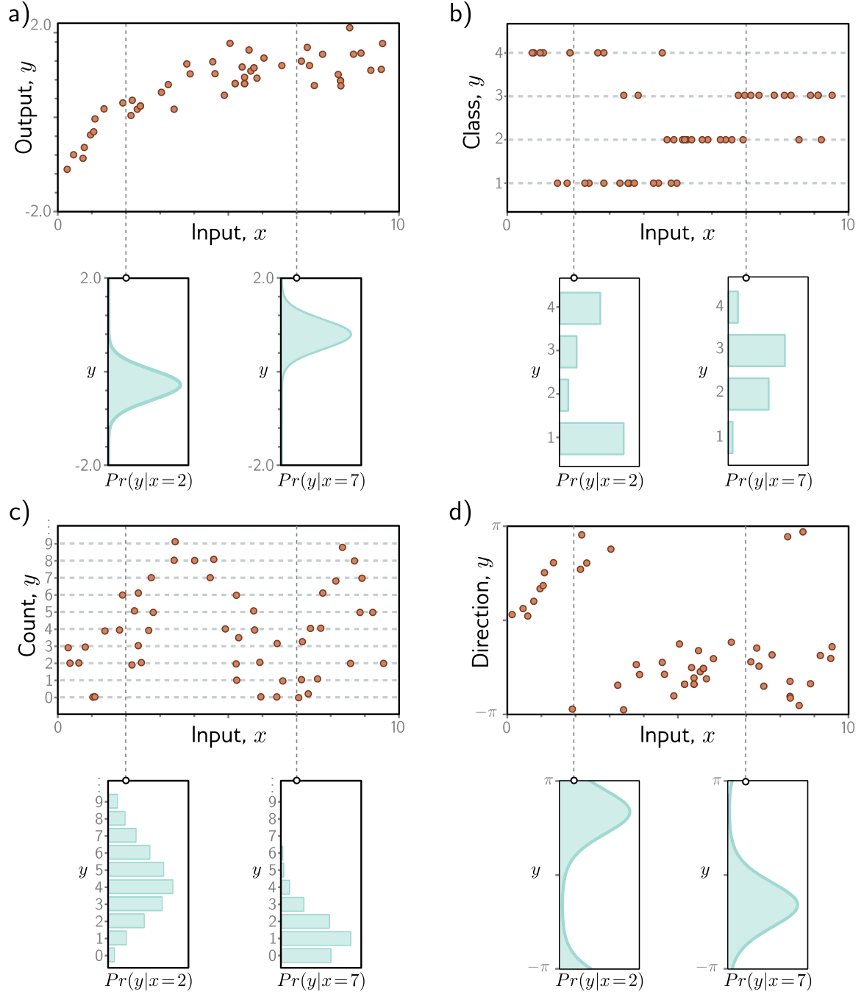{#fig-udl-5-1 width=74%}

This also explains, in advance, why this chapter generalizes so easily. Nothing
about a neural network needs to change to predict counts instead of
temperatures. What changes is the distribution, and hence the loss.

### Computing a distribution over outputs

*Prince §5.1.1, p. 58.*

A network outputs numbers, not distributions, so we need one more step. Choose a
**parametric** distribution $Pr(y \mid \boldsymbol{\theta})$ defined on the
output domain, then use the network to compute one or more of its parameters
$\boldsymbol{\theta}$.

For a real-valued output $y \in \mathbb{R}$ the univariate normal is a natural
choice; it has parameters $\boldsymbol{\theta} = \{\mu, \sigma^2\}$, and we might
let the network predict the mean, $\mu = \mathrm{f}[x, \boldsymbol{\phi}]$, and
treat the variance $\sigma^2$ as an unknown constant. The network's job has been
redefined, not made harder: the same piecewise linear function of $x$ that used
to *be* the prediction now *indexes* a family of distributions.

### The maximum likelihood criterion

*Prince §5.1.2, p. 58.*

The model computes different distribution parameters $\boldsymbol{\theta}_i =
\mathbf{f}[\mathbf{x}_i, \boldsymbol{\phi}]$ for each training input. Each
observed output $y_i$ should be probable under its own distribution, so we
choose the parameters that maximize the combined probability of all $I$ training
examples:

$$
\hat{\boldsymbol{\phi}}
= \operatorname*{argmax}_{\boldsymbol{\phi}} \left[ \prod_{i=1}^{I} Pr(y_i \mid \mathbf{x}_i) \right]
= \operatorname*{argmax}_{\boldsymbol{\phi}} \left[ \prod_{i=1}^{I} Pr\big(y_i \mid \mathbf{f}[\mathbf{x}_i, \boldsymbol{\phi}]\big) \right].
$$ {#eq-mle}

Read as a function of $y$, the quantity $Pr(y \mid \boldsymbol{\psi})$ is a
probability distribution and sums to one. Read as a function of the parameters
$\boldsymbol{\psi}$, it is a **likelihood**, and it does not generally sum to
anything. @Eq-mle is the **maximum likelihood criterion**.

Two assumptions are hiding in that product, and both matter later.

1. The data are **identically distributed**: the *form* of the distribution over outputs is the same for every data point. We use a normal at every $x$, or a Bernoulli at every $x$ — only the parameters change.
2. The conditional distributions are **independent** given the inputs, so the total likelihood factorizes:

$$
Pr(y_1, y_2, \ldots, y_I \mid \mathbf{x}_1, \mathbf{x}_2, \ldots, \mathbf{x}_I) = \prod_{i=1}^{I} Pr(y_i \mid \mathbf{x}_i).
$$ {#eq-iid}

Together: the data are **independent and identically distributed (i.i.d.)**.
This is an assumption about the *data collection*, not about the network, and it
is the first thing to question when a model behaves strangely on real
engineering data — consecutive readings from one sensor, or parts from one
production batch, are rarely independent.

### Maximizing log-likelihood

*Prince §5.1.3, p. 59; figure on p. 59.*

@Eq-mle is unusable as written. Each factor is a probability, often much smaller
than one, and the product of thousands of them cannot be represented in finite
precision. Fortunately we can maximize the logarithm instead:

$$
\hat{\boldsymbol{\phi}}
= \operatorname*{argmax}_{\boldsymbol{\phi}} \left[ \log\left[\prod_{i=1}^{I} Pr\big(y_i \mid \mathbf{f}[\mathbf{x}_i, \boldsymbol{\phi}]\big)\right] \right]
= \operatorname*{argmax}_{\boldsymbol{\phi}} \left[ \sum_{i=1}^{I} \log\Big[ Pr\big(y_i \mid \mathbf{f}[\mathbf{x}_i, \boldsymbol{\phi}]\big) \Big] \right].
$$ {#eq-loglik}

This is *equivalent*, not merely similar, because the logarithm is
**monotonically increasing**: if $z > z'$ then $\log[z] > \log[z']$
(@fig-udl-5-2). Any change to $\boldsymbol{\phi}$ that improves the likelihood
improves the log-likelihood, and the two criteria have their maxima in exactly
the same place. The practical gain is that a sum of logarithms is representable
where a product of probabilities is not.

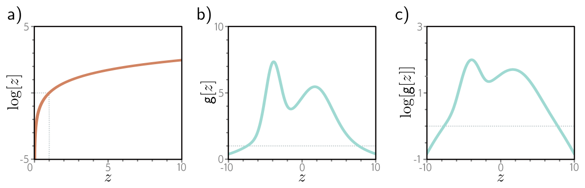{#fig-udl-5-2 width=88%}

The failure this avoids is not subtle, and it is worth seeing once. Below, the
"probabilities" are densities of standard normal residuals — none of them
especially small on its own.

```{python}
#| label: nll-underflow

rng = np.random.default_rng(774)
resid = rng.normal(0, 1, 2000)
probs = np.exp(-0.5 * resid ** 2) / np.sqrt(2 * np.pi)   # Pr(y_i | f[x_i, phi])

print(f"smallest single factor: {probs.min():.3e}   (nothing unusual)")
print(f"\n{'I':>6}{'product (eq. 5.1)':>22}{'sum of logs (eq. 5.3)':>24}")
for I in (100, 300, 500, 2000):
    print(f"{I:>6}{np.prod(probs[:I]):>22.3e}{np.log(probs[:I]).sum():>24.2f}")
```

By five hundred examples the product has fallen into the subnormal range, and
by two thousand it is exactly zero in double precision — and a gradient of zero
tells the optimizer nothing. The sum of logarithms is perfectly
well behaved at every size. Every deep learning framework works in log space for
this reason, and you will meet the same trick again as `logsumexp` below.

### Minimizing negative log-likelihood

*Prince §5.1.4, p. 60.*

By convention, model fitting is framed as *minimization*. Multiplying by minus
one converts the maximum log-likelihood criterion into the **negative
log-likelihood** criterion, and that is the loss:

$$
\hat{\boldsymbol{\phi}}
= \operatorname*{argmin}_{\boldsymbol{\phi}} \left[ -\sum_{i=1}^{I} \log\Big[ Pr\big(y_i \mid \mathbf{f}[\mathbf{x}_i, \boldsymbol{\phi}]\big) \Big] \right]
= \operatorname*{argmin}_{\boldsymbol{\phi}} \big[ L[\boldsymbol{\phi}] \big].
$$ {#eq-nll}

### Inference

*Prince §5.1.5, p. 60.*

The trained network no longer hands us an output; it hands us a distribution
over outputs. Often we want a single number, so we return the **maximum** of
that distribution:

$$
\hat{y} = \operatorname*{argmax}_{y} \Big[ Pr\big(y \mid \mathbf{f}[\mathbf{x}, \hat{\boldsymbol{\phi}}]\big) \Big].
$$ {#eq-infer}

It is usually easy to express this in terms of the predicted parameters. For the
univariate normal the maximum is at the mean $\mu$, which is exactly what the
network computed — so for regression this step is free. It will not always be.

## The Recipe

*Prince §5.2, p. 60.*

Everything above collapses into four steps, and the rest of the chapter is
nothing but this recipe applied three times.

::: {.callout-important}
## The recipe for constructing a loss function
Given training data $\{\mathbf{x}_i, y_i\}$:

1. **Choose a distribution.** Pick a probability distribution $Pr(y \mid \boldsymbol{\theta})$ defined over the domain of the predictions $y$, with parameters $\boldsymbol{\theta}$.
2. **Point the network at its parameters.** Set the model $\mathbf{f}[\mathbf{x}, \boldsymbol{\phi}]$ to predict one or more of them, so $\boldsymbol{\theta} = \mathbf{f}[\mathbf{x}, \boldsymbol{\phi}]$ and $Pr(y \mid \boldsymbol{\theta}) = Pr(y \mid \mathbf{f}[\mathbf{x}, \boldsymbol{\phi}])$.
3. **Train by minimizing the negative log-likelihood** over the training pairs:
   $$
   \hat{\boldsymbol{\phi}} = \operatorname*{argmin}_{\boldsymbol{\phi}} \left[ -\sum_{i=1}^{I} \log\Big[ Pr\big(y_i \mid \mathbf{f}[\mathbf{x}_i, \boldsymbol{\phi}]\big) \Big] \right].
   $$ {#eq-recipe-loss}
4. **Infer** for a new test example $\mathbf{x}$ by returning either the full distribution $Pr(y \mid \mathbf{f}[\mathbf{x}, \hat{\boldsymbol{\phi}}])$ or its maximum.

Step 1 is the only place where judgement enters. Steps 2–4 are mechanical.
:::

Note what step 2 does *not* say. The network is not required to predict *all*
the distribution's parameters. Which ones it predicts, and which are held fixed
or learned as single global constants, is a modeling decision — and in §5.3
below, exactly that decision separates least squares from heteroscedastic
regression.

## Example 1: Univariate Regression

*Prince §5.3, pp. 61–62; figures on pp. 61 and 63.*

Predict a single real number $y \in \mathbb{R}$ from input $x$. Step 1: choose a
distribution on $\mathbb{R}$, and the univariate normal (@fig-udl-5-3) is the
obvious candidate. It has a mean $\mu$, which locates the peak, and a variance
$\sigma^2$, whose positive root — the standard deviation — sets the width:

$$
Pr(y \mid \mu, \sigma^2) = \frac{1}{\sqrt{2\pi\sigma^2}} \exp\left[ \frac{-(y - \mu)^2}{2\sigma^2} \right].
$$ {#eq-normal}

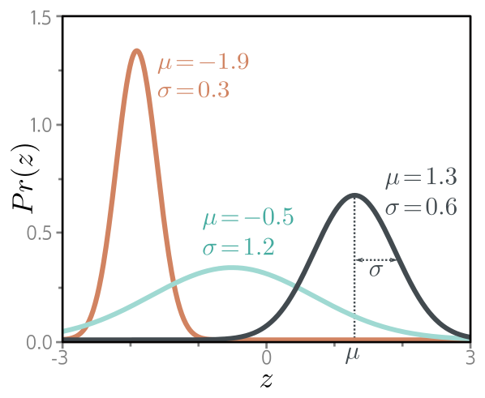{#fig-udl-5-3 width=52%}

Step 2: let the network compute the mean, $\mu = \mathrm{f}[x,
\boldsymbol{\phi}]$, and leave the variance as a constant:

$$
Pr(y \mid \mathrm{f}[x, \boldsymbol{\phi}], \sigma^2) = \frac{1}{\sqrt{2\pi\sigma^2}} \exp\left[ \frac{-(y - \mathrm{f}[x, \boldsymbol{\phi}])^2}{2\sigma^2} \right].
$$ {#eq-normal-model}

Step 3: the loss is the negative log-likelihood,

$$
L[\boldsymbol{\phi}] = -\sum_{i=1}^{I} \log\left[ \frac{1}{\sqrt{2\pi\sigma^2}} \exp\left[ \frac{-(y_i - \mathrm{f}[x_i, \boldsymbol{\phi}])^2}{2\sigma^2} \right] \right].
$$ {#eq-reg-nll}

### The least squares loss function

*Prince §5.3.1, p. 62.*

@Eq-reg-nll looks nothing like the criterion from Chapter 2, until you simplify
it. Take the log inside:

$$
\begin{aligned}
\hat{\boldsymbol{\phi}}
&= \operatorname*{argmin}_{\boldsymbol{\phi}} \left[ -\sum_{i=1}^{I} \left( \log\left[\frac{1}{\sqrt{2\pi\sigma^2}}\right] - \frac{(y_i - \mathrm{f}[x_i, \boldsymbol{\phi}])^2}{2\sigma^2} \right) \right] \\
&= \operatorname*{argmin}_{\boldsymbol{\phi}} \left[ \sum_{i=1}^{I} \frac{(y_i - \mathrm{f}[x_i, \boldsymbol{\phi}])^2}{2\sigma^2} \right]
= \operatorname*{argmin}_{\boldsymbol{\phi}} \left[ \sum_{i=1}^{I} \big(y_i - \mathrm{f}[x_i, \boldsymbol{\phi}]\big)^2 \right],
\end{aligned}
$$ {#eq-ls-derivation}

where the first term was dropped because it does not depend on
$\boldsymbol{\phi}$, and the $2\sigma^2$ because a positive constant scaling does
not move the position of a minimum. What is left is the **least squares** loss
of Chapter 2:

$$
L[\boldsymbol{\phi}] = \sum_{i=1}^{I} \big(y_i - \mathrm{f}[x_i, \boldsymbol{\phi}]\big)^2.
$$ {#eq-least-squares}

@Fig-udl-5-4 makes the equivalence visual: panels (a) and (b) measure squared
deviations for a good and a bad fit, and panels (c) and (d) measure the
probability of the data under a normal distribution centred on the model's
prediction. They rank the two fits the same way because they *are* the same
criterion.

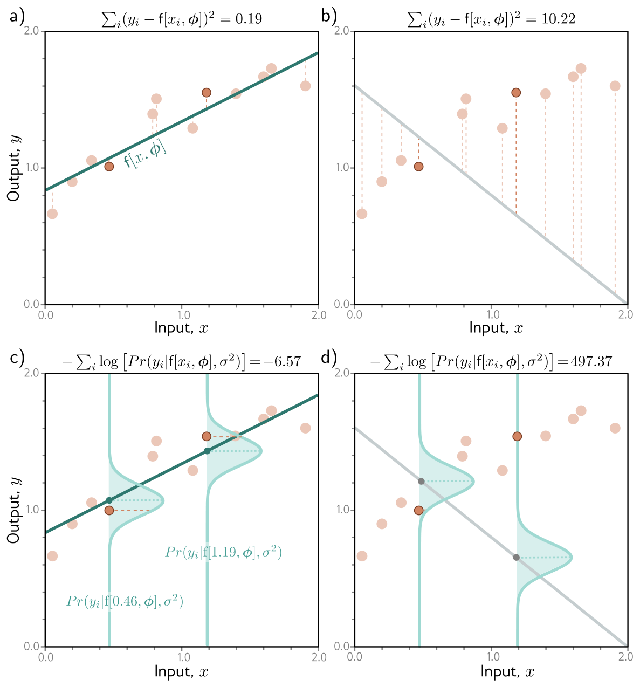{#fig-udl-5-4 width=74%}

::: {.callout-important}
## What least squares assumes
Least squares is not a neutral default. @Eq-ls-derivation shows it is exactly
the negative log-likelihood under three assumptions: the errors are
**independent**, they are **normally distributed**, and their variance is the
**same everywhere**. When the errors have heavy tails, a squared penalty gives a
single outlier enormous leverage — which is why a Laplace or $t$ distribution,
yielding an absolute-error loss, is the standard robust alternative. When the
variance is not constant, §5.3.4 applies. Using least squares is a claim about
your noise, whether or not you meant to make it.
:::

We can check the algebra numerically. Because @eq-reg-nll and
@eq-least-squares differ only by the positive factor $1/(2\sigma^2)$ and the
additive constant $\tfrac{I}{2}\log[2\pi\sigma^2]$, the two should agree to
machine precision under that affine map, and their minima should coincide for
*any* value of $\sigma^2$.

```{python}
#| label: fig-ls-nll
#| fig-cap: "Least squares and the negative log-likelihood of a normal model, for a straight-line fit with the intercept held fixed. Left: the data and the best-fitting line. Right: both criteria as functions of the slope, each rescaled to $[0, 1]$. All four curves lie exactly on top of one another — that is the result, not a plotting accident — because the two expressions differ only by a positive scale factor and an additive constant, neither of which survives the rescaling. Changing $\\sigma^2$ therefore cannot move the minimum (dotted line), which is why @eq-least-squares can drop the variance entirely."

x_d = np.linspace(0, 2, 12)
y_d = 0.85 + 0.45 * x_d + rng.normal(0, 0.12, x_d.shape)

def sse(slope, intercept=0.85):                       # equation (5.11)
    return np.sum((y_d - (intercept + slope * x_d)) ** 2)

def nll_normal(slope, sigma2, intercept=0.85):        # equation (5.9)
    f = intercept + slope * x_d
    return -np.sum(-0.5 * np.log(2 * np.pi * sigma2) - (y_d - f) ** 2 / (2 * sigma2))

slopes = np.linspace(-0.2, 1.1, 400)
L_ls = np.array([sse(s) for s in slopes])
best = slopes[L_ls.argmin()]

fig, axes = plt.subplots(1, 2, figsize=(10, 3.4))
axes[0].scatter(x_d, y_d, s=28, color=ACCENT, zorder=3)
axes[0].plot(x_d, 0.85 + best * x_d, color=NDSU_GREEN, lw=2)
axes[0].set_title("data and least-squares fit"); axes[0].set_xlabel("$x$"); axes[0].set_ylabel("$y$")
axes[1].plot(slopes, L_ls / L_ls.max(), color=NDSU_GREEN, lw=2.4, label="least squares (scaled)")
for s2, ls in zip((0.01, 0.05, 0.25), ("-", "--", ":")):
    L = np.array([nll_normal(s, s2) for s in slopes])
    axes[1].plot(slopes, (L - L.min()) / (L - L.min()).max(), ls, color=ACCENT, lw=1.4,
                 label=rf"$-\log$ likelihood, $\sigma^2 = {s2}$")
axes[1].axvline(best, color="gray", ls=":", lw=1)
axes[1].set_title("both criteria, rescaled to $[0, 1]$"); axes[1].set_xlabel("slope"); axes[1].set_ylabel("loss")
axes[1].legend(fontsize=7.5)
plt.tight_layout()
plt.show()

print(f"argmin slope, least squares: {best:.4f}\n")
print(f"{'sigma^2':>9}{'argmin slope':>14}{'max |NLL - (SSE/2s^2 + I/2 log 2 pi s^2)|':>45}")
for s2 in (0.01, 0.05, 0.25):
    L = np.array([nll_normal(s, s2) for s in slopes])
    affine = L_ls / (2 * s2) + len(x_d) / 2 * np.log(2 * np.pi * s2)
    print(f"{s2:>9}{slopes[L.argmin()]:>14.4f}{np.abs(L - affine).max():>45.2e}")
```

The minima agree to the resolution of the grid and the two expressions agree to
about $10^{-14}$. Least squares really is the normal-distribution
log-likelihood with the constants thrown away.

### Inference

*Prince §5.3.2, p. 62.*

The network predicts $\mu = \mathrm{f}[x, \boldsymbol{\phi}]$, so at inference

$$
\hat{y} = \operatorname*{argmax}_{y} \Big[ Pr\big(y \mid \mathrm{f}[x, \hat{\boldsymbol{\phi}}], \sigma^2\big) \Big] = \mathrm{f}[x, \hat{\boldsymbol{\phi}}].
$$ {#eq-reg-infer}

The maximum of a normal is at its mean, and the mean is what the network
computed. Nothing to do.

### Estimating the variance

*Prince §5.3.3, pp. 62–64.*

@Eq-least-squares does not mention $\sigma^2$, which is convenient but throws
information away. Nothing stops us treating $\sigma^2$ as one more parameter and
minimizing @eq-reg-nll over both:

$$
\hat{\boldsymbol{\phi}}, \hat{\sigma}^2 = \operatorname*{argmin}_{\boldsymbol{\phi}, \sigma^2} \left[ -\sum_{i=1}^{I} \log\left[ \frac{1}{\sqrt{2\pi\sigma^2}} \exp\left[ \frac{-(y_i - \mathrm{f}[x_i, \boldsymbol{\phi}])^2}{2\sigma^2} \right] \right] \right].
$$ {#eq-est-var}

Now the model returns two things from one training run: the mean $\mu =
\mathrm{f}[x, \hat{\boldsymbol{\phi}}]$, which is the prediction, and
$\hat{\sigma}^2$, which quantifies how much to trust it. For an engineering
model that second number is often the one the decision depends on.

### Heteroscedastic regression

*Prince §5.3.4, p. 64; figure on p. 65.*

A single global $\hat{\sigma}^2$ still assumes the noise is the same everywhere
— **homoscedastic**. That is frequently wrong: a sensor is precise at low load
and noisy at high load; a process is repeatable near its setpoint and erratic at
the edge of its window. When the uncertainty varies with the input we call the
model **heteroscedastic**.

The fix follows the recipe with no new ideas. Give the network *two* outputs,
using $\mathrm{f}_1[x, \boldsymbol{\phi}]$ for the mean and $\mathrm{f}_2[x,
\boldsymbol{\phi}]$ for the variance. One complication: a variance must be
positive and a network output need not be, so we pass the second output through
a function that maps $\mathbb{R}$ to $\mathbb{R}^+$. Squaring will do:

$$
\mu = \mathrm{f}_1[x, \boldsymbol{\phi}], \qquad \sigma^2 = \mathrm{f}_2[x, \boldsymbol{\phi}]^2,
$$ {#eq-hetero}

giving the loss

$$
\hat{\boldsymbol{\phi}} = \operatorname*{argmin}_{\boldsymbol{\phi}} \left[ -\sum_{i=1}^{I} \left( \log\left[ \frac{1}{\sqrt{2\pi \mathrm{f}_2[x_i, \boldsymbol{\phi}]^2}} \right] - \frac{(y_i - \mathrm{f}_1[x_i, \boldsymbol{\phi}])^2}{2\,\mathrm{f}_2[x_i, \boldsymbol{\phi}]^2} \right) \right].
$$ {#eq-hetero-loss}

@Fig-udl-5-5 compares the two architectures and what they produce. In the
homoscedastic model the mean is piecewise linear and the $\pm 2\sigma$ band has
constant width; in the heteroscedastic model the standard deviation is itself a
piecewise linear function of $x$ and the band breathes.

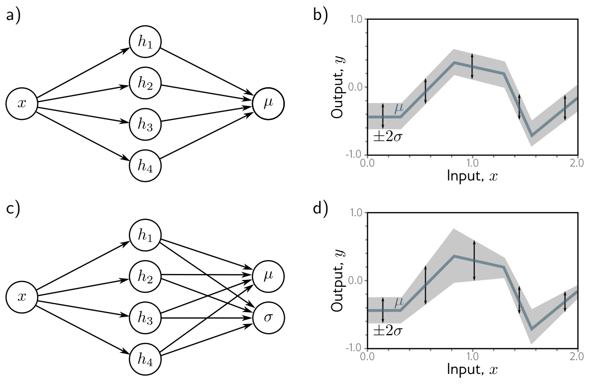{#fig-udl-5-5 width=84%}

Notice that @eq-hetero-loss can no longer be simplified into least squares. The
$\log$ term survives because $\mathrm{f}_2$ depends on $\boldsymbol{\phi}$, and
it is what stops the network from declaring infinite uncertainty everywhere: the
squared-error term is divided by the variance, so widening the band cheapens the
errors, while the $\log$ term charges for the width. The loss balances the two,
and that balance is exactly the maximum likelihood estimate.

Below we generate data whose noise grows with $x$, fit both models with the same
architecture and optimizer, and ask a question that squared error cannot answer:
*does the predicted uncertainty hold up?*

```{python}
#| label: fig-heteroscedastic
#| fig-cap: "Our version of figure 5.5, on data whose noise grows with $x$. Left: a homoscedastic model — the mean fits well, but the $\\pm 2\\sigma$ band (grey) is one width everywhere, far too wide on the left and too narrow on the right. Right: a heteroscedastic model with two outputs trained on @eq-hetero-loss; the band tracks the true noise (dashed red). Both networks have one hidden layer of 40 units; only the loss and the number of outputs differ."

def true_mean(x):  return 0.4 * np.sin(3.0 * x) - 0.25 * x
def true_sd(x):    return 0.03 + 0.22 * x

x_h = np.random.uniform(0, 2, 600)
y_h = true_mean(x_h) + np.random.normal(0, 1, x_h.shape) * true_sd(x_h)
X_h = torch.tensor(x_h, dtype=torch.float32)[:, None]
Y_h = torch.tensor(y_h, dtype=torch.float32)[:, None]
x_grid = torch.linspace(0, 2, 400)[:, None]

def shallow_net(D_o, D=40):
    return nn.Sequential(nn.Linear(1, D), nn.ReLU(), nn.Linear(D, D_o))

def homo_loss(out):                                  # equation (5.11)
    return ((Y_h - out) ** 2).mean()

def hetero_loss(out):                                # equation (5.15)
    mu, sigma2 = out[:, 0:1], out[:, 1:2] ** 2 + 1e-6   # the epsilon keeps log finite
    return (0.5 * torch.log(2 * np.pi * sigma2) + (Y_h - mu) ** 2 / (2 * sigma2)).mean()

def train(model, loss_fn, epochs=4000, lr=0.01):
    opt = torch.optim.Adam(model.parameters(), lr=lr)
    for _ in range(epochs):
        opt.zero_grad()
        loss = loss_fn(model(X_h))
        loss.backward()
        opt.step()
    return loss.item()

torch.manual_seed(774); homo   = shallow_net(1)
torch.manual_seed(774); hetero = shallow_net(2)
train(homo, homo_loss)
train(hetero, hetero_loss)

with torch.no_grad():
    mu_h = homo(X_h).squeeze().numpy()
    sd_h = np.sqrt(np.mean((y_h - mu_h) ** 2))          # equation (5.13): the MLE of a constant sigma
    out_t = hetero(X_h)
    mu_t, sd_t = out_t[:, 0].numpy(), np.abs(out_t[:, 1].numpy())
    g = x_grid.squeeze().numpy()
    mg_h = homo(x_grid).squeeze().numpy()
    og = hetero(x_grid)
    mg_t, sg_t = og[:, 0].numpy(), np.abs(og[:, 1].numpy())

fig, axes = plt.subplots(1, 2, figsize=(11, 3.6), sharey=True)
for ax, m, s, title in [(axes[0], mg_h, np.full_like(g, sd_h), "homoscedastic: least squares"),
                        (axes[1], mg_t, sg_t, "heteroscedastic: equation (5.15)")]:
    ax.scatter(x_h, y_h, s=5, color="gray", alpha=0.35)
    ax.fill_between(g, m - 2 * s, m + 2 * s, color=NDSU_GREEN, alpha=0.18, label=r"$\pm 2\sigma$")
    ax.plot(g, m, color=NDSU_GREEN, lw=2, label=r"predicted $\mu$")
    ax.plot(g, true_mean(g) + 2 * true_sd(g), "--", color=ACCENT, lw=1.1, label=r"true $\pm 2\sigma$")
    ax.plot(g, true_mean(g) - 2 * true_sd(g), "--", color=ACCENT, lw=1.1)
    ax.set_title(title); ax.set_xlabel("$x$"); ax.set_ylim(-1.6, 1.6)
axes[0].set_ylabel("$y$"); axes[0].legend(fontsize=8, loc="lower left")
plt.tight_layout()
plt.show()

def mean_nll(mu, sd):  return float(np.mean(0.5 * np.log(2 * np.pi * sd ** 2) + (y_h - mu) ** 2 / (2 * sd ** 2)))
def coverage(mask, mu, sd):
    sd = np.full_like(mu, sd) if np.ndim(sd) == 0 else sd
    return float(np.mean(np.abs(y_h[mask] - mu[mask]) <= 2 * sd[mask]))

low, high, allpts = x_h < 0.7, x_h > 1.3, np.ones_like(x_h, dtype=bool)
print(f"{'model':<20}{'mean NLL':>10}{'in +/-2s, all':>15}{'x < 0.7':>10}{'x > 1.3':>10}")
print(f"{'homoscedastic':<20}{mean_nll(mu_h, sd_h):>10.3f}{coverage(allpts, mu_h, sd_h):>15.1%}{coverage(low, mu_h, sd_h):>10.1%}{coverage(high, mu_h, sd_h):>10.1%}")
print(f"{'heteroscedastic':<20}{mean_nll(mu_t, sd_t):>10.3f}{coverage(allpts, mu_t, sd_t):>15.1%}{coverage(low, mu_t, sd_t):>10.1%}{coverage(high, mu_t, sd_t):>10.1%}")
print(f"{'nominal for +/-2s':<20}{'':>10}{0.9545:>15.1%}{0.9545:>10.1%}{0.9545:>10.1%}")
print(f"\nhomoscedastic sigma: {sd_h:.3f} everywhere")
print(f"heteroscedastic sigma: {sg_t.min():.3f} at the left edge, rising to {sg_t.max():.3f} at the right")
```

Both models find much the same mean — that part is least squares either way.
The difference is in the interval. Averaged over all the data the homoscedastic
band looks almost respectable, which is the trap: it is far too conservative
where the process is quiet and it under-covers exactly where the process is
noisy and a wrong answer costs the most. The heteroscedastic model is close to
nominal in both halves. If your model's output feeds a tolerance decision, this
is the difference between a useful interval and a decorative one.

## Example 2: Binary Classification

*Prince §5.4, pp. 64–66; figures on pp. 65–67.*

Now assign the input to one of two classes, $y \in \{0, 1\}$, where $y$ is
called a **label**. Predicting whether a review is positive, whether a tumor is
present, whether a weld will pass inspection — same recipe, different
distribution.

Step 1: the **Bernoulli** distribution is defined on $\{0, 1\}$ and has one
parameter $\lambda \in [0, 1]$, the probability that $y = 1$ (@fig-udl-5-6):

$$
Pr(y \mid \lambda) = \begin{cases} 1 - \lambda & y = 0 \\ \lambda & y = 1, \end{cases}
$$ {#eq-bernoulli}

which can be written in one line as

$$
Pr(y \mid \lambda) = (1 - \lambda)^{1 - y} \cdot \lambda^{y}.
$$ {#eq-bernoulli-compact}

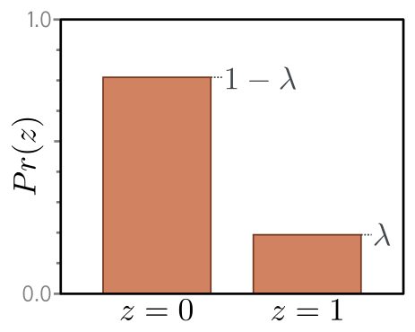{#fig-udl-5-6 width=46%}

Step 2: have the network predict $\lambda$. But $\lambda$ must lie in $[0, 1]$
and a network output is an arbitrary real number, so we pass it through a
squashing function. The **logistic sigmoid** (@fig-udl-5-7) does the job:

$$
\mathrm{sig}[z] = \frac{1}{1 + \exp[-z]}.
$$ {#eq-sigmoid}

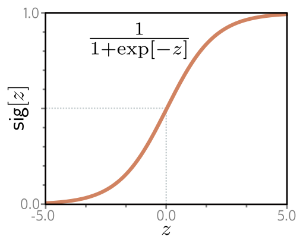{#fig-udl-5-7 width=44%}

So $\lambda = \mathrm{sig}[\mathrm{f}[x, \boldsymbol{\phi}]]$ and the likelihood
is

$$
Pr(y \mid x) = \big(1 - \mathrm{sig}[\mathrm{f}[x, \boldsymbol{\phi}]]\big)^{1-y} \cdot \mathrm{sig}[\mathrm{f}[x, \boldsymbol{\phi}]]^{y}.
$$ {#eq-bern-lik}

Step 3: the loss is the negative log-likelihood of the training set,

$$
L[\boldsymbol{\phi}] = \sum_{i=1}^{I} -(1 - y_i) \log\Big[ 1 - \mathrm{sig}[\mathrm{f}[x_i, \boldsymbol{\phi}]] \Big] - y_i \log\Big[ \mathrm{sig}[\mathrm{f}[x_i, \boldsymbol{\phi}]] \Big],
$$ {#eq-bce}

known — for reasons that §5.7 will supply — as the **binary cross-entropy**
loss. The indicator structure is worth reading carefully: for a positive example
only the second term survives and the loss is $-\log \lambda$; for a negative
example only the first survives and it is $-\log(1 - \lambda)$.

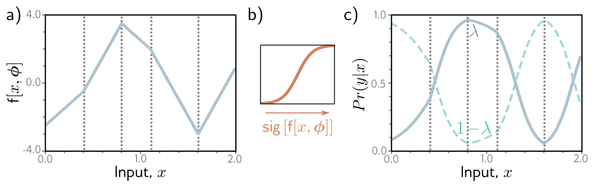{#fig-udl-5-8 width=88%}

Step 4: the transformed output is the probability that $y = 1$. For a point
estimate we set $y = 1$ if $\lambda > 0.5$ and $y = 0$ otherwise — though note
that the threshold is a separate decision from the model, and $0.5$ is only
right when the two kinds of error cost the same.

@Fig-binary is our version of @fig-udl-5-8. The helper in the first cell turns
any piecewise linear function specified by its knots into a shallow ReLU
network, which is a constructive restatement of Week 3: on a bounded interval,
*every* continuous piecewise linear function is a shallow network.

```{python}
#| label: fig-binary
#| fig-cap: "Our version of figure 5.8. a) The network output $\\mathrm{f}[x, \\phi]$ is piecewise linear and unconstrained. b) The logistic sigmoid squashes it into $[0, 1]$. c) The result is the Bernoulli parameter $\\lambda$: the solid curve is $Pr(y = 1 \\mid x)$ and the dashed curve $Pr(y = 0 \\mid x)$. Any vertical slice is a Bernoulli distribution like @fig-udl-5-6. Sixty labels sampled from the model are plotted at $y = 0$ and $y = 1$; the loss of @eq-bce rewards a curve that is high where the ones are and low where the zeros are."

def pwl_network(knots, values):
    """The shallow ReLU network whose output is the piecewise linear function
    through (knots, values). One hidden unit per interior interval."""
    knots, values = np.asarray(knots, float), np.asarray(values, float)
    slopes = np.diff(values) / np.diff(knots)
    theta = np.column_stack([-knots[:-1], np.ones(len(knots) - 1)])
    phi = np.concatenate([[slopes[0]], np.diff(slopes)])
    return theta, values[0], phi

def shallow(x, theta, phi0, phi):
    pre = theta[:, 0:1] + theta[:, 1:2] * x[None, :]
    return phi0 + phi @ np.maximum(pre, 0)

def sigmoid(z):
    return 1.0 / (1.0 + np.exp(-z))

KNOTS = [0.0, 0.45, 1.0, 1.6, 2.0]
theta_b, phi0_b, phi_b = pwl_network(KNOTS, [-4.0, 3.5, -0.5, 3.0, -3.0])

x_b = np.linspace(0, 2, 1000)
f_b = shallow(x_b, theta_b, phi0_b, phi_b)
lam = sigmoid(f_b)

x_i = np.sort(np.random.uniform(0, 2, 60))
lam_i = sigmoid(shallow(x_i, theta_b, phi0_b, phi_b))
y_i = (np.random.uniform(size=x_i.shape) < lam_i).astype(int)

fig, axes = plt.subplots(1, 3, figsize=(11.5, 3.2))
axes[0].plot(x_b, f_b, color=STEEL, lw=2.2); axes[0].axhline(0, color="k", lw=0.6)
axes[0].set_title(r"a) $\mathrm{f}[x, \phi]$"); axes[0].set_ylabel(r"$\mathrm{f}[x, \phi]$")
z = np.linspace(-5, 5, 400)
axes[1].plot(z, sigmoid(z), color=ACCENT, lw=2.2)
axes[1].set_title(r"b) $\mathrm{sig}[z]$"); axes[1].set_xlabel("$z$"); axes[1].set_ylabel(r"$\mathrm{sig}[z]$")
axes[2].plot(x_b, lam, color=NDSU_GREEN, lw=2.2, label=r"$\lambda = Pr(y=1\mid x)$")
axes[2].plot(x_b, 1 - lam, "--", color=NDSU_GREEN, lw=1.4, label=r"$1 - \lambda$")
axes[2].scatter(x_i, y_i, s=16, color=ACCENT, zorder=3, alpha=0.75, label="sampled labels")
axes[2].set_title(r"c) $\lambda = \mathrm{sig}[\mathrm{f}[x, \phi]]$"); axes[2].legend(fontsize=7.5, loc="center right")
for ax in (axes[0], axes[2]):
    ax.set_xlabel("$x$")
    for j in KNOTS[1:-1]:
        ax.axvline(j, color="gray", ls=":", lw=0.9)
plt.tight_layout()
plt.show()

loss = np.sum(-(1 - y_i) * np.log(1 - lam_i) - y_i * np.log(lam_i))    # equation (5.20)
coin = len(y_i) * np.log(2)                                            # always answer lambda = 0.5

print(f"{y_i.sum()} of {len(y_i)} sampled labels are positive\n")
print(f"{'model':<28}{'total loss':>12}{'per example':>13}")
print(f"{'the true lambda[x]':<28}{loss:>12.3f}{loss / len(y_i):>13.3f}")
print(f"{'a constant lambda = 0.5':<28}{coin:>12.3f}{coin / len(y_i):>13.3f}")
print(f"\naccuracy of thresholding lambda at 0.5: {np.mean((lam_i > 0.5) == y_i):.1%}")
```

The comparison in the last two lines is the one to remember. A model that
predicts $\lambda = 0.5$ for everything — the coin flip — pays $\log 2 \approx
0.693$ nats per example. Any loss below that means the model has learned
something; a loss above it means the model is worse than knowing nothing, which
is possible, because confident wrong answers are punished without limit.

That unboundedness is visible in the per-example loss, which is problem 5.2.

```{python}
#| label: fig-bce-curves
#| fig-cap: "The binary cross-entropy of a single example, @eq-bce, as a function of the transformed network output $\\mathrm{sig}[\\mathrm{f}[x, \\phi]] \\in [0, 1]$. For a positive label ($y = 1$, green) the loss is $-\\log\\lambda$; for a negative label ($y = 0$, red) it is $-\\log(1 - \\lambda)$. Both are zero at a perfectly confident correct answer and diverge at a perfectly confident wrong one. The dotted line marks $\\lambda = 0.5$, the cost of declining to commit."

lam_axis = np.linspace(1e-4, 1 - 1e-4, 500)
plt.figure(figsize=(5.4, 3.4))
plt.plot(lam_axis, -np.log(lam_axis), color=NDSU_GREEN, lw=2.2, label="$y = 1$:  $-\\log \\lambda$")
plt.plot(lam_axis, -np.log(1 - lam_axis), color=ACCENT, lw=2.2, label="$y = 0$:  $-\\log(1 - \\lambda)$")
plt.axhline(np.log(2), color="gray", ls=":", lw=1)
plt.text(0.52, np.log(2) + 0.15, r"$\log 2$ (always guess $\lambda = 0.5$)", fontsize=8, color="gray")
plt.ylim(0, 5); plt.xlabel(r"$\lambda = \mathrm{sig}[\mathrm{f}[x, \phi]]$"); plt.ylabel("loss")
plt.legend(fontsize=9)
plt.tight_layout()
plt.show()
```

## Example 3: Multiclass Classification

*Prince §5.5, pp. 67–69; figures on pp. 67–68.*

With $K > 2$ classes, $y \in \{1, 2, \ldots, K\}$: which of ten digits is in
this image, which of many words comes next, which of six failure modes this
vibration signature indicates.

Step 1: the **categorical** distribution (@fig-udl-5-9) is defined on exactly
this domain. It has $K$ parameters,

$$
Pr(y = k) = \lambda_k,
$$ {#eq-categorical}

each constrained to $[0, 1]$, and together they must sum to one.

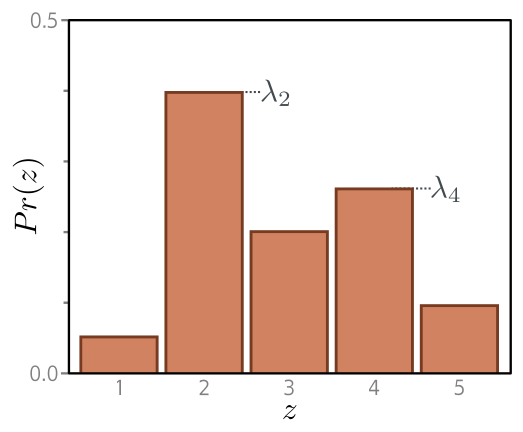{#fig-udl-5-9 width=48%}

Step 2: use a network with $K$ outputs. Again the raw outputs — the **logits** —
will not respect the constraints, so we pass them through the **softmax**
function, which takes an arbitrary vector of length $K$ and returns one of the
same length whose entries are in $[0, 1]$ and sum to one:

$$
\mathrm{softmax}_k[\mathbf{z}] = \frac{\exp[z_k]}{\sum_{k'=1}^{K} \exp[z_{k'}]}.
$$ {#eq-softmax}

The exponentials guarantee positivity; the denominator guarantees the sum. The
likelihood is then

$$
Pr(y = k \mid \mathbf{x}) = \mathrm{softmax}_k\big[ \mathbf{f}[\mathbf{x}, \boldsymbol{\phi}] \big],
$$ {#eq-cat-lik}

and step 3 gives the **multiclass cross-entropy** loss:

$$
L[\boldsymbol{\phi}]
= -\sum_{i=1}^{I} \log\Big[ \mathrm{softmax}_{y_i}\big[ \mathbf{f}[\mathbf{x}_i, \boldsymbol{\phi}] \big] \Big]
= -\sum_{i=1}^{I} \left( \mathrm{f}_{y_i}[\mathbf{x}_i, \boldsymbol{\phi}] - \log\left[ \sum_{k'=1}^{K} \exp\big[\mathrm{f}_{k'}[\mathbf{x}_i, \boldsymbol{\phi}]\big] \right] \right).
$$ {#eq-ce-multi}

The second form is the one that gets implemented. It never forms the softmax
explicitly: it takes the logit of the correct class and subtracts a
`logsumexp` over all the logits. Step 4, inference, takes the most probable
category, $\hat{y} = \operatorname{argmax}_k[Pr(y = k \mid \mathbf{f}[\mathbf{x},
\hat{\boldsymbol{\phi}}])]$ — whichever curve is highest at that $x$ in
@fig-udl-5-10.

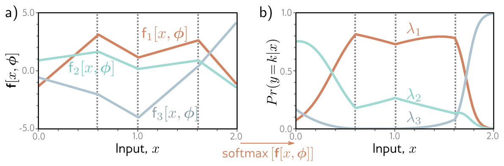{#fig-udl-5-10 width=88%}

```{python}
#| label: fig-multiclass
#| fig-cap: "Our version of figure 5.10 with $K = 3$. Left: three piecewise linear network outputs sharing one hidden layer; they take arbitrary real values and cross each other freely. Right: after the softmax, all three are non-negative and every vertical slice sums to one, so each slice is a valid categorical distribution like @fig-udl-5-9. The shaded strips mark which class is the argmax, which is what inference returns."

TARGETS = {1: [-2.0,  3.0, -1.0, -3.0, -4.0],
           2: [-3.0, -1.5,  2.5,  0.5, -1.0],
           3: [-4.0, -3.0, -1.0,  3.0,  3.5]}

theta_m, _, _ = pwl_network(KNOTS, TARGETS[1])          # the hidden layer is shared
phi0_m = np.array([pwl_network(KNOTS, v)[1] for v in TARGETS.values()])
Phi_m  = np.array([pwl_network(KNOTS, v)[2] for v in TARGETS.values()])

x_m = np.linspace(0, 2, 1000)
H_m = np.maximum(theta_m[:, 0:1] + theta_m[:, 1:2] * x_m[None, :], 0)
F_m = phi0_m[:, None] + Phi_m @ H_m                      # K x N logits

def softmax(F):                                          # equation (5.22), shifted for stability
    E = np.exp(F - F.max(axis=0, keepdims=True))
    return E / E.sum(axis=0, keepdims=True)

S_m = softmax(F_m)
colors = [ACCENT, STEEL, NDSU_GREEN]

fig, axes = plt.subplots(1, 2, figsize=(11, 3.4))
for k in range(3):
    axes[0].plot(x_m, F_m[k], color=colors[k], lw=2.1, label=rf"$\mathrm{{f}}_{k+1}[x, \phi]$")
    axes[1].plot(x_m, S_m[k], color=colors[k], lw=2.1, label=rf"$\lambda_{k+1} = Pr(y={k+1}\mid x)$")
winner = S_m.argmax(axis=0)
for k in range(3):
    axes[1].fill_between(x_m, 0, 1, where=(winner == k), color=colors[k], alpha=0.07)
axes[0].axhline(0, color="k", lw=0.6)
axes[0].set_title("a) network outputs (logits)"); axes[0].set_ylabel(r"$\mathrm{f}_k[x, \phi]$")
axes[1].set_title("b) after the softmax"); axes[1].set_ylabel(r"$Pr(y = k \mid x)$"); axes[1].set_ylim(0, 1)
for ax in axes:
    ax.set_xlabel("$x$"); ax.legend(fontsize=8)
plt.tight_layout()
plt.show()

print(f"every column of the softmax sums to one: {np.allclose(S_m.sum(axis=0), 1.0)}")
print(f"classes that are ever the argmax       : {sorted(int(k) + 1 for k in set(winner))}")
```

Two properties of the softmax are worth knowing before you use it.

```{python}
#| label: softmax-properties

z = np.array([1.2, -0.4, 2.0])
print("softmax is invariant to adding a constant to every logit:")
for c in (0.0, 5.0, -100.0):
    print(f"   z + {c:>7}: {softmax((z + c)[:, None]).ravel().round(6)}")
print("\n=> the K logits carry only K - 1 degrees of freedom; the model can never")
print("   identify their absolute level, only their differences.\n")

big = np.array([1000.0, 1001.0, 999.0])
with np.errstate(over="ignore", invalid="ignore"):
    naive = np.exp(big) / np.exp(big).sum()
print("the exponentials overflow if you implement equation (5.22) literally:")
print(f"   exp[z] / sum exp[z] with z = {big}  ->  {naive}")
print(f"   subtracting max[z] first                       ->  {softmax(big[:, None]).ravel().round(6)}")
print(f"   log Pr(y = 2) by log-sum-exp, equation (5.24)  ->  {big[1] - (big.max() + np.log(np.exp(big - big.max()).sum())):.6f}"
      f"   (= log {softmax(big[:, None]).ravel()[1]:.6f})")
```

Shift invariance is why a softmax layer with $K$ outputs is over-parameterized,
and the overflow is why @eq-ce-multi is implemented in its second,
`logsumexp` form. `torch.nn.CrossEntropyLoss` does both for you, which is the
main reason you should not build your own.

### Predicting other data types

*Prince §5.5.1, p. 69; figure on p. 70.*

Regression and classification cover most of what we will do, but the recipe does
not care. To predict something else, pick a distribution defined on that domain
and turn the crank. Prince's figure 5.11 tabulates the standard choices; it is
reproduced here as a table.

| Data type | Domain | Distribution | Use |
|:--|:--|:--|:--|
| univariate, continuous, unbounded | $y \in \mathbb{R}$ | univariate normal | regression |
| univariate, continuous, unbounded | $y \in \mathbb{R}$ | Laplace or $t$ | robust regression |
| univariate, continuous, unbounded | $y \in \mathbb{R}$ | mixture of Gaussians | multimodal regression |
| univariate, continuous, bounded below | $y \in \mathbb{R}^+$ | exponential or gamma | predicting magnitude |
| univariate, continuous, bounded | $y \in [0, 1]$ | beta | predicting proportions |
| multivariate, continuous, unbounded | $y \in \mathbb{R}^K$ | multivariate normal | multivariate regression |
| univariate, continuous, circular | $y \in (-\pi, \pi]$ | von Mises | predicting direction |
| univariate, discrete, binary | $y \in \{0, 1\}$ | Bernoulli | binary classification |
| univariate, discrete, bounded | $y \in \{1, 2, \ldots, K\}$ | categorical | multiclass classification |
| univariate, discrete, bounded below | $y \in \{0, 1, 2, \ldots\}$ | Poisson | predicting event counts |
| multivariate, discrete, permutation | $y \in \mathrm{Perm}[1, 2, \ldots, K]$ | Plackett-Luce | ranking |

: Prince (2024), figure 5.11, p. 70, reproduced as a table. {tbl-colwidths="[30,22,22,26]"}

Every row is a homework problem waiting to happen, and problems 5.3–5.6 at the
end of the chapter walk through four of them. The pattern never changes: write
down the density, take $-\log$, sum over the data, and decide which parameters
the network computes and which are constants.

## Multiple Outputs {#sec-multiple-outputs}

*Prince §5.6, pp. 69–70.*

Often we want more than one prediction from the same model: a molecule's melting
*and* boiling point, or a class label at every pixel of an image. It is possible
to define a multivariate distribution and have the network predict its
parameters, but the usual move is to assume the predictions are **independent**
given the input, so the probability factorizes over the elements $y_d$ of
$\mathbf{y}$:

$$
Pr(\mathbf{y} \mid \mathbf{f}[\mathbf{x}, \boldsymbol{\phi}]) = \prod_d Pr\big(y_d \mid \mathbf{f}_d[\mathbf{x}, \boldsymbol{\phi}]\big),
$$ {#eq-multi-indep}

where $\mathbf{f}_d[\mathbf{x}, \boldsymbol{\phi}]$ is the $d$th *set* of network
outputs — the parameters of the distribution over $y_d$. Take the negative
logarithm and the product becomes a sum:

$$
L[\boldsymbol{\phi}] = -\sum_{i=1}^{I} \sum_d \log\Big[ Pr\big(y_{id} \mid \mathbf{f}_d[\mathbf{x}_i, \boldsymbol{\phi}]\big) \Big].
$$ {#eq-multi-nll}

The same argument covers predictions of *different kinds* from one network. To
predict wind direction and wind speed, use a von Mises distribution for the
direction and an exponential for the speed; independence makes the joint
likelihood a product, and the negative log-likelihood a sum of two terms.

::: {.callout-note}
## The hidden weighting problem
@Eq-multi-nll adds the terms with weight one each, which looks neutral and is
not. The relative size of the terms depends on the units and the scale of each
output, so a network predicting a person's height in meters and weight in
kilograms will effectively ignore the height (problem 5.9). Maximum likelihood
gives a principled answer — if each dimension gets its own estimated variance,
as in @eq-hetero, the terms are automatically weighted by how predictable each
output is. Otherwise you are choosing weights by accident. Standardizing every
output to zero mean and unit variance before training is the cheap fix.
:::

## Cross-Entropy Loss

*Prince §5.7, pp. 71–72; figure on p. 71.*

Everything so far has been built from negative log-likelihood, yet the losses in
§5.4 and §5.5 are universally called cross-entropy. The two names describe the
same object, and this section shows why.

The **cross-entropy** view starts somewhere else: find the model distribution
$Pr(y \mid \boldsymbol{\theta})$ that is *closest* to the empirical distribution
$q(y)$ of the observed data (@fig-udl-5-12). Distance between distributions is
measured by the **Kullback-Leibler divergence**,

$$
D_{KL}\big[q \,\|\, p\big] = \int_{-\infty}^{\infty} q(z) \log\big[q(z)\big] \, dz - \int_{-\infty}^{\infty} q(z) \log\big[p(z)\big] \, dz.
$$ {#eq-kl}

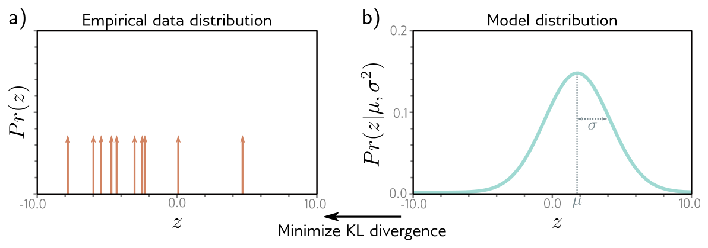{#fig-udl-5-12 width=88%}

The empirical distribution of a finite sample $\{y_i\}_{i=1}^{I}$ is a set of
point masses,

$$
q(y) = \frac{1}{I} \sum_{i=1}^{I} \delta[y - y_i],
$$ {#eq-empirical}

with $\delta[\bullet]$ the Dirac delta. Minimizing the KL divergence between the
model and this empirical distribution,

$$
\hat{\boldsymbol{\theta}} = \operatorname*{argmin}_{\boldsymbol{\theta}} \left[ -\int_{-\infty}^{\infty} q(y) \log\big[Pr(y \mid \boldsymbol{\theta})\big] \, dy \right],
$$ {#eq-kl-argmin}

drops the first term of @eq-kl because it has no dependence on
$\boldsymbol{\theta}$. What remains is the **cross-entropy**. Substituting
@eq-empirical and using the sifting property of the delta,

$$
\hat{\boldsymbol{\theta}}
= \operatorname*{argmin}_{\boldsymbol{\theta}} \left[ -\frac{1}{I} \sum_{i=1}^{I} \log\big[Pr(y_i \mid \boldsymbol{\theta})\big] \right]
= \operatorname*{argmin}_{\boldsymbol{\theta}} \left[ -\sum_{i=1}^{I} \log\big[Pr(y_i \mid \boldsymbol{\theta})\big] \right],
$$ {#eq-ce-derivation}

where the constant $1/I$ goes because it does not move the minimum. Since the
distribution parameters are computed by the model, $\boldsymbol{\theta} =
\mathbf{f}[\mathbf{x}_i, \boldsymbol{\phi}]$,

$$
\hat{\boldsymbol{\phi}} = \operatorname*{argmin}_{\boldsymbol{\phi}} \left[ -\sum_{i=1}^{I} \log\Big[ Pr\big(y_i \mid \mathbf{f}[\mathbf{x}_i, \boldsymbol{\phi}]\big) \Big] \right],
$$ {#eq-ce-equals-nll}

which is @eq-nll exactly. Maximizing the likelihood of the data and minimizing
the distance from the empirical distribution are the same procedure, reached
from opposite directions.

The discrete case makes the bookkeeping visible in a few lines.

```{python}
#| label: cross-entropy-kl

labels = np.random.choice(4, size=500, p=[0.50, 0.25, 0.15, 0.10])
q = np.bincount(labels, minlength=4) / len(labels)      # empirical distribution, eq. (5.28)
p = np.array([0.40, 0.30, 0.20, 0.10])                  # a model distribution

H_cross = -np.sum(q * np.log(p))                        # cross-entropy H[q, p]
H_q     = -np.sum(q * np.log(q))                        # entropy H[q]
nll     = -np.sum(np.log(p[labels]))                    # equation (5.31)

print(f"empirical q               : {q.round(3)}")
print(f"model p                   : {p.round(3)}\n")
print(f"cross-entropy H[q, p]     : {H_cross:.6f}")
print(f"negative log-likelihood/I : {nll / len(labels):.6f}   <- the same number")
print(f"\nentropy H[q]              : {H_q:.6f}")
print(f"KL[q || p] = H[q,p] - H[q]: {H_cross - H_q:.6f}   >= 0, zero only when p = q")
print(f"\nH[q, q], i.e. the best any model could do on this sample: {H_q:.6f}")
```

The cross-entropy decomposes as $H[q, p] = H[q] + D_{KL}[q \,\|\, p]$. The first
term is a property of the data alone and no model can reduce it; the second is
what training minimizes. A cross-entropy of $1.20$ nats therefore does not mean
the model is bad — $1.15$ of it is irreducible, and training can only ever
recover the remaining $0.05$. This is also the cleanest reason
the loss value on its own is a poor progress report, and why Chapter 8 will
insist on comparing against a baseline.

## Losses in PyTorch

*Ours; UDL notebooks 5.1–5.3.*

Three lines of PyTorch cover this entire chapter, and each corresponds to one
equation above.

| Prediction type | Equation | PyTorch | Expects |
|:--|:--|:--|:--|
| univariate regression | @eq-least-squares | `nn.MSELoss` | prediction and target |
| binary classification | @eq-bce | `nn.BCEWithLogitsLoss` | **logits** and $\{0,1\}$ target |
| multiclass classification | @eq-ce-multi | `nn.CrossEntropyLoss` | **logits** and integer class index |

: PyTorch's built-in losses and the equations they implement. {tbl-colwidths="[28,16,30,26]"}

The first check is that they really are the equations, with no hidden constants
beyond the choice of `reduction`.

```{python}
#| label: pytorch-losses

torch.manual_seed(774)
I, K = 8, 5

f1, y1 = torch.randn(I, 1), torch.randn(I, 1)
manual_mse = ((y1 - f1) ** 2).sum()

f2 = torch.randn(I)
y2 = (torch.rand(I) < 0.5).float()
s = torch.sigmoid(f2)
manual_bce = (-(1 - y2) * torch.log(1 - s) - y2 * torch.log(s)).sum()

f3 = torch.randn(I, K)
y3 = torch.randint(0, K, (I,))
manual_ce = -(f3[range(I), y3] - torch.logsumexp(f3, dim=1)).sum()

print(f"{'loss':<24}{'PyTorch':>12}{'our equation':>15}{'equation':>11}")
for name, torch_val, ours, eq in [
    ("MSELoss",            nn.MSELoss(reduction="sum")(f1, y1),           manual_mse, "(5.11)"),
    ("BCEWithLogitsLoss",  nn.BCEWithLogitsLoss(reduction="sum")(f2, y2), manual_bce, "(5.20)"),
    ("CrossEntropyLoss",   nn.CrossEntropyLoss(reduction="sum")(f3, y3),  manual_ce,  "(5.24)"),
]:
    print(f"{name:<24}{torch_val.item():>12.6f}{ours.item():>15.6f}{eq:>11}")
```

The second check is the one that costs people a day of debugging. `BCELoss`
takes probabilities and `BCEWithLogitsLoss` takes logits; they compute the same
quantity in exact arithmetic, and they do not behave the same in floating point.

```{python}
#| label: logit-trap

print(f"{'logit z':>9}{'BCELoss(sigmoid(z))':>22}{'BCEWithLogitsLoss(z)':>23}{'exact -log sig[z]':>20}"
      f"{'dL/dz, BCELoss':>17}{'dL/dz, logits':>15}")
for z_val in (-5.0, -20.0, -80.0, -200.0, -500.0):
    t_a = torch.tensor([z_val], requires_grad=True)
    t_b = torch.tensor([z_val], requires_grad=True)
    one = torch.tensor([1.0])                       # the true label is 1, so the loss is -log sig[z]
    L_a = nn.BCELoss()(torch.sigmoid(t_a), one)
    L_b = nn.BCEWithLogitsLoss()(t_b, one)
    g_a = torch.autograd.grad(L_a, t_a)[0].item()
    g_b = torch.autograd.grad(L_b, t_b)[0].item()
    print(f"{z_val:>9.0f}{L_a.item():>22.4f}{L_b.item():>23.4f}{-z_val:>20.4f}{g_a:>17.4f}{g_b:>15.4f}")
```

Read the gradient columns. By $z = -80$ the sigmoid has underflowed to zero in
`float32`, so `BCELoss` sees $\log[0]$, returns a clamped value, and reports a
gradient of **zero** — the worst possible failure, because the loss still looks
plausible while the example has silently stopped contributing to training. The
logit version keeps the exact answer, $L = -z$ with $dL/dz = -1$, at every
magnitude. The same argument applies to `CrossEntropyLoss`, which is why it
takes logits and not the output of a `Softmax` layer.

::: {.callout-warning}
## Three rules that follow from this chapter
1. **Never put a sigmoid or softmax at the end of a network that feeds `BCEWithLogitsLoss` or `CrossEntropyLoss`.** They apply it internally, in log space. Applying it twice is both wrong and numerically fragile.
2. **`reduction` changes the effective learning rate, not the model.** `sum` is @eq-least-squares literally; `mean` divides by $I$ and is the default because it makes the gradient magnitude independent of batch size.
3. **Add the sigmoid or softmax back at inference time**, when you want a probability rather than a loss.
:::

## Summary

*Prince §5.8, pp. 72–73.*

We stopped thinking of a network as predicting outputs $y$ from data
$\mathbf{x}$ and started thinking of it as computing the parameters
$\boldsymbol{\theta}$ of a probability distribution $Pr(y \mid
\boldsymbol{\theta})$ over the output space. Choosing the parameters
$\boldsymbol{\phi}$ that maximize the likelihood of the observed data —
equivalently, that minimize the negative log-likelihood — turns the choice of a
loss function from a matter of taste into a consequence of one modeling
decision: which distribution fits the output domain.

Least squares follows from assuming $y$ is normally distributed with constant
variance and that the network predicts the mean. Letting the network predict the
variance as well gives an uncertainty estimate; letting that variance depend on
the input gives the heteroscedastic model. The same recipe with a Bernoulli
distribution and a logistic sigmoid gives binary cross-entropy, and with a
categorical distribution and a softmax gives multiclass cross-entropy. Multiple
outputs are handled by assuming independence, which turns a product of
likelihoods into a sum of losses. Finally, the cross-entropy criterion —
minimizing the KL divergence between the model and the empirical data
distribution — turns out to be the negative log-likelihood criterion under
another name.

**Next:** we now have a family of functions (Weeks 3 and 4) and a single number
that says how well any member of it describes the data (this week). What we do
not have is a way to find the member that minimizes that number. Chapter 6
introduces gradient descent and its stochastic variants, and Chapter 7 explains
how to compute the gradients a network of many layers needs.

---

## Exercises

::: {.callout-note appearance="minimal"}
Problem numbers refer to Prince, Chapter 5 (pp. 74–76). Starred UDL problems
have published answers on the [UDL website](https://udlbook.github.io/udlbook/).
The computational problems extend code that is already written for you — start
from the [Colab notebook](https://colab.research.google.com/github/harunpirim/IMSE774-NeuralNetworks/blob/main/notebooks/week05-loss-functions.ipynb).
:::

**1. (UDL 5.1 and 5.2)** Show that the logistic sigmoid $\mathrm{sig}[z] = 1 /
(1 + \exp[-z])$ maps $z = -\infty$ to $0$, $z = 0$ to $0.5$, and $z = \infty$ to
$1$. Then, for the single-example binary loss of @eq-bce, plot the loss against
the transformed output $\mathrm{sig}[\mathrm{f}[x, \boldsymbol{\phi}]] \in [0,
1]$ for $y = 0$ and for $y = 1$, and confirm your sketch against
@fig-bce-curves. What is the loss of a model that always answers $\lambda =
0.5$, and why is that number a useful baseline?

**2.** Derive @eq-least-squares from @eq-reg-nll in full, justifying each
dropped term. Then state the three assumptions least squares encodes, and for
each one give a measurement situation from your own field where it fails.

**3. (UDL 5.3\*)** Predict the direction $y$ in radians of the prevailing wind
from barometric pressure $x$. A suitable distribution on a circular domain is
the von Mises (@fig-udl-5-13),
$$
Pr(y \mid \mu, \kappa) = \frac{\exp\big[\kappa \cos[y - \mu]\big]}{2\pi \cdot \mathrm{Bessel}_0[\kappa]},
$$
where $\mu$ is the mean direction and $\kappa$ the concentration. Use the recipe
of §5.2 to build a loss function for a model $\mathrm{f}[x, \boldsymbol{\phi}]$
that predicts $\mu$, treating $\kappa$ as constant. How would you perform
inference?

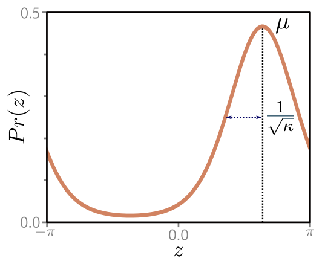{#fig-udl-5-13 width=46%}

**4. (UDL 5.4\* and 5.5)** Sometimes there is more than one valid output for a
given input (@fig-udl-5-14**a**). A **mixture of two Gaussians** with parameters
$\boldsymbol{\theta} = \{\lambda, \mu_1, \sigma_1^2, \mu_2, \sigma_2^2\}$,
$$
Pr(y \mid \boldsymbol{\theta}) = \frac{\lambda}{\sqrt{2\pi\sigma_1^2}} \exp\left[\frac{-(y - \mu_1)^2}{2\sigma_1^2}\right] + \frac{1 - \lambda}{\sqrt{2\pi\sigma_2^2}} \exp\left[\frac{-(y - \mu_2)^2}{2\sigma_2^2}\right],
$$
can represent it. Construct a loss for a model that predicts this mixture from
$I$ training pairs. How many outputs does the network need, and what must you do
to each one to keep the parameters valid? What problems do you foresee at
inference time, and why does @eq-infer stop being easy here? Then extend problem
3 to a mixture of two von Mises distributions and write the likelihood.

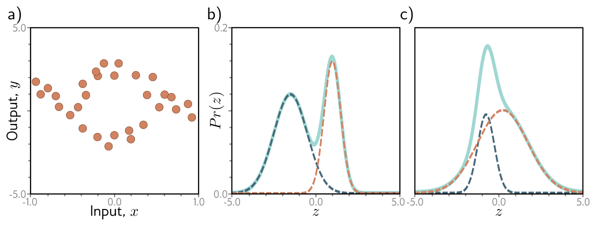{#fig-udl-5-14 width=88%}

**5. (UDL 5.6)** Predict the number of pedestrians $y \in \{0, 1, 2, \ldots\}$
passing a point in the next minute from data $x$ describing time of day,
position, and neighborhood type. A suitable distribution for counts is the
Poisson (@fig-udl-5-15), with rate $\lambda > 0$ and
$$
Pr(y = k) = \frac{\lambda^k e^{-\lambda}}{k!}.
$$
Design the loss function for $I$ training pairs. Which term can be dropped
during optimization, and why? What function would you use to keep the network's
output positive, and what would go wrong with the squaring used in
@eq-hetero?

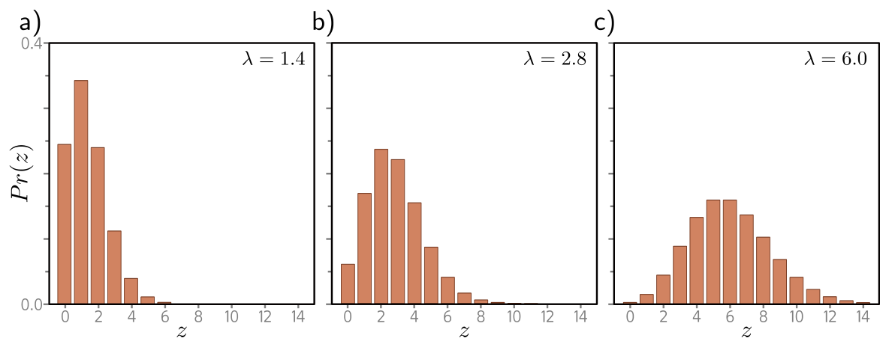{#fig-udl-5-15 width=88%}

**6. (UDL 5.7 and 5.9\*)** Consider a multivariate regression predicting ten
outputs, $\mathbf{y} \in \mathbb{R}^{10}$, each modeled with an independent
normal whose mean is predicted by the network and whose variance $\sigma^2$ is a
shared constant. Write $Pr(\mathbf{y} \mid \mathbf{f}[\mathbf{x},
\boldsymbol{\phi}])$ and show that minimizing the negative log-likelihood is
still a sum of squared terms. Then suppose two of those outputs are a person's
height in meters and their weight in kilograms. What goes wrong, and what are
two ways to fix it? Relate your answer to the callout in @sec-multiple-outputs.

**7. (UDL 5.8\* and 5.10)** Construct a loss for multivariate predictions
$\mathbf{y} \in \mathbb{R}^{D_o}$ using independent normals with a *different*
variance $\sigma_d^2$ per dimension, where both the means and the variances vary
with the input. How many outputs does the network need? Then extend problem 3 to
predict wind direction **and** wind speed together, naming the distribution you
choose for each and writing the combined loss.

**8.** A bolted joint on an assembly line is inspected and recorded as pass or
fail, and 3% of joints fail. A colleague trains a classifier with
`BCEWithLogitsLoss`, reports 97.2% accuracy, and proposes deploying it. (a)
Using @fig-bce-curves, explain what loss value a model that always predicts
"pass" would achieve, and why accuracy is the wrong number to quote here. (b)
The chapter notes (p. 73) describe **focal loss** for exactly this situation.
Explain in terms of @eq-bce what "down-weighting well-classified examples" does
to the gradient. (c) Propose a threshold other than $0.5$ and justify it from the
relative cost of the two errors, not from the model.

**9. Computational.** The heteroscedastic cell fits a two-output network with
@eq-hetero-loss. In the notebook: (a) replace the squaring in @eq-hetero with
$\sigma^2 = \exp[\mathrm{f}_2[x, \boldsymbol{\phi}]]$ and compare the fitted
$\sigma$ curves and the coverage table; (b) remove the $\log$ term from
@eq-hetero-loss, retrain, and report what the network does to $\sigma$ and why;
(c) drop the $10^{-6}$ floor on the variance and describe the failure. Explain
each result in terms of the two competing terms of @eq-hetero-loss.

**10. Computational.** Take the three-class model of @fig-multiclass and treat
its softmax outputs as the true label distribution. Sample 400 labels from it.
Then (a) fit a small network with `CrossEntropyLoss` and compare its achieved
loss with $H[q]$ computed from the true conditional distributions — this is the
irreducible floor; (b) add a constant of 50 to every logit of the *trained*
network's last layer and confirm that neither the loss nor the predictions
change; (c) replace `CrossEntropyLoss` with `NLLLoss` applied to
`log(softmax(...))` computed naively, scale the logits up by a factor of 200, and
report the first magnitude at which the two disagree.

---

## Textbook Reference Map {#sec-reference-map}

Every part of this page, mapped to Prince, *Understanding Deep Learning*
(MIT Press, 2024) [@prince2024]. Page numbers are those of the printed book.

| This page | Prince section | Pages | Figures used |
|:--|:--|:--:|:--|
| What a Loss Function Is For | Ch. 5 opening | 56 | — |
| From Predictions to Distributions | §5.1 | 56–57 | 5.1 (p. 57) |
| — Computing a distribution over outputs | §5.1.1 | 58 | — |
| — The maximum likelihood criterion | §5.1.2 | 58 | — |
| — Maximizing log-likelihood | §5.1.3 | 59 | 5.2 (p. 59) |
| — Minimizing negative log-likelihood | §5.1.4 | 60 | — |
| — Inference | §5.1.5 | 60 | — |
| The Recipe | §5.2 | 60 | — |
| Example 1: Univariate Regression | §5.3 | 61–62 | 5.3 (p. 61) |
| — The least squares loss function | §5.3.1 | 62 | 5.4 (p. 63) |
| — Inference | §5.3.2 | 62 | — |
| — Estimating the variance | §5.3.3 | 62–64 | — |
| — Heteroscedastic regression | §5.3.4 | 64 | 5.5 (p. 65) |
| Example 2: Binary Classification | §5.4 | 64–66 | 5.6 (p. 65), 5.7 (p. 66), 5.8 (p. 67) |
| Example 3: Multiclass Classification | §5.5 | 67–69 | 5.9 (p. 67), 5.10 (p. 68) |
| — Predicting other data types | §5.5.1 | 69 | 5.11 (p. 70), as a table |
| Multiple Outputs | §5.6 | 69–70 | — |
| Cross-Entropy Loss | §5.7 | 71–72 | 5.12 (p. 71) |
| Losses in PyTorch | ours; notebooks 5.1–5.3 | — | — |
| Summary | §5.8 | 72–73 | — |
| Exercises 1, 3–7 | Problems 5.1–5.10 | 74–76 | 5.13 (p. 74), 5.14 (p. 75), 5.15 (p. 76) |

: {tbl-colwidths="[36,24,10,30]"}

Equations on this page correspond to Prince as follows: @eq-mle is his (5.1),
@eq-iid is (5.2), @eq-loglik is (5.3), @eq-nll is (5.4), @eq-infer is (5.5),
@eq-recipe-loss is (5.6), @eq-normal is (5.7), @eq-normal-model is (5.8),
@eq-reg-nll is (5.9), @eq-ls-derivation is (5.10), @eq-least-squares is (5.11),
@eq-reg-infer is (5.12), @eq-est-var is (5.13), @eq-hetero is (5.14),
@eq-hetero-loss is (5.15), @eq-bernoulli is (5.16), @eq-bernoulli-compact is
(5.17), @eq-sigmoid is (5.18), @eq-bern-lik is (5.19), @eq-bce is (5.20),
@eq-categorical is (5.21), @eq-softmax is (5.22), @eq-cat-lik is (5.23),
@eq-ce-multi is (5.24), @eq-multi-indep is (5.25), @eq-multi-nll is (5.26),
@eq-kl is (5.27), @eq-empirical is (5.28), @eq-kl-argmin is (5.29),
@eq-ce-derivation is (5.30), and @eq-ce-equals-nll is (5.31). The von Mises,
mixture-of-Gaussians, and Poisson densities in the exercises are his (5.34),
(5.35), and (5.36).

::: {.callout-note appearance="simple"}
## Figure credits
Figures 5.1–5.15 are reproduced unaltered from Prince, *Understanding Deep
Learning* (MIT Press, 2024), which is distributed under a Creative Commons
CC-BY-NC-ND license, and are used here for non-commercial classroom instruction.
Figure 5.11 is reproduced as a table with its contents unchanged. All other
figures on this page are generated by the code in this week's notebook.
:::

---

## Further Reading

- Prince, *Understanding Deep Learning*, Chapter 5 [@prince2024] — the assigned reading. The chapter notes (pp. 73–74) survey robust regression, quantile regression, class imbalance, learning to rank, and the non-probabilistic losses this chapter sets aside.
- **[▶ UDL notebooks 5.1–5.3](https://github.com/udlbook/udlbook/tree/main/Notebooks/Chap05)** — Prince's own Colab notebooks for this chapter; links to each are at the top of this page.
- **[▶ This week's notebook](https://colab.research.google.com/github/harunpirim/IMSE774-NeuralNetworks/blob/main/notebooks/week05-loss-functions.ipynb)** — every cell above, in one Colab file.
- Nix & Weigend (1994) [@nix1994] — the original heteroscedastic neural network: two outputs, mean and variance, trained on @eq-hetero-loss.
- Kendall & Gal (2017) [@kendall2017] — the modern treatment of the same idea, and the distinction between noise in the data and uncertainty in the model.
- Bishop (1994) [@bishop1994] — mixture density networks, the general form of problem 4.
- Koenker & Hallock (2001) [@koenker2001] — quantile regression, for when you need "the value will be below this 90% of the time" rather than a mean.
- Lin et al. (2017) [@lin2017focal] — focal loss, the standard remedy for the class imbalance of exercise 8.
- Guo et al. (2017) [@guo2017] — modern networks minimize cross-entropy well and are still badly **calibrated**; required reading before you treat a softmax output as a probability.
- Goodfellow, Bengio & Courville, *Deep Learning*, §5.5 and §6.2 [@goodfellow2016] — maximum likelihood estimation and output units, a second pass over the same material.
