::: {.lecture-meta}
**Reading** Prince, *Understanding Deep Learning*, Chapter 6 (pp. 77–95) &nbsp;·&nbsp;
**UDL notebooks** 6.1–6.5
:::

::: {.callout-note appearance="simple"}
## How to read the references in these notes
Every section below opens with the section number and page range it covers in
Prince, *Understanding Deep Learning* (MIT Press, 2024). Page numbers are those
of the printed book. Figures taken from the textbook are captioned with their
original figure number and page; figures generated by the code behind this page
are ours. A complete cross-reference table appears in @sec-reference-map.
:::

## Learning Objectives

By the end of this week you should be able to:

1. State the two-step loop that every training algorithm in this course repeats, and say which step this chapter is about and which belongs to Chapter 7.
2. Implement **gradient descent**, choose its step with a fixed **learning rate** or a **line search**, and predict from the curvature of the loss when a learning rate will diverge.
3. Define **convexity**, and explain why it guarantees that downhill walking cannot fail — and why the loss of a neural network does not have it.
4. Locate and classify the **critical points** of a loss — local minima, maxima, and **saddle points** — using the eigenvalues of the Hessian, and explain why a small gradient is not proof of convergence.
5. Describe **stochastic gradient descent** in terms of **batches** and **epochs**, show that its gradient is unbiased, and give both interpretations of what it computes.
6. Explain why SGD is usually paired with a **learning rate schedule**, and what each phase of the schedule is for.
7. Derive the **momentum** and **Nesterov momentum** updates and explain, in terms of oscillation across a valley, why they converge faster.
8. State the **Adam** update, explain the role of each of its terms — including the bias correction — and say what problem the normalization solves.
9. Use `torch.optim.SGD` and `torch.optim.Adam`, and translate between Prince's momentum convention and PyTorch's.

::: {.callout-tip}
## The code lives in a notebook
This page shows the figures and results; the Python behind them is not printed
here. All of it — every cell, in the order the note uses it — is in a notebook
you can open in the browser with nothing to install:

- **[▶ Open the Week 6 notebook in Google Colab](https://colab.research.google.com/github/harunpirim/IMSE774-NeuralNetworks/blob/main/notebooks/week06-fitting-models.ipynb)** — all of this page's code, in order.
- **[▶ UDL notebook 6.1 — Line search](https://colab.research.google.com/github/udlbook/udlbook/blob/main/Notebooks/Chap06/6_1_Line_Search.ipynb)** — the bracketing search of @fig-udl-6-10 on a one-dimensional loss.
- **[▶ UDL notebook 6.2 — Gradient descent](https://colab.research.google.com/github/udlbook/udlbook/blob/main/Notebooks/Chap06/6_2_Gradient_Descent.ipynb)** — @fig-udl-6-1 from scratch.
- **[▶ UDL notebook 6.3 — Stochastic gradient descent](https://colab.research.google.com/github/udlbook/udlbook/blob/main/Notebooks/Chap06/6_3_Stochastic_Gradient_Descent.ipynb)** — the Gabor model of @eq-gabor, full-batch and stochastic.
- **[▶ UDL notebook 6.4 — Momentum](https://colab.research.google.com/github/udlbook/udlbook/blob/main/Notebooks/Chap06/6_4_Momentum.ipynb)** — @eq-momentum and @eq-nesterov on the same surface.
- **[▶ UDL notebook 6.5 — Adam](https://colab.research.google.com/github/udlbook/udlbook/blob/main/Notebooks/Chap06/6_5_Adam.ipynb)** — the four panels of @fig-udl-6-9.

Colab gives you a Python environment with NumPy, matplotlib, and PyTorch
already installed. In Colab, run a cell with **Shift+Enter**. If you prefer to
work locally, `pip install -r requirements.txt` from the [course
repository](https://github.com/harunpirim/IMSE774-NeuralNetworks) gives you the
same environment.
:::

```{python}
#| label: setup
#| code-fold: true
#| code-summary: "Plotting setup (click to expand)"

import numpy as np
import matplotlib.pyplot as plt
import torch
import torch.nn as nn
from torch.func import vmap, grad, hessian

torch.manual_seed(774)
np.random.seed(774)

plt.rcParams.update({
    "figure.figsize": (7, 4),
    "figure.dpi": 130,
    "axes.spines.top": False,
    "axes.spines.right": False,
    "axes.grid": True,
    "grid.alpha": 0.25,
    "font.size": 10,
    "axes.titlesize": 11,
    "axes.labelsize": 10,
    "legend.frameon": False,
})

NDSU_GREEN = "#005643"
NDSU_GOLD  = "#FFC72C"
ACCENT     = "#C1121F"
STEEL      = "#1864AB"
```

---

## What Fitting a Model Means

*Prince, Chapter 6 opening, p. 77.*

Three chapters have now built the pieces. Weeks 3 and 4 gave families of
piecewise linear functions, one member per setting of the parameters
$\boldsymbol{\phi}$. Week 5 gave the loss $L[\boldsymbol{\phi}]$, a single
number measuring how badly a given member describes the training data. What is
missing is the search: finding the parameter values that make the loss as small
as possible. That search is what we mean by **learning** the parameters, or
equivalently **training** or **fitting** the model.

Every method in this course runs the same loop. Choose initial values for the
parameters, then repeat two steps:

1. **compute the gradient** — the derivatives of the loss with respect to every parameter;
2. **adjust the parameters** using that gradient so that the loss goes down.

After enough repetitions we *hope* to be at the overall minimum. That word is
doing real work, and half of this chapter is about why the hope can fail.

This chapter is entirely about step 2: given a gradient, how should we move?
Step 1, which for a network with millions of parameters is a substantial
computation in its own right, is the backpropagation algorithm of Chapter 7,
which also takes up the question this loop quietly begs — where the initial
values come from.

## Gradient Descent

*Prince §6.1, pp. 77–78.*

We have a training set $\{\mathbf{x}_i, \mathbf{y}_i\}_{i=1}^{I}$, a model
$\mathbf{f}[\mathbf{x}_i, \boldsymbol{\phi}]$, and a loss. The goal of an
optimization algorithm is the minimizer

$$
\hat{\boldsymbol{\phi}} = \operatorname*{argmin}_{\boldsymbol{\phi}} \Big[ L[\boldsymbol{\phi}] \Big].
$$ {#eq-argmin}

There are many families of optimization algorithms, but the ones used to train
neural networks are all **iterative**: initialize the parameters heuristically,
then adjust them repeatedly so that the loss decreases. The simplest member of
the family is **gradient descent**. Starting from parameters $\boldsymbol{\phi}
= [\phi_0, \phi_1, \ldots, \phi_N]^T$, it iterates two steps.

**Step 1.** Compute the derivatives of the loss with respect to the parameters:

$$
\frac{\partial L}{\partial \boldsymbol{\phi}} =
\begin{bmatrix} \dfrac{\partial L}{\partial \phi_0} & \dfrac{\partial L}{\partial \phi_1} & \cdots & \dfrac{\partial L}{\partial \phi_N} \end{bmatrix}^T.
$$ {#eq-gradient}

**Step 2.** Update the parameters according to the rule

$$
\boldsymbol{\phi} \longleftarrow \boldsymbol{\phi} - \alpha \cdot \frac{\partial L}{\partial \boldsymbol{\phi}},
$$ {#eq-gd-update}

where the positive scalar $\alpha$ sets the size of the change.

The gradient points in the direction in which the loss *increases* fastest — the
uphill direction at the current position. Step 2 therefore moves a small
distance downhill, which is the whole reason for the minus sign.

At a minimum the surface must be flat; if it were not, we could keep going
downhill. So the gradient there is zero and the updates stop changing anything.
In practice we monitor the size of the gradient and stop when it falls below a
threshold. Hold on to that stopping rule. It is entirely reasonable, and
@sec-saddle will show it can be fooled.

### Choosing the step: learning rate or line search

*Prince §6.1, p. 78; chapter notes, pp. 92–93; figure on p. 93.*

There are two ways to choose $\alpha$. We can fix it in advance, in which case
it is called the **learning rate**. Or we can perform a **line search**: having
computed the downhill direction, try several values of $\alpha$ along it and
take the one that decreases the loss the most.

The chapter notes explain why the second option exists. With a fixed $\alpha$,
the distance moved is proportional to the size of the gradient, so the method
takes long strides where the loss changes fast — exactly where caution is
called for — and timid ones where it changes slowly, where it should explore.
A line search removes that coupling. One standard procedure is **bracketing**
(@fig-udl-6-10): keep two interior points inside a search interval, compare the
loss at them, discard the end of the interval that cannot contain the minimum,
and repeat until the minimum is pinned down.

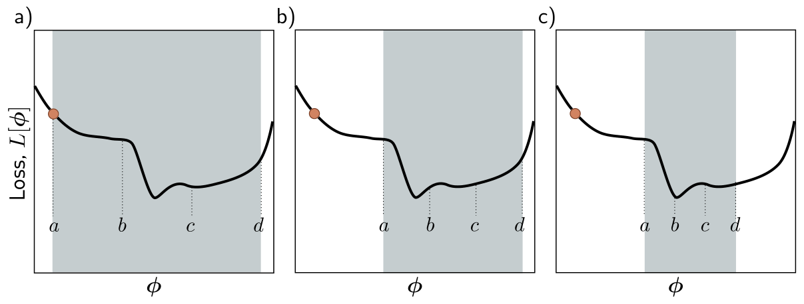{#fig-udl-6-10 width=88%}

Line search is cheap when one loss evaluation is cheap. For a network trained on
millions of examples, every trial value of $\alpha$ costs a full pass over the
data, which is why deep learning almost always uses a fixed learning rate — or
a fixed *schedule* of them — instead.

### Linear regression example

*Prince §6.1.1, pp. 78–80; figure on p. 79.*

Start with the model we know best, the 1D linear regression of Chapter 2:

$$
y = \mathrm{f}[x, \boldsymbol{\phi}] = \phi_0 + \phi_1 x,
$$ {#eq-linear}

with intercept $\phi_0$ and slope $\phi_1$, and the least squares loss over $I$
pairs,

$$
L[\boldsymbol{\phi}] = \sum_{i=1}^{I} \ell_i = \sum_{i=1}^{I} \big(\mathrm{f}[x_i, \boldsymbol{\phi}] - y_i\big)^2 = \sum_{i=1}^{I} \big(\phi_0 + \phi_1 x_i - y_i\big)^2,
$$ {#eq-ls-loss}

where $\ell_i$ is the contribution of the $i$th example. Because the loss is a
sum, so is its derivative,

$$
\frac{\partial L}{\partial \boldsymbol{\phi}} = \frac{\partial}{\partial \boldsymbol{\phi}} \sum_{i=1}^{I} \ell_i = \sum_{i=1}^{I} \frac{\partial \ell_i}{\partial \boldsymbol{\phi}},
$$ {#eq-grad-sum}

and each term is

$$
\frac{\partial \ell_i}{\partial \boldsymbol{\phi}} =
\begin{bmatrix} \dfrac{\partial \ell_i}{\partial \phi_0} \\[8pt] \dfrac{\partial \ell_i}{\partial \phi_1} \end{bmatrix} =
\begin{bmatrix} 2(\phi_0 + \phi_1 x_i - y_i) \\ 2 x_i (\phi_0 + \phi_1 x_i - y_i) \end{bmatrix}.
$$ {#eq-grad-terms}

@Eq-grad-sum looks like bookkeeping, but it is the observation the rest of the
chapter is built on: *the gradient of the whole dataset is a sum of
per-example gradients*. Stochastic gradient descent will simply stop summing
over all of them.

@Fig-udl-6-1 runs @eq-gd-update with a line search at every step. Panel (b)
shows the loss as a surface, (c) the same surface as a heatmap with the
iterates marked, and (d) the line each iterate represents. After four steps the
fit is already reasonable.

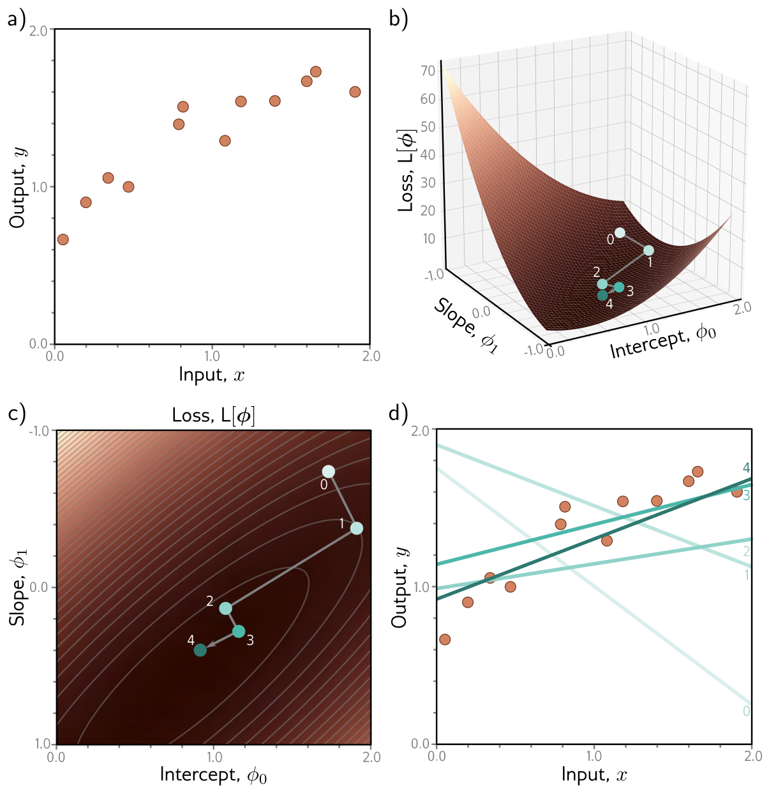{#fig-udl-6-1 width=80%}

Our version below implements the bracketing search of @fig-udl-6-10 as a
golden-section search and runs it on twelve points of our own.

```{python}
#| label: fig-gd-linear
#| fig-cap: "Our version of figure 6.1. Left: contours of the least squares loss over intercept and slope, with eight iterations of gradient descent with line search (gold) and the closed-form optimum (white star). Each step runs downhill until the loss stops falling, so it turns sharply at every iterate — compare path 1 in @fig-udl-6-5**a**. Right: the data and the line at each iterate, lightest to darkest."

rng = np.random.default_rng(774)
x_lin = np.sort(rng.uniform(0, 2, 12))
y_lin = 0.85 + 0.45 * x_lin + rng.normal(0, 0.12, 12)
X_lin = np.column_stack([np.ones_like(x_lin), x_lin])

def loss_lin(phi):                                      # equation (6.5)
    return np.sum((X_lin @ phi - y_lin) ** 2)

def grad_lin(phi):                                      # equations (6.6) and (6.7)
    r = X_lin @ phi - y_lin
    return np.array([2 * r.sum(), 2 * (x_lin * r).sum()])

def line_search(f, phi, d, a_max=2.0, tol=1e-6):
    """Bracketing search (figure 6.10) for the step a along -d that minimizes f.
    Golden-section spacing lets each iteration reuse one interior point."""
    g = (np.sqrt(5) - 1) / 2
    a, b = 0.0, a_max
    c, e = b - g * (b - a), a + g * (b - a)
    while b - a > tol:
        if f(phi - c * d) < f(phi - e * d):             # minimum is not in [e, b]
            b, e = e, c
            c = b - g * (b - a)
        else:                                           # minimum is not in [a, c]
            a, c = c, e
            e = a + g * (b - a)
    return 0.5 * (a + b)

phi = np.array([1.7, -0.75])
path = [phi]
for _ in range(8):
    d = grad_lin(phi)                                   # step 1, equation (6.2)
    phi = phi - line_search(loss_lin, phi, d) * d       # step 2, equation (6.3)
    path.append(phi)
path = np.array(path)
phi_star = np.linalg.solve(X_lin.T @ X_lin, X_lin.T @ y_lin)

g0, g1 = np.meshgrid(np.linspace(0, 2, 300), np.linspace(-1, 1, 300))
L_surf = ((g0[..., None] + g1[..., None] * x_lin - y_lin) ** 2).sum(-1)

fig, axes = plt.subplots(1, 2, figsize=(11, 4.2))
ax = axes[0]
ax.contourf(g0, g1, np.log10(L_surf), 30, cmap="copper")
ax.contour(g0, g1, np.log10(L_surf), 15, colors="white", linewidths=0.4, alpha=0.4)
ax.plot(path[:, 0], path[:, 1], "-o", color=NDSU_GOLD, ms=4, lw=1.4)
for k in range(5):
    ax.annotate(str(k), path[k], textcoords="offset points", xytext=(6, 4), color="white", fontsize=8)
ax.plot(*phi_star, "*", color="white", ms=13)
ax.set_xlabel(r"intercept $\phi_0$"); ax.set_ylabel(r"slope $\phi_1$"); ax.set_title(r"$\log_{10} L[\phi]$ and the iterates")
ax.grid(False)
ax = axes[1]
xs = np.linspace(0, 2, 50)
for k, p in enumerate(path[:5]):
    ax.plot(xs, p[0] + p[1] * xs, color=NDSU_GREEN, alpha=0.2 + 0.8 * k / 4, lw=2, label=f"iterate {k}" if k in (0, 4) else None)
ax.scatter(x_lin, y_lin, color=ACCENT, s=28, zorder=3)
ax.set_xlabel("$x$"); ax.set_ylabel("$y$"); ax.set_ylim(0, 2); ax.legend(fontsize=8)
ax.set_title("the model at each iterate")
plt.tight_layout()
plt.show()

print(f"{'iterate':>8}" + "".join(f"{k:>8}" for k in range(len(path))))
print(f"{'loss':>8}" + "".join(f"{loss_lin(p):>8.3f}" for p in path))
print(f"\nclosed-form optimum (normal equations): loss {loss_lin(phi_star):.4f}")
```

Two things are worth seeing here. The loss drops by a factor of more than four
in the first three steps and then crawls; the last few iterations buy very
little. And each step ends exactly where the line search found the bottom of
the valley along the current direction, after which the new direction is very
different — the path zig-zags even on a perfectly well-behaved bowl. Problem
6.7 asks you why.

The more common choice in deep learning is a fixed learning rate, and here the
curvature of the loss sets a hard limit. The Week 2 note showed that for a
quadratic loss the Hessian $2\mathbf{X}^T\mathbf{X}$ describes the shape of the
bowl, and that gradient descent is stable only for $\alpha < 2/\lambda_{\max}$
([Week 2, §"Why the iterative methods struggle"](02-math-background.qmd#sec-conditioning)).
@fig-learning-rate checks that limit on the same data.

```{python}
#| label: fig-learning-rate
#| fig-cap: "Gradient descent with a fixed learning rate on the data of @fig-gd-linear, for four values of $\\alpha$ expressed as fractions of the stability limit $2/\\lambda_{\\max}$, where $\\lambda_{\\max}$ is the largest eigenvalue of the Hessian. Small steps are safe and slow; steps just below the limit converge fastest; 5% above the limit and the iterates oscillate with growing amplitude until the loss overflows. The dashed line is the closed-form minimum."

H_lin = 2 * X_lin.T @ X_lin                             # the Hessian of equation (6.5)
lam = np.linalg.eigvalsh(H_lin)
alpha_crit = 2 / lam[-1]

plt.figure(figsize=(6.4, 3.6))
colors = [STEEL, NDSU_GREEN, NDSU_GOLD, ACCENT]
for frac, c in zip((0.1, 0.5, 0.95, 1.05), colors):
    phi, hist = np.array([1.7, -0.75]), [loss_lin(np.array([1.7, -0.75]))]
    for _ in range(60):
        phi = phi - frac * alpha_crit * grad_lin(phi)
        hist.append(loss_lin(phi))
    plt.semilogy(hist, color=c, lw=2, label=rf"$\alpha = {frac}\times 2/\lambda_{{\max}}$")
plt.axhline(loss_lin(phi_star), color="gray", ls="--", lw=1)
plt.ylim(0.08, 1e3); plt.xlabel("iteration"); plt.ylabel("loss  (log scale)")
plt.legend(fontsize=8); plt.tight_layout(); plt.show()

print(f"Hessian eigenvalues: {lam.round(3)}   condition number {lam[-1] / lam[0]:.1f}")
print(f"stability limit 2 / lambda_max = {alpha_crit:.4f}")
```

The limit is not a heuristic: on a quadratic, the error along the steepest
eigenvector is multiplied by $(1 - \alpha\lambda_{\max})$ at every step, which
has magnitude above one exactly when $\alpha > 2/\lambda_{\max}$. Meanwhile the
error along the shallowest direction shrinks by $(1 - \alpha\lambda_{\min})$,
so the *slowest* part of the problem sets the convergence rate while the
*steepest* part sets the step size. Their ratio, the condition number, is the
quantity that momentum and Adam will both try to defeat.

## Non-Convex Loss Surfaces

*Prince §6.1.2, pp. 80–81; figures on p. 81; chapter notes, p. 92.*

The linear regression loss has one well-defined global minimum. More precisely
it is **convex**: no chord — no line segment joining two points on the surface —
passes below the surface. Convexity has a strong consequence. Wherever we
initialize, if we keep walking downhill we are bound to reach the minimum; the
training procedure cannot fail.

The chapter notes give the algebraic test. Collect the second derivatives into
the **Hessian**,

$$
\mathbf{H}[\boldsymbol{\phi}] =
\begin{bmatrix}
\dfrac{\partial^2 L}{\partial \phi_0^2} & \dfrac{\partial^2 L}{\partial \phi_0 \partial \phi_1} & \cdots & \dfrac{\partial^2 L}{\partial \phi_0 \partial \phi_N} \\[8pt]
\dfrac{\partial^2 L}{\partial \phi_1 \partial \phi_0} & \dfrac{\partial^2 L}{\partial \phi_1^2} & \cdots & \dfrac{\partial^2 L}{\partial \phi_1 \partial \phi_N} \\
\vdots & \vdots & \ddots & \vdots \\
\dfrac{\partial^2 L}{\partial \phi_N \partial \phi_0} & \dfrac{\partial^2 L}{\partial \phi_N \partial \phi_1} & \cdots & \dfrac{\partial^2 L}{\partial \phi_N^2}
\end{bmatrix}.
$$ {#eq-hessian}

If $\mathbf{H}$ is positive definite — all eigenvalues positive — for *every*
$\boldsymbol{\phi}$, the function is convex: a smooth bowl with a single global
minimum and no local minima or saddle points. Problem 6.2 asks you to prove
this for linear regression.

Unfortunately the loss functions of almost all nonlinear models, shallow and
deep networks included, are **non-convex**. A network's loss is impossible to
draw, so Prince studies a nonlinear model with only two parameters, the
**Gabor model**:

$$
\mathrm{f}[x, \boldsymbol{\phi}] = \sin\big[\phi_0 + 0.06 \cdot \phi_1 x\big] \cdot \exp\left[ \frac{-(\phi_0 + 0.06 \cdot \phi_1 x)^2}{32.0} \right].
$$ {#eq-gabor}

It multiplies an oscillating sinusoid by a decaying exponential, so the
oscillation dies away from its center (@fig-udl-6-2). The parameter $\phi_0 \in
\mathbb{R}$ sets the position of the center and $\phi_1 \in \mathbb{R}^+$
squeezes or stretches the function along the $x$-axis. Fitting it to $I$
training pairs (@fig-udl-6-3) by least squares means minimizing

$$
L[\boldsymbol{\phi}] = \sum_{i=1}^{I} \big(\mathrm{f}[x_i, \boldsymbol{\phi}] - y_i\big)^2.
$$ {#eq-gabor-loss}

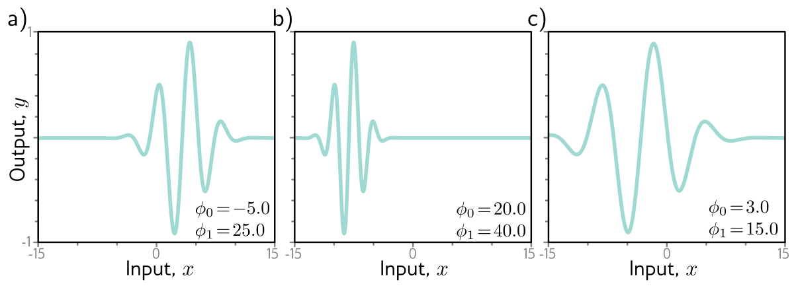{#fig-udl-6-2 width=88%}

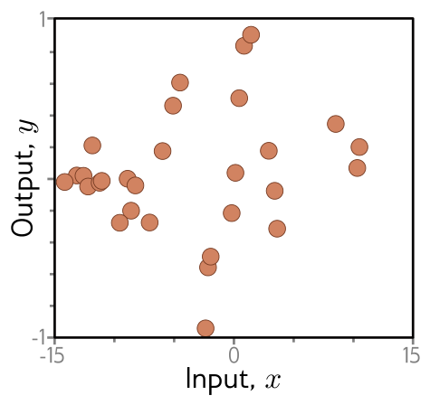{#fig-udl-6-3 width=40%}

The Hessian test does more than certify convexity. At any point where the
gradient is zero — a **critical point** — its eigenvalues classify what kind of
point it is: all positive means a **minimum**, all negative a **maximum**, and
a mixture a **saddle point**, with the positive eigenvalues marking directions
in which we sit at a minimum and the negative ones directions in which we sit at
a maximum.

That suggests an experiment the chapter does not run: find *every* critical
point of the Gabor loss and classify each one. Newton's method — which the
chapter notes describe as stepping by $-\mathbf{H}^{-1}\,\partial L/\partial
\boldsymbol{\phi}$ — is the right tool, precisely because of the flaw the notes
point out: it heads for the *nearest* critical point, whatever kind it is. Run
from a grid of starting points, it finds them all.

```{python}
#| label: fig-gabor-critical
#| fig-cap: "Every critical point of the Gabor loss in the window of figure 6.4, found by running Newton's method from 1,681 starting points and classified by the eigenvalues of the Hessian, @eq-hessian. Left: our training data (28 points generated from $\\phi = [0, 16.6]^T$ plus noise, as in @fig-udl-6-3) and the model at the global minimum. Right: $\\log L[\\phi]$, darker is lower; cyan circles are minima, white triangles maxima, white crosses saddle points, and the gold star the global minimum. The vertical valleys are where the sinusoid lines up with the data; the plateaus at the left and right edges are where $|\\phi_0|$ is so large that the Gabor function is essentially zero across the data."

def gabor(x, phi):                                      # equation (6.8), batched over phi
    z = phi[..., 0:1] + 0.06 * phi[..., 1:2] * x
    return torch.sin(z) * torch.exp(-z ** 2 / 32.0)

x_g = torch.tensor(rng.uniform(-15, 15, 28))
y_g = gabor(x_g, torch.tensor([0.0, 16.6], dtype=torch.float64)) + torch.tensor(rng.normal(0, 0.15, 28))
I_g = len(x_g)

def L_w(phi, w):
    """Equation (6.9) with a 0/1 weight per example: all ones is the full loss,
    and a batch mask gives the loss of one batch (equation 6.10)."""
    return torch.sum(w * (gabor(x_g, phi) - y_g) ** 2)

ALL = torch.ones(I_g, dtype=torch.float64)
L_full = lambda phi: L_w(phi, ALL)
grad_L = vmap(grad(L_full))                             # gradients at many phi at once
hess_L = vmap(hessian(L_full))                          # 2 x 2 Hessians at many phi at once

p0g = torch.linspace(-10, 10, 301, dtype=torch.float64)
p1g = torch.linspace(2.5, 22.5, 301, dtype=torch.float64)
P0, P1 = torch.meshgrid(p0g, p1g, indexing="xy")
L_grid = ((gabor(x_g[None, :], torch.stack([P0.ravel(), P1.ravel()], 1)) - y_g) ** 2).sum(1).reshape(P0.shape)

starts = torch.stack(torch.meshgrid(torch.linspace(-10, 10, 41, dtype=torch.float64),
                                    torch.linspace(2.5, 22.5, 41, dtype=torch.float64),
                                    indexing="xy"), -1).reshape(-1, 2)
p = starts.clone()
for _ in range(60):                                     # Newton: phi <- phi - H^{-1} dL/dphi
    step = torch.linalg.solve(hess_L(p), grad_L(p).unsqueeze(-1)).squeeze(-1)
    p = p - step.clamp(-1.0, 1.0)                       # clamp keeps early steps from leaping off the map

inside = (p[:, 0].abs() <= 10) & (p[:, 1] >= 2.5) & (p[:, 1] <= 22.5)
p = p[(grad_L(p).norm(dim=1) < 1e-8) & inside]
crit = []
for q in p:                                             # merge duplicates found from different starts
    if all((q - c).norm() > 1e-3 for c in crit):
        crit.append(q)
crit = torch.stack(crit)
ev = torch.linalg.eigvalsh(hess_L(crit))
kind = np.where((ev > 0).all(1), "minimum", np.where((ev < 0).all(1), "maximum", "saddle"))
L_crit = torch.stack([L_full(c) for c in crit]).numpy()
is_min = kind == "minimum"
order = np.argsort(L_crit[is_min])
minima, L_minima = crit[is_min][order], L_crit[is_min][order]
phi_global = minima[0]

fig, axes = plt.subplots(1, 2, figsize=(11.5, 4.4), gridspec_kw={"width_ratios": [1, 1.15]})
xs = torch.linspace(-15, 15, 400, dtype=torch.float64)
axes[0].scatter(x_g, y_g, color=ACCENT, s=26, zorder=3, label="training data")
axes[0].plot(xs, gabor(xs, phi_global).squeeze(), color=NDSU_GREEN, lw=2, label="model at global minimum")
axes[0].set_xlabel("$x$"); axes[0].set_ylabel("$y$"); axes[0].set_ylim(-1, 1); axes[0].legend(fontsize=8, loc="lower left")
ax = axes[1]
ax.contourf(P0, P1, torch.log(L_grid), 40, cmap="copper")
ax.contour(P0, P1, torch.log(L_grid), 18, colors="white", linewidths=0.3, alpha=0.35)
style = {"minimum": dict(marker="o", c="#7FDBDA", s=34, edgecolors="k", linewidths=0.5),
         "maximum": dict(marker="^", c="white", s=30, edgecolors="k", linewidths=0.4),
         "saddle":  dict(marker="x", c="white", s=30, linewidths=1.3)}
for k, st in style.items():
    pts = crit[kind == k]
    ax.scatter(pts[:, 0], pts[:, 1], label=f"{k} ({len(pts)})", **st)
ax.plot(*phi_global, "*", color=NDSU_GOLD, ms=15, mec="k", mew=0.5)
ax.set_xlim(-10, 10); ax.set_ylim(2.5, 22.5); ax.grid(False)
ax.set_xlabel(r"$\phi_0$"); ax.set_ylabel(r"$\phi_1$"); ax.set_title(r"$\log L[\phi]$ and its critical points")
ax.legend(fontsize=7.5, loc="upper left", framealpha=0.85, frameon=True)
plt.tight_layout()
plt.show()

print(f"critical points in the window: {is_min.sum()} minima, {(kind == 'maximum').sum()} maxima, "
      f"{(kind == 'saddle').sum()} saddle points")
print(f"global minimum: phi = [{phi_global[0]:.3f}, {phi_global[1]:.3f}], loss {L_minima[0]:.3f}"
      f"   (data generated from [0, 16.6])")
print(f"losses at the other minima: {np.round(L_minima[1:], 2)}")
```

Ten minima, and only one of them is the answer. The sum of the squared noise in
our 28 points is roughly what the global minimum leaves behind, so the global
minimum recovers the generating parameters almost exactly. Every other minimum
is a qualitatively wrong model that no small change can improve. Also note how
much of the map is *plateau*: where $|\phi_0|$ is large the Gabor function is
nearly zero over the whole dataset, the loss is close to $\sum_i y_i^2$, and the
gradient is close to zero — not because we are near a solution but because
nothing we do matters there.

### Local minima

*Prince §6.1.3, pp. 81–83; figures on pp. 82–83.*

@Fig-udl-6-4 is Prince's version of the same surface. At each cyan circle the
gradient is zero and the loss increases in every direction, yet we are not at
the lowest point; the lowest point, the **global minimum**, is the gray circle,
with a loss of 0.64 on his data. Panels (b)–(f) show the model at five of the
minima, and in every one of them no small change improves the fit.

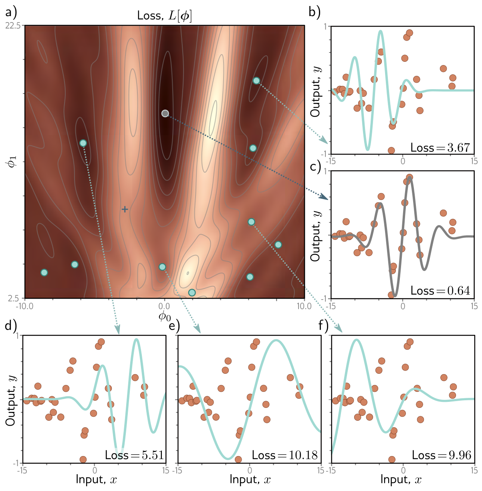{#fig-udl-6-4 width=80%}

Start somewhere at random and walk downhill, and nothing guarantees you arrive
at the global minimum (@fig-udl-6-5**a**). Prince puts it bluntly: it is
equally or even more likely that the algorithm terminates in one of the local
minima, and there is no way of knowing whether a better solution exists
elsewhere.

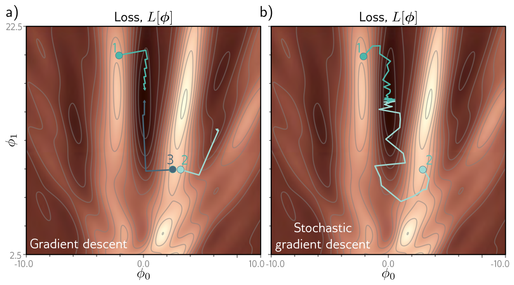{#fig-udl-6-5 width=82%}

"Equally or even more likely" can be measured. Below, gradient descent starts
from every point of the same 41 × 41 grid, and we record where each run ends.

```{python}
#| label: fig-multistart
#| fig-cap: "Where gradient descent ends, as a function of where it starts. Each of the 1,681 squares is one starting point on the Gabor loss, coloured by the outcome after 3,000 steps with a fixed learning rate: gold, the global minimum; green, a different local minimum; gray, still on a plateau where the loss is within 5% of its value for a model that predicts zero everywhere; blue, still moving. White crosses mark the minima of @fig-gabor-critical. Only the narrow central valley drains to the global minimum."

def classify(p_end):
    """0 = global minimum, 1 = other local minimum, 2 = plateau, 3 = still moving."""
    L_end = torch.stack([L_full(q) for q in p_end])
    g_end = grad_L(p_end).norm(dim=1)
    at_global = (p_end - phi_global).norm(dim=1) < 0.1
    near_min = torch.stack([(p_end - m).norm(dim=1) < 0.1 for m in minima]).any(0)
    plateau = L_end > 0.95 * (y_g ** 2).sum()
    out = np.full(len(p_end), 3)
    out[plateau.numpy()] = 2
    out[(near_min & ~at_global).numpy()] = 1
    out[at_global.numpy()] = 0
    return out

p = starts.clone()
for _ in range(3000):
    p = p - 0.004 * grad_L(p)                           # equation (6.3), alpha = 0.004
gd_outcome = classify(p)

from matplotlib.colors import ListedColormap
OUTCOME_CMAP = ListedColormap([NDSU_GOLD, NDSU_GREEN, "#BBBBBB", STEEL])
OUTCOMES = ["global minimum", "other local minimum", "plateau", "still moving"]

fig, ax = plt.subplots(figsize=(5.4, 4.6))
ax.imshow(gd_outcome.reshape(41, 41), origin="lower", extent=(-10.25, 10.25, 2.25, 22.75),
          cmap=OUTCOME_CMAP, vmin=-0.5, vmax=3.5, aspect="auto", interpolation="nearest")
ax.scatter(minima[:, 0], minima[:, 1], marker="x", c="white", s=28, linewidths=1.3)
ax.set_xlabel(r"starting $\phi_0$"); ax.set_ylabel(r"starting $\phi_1$"); ax.grid(False)
ax.set_title("gradient descent: final destination")
plt.tight_layout(); plt.show()

for k, name in enumerate(OUTCOMES):
    print(f"{name:<22}{np.mean(gd_outcome == k):>7.1%}")
```

Only about one start in twenty finds the global minimum, while one in five
settles confidently into one of the nine wrong minima — so on this surface,
"equally or even more likely" is an understatement by a factor of four. Most of
the rest never really get going: over two in five began on a plateau, where the
gradient is too small to move the parameters anywhere in 3,000 steps, and the
blue region is still creeping along shallow valley floors when the budget runs
out. With two parameters we could escape this
by brute force — search the whole grid, or restart from many points and keep
the best — but a network has millions of parameters, and neither strategy
scales. We can find *a* minimum; we cannot tell whether it is the global one,
or even a good one.

::: {.callout-note}
## How worried should we be?
The Gabor model is chosen because it is drawable, not because it is typical.
Prince's footnote on p. 91 previews Chapter 20: in practice deep networks are
surprisingly easy to train, and whether local minima and saddle points are a
real obstacle in very high dimensions is a research question in its own right.
Treat this section as the vocabulary for failures, not a forecast of them.
:::

### Saddle points {#sec-saddle}

*Prince §6.1.3, p. 83.*

The surface also contains saddle points — the blue cross in @fig-udl-6-4 is one
— where the gradient is zero but the function increases in some directions and
decreases in others. Unless the parameters sit *exactly* at the saddle,
gradient descent will eventually escape downhill. The trouble is the word
"eventually". Near a saddle the surface is flat, so it is hard to be sure that
training has not converged, and a stopping rule of the form "terminate when the
gradient is small" can stop us at the saddle.

The simplest function with this behaviour makes the point vividly:
$L[\phi_0, \phi_1] = \tfrac{1}{4}\phi_0^4 - \tfrac{1}{2}\phi_0^2 + \tfrac{1}{2}\phi_1^2$
has a saddle at the origin and minima at $(\pm 1, 0)$.

```{python}
#| label: fig-saddle
#| fig-cap: "Gradient descent passing a saddle point. The loss $L = \\phi_0^4/4 - \\phi_0^2/2 + \\phi_1^2/2$ has a saddle at the origin (loss 0) and minima at $(\\pm 1, 0)$ (loss $-0.25$). Starting at $\\phi = [10^{-7}, 1.5]^T$, the $\\phi_1$ direction drains away quickly, and the run then sits next to the saddle while the tiny $\\phi_0$ offset grows by a factor of 1.1 per step. Left: the gradient norm falls by nearly four orders of magnitude, rises again, and only then collapses at the true minimum. Right: the loss stalls at the saddle's value for most of a hundred iterations. A stopping rule of $\\|\\partial L / \\partial \\phi\\| < 10^{-3}$ (dotted) fires at the first crossing, at the saddle."

def L_toy(p):  return p[0] ** 4 / 4 - p[0] ** 2 / 2 + p[1] ** 2 / 2
def g_toy(p):  return np.array([p[0] ** 3 - p[0], p[1]])

p = np.array([1e-7, 1.5]); gnorm, loss_toy = [], []
for _ in range(300):
    gnorm.append(np.linalg.norm(g_toy(p))); loss_toy.append(L_toy(p))
    p = p - 0.1 * g_toy(p)
gnorm, loss_toy = np.array(gnorm), np.array(loss_toy)
stop = int(np.argmax(gnorm < 1e-3))

fig, axes = plt.subplots(1, 2, figsize=(10.5, 3.3))
axes[0].semilogy(gnorm, color=NDSU_GREEN, lw=2)
axes[0].axhline(1e-3, color="gray", ls=":", lw=1.2)
axes[0].axvline(stop, color=ACCENT, lw=1, ls="--")
axes[0].set_xlabel("iteration"); axes[0].set_ylabel(r"$\|\partial L / \partial \phi\|$"); axes[0].set_title("gradient norm")
axes[1].plot(loss_toy, color=NDSU_GREEN, lw=2)
axes[1].axhline(0, color="gray", ls=":", lw=1); axes[1].axhline(-0.25, color="gray", ls="--", lw=1)
axes[1].axvline(stop, color=ACCENT, lw=1, ls="--")
axes[1].text(stop + 4, 0.6, "stopping rule\nfires here", color=ACCENT, fontsize=8)
axes[1].set_xlabel("iteration"); axes[1].set_ylabel("loss"); axes[1].set_title("loss"); axes[1].set_ylim(-0.35, 1.2)
plt.tight_layout(); plt.show()

print(f"the gradient norm first drops below 1e-3 at iteration {stop}: phi = {p.round(3)} at the end, but "
      f"at iteration {stop} the loss was {loss_toy[stop]:.2e} (saddle value 0)")
print(f"smallest gradient norm on the way past the saddle: {gnorm[40:150].min():.1e}")
print(f"final loss: {loss_toy[-1]:.4f}   (true minimum -0.25)")
```

A starting offset of $10^{-7}$ is not contrived: in floating point, *some* tiny
component along the escape direction is almost always present, which is why
gradient descent rarely gets permanently stuck on a saddle. It gets *slow*. In a
space of millions of parameters, Chapter 20 will argue, saddle points vastly
outnumber local minima, and the long plateaus they create are a more realistic
threat than being trapped.

## Stochastic Gradient Descent

*Prince §6.2, pp. 83–85.*

Gradient descent has a deeper problem than slowness: its final destination is
completely determined by its starting point (@fig-multistart is a map of exactly
that dependence). **Stochastic gradient descent** (SGD) tries to loosen this by
adding noise to the gradient at each step. On average the solution still moves
downhill, but at any single iteration the chosen direction need not be the
steepest descent — it need not be downhill at all. Moving temporarily uphill is
what allows the parameters to jump from one valley of the loss to another
(@fig-udl-6-5**b**).

### Batches and epochs

*Prince §6.2.1, p. 85; figure on p. 84.*

The mechanism for the noise is almost embarrassingly simple, and it follows
directly from @eq-grad-sum. At each iteration, choose a random subset of the
training data — a **minibatch**, or **batch** for short — and compute the
gradient from those examples alone. The update at iteration $t$ is

$$
\boldsymbol{\phi}_{t+1} \longleftarrow \boldsymbol{\phi}_t - \alpha \cdot \sum_{i \in \mathcal{B}_t} \frac{\partial \ell_i[\boldsymbol{\phi}_t]}{\partial \boldsymbol{\phi}},
$$ {#eq-sgd}

where $\mathcal{B}_t$ holds the indices of the examples in the current batch and
$\ell_i$ is the loss of the $i$th example. As before, $\alpha$ is the learning
rate, chosen at the start and independent of the local shape of the function;
together with the gradient magnitude it determines how far each step goes.

Batches are usually drawn **without replacement**. The algorithm works through
the training examples until every one has been used, then starts again from the
full set. One complete pass is an **epoch**. A batch can be as small as a single
example or as large as the whole dataset; the second case is **full-batch
gradient descent**, which is identical to the ordinary, non-stochastic gradient
descent of @eq-gd-update.

There is a second way to read @eq-sgd, and it is the one @fig-udl-6-6
illustrates. The loss depends on both the model and the data, so each batch
defines *its own* loss function. SGD can then be seen as performing ordinary,
deterministic gradient descent on a loss function that changes at every
iteration. Panels (b)–(d) show three batches of three examples, three different
surfaces, and three different steps from the same point — and in panel (d), a
step that is downhill on its batch's surface but uphill on the full one.

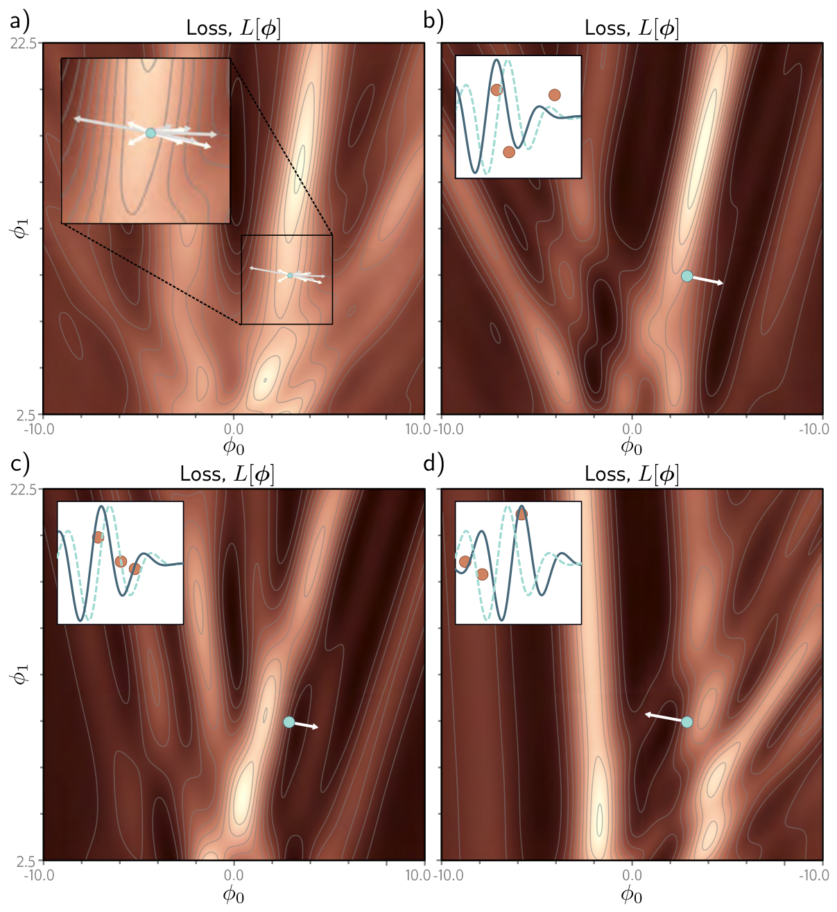{#fig-udl-6-6 width=80%}

Despite that variability, the expected loss and the expected gradient at any
point are the same as for full-batch descent: averaged over the possible
batches, a batch of $B$ examples contributes on average $B/I$ of the full
gradient. Both claims are easy to check by sampling.

```{python}
#| label: fig-batch-gradients
#| fig-cap: "The noise in SGD, sampled at one point on the Gabor loss ($\\phi = [2.5, 9.0]^T$, inside the panel-(a) inset region of figure 6.6). Left: 300 update directions $-\\sum_{i \\in \\mathcal{B}} \\partial \\ell_i / \\partial \\phi$ for random batches of three, each scaled by $I/B$ so they are comparable with the full-batch step (gold). Arrows in red point uphill on the full loss — the panel-(d) case of figure 6.6. Right: as the batch grows, the fraction of uphill steps falls and the typical batch direction aligns with the full gradient; at $B = I$ there is no noise left."

phi_pt = torch.tensor([2.5, 9.0], dtype=torch.float64)
g_full = grad(L_full)(phi_pt)
gen = torch.Generator().manual_seed(774)

def batch_grads(B, n=4000):
    """Gradients of n random batches of size B at phi_pt, each the sum in equation (6.10)."""
    idx = torch.argsort(torch.rand(n, I_g, generator=gen), dim=1)[:, :B]
    W = torch.zeros(n, I_g, dtype=torch.float64).scatter_(1, idx, 1.0)
    return vmap(grad(L_w), in_dims=(None, 0))(phi_pt, W)

fig, axes = plt.subplots(1, 2, figsize=(10.5, 3.9))
gb3 = batch_grads(3, 300) * I_g / 3
uphill = (gb3 @ g_full) < 0
ax = axes[0]
for gvec, up in zip(gb3, uphill):
    ax.arrow(0, 0, -gvec[0].item(), -gvec[1].item(), color=ACCENT if up else STEEL,
             alpha=0.35, width=0.004, head_width=0.06, length_includes_head=True)
ax.arrow(0, 0, -g_full[0].item(), -g_full[1].item(), color=NDSU_GOLD, width=0.03,
         head_width=0.25, length_includes_head=True, zorder=5)
ax.set_aspect("equal"); ax.set_xlim(-2, 9); ax.set_ylim(-4, 4)
ax.set_xlabel(r"change in $\phi_0$"); ax.set_ylabel(r"change in $\phi_1$")
ax.set_title(f"batches of 3: {uphill.float().mean():.0%} of steps go uphill")

rows = []
for B in (1, 2, 3, 5, 7, 14, 28):
    gb = batch_grads(B)
    cos = (gb @ g_full) / (gb.norm(dim=1) * g_full.norm())
    rows.append((B, ((gb @ g_full) < 0).float().mean().item(), cos.median().item(),
                 (gb.mean(0) * I_g / B - g_full).norm().item() / g_full.norm().item()))
rows = np.array(rows)
ax = axes[1]
ax.plot(rows[:, 0], rows[:, 1], "o-", color=ACCENT, lw=2, label="fraction of uphill steps")
ax.plot(rows[:, 0], rows[:, 2], "s-", color=STEEL, lw=2, label="median cosine with full gradient")
ax.set_xscale("log"); ax.set_xticks(rows[:, 0]); ax.set_xticklabels([int(b) for b in rows[:, 0]])
ax.set_xlabel("batch size $B$  (of $I = 28$)"); ax.set_ylim(-0.02, 1.05); ax.legend(fontsize=8)
ax.set_title("noise shrinks as the batch grows")
plt.tight_layout(); plt.show()

print(f"{'B':>4}{'uphill':>9}{'median cos':>12}{'|mean(I/B * batch grad) - full| / |full|':>44}")
for B, up, c, err in rows:
    print(f"{int(B):>4}{up:>9.1%}{c:>12.3f}{err:>44.3f}")
```

The last column is the unbiasedness claim: averaged over 4,000 batches and
rescaled by $I/B$, the batch gradient matches the full gradient to within
sampling error at every batch size. The middle columns are the noise. With a
single example per batch, more than a third of all steps are uphill on the full
loss; even at half the dataset, one in five is.

### Properties of stochastic gradient descent

*Prince §6.2.2, pp. 85–86.*

Prince lists the attractions of SGD, and each is worth stating precisely.

1. **Every step is sensible.** Each update improves the fit to *some* subset of the data, even if not to all of it.
2. **Every example counts equally.** Sampling without replacement and cycling through epochs means no example is favoured.
3. **Each step is cheap.** The cost of a gradient scales with the batch, not the dataset — for a network trained on millions of examples, this is the property that makes training possible at all.
4. **It can, in principle, escape local minima,** by the uphill steps measured above.
5. **It is less likely to stall near saddle points.** At any point, some batch is likely to have a substantial gradient, even where the full gradient is nearly zero.
6. **It may find parameters that generalize better.** There is evidence that the minima SGD finds in networks generalize well to new data; this is a Chapter 9 topic.

Property 4 carries the words "in principle", and it is worth testing them
honestly. The comparison has a trap. SGD is usually run with larger steps than
gradient descent, and a larger step can carry the parameters over a ridge by
itself, noise or no noise. So below, each SGD run is paired with a full-batch
run that uses the same per-example step size, the same schedule, and the same
number of updates. Any difference between them is due to the noise alone.

```{python}
#| label: fig-sgd-vs-gd
#| fig-cap: "Does the noise in SGD help on the Gabor loss? Every start of @fig-multistart is run twice for 300 epochs of 4 updates each, with the learning rate halved every 75 epochs: once with SGD and batches of seven, and once with full-batch gradient descent whose learning rate is scaled by $B/I$ so that both take the same expected step. Colours as in @fig-multistart. Compared with @fig-multistart, both runs reach the global minimum from far more starts, and the noisy run leaves fewer starts stranded on the plateau — but the noise adds almost nothing to the global-minimum count: the larger steps did that."

B_sgd, epochs, lr0 = 7, 300, 0.2
steps_per_epoch = I_g // B_sgd

def lr_at(epoch):                                       # halve every 75 epochs
    return lr0 * 0.5 ** (epoch // 75)

gen = torch.Generator().manual_seed(774)
p_sgd, p_gd = starts.clone(), starts.clone()
N = len(starts)
for ep in range(epochs):
    perm = torch.argsort(torch.rand(N, I_g, generator=gen), dim=1)     # a fresh shuffle per run per epoch
    for k in range(steps_per_epoch):
        W = torch.zeros(N, I_g, dtype=torch.float64).scatter_(1, perm[:, k * B_sgd:(k + 1) * B_sgd], 1.0)
        p_sgd = p_sgd - lr_at(ep) * vmap(grad(L_w))(p_sgd, W)            # equation (6.10)
        p_gd  = p_gd  - lr_at(ep) * B_sgd / I_g * grad_L(p_gd)           # same expected step, no noise
sgd_outcome, gdm_outcome = classify(p_sgd), classify(p_gd)

fig, axes = plt.subplots(1, 2, figsize=(10.5, 4.4))
for ax, out, title in [(axes[0], gdm_outcome, "full batch, matched step"), (axes[1], sgd_outcome, "SGD, batches of 7")]:
    ax.imshow(out.reshape(41, 41), origin="lower", extent=(-10.25, 10.25, 2.25, 22.75),
              cmap=OUTCOME_CMAP, vmin=-0.5, vmax=3.5, aspect="auto", interpolation="nearest")
    ax.scatter(minima[:, 0], minima[:, 1], marker="x", c="white", s=24, linewidths=1.2)
    ax.set_xlabel(r"starting $\phi_0$"); ax.grid(False); ax.set_title(title)
axes[0].set_ylabel(r"starting $\phi_1$")
plt.tight_layout(); plt.show()

print(f"{'outcome':<22}{'GD, fixed small step':>22}{'GD, matched step':>18}{'SGD':>8}")
for k, name in enumerate(OUTCOMES):
    print(f"{name:<22}{np.mean(gd_outcome == k):>22.1%}{np.mean(gdm_outcome == k):>18.1%}{np.mean(sgd_outcome == k):>8.1%}")
```

This is a useful result precisely because it is not the one the textbook
picture invites. Larger steps nearly triple the number of starts that reach the
global minimum; the noise on top of them changes that count by a fraction of a
percentage point. Where the noise *does* earn its keep is property 5: SGD
strands noticeably fewer runs on the plateau, because even where the full
gradient vanishes, some batches do not. But follow those rescued runs and most
of them roll into a *wrong* minimum — escaping a flat region is not the same as
finding a good one. On a two-parameter surface with deep,
widely separated valleys, 28 examples simply cannot generate enough noise to
climb out of a wrong valley that full-batch descent has settled into. Whether
the same is true of a network with millions of parameters is a different and
much more interesting question, and it is the one Chapters 9 and 20 take up.

### Learning rate schedules

*Prince §6.2.2, p. 86; chapter notes, p. 93.*

SGD does not "converge" in the classical sense: near any minimum, every batch
still pulls in a slightly different direction, so with a fixed $\alpha$ the
parameters keep jittering. The hope is that close to the global minimum all the
examples are well described, every batch gradient is small, and the jitter
dies down on its own.

In practice SGD is almost always run with a **learning rate schedule**. The
standard one starts $\alpha$ high and divides it by a constant factor every $N$
epochs. The logic has two phases. Early in training we want to *explore* —
jump from valley to valley until we find a sensible region. Later we are
roughly in the right place and want to *fine-tune*, so smaller steps make
smaller changes.

```{python}
#| label: fig-lr-schedule
#| fig-cap: "Why SGD wants a schedule. Linear regression on the data of @fig-gd-linear (input standardized), SGD with batches of two; each curve is the median over 20 runs of the excess loss $L[\\phi] - L[\\hat{\\phi}]$. A large constant rate (red) is fast and then stalls at a noise floor set by the batch-to-batch disagreement. A small constant rate (blue) gets far below that floor but needs about 15 epochs just to reach it. Halving the large rate every 5 epochs (green) has the early speed of the first and the late precision of the second, and is never worse than either. Halving every 10 epochs (dashed) decays too slowly: for more than half the run it trails the small constant rate — the schedule is itself a hyperparameter."

x_std = (x_lin - x_lin.mean()) / x_lin.std()
X_std = np.column_stack([np.ones(12), x_std])
phi_hat = np.linalg.solve(X_std.T @ X_std, X_std.T @ y_lin)
L_hat = np.sum((X_std @ phi_hat - y_lin) ** 2)

def sgd_linear(lr_fn, epochs=60, B=2, seed=0):
    r = np.random.default_rng(seed)
    phi, excess = np.array([-1.0, 1.5]), []
    for ep in range(epochs):
        perm = r.permutation(12)                        # without replacement, one epoch
        for k in range(12 // B):
            b = perm[k * B:(k + 1) * B]
            phi = phi - lr_fn(ep) * 2 * X_std[b].T @ (X_std[b] @ phi - y_lin[b])
        excess.append(np.sum((X_std @ phi - y_lin) ** 2) - L_hat)
    return np.array(excess)

schedules = {"constant, $\\alpha = 0.2$":                 (lambda e: 0.2,                   ACCENT,     "-"),
             "constant, $\\alpha = 0.01$":                (lambda e: 0.01,                  STEEL,      "-"),
             "step decay: $0.2$, halved every 5 epochs":  (lambda e: 0.2 * 0.5 ** (e // 5),  NDSU_GREEN, "-"),
             "step decay: $0.2$, halved every 10 epochs": (lambda e: 0.2 * 0.5 ** (e // 10), NDSU_GREEN, "--")}

plt.figure(figsize=(6.6, 3.6))
summary = {}
for name, (fn, c, ls) in schedules.items():
    runs = np.array([sgd_linear(fn, seed=s) for s in range(20)])
    med = np.median(runs, axis=0); summary[name] = med
    plt.semilogy(np.arange(1, 61), med, ls, color=c, lw=2 if ls == "-" else 1.4, label=name)
plt.xlabel("epoch"); plt.ylabel(r"excess loss $L[\phi] - L[\hat\phi]$")
plt.legend(fontsize=8); plt.tight_layout(); plt.show()

small = summary["constant, $\\alpha = 0.01$"]
print(f"{'schedule':<44}{'epoch 5':>11}{'epoch 20':>11}{'epoch 60':>11}{'epochs behind alpha = 0.01':>29}")
for name, med in summary.items():
    print(f"{name.replace('$', '').replace(chr(92), ''):<44}{med[4]:>11.2e}{med[19]:>11.2e}{med[-1]:>11.2e}"
          f"{int(np.sum(med > small)):>29}")
```

The chapter notes add one refinement for adaptive methods like Adam (below):
**learning rate warm-up**, which starts with a *small* rate and increases it
over the first few thousand iterations, because the running statistics those
methods depend on are unreliable until enough gradients have been seen. Modern
recipes typically combine both: a short warm-up, then a decay.

## Momentum

*Prince §6.3, p. 86; figure on p. 87.*

A common modification to SGD adds a **momentum** term. Rather than stepping
along the current batch gradient, step along a weighted combination of that
gradient and the direction moved at the previous step:

$$
\begin{aligned}
\mathbf{m}_{t+1} &\longleftarrow \beta \cdot \mathbf{m}_t + (1 - \beta) \sum_{i \in \mathcal{B}_t} \frac{\partial \ell_i[\boldsymbol{\phi}_t]}{\partial \boldsymbol{\phi}} \\
\boldsymbol{\phi}_{t+1} &\longleftarrow \boldsymbol{\phi}_t - \alpha \cdot \mathbf{m}_{t+1},
\end{aligned}
$$ {#eq-momentum}

where $\mathbf{m}_t$ is the momentum that drives the update at iteration $t$,
$\beta \in [0, 1)$ controls how strongly the gradient is smoothed over time,
and $\alpha$ is the learning rate.

Because $\mathbf{m}$ is defined recursively, each step is an infinite weighted
sum of *all* previous gradients, with weights that shrink the further back we
go (problem 6.10 asks for the weights). That has a simple consequence. Where
successive gradients agree — along the floor of a long valley — they add up and
the effective step grows. Where they alternate — across the valley, from wall
to wall — they cancel. The result is a smoother trajectory with much less
oscillation (@fig-udl-6-7).

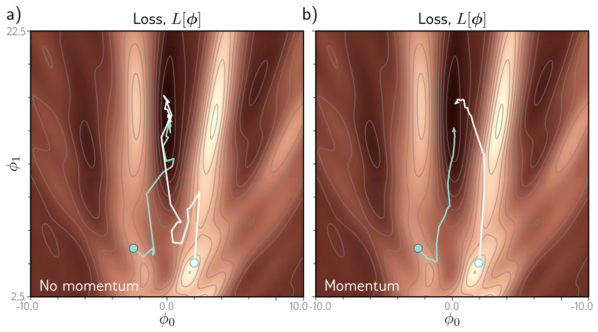{#fig-udl-6-7 width=82%}

The deterministic version of this is the clearest. Take a quadratic bowl with
condition number 100, so gradient descent faces exactly the dilemma of
@fig-learning-rate, and give gradient descent, momentum, and Nesterov momentum
(next subsection) each the *best* hyperparameters from a common grid.

```{python}
#| label: fig-momentum
#| fig-cap: "Momentum on a quadratic bowl $L = \\tfrac{1}{2}(0.1\\,\\phi_0^2 + 10\\,\\phi_1^2)$, whose curvatures differ by a factor of 100. Each method uses the hyperparameters that reach $\\|\\phi\\| < 10^{-6}$ in the fewest steps on a grid of 60 learning rates and 8 momentum coefficients. Left: the first 40 steps from the same start. Gradient descent must keep $\\alpha$ below the stability limit set by the steep $\\phi_1$ direction, so it rattles across the valley while crawling along the shallow $\\phi_0$ axis. Momentum takes a much larger $\\alpha$, overshoots across the valley at first, and the alternating gradients cancel while the aligned ones along $\\phi_0$ accumulate. Nesterov momentum heads for the minimum most directly in these first steps, but its error curve (right) has bumps that delay the final approach. Right: distance to the minimum against iteration."

A_q = np.diag([0.1, 10.0])
p_start = np.array([-0.9, -0.6])

def run_momentum(alpha, beta, nesterov=False, n=3000, tol=1e-6):
    """Equation (6.11), or (6.12) when nesterov=True, on the bowl; full-batch gradients."""
    phi, m, path = p_start.copy(), np.zeros(2), [p_start.copy()]
    for t in range(n):
        g = A_q @ (phi - alpha * m) if nesterov else A_q @ phi
        m = beta * m + (1 - beta) * g
        phi = phi - alpha * m
        path.append(phi.copy())
        if not np.all(np.isfinite(phi)) or np.abs(phi).max() > 1e6:
            return None, np.array(path)
        if np.linalg.norm(phi) < tol:
            return t + 1, np.array(path)
    return None, np.array(path)

alphas = np.geomspace(0.01, 5, 60)
betas = [0.5, 0.6, 0.7, 0.8, 0.85, 0.9, 0.95, 0.99]
best = {}
for name, nest, bset in [("gradient descent", False, [0.0]), ("momentum", False, betas),
                         ("Nesterov momentum", True, betas)]:
    trials = [(run_momentum(a, b, nest)[0] or 10 ** 9, a, b) for a in alphas for b in bset]
    best[name] = min(trials)

fig, axes = plt.subplots(1, 2, figsize=(11.5, 3.9))
gx, gy = np.meshgrid(np.linspace(-1.05, 0.15, 200), np.linspace(-0.85, 1.15, 200))
axes[0].contour(gx, gy, 0.5 * (0.1 * gx ** 2 + 10 * gy ** 2), 18, colors="gray", linewidths=0.5, alpha=0.6)
for (name, (n, a, b)), c, lw in zip(best.items(), [ACCENT, NDSU_GREEN, STEEL], [0.8, 1.3, 1.3]):
    _, path = run_momentum(a, b, name.startswith("Nesterov"))
    axes[0].plot(path[:41, 0], path[:41, 1], "-o", color=c, ms=2.5, lw=lw, label=name)
    axes[1].semilogy(np.linalg.norm(path, axis=1), color=c, lw=2, label=f"{name}: {n} steps")
axes[0].plot(0, 0, "*", color=NDSU_GOLD, ms=13, mec="k", mew=0.5, zorder=5)
axes[0].set_xlim(-1.05, 0.15); axes[0].set_ylim(-0.85, 1.15)
axes[0].set_xlabel(r"$\phi_0$  (shallow direction)"); axes[0].set_ylabel(r"$\phi_1$  (steep direction)")
axes[0].legend(fontsize=8, loc="upper right"); axes[0].set_title("first 40 steps"); axes[0].grid(False)
axes[1].set_xlim(0, 800); axes[1].set_ylim(1e-6, 2)
axes[1].set_xlabel("iteration"); axes[1].set_ylabel(r"$\|\phi - \hat\phi\|$"); axes[1].legend(fontsize=8)
plt.tight_layout(); plt.show()

print(f"{'method':<20}{'alpha':>8}{'beta':>7}{'steps to 1e-6':>15}")
for name, (n, a, b) in best.items():
    print(f"{name:<20}{a:>8.3f}{b:>7.2f}{n:>15}")
print(f"\nstability limit of plain gradient descent, 2 / lambda_max = {2 / 10.0:.3f}")
```

Two numbers carry the lesson. Momentum is roughly nine times faster than the
best gradient descent, and it gets there with a learning rate several times
*above* gradient descent's stability limit — a step that would diverge without
the momentum term. Theory predicts this: on a quadratic, the iterations
gradient descent needs grow with the condition number $\kappa$, while momentum
with well-chosen coefficients needs a number that grows only with
$\sqrt{\kappa}$. At $\kappa = 100$ that is the difference between hundreds of
steps and tens.

### Nesterov accelerated momentum

*Prince §6.3.1, pp. 86–88; figure on p. 87.*

The momentum term is a coarse prediction of where the algorithm is about to
go. **Nesterov accelerated momentum** takes that prediction seriously and
measures the gradient *there*, at the look-ahead point, instead of at the
current one:

$$
\begin{aligned}
\mathbf{m}_{t+1} &\longleftarrow \beta \cdot \mathbf{m}_t + (1 - \beta) \sum_{i \in \mathcal{B}_t} \frac{\partial \ell_i[\boldsymbol{\phi}_t - \alpha \cdot \mathbf{m}_t]}{\partial \boldsymbol{\phi}} \\
\boldsymbol{\phi}_{t+1} &\longleftarrow \boldsymbol{\phi}_t - \alpha \cdot \mathbf{m}_{t+1}.
\end{aligned}
$$ {#eq-nesterov}

@Fig-udl-6-8 shows the difference geometrically. Ordinary momentum, at point
1, measures the gradient there, steps along it to point 2, and then adds the
momentum term to arrive at point 3. Nesterov momentum applies the momentum
term first, moving from point 1 to point 4, then measures the gradient at 4 and
corrects to point 5. One way to read it: the gradient now *corrects* the path
that momentum alone would have taken, rather than being added to it blindly.

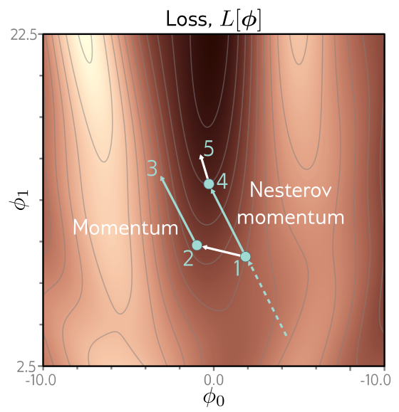{#fig-udl-6-8 width=46%}

On our quadratic, Nesterov's grid-best settings needed more steps than ordinary
momentum's — not a contradiction. For a quadratic, ordinary ("heavy-ball")
momentum with tuned coefficients is already optimal; Nesterov's advantage is a
convergence *guarantee* for general smooth convex functions where heavy-ball
momentum can fail, plus a well-documented robustness in deep learning practice
[@sutskever2013]. Both beat plain gradient descent by a wide margin.

## Adam

*Prince §6.4, pp. 88–90; figure on p. 89.*

Gradient descent with a fixed step size has an undesirable property that the
condition number made concrete: it makes large adjustments to parameters with
large gradients, where perhaps it should be cautious, and small adjustments to
parameters with small gradients, where perhaps it should explore. When the loss
is much steeper in one direction than another, no single learning rate both
makes good progress in every direction and is stable (@fig-udl-6-9**a**–**b**).

A direct fix is to **normalize** the gradient so that every coordinate moves the
same distance. Measure the gradient $\mathbf{m}_{t+1}$ and the pointwise squared
gradient $\mathbf{v}_{t+1}$,

$$
\mathbf{m}_{t+1} \longleftarrow \frac{\partial L[\boldsymbol{\phi}_t]}{\partial \boldsymbol{\phi}}, \qquad
\mathbf{v}_{t+1} \longleftarrow \left( \frac{\partial L[\boldsymbol{\phi}_t]}{\partial \boldsymbol{\phi}} \right)^2,
$$ {#eq-norm-stats}

and update with

$$
\boldsymbol{\phi}_{t+1} \longleftarrow \boldsymbol{\phi}_t - \alpha \cdot \frac{\mathbf{m}_{t+1}}{\sqrt{\mathbf{v}_{t+1}} + \epsilon},
$$ {#eq-norm-update}

where the square root and division are taken element by element, and the small
constant $\epsilon$ prevents division by zero. Dividing the gradient by its own
magnitude leaves only its **sign** in each coordinate, so every parameter moves
a fixed distance $\alpha$, downhill. That makes good progress in all directions
— but it can never settle unless it happens to land exactly on the minimum.
Instead it rattles back and forth around it (@fig-udl-6-9**c**).

**Adaptive moment estimation**, or **Adam**, keeps the normalization and adds
momentum to *both* statistics:

$$
\begin{aligned}
\mathbf{m}_{t+1} &\longleftarrow \beta \cdot \mathbf{m}_t + (1 - \beta) \frac{\partial L[\boldsymbol{\phi}_t]}{\partial \boldsymbol{\phi}} \\
\mathbf{v}_{t+1} &\longleftarrow \gamma \cdot \mathbf{v}_t + (1 - \gamma) \left( \frac{\partial L[\boldsymbol{\phi}_t]}{\partial \boldsymbol{\phi}} \right)^2,
\end{aligned}
$$ {#eq-adam-stats}

with momentum coefficients $\beta$ and $\gamma$ for the two statistics. Each is
now a weighted average over the history of the gradient and of its square. That
creates one problem at the start: the averages begin at zero, so for the first
few iterations both are unrealistically small. Adam corrects them,

$$
\tilde{\mathbf{m}}_{t+1} \longleftarrow \frac{\mathbf{m}_{t+1}}{1 - \beta^{t+1}}, \qquad
\tilde{\mathbf{v}}_{t+1} \longleftarrow \frac{\mathbf{v}_{t+1}}{1 - \gamma^{t+1}},
$$ {#eq-adam-bias}

and since $\beta, \gamma \in [0, 1)$ the powers shrink every step, the
denominators approach one, and the correction fades out. The update uses the
corrected statistics:

$$
\boldsymbol{\phi}_{t+1} \longleftarrow \boldsymbol{\phi}_t - \alpha \cdot \frac{\tilde{\mathbf{m}}_{t+1}}{\sqrt{\tilde{\mathbf{v}}_{t+1}} + \epsilon}.
$$ {#eq-adam-update}

The result converges to the minimum and still makes good progress in every
direction of parameter space (@fig-udl-6-9**d**). In practice Adam is run
stochastically, with both statistics accumulated from batches,

$$
\begin{aligned}
\mathbf{m}_{t+1} &\longleftarrow \beta \cdot \mathbf{m}_t + (1 - \beta) \sum_{i \in \mathcal{B}_t} \frac{\partial \ell_i[\boldsymbol{\phi}_t]}{\partial \boldsymbol{\phi}} \\
\mathbf{v}_{t+1} &\longleftarrow \gamma \cdot \mathbf{v}_t + (1 - \gamma) \left( \sum_{i \in \mathcal{B}_t} \frac{\partial \ell_i[\boldsymbol{\phi}_t]}{\partial \boldsymbol{\phi}} \right)^2,
\end{aligned}
$$ {#eq-adam-sgd}

so the trajectory is noisy, like every other method in this chapter.

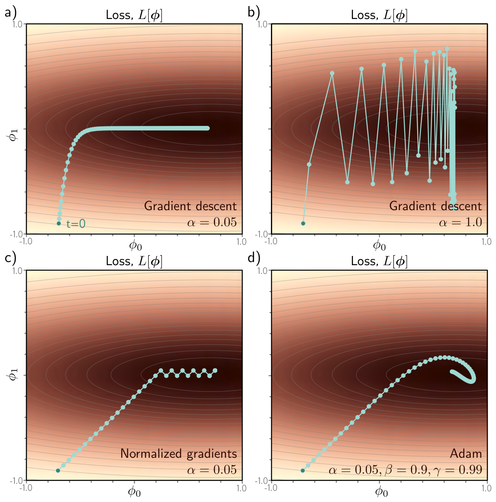{#fig-udl-6-9 width=80%}

```{python}
#| label: fig-adam
#| fig-cap: "Our version of figure 6.9, on the bowl $L = \\tfrac{1}{2}(0.5\\,\\phi_0^2 + 10\\,\\phi_1^2)$, 100 full-batch steps from the same start. a) Gradient descent with a step small enough for the steep $\\phi_1$ direction crawls along $\\phi_0$. b) A step just inside the stability limit makes good horizontal progress but bounces between the valley walls. c) Normalized gradients, @eq-norm-update, move a fixed distance along each axis, reach the minimum's neighbourhood fast, and then oscillate there forever. d) Adam, @eq-adam-stats–@eq-adam-update, keeps the per-coordinate normalization but smooths both statistics, curving in to the minimum."

A_a = np.diag([0.5, 10.0])
grad_a = lambda p: A_a @ p
p_start_a = np.array([-0.7, -0.9])

def optimize(update, n=100):
    phi, state, path = p_start_a.copy(), {}, [p_start_a.copy()]
    for t in range(n):
        phi = update(phi, grad_a(phi), t, state)
        path.append(phi.copy())
    return np.array(path)

def gd_step(alpha):
    return lambda phi, g, t, s: phi - alpha * g                              # equation (6.3)

def normalized_step(alpha, eps=1e-8):
    return lambda phi, g, t, s: phi - alpha * g / (np.sqrt(g ** 2) + eps)    # equations (6.13)-(6.14)

def adam_step(alpha, beta=0.9, gamma=0.99, eps=1e-8):
    def step(phi, g, t, s):
        s["m"] = beta * s.get("m", 0.0) + (1 - beta) * g                     # equation (6.15)
        s["v"] = gamma * s.get("v", 0.0) + (1 - gamma) * g ** 2
        m_hat = s["m"] / (1 - beta ** (t + 1))                               # equation (6.16)
        v_hat = s["v"] / (1 - gamma ** (t + 1))
        return phi - alpha * m_hat / (np.sqrt(v_hat) + eps)                  # equation (6.17)
    return step

panels = [("a) gradient descent, $\\alpha = 0.05$", gd_step(0.05)),
          ("b) gradient descent, $\\alpha = 0.195$", gd_step(0.195)),
          ("c) normalized gradients, $\\alpha = 0.05$", normalized_step(0.05)),
          ("d) Adam, $\\alpha = 0.05,\\ \\beta = 0.9,\\ \\gamma = 0.99$", adam_step(0.05))]

gx, gy = np.meshgrid(np.linspace(-1, 1, 200), np.linspace(-1, 1, 200))
L_bowl = 0.5 * (0.5 * gx ** 2 + 10 * gy ** 2)
fig, axes = plt.subplots(2, 2, figsize=(9.6, 7.6))
final = {}
for ax, (title, upd) in zip(axes.ravel(), panels):
    path = optimize(upd)
    final[title] = np.linalg.norm(path[[20, 50, 100]], axis=1)
    ax.contourf(gx, gy, np.log(L_bowl + 1e-3), 30, cmap="copper")
    ax.plot(path[:, 0], path[:, 1], "-o", color="#9EE3DF", ms=2.6, lw=0.9)
    ax.plot(*path[0], "o", color=NDSU_GREEN, ms=6)
    ax.set_title(title, fontsize=9.5); ax.set_xlim(-1, 1); ax.set_ylim(-1, 1); ax.grid(False)
    ax.set_xlabel(r"$\phi_0$"); ax.set_ylabel(r"$\phi_1$")
plt.tight_layout(); plt.show()

print(f"{'method':<52}{'|phi| after 20':>15}{'50':>11}{'100':>11}")
for title, d in final.items():
    print(f"{title.replace('$', '').replace(chr(92), ''):<52}{d[0]:>15.2e}{d[1]:>11.2e}{d[2]:>11.2e}")
```

Read the columns left to right. The normalized-gradient method gets close
fastest and then stops improving at all, frozen at a distance set by $\alpha$.
Gradient descent with the safe step is still far away after 100 steps. Adam
ends closest of the four — narrowly ahead of panel (b), which only does well
because its step was tuned to sit just inside this particular bowl's stability
limit. Adam reached that point with the same cautious $\alpha = 0.05$ that
crippled panel (a), and without knowing anything about the curvature. Notice also what @eq-adam-stats becomes with $\beta =
\gamma = 0$: the statistics are just the current gradient and its square, and
Adam *is* the normalized-gradient method of panel (c). Momentum on the squared
gradient is what turns a fixed-size rattle into convergence.

Three more claims from the section can be checked directly: what the bias
correction does, that our six lines agree with PyTorch's `Adam`, and the
promise that Adam is less sensitive to the learning rate.

```{python}
#| label: adam-checks

print("bias correction, equation (6.16), with PyTorch's defaults beta = 0.9, gamma = 0.999")
print("a constant gradient g = 1 gives these running averages before and after correction:\n")
print(f"{'t':>4}{'m_t':>9}{'m~_t':>8}{'v_t':>10}{'v~_t':>8}{'update without correction':>28}")
for t in range(1, 6):
    m_t, v_t = 1 - 0.9 ** t, 1 - 0.999 ** t                   # closed form of the recursion for g = 1
    print(f"{t:>4}{m_t:>9.4f}{1.0:>8.1f}{v_t:>10.4f}{1.0:>8.1f}{m_t / np.sqrt(v_t):>28.3f} x alpha")

torch.manual_seed(774)
Q = torch.randn(5, 5, dtype=torch.float64); Q = Q @ Q.T + 0.1 * torch.eye(5, dtype=torch.float64)
c = torch.randn(5, dtype=torch.float64)
quad = lambda w: 0.5 * w @ Q @ w - c @ w                     # a 5-parameter convex test loss
w_star = torch.linalg.solve(Q, c)

w_torch = torch.zeros(5, dtype=torch.float64, requires_grad=True)
opt = torch.optim.Adam([w_torch], lr=0.05, betas=(0.9, 0.99), eps=1e-8)
w_ours, s = np.zeros(5), {}
step = adam_step(0.05, beta=0.9, gamma=0.99)
gap = 0.0
for t in range(200):
    opt.zero_grad(); quad(w_torch).backward(); opt.step()
    w_ours = step(w_ours, (Q.numpy() @ w_ours - c.numpy()), t, s)
    gap = max(gap, np.abs(w_ours - w_torch.detach().numpy()).max())
print(f"\nour equations (6.15)-(6.17) vs torch.optim.Adam over 200 steps: max difference {gap:.1e}")

print("\nmultiply the same loss by k, keep every hyperparameter fixed, run 300 steps:")
print(f"{'k':>8}{'SGD (lr 0.15): |w - w*|':>28}{'Adam (lr 0.05): |w - w*|':>28}")
for k in (1.0, 1000.0):
    dist = []
    for make in (lambda p: torch.optim.SGD(p, lr=0.15), lambda p: torch.optim.Adam(p, lr=0.05)):
        w = torch.zeros(5, dtype=torch.float64, requires_grad=True)
        o = make([w])
        for _ in range(300):
            o.zero_grad(); (k * quad(w)).backward(); o.step()
        dist.append((w.detach() - w_star).norm().item())
    print(f"{k:>8.0f}{dist[0]:>28.2e}{dist[1]:>28.2e}")
```

The table holds a small surprise. Each statistic on its own is indeed far too
small at the start — $\mathbf{m}$ by a factor of ten, $\mathbf{v}$ by a factor of
a thousand — just as Prince says. But they enter the update as a ratio, and the
two biases do not cancel: dividing by $\sqrt{\mathbf{v}}$ over-corrects, so an
uncorrected first step would be more than three times *larger* than intended,
at exactly the moment the statistics are least trustworthy. The correction makes
the first step the full $\alpha$ in every coordinate; warm-up, from the previous
section, guards against the same early instability from the other side. The
second check confirms there is nothing hidden in PyTorch's
implementation — it is @eq-adam-update to machine precision. The third is the
practical point. Scaling the loss by 1,000 scales every gradient by 1,000, so
SGD's carefully chosen learning rate is suddenly 1,000 times too large and the
run blows up. Adam divides each gradient by its own running magnitude, so the
scale cancels and the trajectory is unchanged.

That invariance is why the section closes the way it does. Chapter 7 will show
that gradient magnitudes in a network depend on a parameter's *depth*, and Adam
compensates for that tendency, balancing the size of the updates across layers.
It is also less sensitive to the initial learning rate, because it avoids the
failure modes of @fig-udl-6-9**a**–**b** by construction, and so it rarely needs
an elaborate schedule. These are the reasons it is the default optimizer in most
of deep learning.

::: {.callout-note}
## Where Adam came from, and where it went
The chapter notes (p. 93) trace the lineage. **AdaGrad** gave each parameter its
own learning rate by dividing by the *cumulative* squared gradient, which made
the rates shrink forever and could halt learning before the minimum.
**RMSProp** and **AdaDelta** replaced the cumulative sum with a running average
— @eq-adam-stats's $\mathbf{v}$ without the bias correction. Adam combined that
with momentum on $\mathbf{m}$ [@kingma2015]. Its original convergence proof
turned out to have a hole [@reddi2018], and **AdamW** fixed the way Adam
interacts with $L_2$ regularization [@loshchilov2019], which is a Chapter 9
topic; AdamW is the variant most large models are actually trained with. Whether
well-tuned SGD with momentum generalizes better than Adam has been argued for
years [@wilson2017]; the current consensus is that the gap mostly closes when
Adam's hyperparameters are searched as carefully as SGD's.
:::

## Training Algorithm Hyperparameters

*Prince §6.5, p. 91.*

Every choice made in this chapter — the algorithm, the batch size, the learning
rate and its schedule, the momentum coefficients — is a **hyperparameter of the
training algorithm**. These are distinct from the model's parameters
$\boldsymbol{\phi}$, which training sets, and from the architectural
hyperparameters of Week 4, which fix the family of functions; yet they directly
affect the model you end up with. Choosing them is, in Prince's words, more art
than science. The usual approach is to train many models with different
settings and keep the best, which is called **hyperparameter search** and is a
topic for Chapter 8.

| Hyperparameter | Typical starting point | What goes wrong if it is off |
|:--|:--|:--|
| algorithm | Adam (or AdamW) | — |
| learning rate $\alpha$ | $10^{-3}$ for Adam; $10^{-2}$–$10^{-1}$ for SGD | too high diverges; too low stalls |
| batch size $B$ | 32–256 | too small is noisy and slow per epoch; too large wastes compute per step |
| momentum $\beta$ | 0.9 | too close to 1 overshoots and oscillates |
| Adam $\gamma$ | 0.999 | too small makes the normalization noisy |
| schedule | warm-up, then step or cosine decay | none at all leaves SGD at its noise floor |

: Common defaults for the training hyperparameters of this chapter. They are where a search starts, not a substitute for one. {tbl-colwidths="[22,38,40]"}

## Optimizers in PyTorch

*Ours; UDL notebooks 6.1–6.5.*

Every algorithm in this chapter is one line of PyTorch, and the training loop
around it never changes: zero the gradients, compute the loss on a batch,
backpropagate, step.

| Algorithm | Equation | PyTorch |
|:--|:--|:--|
| SGD | @eq-sgd | `torch.optim.SGD(params, lr)` |
| SGD with momentum | @eq-momentum | `torch.optim.SGD(params, lr, momentum=0.9)` |
| SGD with Nesterov momentum | @eq-nesterov | `torch.optim.SGD(params, lr, momentum=0.9, nesterov=True)` |
| Adam | @eq-adam-sgd | `torch.optim.Adam(params, lr, betas=(0.9, 0.999))` |
| step-decay schedule | — | `torch.optim.lr_scheduler.StepLR(opt, step_size, gamma)` |

: The optimizers of this chapter and their PyTorch constructors. Note that PyTorch's `gamma` in `StepLR` is the decay factor, not Adam's $\gamma$. {tbl-colwidths="[28,14,58]"}

One trap is worth a cell of its own. PyTorch's momentum is *not* @eq-momentum.
It accumulates $\mathbf{b}_{t+1} = \beta \mathbf{b}_t + \mathbf{g}_t$, with no
$(1 - \beta)$ on the gradient, and steps by the learning rate times
$\mathbf{b}$. The two agree exactly when PyTorch's learning rate is set to
$\alpha(1 - \beta)$.

```{python}
#| label: momentum-convention

alpha, beta = 0.1, 0.9
w_t = torch.zeros(5, dtype=torch.float64, requires_grad=True)
opt = torch.optim.SGD([w_t], lr=alpha * (1 - beta), momentum=beta)   # PyTorch's convention
w, m, gap = np.zeros(5), np.zeros(5), 0.0
for _ in range(200):
    opt.zero_grad(); quad(w_t).backward(); opt.step()
    g = Q.numpy() @ w - c.numpy()
    m = beta * m + (1 - beta) * g                                       # Prince, equation (6.11)
    w = w - alpha * m
    gap = max(gap, np.abs(w - w_t.detach().numpy()).max())
print(f"Prince alpha = {alpha}, beta = {beta}  <=>  torch.optim.SGD(lr = {alpha * (1 - beta):.3f}, momentum = {beta})")
print(f"max difference over 200 steps: {gap:.1e}")
print(f"\nso torch.optim.SGD(lr = 0.05, momentum = 0.9) is Prince's alpha = {0.05 / (1 - 0.9):.2f}:")
print("adding momentum=0.9 to an SGD run multiplies its effective step size by ten.")
```

The practical consequence: switching on `momentum=0.9` in PyTorch without
touching `lr` is not "the same step size plus smoothing" — it makes the
effective step ten times larger. Sometimes that is exactly why momentum seemed
to help.

Finally, the three optimizers on a real, if small, network: two hidden layers of
32 ReLU units fitting 256 noisy samples of a smooth curve with batches of 16.

```{python}
#| label: fig-optimizers
#| fig-cap: "Training loss (mean squared error over the full training set, measured once per epoch) for a 1–32–32–1 ReLU network on 256 noisy points, batches of 16. Each line is one of three random initializations; the dashed line is the noise variance, the floor no model can beat on average. SGD with momentum (PyTorch convention, so ten times SGD's effective step) drops fastest, then keeps bouncing — the noise floor of @fig-lr-schedule again, raised by the larger step; Adam is smoother and reaches the floor by epoch 50; plain SGD takes longest. By 150 epochs all three have arrived."

rng_n = np.random.default_rng(774)
x_n = rng_n.uniform(-1, 1, 256)
y_n = np.sin(3 * x_n) + 0.3 * x_n ** 2 + rng_n.normal(0, 0.1, 256)
X_n = torch.tensor(x_n, dtype=torch.float32)[:, None]
Y_n = torch.tensor(y_n, dtype=torch.float32)[:, None]

OPTIMIZERS = {"SGD (lr 0.05)":                  lambda p: torch.optim.SGD(p, lr=0.05),
              "SGD + momentum (lr 0.05, 0.9)":  lambda p: torch.optim.SGD(p, lr=0.05, momentum=0.9),
              "Adam (lr 0.003)":                lambda p: torch.optim.Adam(p, lr=0.003)}

def train(make_opt, seed, epochs=150, B=16):
    torch.manual_seed(seed)
    net = nn.Sequential(nn.Linear(1, 32), nn.ReLU(), nn.Linear(32, 32), nn.ReLU(), nn.Linear(32, 1))
    opt = make_opt(net.parameters())
    gen = torch.Generator().manual_seed(seed)
    history = []
    for _ in range(epochs):
        perm = torch.randperm(256, generator=gen)
        for k in range(256 // B):
            b = perm[k * B:(k + 1) * B]
            opt.zero_grad()
            loss = ((net(X_n[b]) - Y_n[b]) ** 2).mean()
            loss.backward()
            opt.step()
        with torch.no_grad():
            history.append(((net(X_n) - Y_n) ** 2).mean().item())
    return np.array(history)

plt.figure(figsize=(6.8, 3.7))
table = {}
for (name, make), c in zip(OPTIMIZERS.items(), [STEEL, NDSU_GREEN, ACCENT]):
    runs = np.array([train(make, s) for s in range(3)])
    table[name] = np.median(runs, axis=0)
    for k, h in enumerate(runs):
        plt.semilogy(np.arange(1, 151), h, color=c, lw=1.5, alpha=0.85, label=name if k == 0 else None)
plt.axhline(0.1 ** 2, color="gray", ls="--", lw=1)
plt.xlabel("epoch"); plt.ylabel("training MSE (log scale)"); plt.legend(fontsize=8)
plt.tight_layout(); plt.show()

print(f"{'optimizer':<32}{'epoch 10':>10}{'epoch 50':>10}{'epoch 150':>11}   (median of 3 runs)")
for name, h in table.items():
    print(f"{name:<32}{h[9]:>10.4f}{h[49]:>10.4f}{h[-1]:>11.4f}")
```

On a problem this small every reasonable optimizer gets there; the differences
are in how fast and how smoothly. That is the typical picture, and it is why
the choice of optimizer matters most when compute is the binding constraint.

::: {.callout-warning}
## Three rules that follow from this chapter
1. **Never judge an optimizer at a learning rate tuned for a different one.** Adam's $10^{-3}$ and SGD's $10^{-1}$ are not comparable numbers, and @fig-sgd-vs-gd shows how easily a step-size difference masquerades as an algorithmic one.
2. **Know which momentum convention you are using.** PyTorch's `momentum=0.9` multiplies the effective step by ten relative to @eq-momentum.
3. **A small gradient is not a certificate.** Plateaus and saddle points also have small gradients (@fig-saddle). Stop on a validation criterion, which is Chapter 8's subject, not on the gradient norm alone.
:::

## Summary

*Prince §6.6, p. 91.*

Training was framed as finding the parameters $\boldsymbol{\phi}$ at the
minimum of a loss $L[\boldsymbol{\phi}]$. Gradient descent measures the
gradient of the loss at the current parameters — how the loss changes under a
small change to each — and moves in the direction that decreases the loss
fastest, repeating until the gradient vanishes. Its step is set either by a
fixed learning rate, limited by the steepest curvature of the loss, or by a line
search.

For nonlinear models the loss is non-convex. It can have local minima, where
gradient descent is trapped, and saddle points, where it can appear to have
converged when it has not. Stochastic gradient descent computes each gradient
from a random batch of the data, which makes every step cheap and adds noise
that, in principle, helps the parameters leave bad regions; it is usually run
with a learning rate schedule that explores first and fine-tunes later.
Momentum averages the gradient over time, cancelling oscillation across valleys
and accelerating progress along them; Nesterov momentum measures the gradient
at the point momentum is about to reach. Adam normalizes each parameter's step
by a running estimate of its gradient magnitude and smooths both statistics,
which makes good progress in every direction, is insensitive to the scale of
the gradients, and is the default optimizer of modern deep learning.

The ideas in this chapter apply to optimizing any model. Nothing in them is
specific to neural networks.

**Next:** every algorithm here assumed the gradient $\partial L / \partial
\boldsymbol{\phi}$ was available. For a deep network it is not obvious how to
get it efficiently, and Chapter 7 derives the **backpropagation** algorithm that
computes it. It also addresses the other loose end of this week's loop — the
initial parameters — and shows that without care, gradients in deep networks
become vanishingly small or explosively large before optimization even begins.

---

## Exercises

::: {.callout-note appearance="minimal"}
Problem numbers refer to Prince, Chapter 6 (pp. 94–95). Starred UDL problems
have published answers on the [UDL website](https://udlbook.github.io/udlbook/).
The computational problems extend code that is already written for you — start
from the [Colab notebook](https://colab.research.google.com/github/harunpirim/IMSE774-NeuralNetworks/blob/main/notebooks/week06-fitting-models.ipynb).
:::

**1. (UDL 6.1 and 6.2)** Show that the derivatives of the least squares loss
@eq-ls-loss are given by @eq-grad-terms. Then find an algebraic expression for
the $2 \times 2$ Hessian of the same loss and prove the loss is convex by showing
that both eigenvalues are always positive. (Hint: it is enough to show that the
trace and the determinant are both positive; Week 2 has the facts you need.)
Check your expression against `H_lin` in @fig-learning-rate.

**2. (UDL 6.3 and 6.5\*)** Compute the derivatives of the Gabor loss
@eq-gabor-loss with respect to $\phi_0$ and $\phi_1$, and verify them against
`grad_L` in the notebook at three points of your choice. Then compute the
derivatives of the least squares loss with respect to all ten parameters of the
shallow network of Week 3,
$$
\mathrm{f}[x, \boldsymbol{\phi}] = \phi_0 + \phi_1 a[\theta_{10} + \theta_{11}x] + \phi_2 a[\theta_{20} + \theta_{21}x] + \phi_3 a[\theta_{30} + \theta_{31}x],
$$
thinking carefully about the derivative of the ReLU $a[\bullet]$. What is it at
exactly zero, and does it matter in practice?

**3. (UDL 6.4\*)** The logistic regression model $Pr(y = 1 \mid x) =
\mathrm{sig}[\phi_0 + \phi_1 x]$ assigns a scalar input to one of two classes.
(i) Plot $Pr(y = 1 \mid x)$ for several $(\phi_0, \phi_1)$ and explain what each
parameter does. (ii) Using Week 5, what is the right loss? (iii) Compute its
derivatives. (iv) Generate ten points from $\mathcal{N}(-1, 1)$ labelled
$y = 0$ and ten from $\mathcal{N}(1, 1)$ labelled $y = 1$, and plot the loss as a
heatmap over $(\phi_0, \phi_1)$. (v) Is it convex? How would you prove it?

**4. (UDL 6.6)** Which of the functions in @fig-udl-6-11 is convex? Justify
your answer. Classify each of the points 1–7 as a local minimum, the global
minimum, or neither.

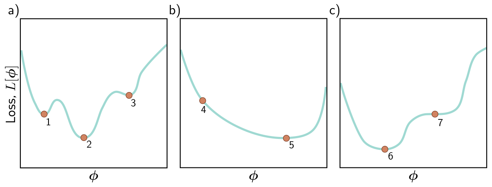{#fig-udl-6-11 width=88%}

**5. (UDL 6.7\* and 6.8\*)** The gradient descent path in @fig-gd-linear, like
path 1 in @fig-udl-6-5**a**, turns through a large angle at every step, and with
an exact line search the turn is a right angle. Explain why, and propose a fix.
Then answer: can non-stochastic gradient descent with a *fixed* learning rate
ever escape a local minimum? Use @fig-learning-rate to sharpen your answer — is
there a sense in which a step size above the stability limit "escapes"?

**6. (UDL 6.9 and 6.11)** We run SGD for 1,000 iterations on a dataset of 100
examples with a batch size of 20. For how many epochs did we train? Separately:
what are the dimensions of the Hessian of a model with one million parameters,
how many gigabytes would it take to store in 32-bit floating point, and what
does that imply for Newton's method in deep learning?

**7. (UDL 6.10)** Show that the momentum $\mathbf{m}_t$ of @eq-momentum is an
infinite weighted sum of the gradients at previous iterations, and derive the
weights. Show they sum to one in the limit. Then use your result to explain the
`momentum-convention` cell: why does PyTorch's form, without the $(1 - \beta)$,
amplify the steady-state step by a factor of $1/(1 - \beta)$?

**8.** A maintenance engineer fits a damped-vibration model to a hammer-tap
test on a machine-tool spindle, $y(t) = A\, e^{-\zeta \omega t} \sin[\omega t]$,
by least squares on 400 accelerometer samples, using gradient descent from
$\omega = 100$ rad/s. The true natural frequency is near 900 rad/s. (a) By
analogy with the Gabor model, sketch what the loss looks like as a function of
$\omega$ alone and explain why the fit converges to a poor answer. (b) Would SGD
help? Use @fig-sgd-vs-gd in your answer. (c) Propose a *physics-based*
initialization that makes the optimization easy, and explain why a good
starting point is worth more here than a better optimizer.

**9. Computational.** Starting from @fig-multistart: (a) replace the fixed
learning rate with the golden-section `line_search` of @fig-gd-linear and
recompute the outcome map — does the fraction reaching the global minimum
change, and why? (b) In @fig-sgd-vs-gd, vary the batch size over 1, 2, 4, 7, and
14, keeping the matched full-batch comparison each time. At which batch size,
if any, does the noise measurably improve the global-minimum count? (c) Report
the plateau fraction for each run and connect it to property 5 of SGD.

**10. Computational.** Using `adam_step` from @fig-adam: (a) remove the bias
correction and plot the first 20 steps against the corrected version — which
coordinates are affected, and for how long? (b) Run with $\beta = \gamma = 0$
and confirm it reproduces panel (c). Prince's notes (p. 94) remark that SGD is a
special case of Adam when $\beta = \gamma = 0$; reconcile that remark with what
you see. (c) Sweep $\alpha$ over $10^{-3}$ to $1$ for gradient descent and for
Adam on this bowl, and plot the distance after 100 steps against $\alpha$ for
both. Which method has the wider range of good learning rates?

---

## Textbook Reference Map {#sec-reference-map}

Every part of this page, mapped to Prince, *Understanding Deep Learning*
(MIT Press, 2024) [@prince2024]. Page numbers are those of the printed book.

| This page | Prince section | Pages | Figures used |
|:--|:--|:--:|:--|
| What Fitting a Model Means | Ch. 6 opening | 77 | — |
| Gradient Descent | §6.1 | 77–78 | — |
| — Choosing the step: learning rate or line search | §6.1; notes | 78, 92–93 | 6.10 (p. 93) |
| — Linear regression example | §6.1.1 | 78–80 | 6.1 (p. 79) |
| Non-Convex Loss Surfaces | §6.1.2; notes | 80–81, 92 | 6.2 (p. 81), 6.3 (p. 81) |
| — Local minima | §6.1.3 | 81–83 | 6.4 (p. 82), 6.5 (p. 83) |
| — Saddle points | §6.1.3 | 83 | — |
| Stochastic Gradient Descent | §6.2 | 83–85 | 6.5 (p. 83) |
| — Batches and epochs | §6.2.1 | 85 | 6.6 (p. 84) |
| — Properties of stochastic gradient descent | §6.2.2 | 85–86 | — |
| — Learning rate schedules | §6.2.2; notes | 86, 93 | — |
| Momentum | §6.3 | 86 | 6.7 (p. 87) |
| — Nesterov accelerated momentum | §6.3.1 | 86–88 | 6.8 (p. 87) |
| Adam | §6.4; notes | 88–90, 93–94 | 6.9 (p. 89) |
| Training Algorithm Hyperparameters | §6.5 | 91 | — |
| Optimizers in PyTorch | ours; notebooks 6.1–6.5 | — | — |
| Summary | §6.6 | 91 | — |
| Exercises 1–7 | Problems 6.1–6.11 | 94–95 | 6.11 (p. 95) |

: {tbl-colwidths="[36,24,14,26]"}

Equations on this page correspond to Prince as follows: @eq-argmin is his
(6.1), @eq-gradient is (6.2), @eq-gd-update is (6.3), @eq-linear is (6.4),
@eq-ls-loss is (6.5), @eq-grad-sum is (6.6), @eq-grad-terms is (6.7),
@eq-gabor is (6.8), @eq-gabor-loss is (6.9), @eq-sgd is (6.10),
@eq-momentum is (6.11), @eq-nesterov is (6.12), @eq-norm-stats is (6.13),
@eq-norm-update is (6.14), @eq-adam-stats is (6.15), @eq-adam-bias is (6.16),
@eq-adam-update is (6.17), @eq-adam-sgd is (6.18), and @eq-hessian is (6.19).
The logistic regression model of exercise 3 is his (6.21)–(6.22), and the
shallow network of exercise 2 is (6.23).

::: {.callout-note appearance="simple"}
## Figure credits
Figures 6.1–6.11 are reproduced unaltered from Prince, *Understanding Deep
Learning* (MIT Press, 2024), which is distributed under a Creative Commons
CC-BY-NC-ND license, and are used here for non-commercial classroom instruction.
All other figures on this page are generated by the code in this week's
notebook.
:::

---

## Further Reading

- Prince, *Understanding Deep Learning*, Chapter 6 [@prince2024] — the assigned reading. The chapter notes (pp. 91–94) cover line search, Newton's method, the batch-size-to-learning-rate ratio, and the history of adaptive methods in more depth than this page.
- **[▶ UDL notebooks 6.1–6.5](https://github.com/udlbook/udlbook/tree/main/Notebooks/Chap06)** — Prince's own Colab notebooks for this chapter; links to each are at the top of this page.
- **[▶ This week's notebook](https://colab.research.google.com/github/harunpirim/IMSE774-NeuralNetworks/blob/main/notebooks/week06-fitting-models.ipynb)** — every cell above, in one Colab file.
- Robbins & Monro (1951) [@robbins1951] — the origin of stochastic approximation, and of the conditions under which a decaying step size makes SGD converge.
- Polyak (1964) [@polyak1964] and Sutskever et al. (2013) [@sutskever2013] — heavy-ball momentum, and the paper that made momentum and Nesterov's method standard in deep learning.
- Goh (2017) [@goh2017] — "Why momentum really works", an interactive essay that makes @fig-momentum's $\sqrt{\kappa}$ argument visual.
- Kingma & Ba (2015) [@kingma2015] — the Adam paper; short and readable.
- Loshchilov & Hutter (2019) [@loshchilov2019] — AdamW, the decoupled weight decay that most large models are trained with.
- Ruder (2016) [@ruder2016] — a compact survey of every optimizer variant you will meet in code.
- Bottou, Curtis & Nocedal (2018) [@bottou2018] — the rigorous treatment of SGD for large-scale learning, for those who want the theory behind §6.2.
