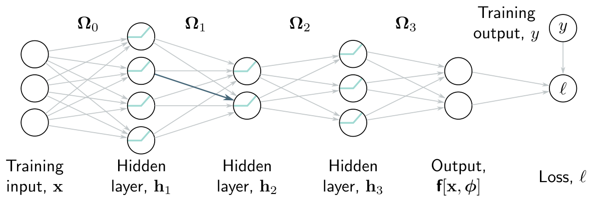
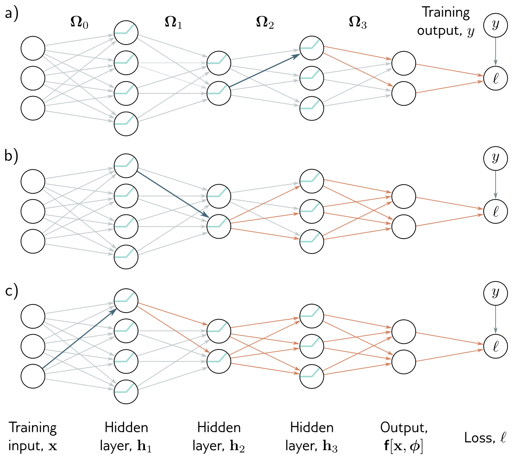
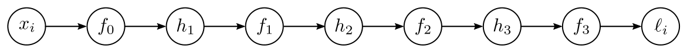
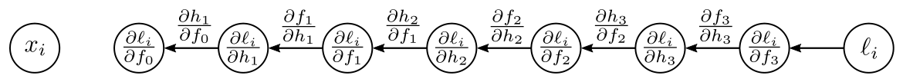
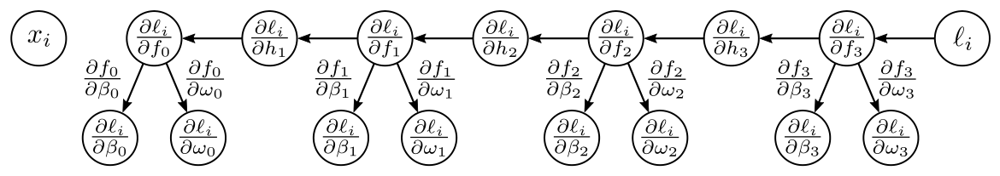
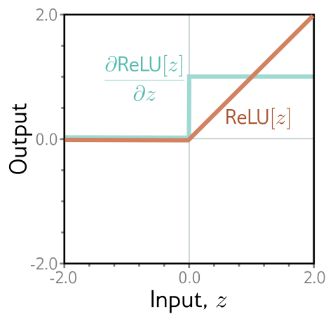
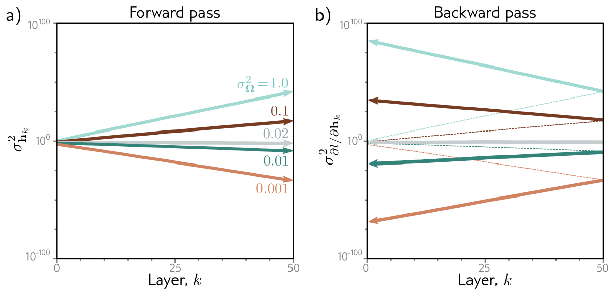
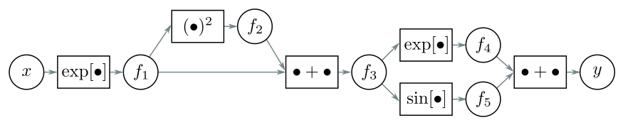

::: {.lecture-meta}
**Reading** Prince, *Understanding Deep Learning*, Chapter 7 (pp. 96–117) &nbsp;·&nbsp;
**UDL notebooks** 7.1–7.3 &nbsp;·&nbsp;
**Due** Project proposal, Thursday, October 8
:::

::: {.callout-note appearance="simple"}
## How to read the references in these notes
Every section below opens with the section number and page range it covers in
Prince, *Understanding Deep Learning* (MIT Press, 2024). Page numbers are those
of the printed book. Figures taken from the textbook are captioned with their
original figure number and page; figures generated by the code behind this page
are ours. A complete cross-reference table appears in @sec-reference-map.
:::

## Learning Objectives

By the end of this week you should be able to:

1. Name the two problems this chapter solves and explain why each is specific to neural networks rather than to optimization in general.
2. State the two **observations** behind backpropagation — weight gradients scale with the source activation, and downstream derivatives can be computed once and reused — and connect each to the **forward** and **backward pass**.
3. Carry out the forward pass and both backward passes by hand for the scalar toy model of §7.3, and check the result against finite differences.
4. Write the backpropagation algorithm for a deep ReLU network in matrix form, give the shape of every term, and implement it with nothing but matrix products and an indicator mask.
5. Explain why backpropagation is cheap in arithmetic but expensive in memory, and estimate both for a given network.
6. Describe what **algorithmic differentiation** frameworks do, how a batch becomes a tensor, and why any acyclic computational graph can be differentiated the same way.
7. Show from the variance recursion why poorly scaled weights make activations and gradients **vanish** or **explode**, and derive **He initialization**, its backward-pass counterpart, and the compromise between them.
8. Recognize the symptoms of a bad initialization in a network that will not train, and know which initialization PyTorch uses unless you tell it otherwise.

::: {.callout-tip}
## The code lives in a notebook
This page shows the figures and results; the Python behind them is not printed
here. All of it — every cell, in the order the note uses it — is in a notebook
you can open in the browser with nothing to install:

- **[▶ Open the Week 7 notebook in Google Colab](https://colab.research.google.com/github/harunpirim/IMSE774-NeuralNetworks/blob/main/notebooks/week07-gradients-initialization.ipynb)** — all of this page's code, in order.
- **[▶ UDL notebook 7.1 — Backpropagation in toy model](https://colab.research.google.com/github/udlbook/udlbook/blob/main/Notebooks/Chap07/7_1_Backpropagation_in_Toy_Model.ipynb)** — the forward and backward passes of §7.3, one line at a time.
- **[▶ UDL notebook 7.2 — Backpropagation](https://colab.research.google.com/github/udlbook/udlbook/blob/main/Notebooks/Chap07/7_2_Backpropagation.ipynb)** — @eq-bp-forward–@eq-bp-first for a deep ReLU network.
- **[▶ UDL notebook 7.3 — Initialization](https://colab.research.google.com/github/udlbook/udlbook/blob/main/Notebooks/Chap07/7_3_Initialization.ipynb)** — the experiment of @fig-udl-7-7.

Colab gives you a Python environment with NumPy, matplotlib, and PyTorch
already installed. In Colab, run a cell with **Shift+Enter**. If you prefer to
work locally, `pip install -r requirements.txt` from the [course
repository](https://github.com/harunpirim/IMSE774-NeuralNetworks) gives you the
same environment.
:::

```{python}
#| label: setup
#| code-fold: true
#| code-summary: "Plotting setup (click to expand)"

import timeit
import numpy as np
import matplotlib.pyplot as plt
import torch
import torch.nn as nn

torch.manual_seed(774)
np.random.seed(774)

plt.rcParams.update({
    "figure.figsize": (7, 4),
    "figure.dpi": 130,
    "axes.spines.top": False,
    "axes.spines.right": False,
    "axes.grid": True,
    "grid.alpha": 0.25,
    "font.size": 10,
    "axes.titlesize": 11,
    "axes.labelsize": 10,
    "legend.frameon": False,
})

NDSU_GREEN = "#005643"
NDSU_GOLD  = "#FFC72C"
ACCENT     = "#C1121F"
STEEL      = "#1864AB"
```

---

## Two Problems Specific to Neural Networks

*Prince, Chapter 7 opening, p. 96.*

Week 6 treated optimization in general. Choose initial parameters at random,
then make a series of small changes that decrease the loss on average, each
change based on the gradient of the loss with respect to the parameters at the
current position. Nothing in that loop cared whether the model was a line, a
Gabor function, or a network.

Two things about it become hard — and specific — once the model *is* a deep
network, and they are the two halves of this chapter.

1. **Computing the gradient efficiently.** The largest models at the time Prince wrote have on the order of $10^{12}$ parameters, and the gradient must be computed for *every* parameter at *every* iteration. A method whose cost grows with the number of parameters times the cost of evaluating the network is hopeless at that scale. The answer is **backpropagation**.
2. **Choosing the initial parameters.** Done carelessly, the loss and its gradients at the start of training are astronomically large or vanishingly small, and in either case training stalls before it starts. The answer is **He initialization** and its relatives.

## Problem Definitions

*Prince §7.1, pp. 96–97; figure on p. 98.*

Take a network $\mathbf{f}[\mathbf{x}, \boldsymbol{\phi}]$ with multivariate
input $\mathbf{x}$, parameters $\boldsymbol{\phi}$, and three hidden layers
$\mathbf{h}_1, \mathbf{h}_2, \mathbf{h}_3$, written exactly as in Week 4:

$$
\begin{aligned}
\mathbf{h}_1 &= \mathbf{a}[\boldsymbol{\beta}_0 + \boldsymbol{\Omega}_0 \mathbf{x}] \\
\mathbf{h}_2 &= \mathbf{a}[\boldsymbol{\beta}_1 + \boldsymbol{\Omega}_1 \mathbf{h}_1] \\
\mathbf{h}_3 &= \mathbf{a}[\boldsymbol{\beta}_2 + \boldsymbol{\Omega}_2 \mathbf{h}_2] \\
\mathbf{f}[\mathbf{x}, \boldsymbol{\phi}] &= \boldsymbol{\beta}_3 + \boldsymbol{\Omega}_3 \mathbf{h}_3,
\end{aligned}
$$ {#eq-net}

where $\mathbf{a}[\bullet]$ applies the activation function separately to every
element of its input. The parameters $\boldsymbol{\phi} = \{\boldsymbol{\beta}_0,
\boldsymbol{\Omega}_0, \boldsymbol{\beta}_1, \boldsymbol{\Omega}_1,
\boldsymbol{\beta}_2, \boldsymbol{\Omega}_2, \boldsymbol{\beta}_3,
\boldsymbol{\Omega}_3\}$ are the bias vectors $\boldsymbol{\beta}_k$ and weight
matrices $\boldsymbol{\Omega}_k$ between successive layers (@fig-udl-7-1).

{#fig-udl-7-1 width=84%}

From Week 5, each training pair contributes a loss term $\ell_i$, the negative
log-likelihood of the label $\mathbf{y}_i$ given the prediction
$\mathbf{f}[\mathbf{x}_i, \boldsymbol{\phi}]$ — for example the least squares
term $\ell_i = (\mathbf{f}[\mathbf{x}_i, \boldsymbol{\phi}] - y_i)^2$ — and the
total loss is the sum

$$
L[\boldsymbol{\phi}] = \sum_{i=1}^{I} \ell_i.
$$ {#eq-total-loss}

From Week 6, the workhorse optimizer is SGD,

$$
\boldsymbol{\phi}_{t+1} \longleftarrow \boldsymbol{\phi}_t - \alpha \sum_{i \in \mathcal{B}_t} \frac{\partial \ell_i[\boldsymbol{\phi}_t]}{\partial \boldsymbol{\phi}},
$$ {#eq-sgd}

with learning rate $\alpha$ and batch $\mathcal{B}_t$. Everything else in Week 6
— momentum, Adam — consumes the same per-example gradients. So the
computational task is precisely this: for every example $i$ in the batch and
every layer $k \in \{0, 1, \ldots, K\}$, compute

$$
\frac{\partial \ell_i}{\partial \boldsymbol{\beta}_k} \qquad \text{and} \qquad \frac{\partial \ell_i}{\partial \boldsymbol{\Omega}_k}.
$$ {#eq-targets}

The first part of the chapter computes these with the backpropagation
algorithm; the second part chooses the $\boldsymbol{\Omega}_k$ and
$\boldsymbol{\beta}_k$ that training starts from, so that it is stable.

## Computing Derivatives

*Prince §7.2, pp. 97–100; figures on pp. 98–99.*

The derivatives tell us how the loss changes when we nudge each parameter. The
algebra that computes them is somewhat involved, so Prince starts with two
observations that carry most of the intuition.

**Observation 1: a weight's effect is scaled by its source.** Each weight — each
element of $\boldsymbol{\Omega}_k$ — multiplies the activation at a *source*
hidden unit and adds the result to a *destination* unit in the next layer. Any
small change to the weight is therefore amplified or attenuated by that source
activation. In @fig-udl-7-1, the blue weight is applied to the second hidden
unit of layer 1; if that unit's activation doubles, the effect of a small change
to the blue weight doubles too. So to compute weight derivatives we must know
the activations, which means running the network on every example in the batch
and **storing** every hidden unit's value. This is the **forward pass**, and the
stored activations are exactly what the gradient computation will consume.

**Observation 2: changes ripple forward, so derivatives can be reused
backward.** A small change in a weight or bias alters its destination unit,
which alters every unit in the next layer, and the one after that, until the
output and finally the loss change. So to know how a parameter affects the loss,
we need to know how changes to every *subsequent* layer modify their successor.
And those same quantities are needed again for every parameter in the same layer
and in every earlier layer — so they can be computed once and reused
(@fig-udl-7-2):

- For a weight or bias feeding into $\mathbf{h}_3$: we need (i) how a change in $\mathbf{h}_3$ changes the output $\mathbf{f}$, and (ii) how a change in $\mathbf{f}$ changes the loss $\ell$ (panel **a**).
- For a weight or bias feeding into $\mathbf{h}_2$: (i) how $\mathbf{h}_2$ affects $\mathbf{h}_3$, then the same two terms as before (panel **b**).
- For a weight or bias feeding into $\mathbf{h}_1$: (i) how $\mathbf{h}_1$ affects $\mathbf{h}_2$, (ii) how $\mathbf{h}_2$ affects $\mathbf{h}_3$, (iii) how $\mathbf{h}_3$ changes the output, and (iv) how the output changes the loss (panel **c**).

{#fig-udl-7-2 width=80%}

Read the list from the bottom up and every line is the previous line with one
extra factor. Working *backward* from the loss, almost every term we need has
already been computed at the previous step. Proceeding this way is the
**backward pass**, and the reuse is the entire source of backpropagation's
efficiency.

The ideas are easy; the derivation is not, because the biases are vectors and
the weights are matrices, and that requires the matrix calculus of Week 2. So,
as Prince does, we first work through a model in which every quantity is a
scalar.

## A Toy Example

*Prince §7.3, pp. 100–103; figures on pp. 101–103.*

Consider a model with eight scalar parameters $\boldsymbol{\phi} = \{\beta_0,
\omega_0, \beta_1, \omega_1, \beta_2, \omega_2, \beta_3, \omega_3\}$ built by
composing $\sin[\bullet]$, $\exp[\bullet]$, and $\cos[\bullet]$:

$$
\mathrm{f}[x, \boldsymbol{\phi}] = \beta_3 + \omega_3 \cdot \cos\Big[\beta_2 + \omega_2 \cdot \exp\big[\beta_1 + \omega_1 \cdot \sin[\beta_0 + \omega_0 \cdot x]\big]\Big],
$$ {#eq-toy}

with a least squares loss $L[\boldsymbol{\phi}] = \sum_i \ell_i$ whose terms are

$$
\ell_i = \big(\mathrm{f}[x_i, \boldsymbol{\phi}] - y_i\big)^2.
$$ {#eq-toy-loss}

Think of it as a network with one input, one output, one hidden unit per layer,
and a different activation function at each layer. We want all eight
derivatives $\partial \ell_i / \partial \beta_k$ and $\partial \ell_i / \partial
\omega_k$.

We *could* differentiate by hand. Here is one of the eight:

$$
\begin{aligned}
\frac{\partial \ell_i}{\partial \omega_0} = \; & -2\Big(\beta_3 + \omega_3 \cos\big[\beta_2 + \omega_2 \exp[\beta_1 + \omega_1 \sin[\beta_0 + \omega_0 x_i]]\big] - y_i\Big) \cdot \omega_1 \omega_2 \omega_3 \cdot x_i \cos[\beta_0 + \omega_0 x_i] \\
& \cdot \exp\big[\beta_1 + \omega_1 \sin[\beta_0 + \omega_0 x_i]\big] \cdot \sin\Big[\beta_2 + \omega_2 \exp\big[\beta_1 + \omega_1 \sin[\beta_0 + \omega_0 x_i]\big]\Big].
\end{aligned}
$$ {#eq-toy-direct}

Expressions like this are awkward to derive and easy to code wrongly, and they
waste work: the same exponential appears three times, and most of
@eq-toy-direct reappears in the derivatives for the other seven parameters.
Backpropagation computes all eight at once, in two stages.

**Forward pass.** Treat the loss as a chain of elementary calculations, and
compute and **store** every intermediate value (@fig-udl-7-3):

$$
\begin{aligned}
f_0 &= \beta_0 + \omega_0 \cdot x_i & h_1 &= \sin[f_0] \\
f_1 &= \beta_1 + \omega_1 \cdot h_1 & h_2 &= \exp[f_1] \\
f_2 &= \beta_2 + \omega_2 \cdot h_2 & h_3 &= \cos[f_2] \\
f_3 &= \beta_3 + \omega_3 \cdot h_3 & \ell_i &= (f_3 - y_i)^2.
\end{aligned}
$$ {#eq-toy-forward}

{#fig-udl-7-3 width=88%}

**Backward pass #1.** Compute the derivatives of $\ell_i$ with respect to the
*intermediate* quantities, in reverse order (@fig-udl-7-4). The first is direct,

$$
\frac{\partial \ell_i}{\partial f_3} = 2(f_3 - y_i),
$$ {#eq-dl-df3}

and the next uses the chain rule,

$$
\frac{\partial \ell_i}{\partial h_3} = \frac{\partial f_3}{\partial h_3} \frac{\partial \ell_i}{\partial f_3}.
$$ {#eq-dl-dh3}

The left side asks how $\ell_i$ changes when $h_3$ changes. The right side
decomposes that into how $f_3$ changes when $h_3$ changes — which is just
$\omega_3$ — times how $\ell_i$ changes when $f_3$ changes, which we computed one
line earlier. Continuing backward,

$$
\begin{aligned}
\frac{\partial \ell_i}{\partial f_2} &= \frac{\partial h_3}{\partial f_2} \left( \frac{\partial f_3}{\partial h_3} \frac{\partial \ell_i}{\partial f_3} \right) &
\frac{\partial \ell_i}{\partial h_2} &= \frac{\partial f_2}{\partial h_2} \left( \frac{\partial h_3}{\partial f_2} \frac{\partial f_3}{\partial h_3} \frac{\partial \ell_i}{\partial f_3} \right) \\
\frac{\partial \ell_i}{\partial f_1} &= \frac{\partial h_2}{\partial f_1} \left( \frac{\partial f_2}{\partial h_2} \frac{\partial h_3}{\partial f_2} \frac{\partial f_3}{\partial h_3} \frac{\partial \ell_i}{\partial f_3} \right) &
\frac{\partial \ell_i}{\partial h_1} &= \frac{\partial f_1}{\partial h_1} \left( \frac{\partial h_2}{\partial f_1} \frac{\partial f_2}{\partial h_2} \frac{\partial h_3}{\partial f_2} \frac{\partial f_3}{\partial h_3} \frac{\partial \ell_i}{\partial f_3} \right) \\
\frac{\partial \ell_i}{\partial f_0} &= \frac{\partial h_1}{\partial f_0} \left( \frac{\partial f_1}{\partial h_1} \frac{\partial h_2}{\partial f_1} \frac{\partial f_2}{\partial h_2} \frac{\partial h_3}{\partial f_2} \frac{\partial f_3}{\partial h_3} \frac{\partial \ell_i}{\partial f_3} \right). & &
\end{aligned}
$$ {#eq-toy-backward1}

In every line the bracket was computed in the previous line, and the remaining
factor is the derivative of one elementary function — a $\cos$, an $\exp$, a
$\sin$, or a weight. This is Observation 2 made literal.

{#fig-udl-7-4 width=88%}

**Backward pass #2.** Finally, the parameters. Each $\beta_k$ and $\omega_k$
enters only through $f_k$, so one more application of the chain rule finishes
the job (@fig-udl-7-5):

$$
\frac{\partial \ell_i}{\partial \beta_k} = \frac{\partial f_k}{\partial \beta_k} \frac{\partial \ell_i}{\partial f_k}, \qquad
\frac{\partial \ell_i}{\partial \omega_k} = \frac{\partial f_k}{\partial \omega_k} \frac{\partial \ell_i}{\partial f_k}.
$$ {#eq-toy-backward2}

The second factor in each case came from @eq-toy-backward1. For $k > 0$, $f_k =
\beta_k + \omega_k \cdot h_k$, so

$$
\frac{\partial f_k}{\partial \beta_k} = 1 \qquad \text{and} \qquad \frac{\partial f_k}{\partial \omega_k} = h_k,
$$ {#eq-toy-local}

which is Observation 1: the derivative with respect to a weight is proportional
to its source variable $h_k$, stored during the forward pass. For the first
layer, $f_0 = \beta_0 + \omega_0 \cdot x_i$, so

$$
\frac{\partial f_0}{\partial \beta_0} = 1 \qquad \text{and} \qquad \frac{\partial f_0}{\partial \omega_0} = x_i.
$$ {#eq-toy-first}

{#fig-udl-7-5 width=88%}

The whole procedure is a dozen lines of code. Below it is checked three ways:
against the brute-force @eq-toy-direct, against finite differences, and against
PyTorch.

```{python}
#| label: toy-backprop

beta  = np.array([0.5, -0.3, 0.2, 1.0])                 # beta_0 ... beta_3
omega = np.array([1.1,  0.7, -0.6, 0.9])                # omega_0 ... omega_3
x_i, y_i = 2.3, 1.4

def forward(beta, omega, x, y):                         # equation (7.8): compute and store
    f0 = beta[0] + omega[0] * x;  h1 = np.sin(f0)
    f1 = beta[1] + omega[1] * h1; h2 = np.exp(f1)
    f2 = beta[2] + omega[2] * h2; h3 = np.cos(f2)
    f3 = beta[3] + omega[3] * h3
    return dict(f0=f0, h1=h1, f1=f1, h2=h2, f2=f2, h3=h3, f3=f3, loss=(f3 - y) ** 2)

s = forward(beta, omega, x_i, y_i)

# Backward pass #1, equations (7.10)-(7.12): each line reuses the one before.
dl_df3 = 2 * (s["f3"] - y_i)
dl_dh3 = omega[3] * dl_df3                              # df3/dh3 = omega_3
dl_df2 = -np.sin(s["f2"]) * dl_dh3                      # dh3/df2 = -sin[f2]
dl_dh2 = omega[2] * dl_df2
dl_df1 = np.exp(s["f1"]) * dl_dh2                       # dh2/df1 = exp[f1]  (already stored as h2)
dl_dh1 = omega[1] * dl_df1
dl_df0 = np.cos(s["f0"]) * dl_dh1                       # dh1/df0 = cos[f0]

# Backward pass #2, equations (7.13)-(7.15).
dl_dbeta  = np.array([dl_df0, dl_df1, dl_df2, dl_df3])
dl_domega = np.array([dl_df0 * x_i, dl_df1 * s["h1"], dl_df2 * s["h2"], dl_df3 * s["h3"]])

# Check 1: the brute-force expression for d l / d omega_0, equation (7.7).
inner = beta[1] + omega[1] * np.sin(beta[0] + omega[0] * x_i)
mid = beta[2] + omega[2] * np.exp(inner)
direct = (-2 * (beta[3] + omega[3] * np.cos(mid) - y_i) * omega[1] * omega[2] * omega[3]
          * x_i * np.cos(beta[0] + omega[0] * x_i) * np.exp(inner) * np.sin(mid))

# Check 2: central finite differences, two extra forward passes per parameter.
eps = 1e-6
def fd(which, k):
    e = np.zeros(4); e[k] = eps
    if which == "beta":
        return (forward(beta + e, omega, x_i, y_i)["loss"] - forward(beta - e, omega, x_i, y_i)["loss"]) / (2 * eps)
    return (forward(beta, omega + e, x_i, y_i)["loss"] - forward(beta, omega - e, x_i, y_i)["loss"]) / (2 * eps)

# Check 3: PyTorch autograd on the same composition.
tb = torch.tensor(beta, requires_grad=True); tw = torch.tensor(omega, requires_grad=True)
t_f = tb[3] + tw[3] * torch.cos(tb[2] + tw[2] * torch.exp(tb[1] + tw[1] * torch.sin(tb[0] + tw[0] * x_i)))
((t_f - y_i) ** 2).backward()

print(f"{'parameter':<10}{'backprop':>13}{'finite diff.':>14}{'autograd':>13}")
for k in range(4):
    print(f"{'beta_' + str(k):<10}{dl_dbeta[k]:>13.8f}{fd('beta', k):>14.8f}{tb.grad[k].item():>13.8f}")
    print(f"{'omega_' + str(k):<10}{dl_domega[k]:>13.8f}{fd('omega', k):>14.8f}{tw.grad[k].item():>13.8f}")
print(f"\nd l / d omega_0 from the brute-force equation (7.7): {direct:.8f}")
```

All three agree to the precision printed. Notice also the bookkeeping: the
forward pass evaluated each of $\sin$, $\exp$, and $\cos$ once, and the backward
pass needed each of their derivatives once — where @eq-toy-direct alone
re-evaluates the innermost exponential three times, and the other seven
brute-force derivatives would repeat most of that work again.

## The Backpropagation Algorithm

*Prince §7.4, pp. 103–106; figure on p. 104.*

Now the same process for the three-layer network of @eq-net. The intuition and
most of the algebra carry over unchanged. What changes is that the intermediate
quantities $\mathbf{f}_k$ and $\mathbf{h}_k$ are vectors, the biases are
vectors, the weights are matrices, and the activation is a ReLU rather than
$\sin$, $\exp$, or $\cos$.

**Forward pass.** Write the network as a sequence of calculations, and store
every intermediate result:

$$
\begin{aligned}
\mathbf{f}_0 &= \boldsymbol{\beta}_0 + \boldsymbol{\Omega}_0 \mathbf{x}_i & \mathbf{h}_1 &= \mathbf{a}[\mathbf{f}_0] \\
\mathbf{f}_1 &= \boldsymbol{\beta}_1 + \boldsymbol{\Omega}_1 \mathbf{h}_1 & \mathbf{h}_2 &= \mathbf{a}[\mathbf{f}_1] \\
\mathbf{f}_2 &= \boldsymbol{\beta}_2 + \boldsymbol{\Omega}_2 \mathbf{h}_2 & \mathbf{h}_3 &= \mathbf{a}[\mathbf{f}_2] \\
\mathbf{f}_3 &= \boldsymbol{\beta}_3 + \boldsymbol{\Omega}_3 \mathbf{h}_3 & \ell_i &= \mathrm{l}[\mathbf{f}_3, \mathbf{y}_i].
\end{aligned}
$$ {#eq-net-forward}

Here $\mathbf{f}_{k-1}$ are the **pre-activations** of the $k$th hidden layer —
the values before the ReLU — and $\mathbf{h}_k$ the **activations** after it.
$\mathrm{l}[\mathbf{f}_3, \mathbf{y}_i]$ is whichever Week 5 loss applies.

**Backward pass #1.** How does the loss change with the pre-activations? By the
chain rule,

$$
\frac{\partial \ell_i}{\partial \mathbf{f}_2} = \frac{\partial \mathbf{h}_3}{\partial \mathbf{f}_2} \frac{\partial \mathbf{f}_3}{\partial \mathbf{h}_3} \frac{\partial \ell_i}{\partial \mathbf{f}_3},
$$ {#eq-dl-df2}

where the three factors have sizes $D_3 \times D_3$, $D_3 \times D_f$, and $D_f
\times 1$ for $D_3$ hidden units in the third layer and an output of dimension
$D_f$ — the "inputs index the rows" layout of Prince's table in Week 2. The
earlier layers follow the same pattern:

$$
\begin{aligned}
\frac{\partial \ell_i}{\partial \mathbf{f}_1} &= \frac{\partial \mathbf{h}_2}{\partial \mathbf{f}_1} \frac{\partial \mathbf{f}_2}{\partial \mathbf{h}_2} \left( \frac{\partial \mathbf{h}_3}{\partial \mathbf{f}_2} \frac{\partial \mathbf{f}_3}{\partial \mathbf{h}_3} \frac{\partial \ell_i}{\partial \mathbf{f}_3} \right) \\
\frac{\partial \ell_i}{\partial \mathbf{f}_0} &= \frac{\partial \mathbf{h}_1}{\partial \mathbf{f}_0} \frac{\partial \mathbf{f}_1}{\partial \mathbf{h}_1} \left( \frac{\partial \mathbf{h}_2}{\partial \mathbf{f}_1} \frac{\partial \mathbf{f}_2}{\partial \mathbf{h}_2} \frac{\partial \mathbf{h}_3}{\partial \mathbf{f}_2} \frac{\partial \mathbf{f}_3}{\partial \mathbf{h}_3} \frac{\partial \ell_i}{\partial \mathbf{f}_3} \right),
\end{aligned}
$$ {#eq-dl-df1-df0}

and again each bracket was computed at the previous step. The individual factors
are simple:

- $\partial \ell_i / \partial \mathbf{f}_3$, the derivative of the loss with respect to the network output, depends on the loss but usually has a simple form — $2(\mathbf{f}_3 - \mathbf{y}_i)$ for least squares.
- $\partial \mathbf{f}_3 / \partial \mathbf{h}_3$ is the derivative of a linear map:
  $$
  \frac{\partial \mathbf{f}_3}{\partial \mathbf{h}_3} = \frac{\partial}{\partial \mathbf{h}_3} \big(\boldsymbol{\beta}_3 + \boldsymbol{\Omega}_3 \mathbf{h}_3\big) = \boldsymbol{\Omega}_3^T,
  $$ {#eq-dlinear}
  which is not obvious unless you are fluent in matrix calculus; problem 7.6 works it out, and the C7 task of Assignment A1 checked it numerically.
- $\partial \mathbf{h}_3 / \partial \mathbf{f}_2$ depends on the activation. Each activation depends only on its own pre-activation, so the matrix is **diagonal**, and for a ReLU its diagonal holds a zero wherever the pre-activation was negative and a one elsewhere (@fig-udl-7-6). Rather than multiply by a diagonal matrix, we extract its diagonal as the indicator vector $\mathbb{I}[\mathbf{f}_2 > 0]$ and multiply element by element.

{#fig-udl-7-6 width=36%}

So, working back through the network, we alternately **multiply by a
transposed weight matrix** $\boldsymbol{\Omega}_k^T$ and **mask with the
indicator** of which pre-activations $\mathbf{f}_{k-1}$ were positive — both of
which depend only on numbers stored in the forward pass.

**Backward pass #2.** The parameters. A bias enters $\mathbf{f}_k$ additively,
so

$$
\frac{\partial \ell_i}{\partial \boldsymbol{\beta}_k} = \frac{\partial \mathbf{f}_k}{\partial \boldsymbol{\beta}_k} \frac{\partial \ell_i}{\partial \mathbf{f}_k} = \frac{\partial}{\partial \boldsymbol{\beta}_k}\big(\boldsymbol{\beta}_k + \boldsymbol{\Omega}_k \mathbf{h}_k\big) \frac{\partial \ell_i}{\partial \mathbf{f}_k} = \frac{\partial \ell_i}{\partial \mathbf{f}_k},
$$ {#eq-dbias}

which backward pass #1 already produced. For the weights,

$$
\frac{\partial \ell_i}{\partial \boldsymbol{\Omega}_k} = \frac{\partial \mathbf{f}_k}{\partial \boldsymbol{\Omega}_k} \frac{\partial \ell_i}{\partial \mathbf{f}_k} = \frac{\partial}{\partial \boldsymbol{\Omega}_k}\big(\boldsymbol{\beta}_k + \boldsymbol{\Omega}_k \mathbf{h}_k\big) \frac{\partial \ell_i}{\partial \mathbf{f}_k} = \frac{\partial \ell_i}{\partial \mathbf{f}_k} \mathbf{h}_k^T.
$$ {#eq-dweight}

The last step is problem 7.9, but the result is easy to sanity-check. It is an
**outer product**, a matrix the same size as $\boldsymbol{\Omega}_k$, linear in
the activations $\mathbf{h}_k$ that $\boldsymbol{\Omega}_k$ multiplied — which is
Observation 1 once more, in matrix form.

### Backpropagation algorithm summary

*Prince §7.4.1, p. 106.*

For a deep network $\mathbf{f}[\mathbf{x}_i, \boldsymbol{\phi}]$ with $K$ hidden
layers of ReLUs and loss term $\ell_i = \mathrm{l}[\mathbf{f}[\mathbf{x}_i,
\boldsymbol{\phi}], \mathbf{y}_i]$, the goal is $\partial \ell_i / \partial
\boldsymbol{\beta}_k$ and $\partial \ell_i / \partial \boldsymbol{\Omega}_k$ for
every $k$.

::: {.callout-important}
## Backpropagation
**Forward pass.** Compute and store

$$
\begin{aligned}
\mathbf{f}_0 &= \boldsymbol{\beta}_0 + \boldsymbol{\Omega}_0 \mathbf{x}_i \\
\mathbf{h}_k &= \mathbf{a}[\mathbf{f}_{k-1}] & k &\in \{1, 2, \ldots, K\} \\
\mathbf{f}_k &= \boldsymbol{\beta}_k + \boldsymbol{\Omega}_k \mathbf{h}_k. & k &\in \{1, 2, \ldots, K\}
\end{aligned}
$$ {#eq-bp-forward}

**Backward pass.** Start from $\partial \ell_i / \partial \mathbf{f}_K$, the
derivative of the loss with respect to the network output, and work backward:

$$
\begin{aligned}
\frac{\partial \ell_i}{\partial \boldsymbol{\beta}_k} &= \frac{\partial \ell_i}{\partial \mathbf{f}_k} & k &\in \{K, K-1, \ldots, 1\} \\
\frac{\partial \ell_i}{\partial \boldsymbol{\Omega}_k} &= \frac{\partial \ell_i}{\partial \mathbf{f}_k} \mathbf{h}_k^T & k &\in \{K, K-1, \ldots, 1\} \\
\frac{\partial \ell_i}{\partial \mathbf{f}_{k-1}} &= \mathbb{I}[\mathbf{f}_{k-1} > 0] \odot \left( \boldsymbol{\Omega}_k^T \frac{\partial \ell_i}{\partial \mathbf{f}_k} \right), & k &\in \{K, K-1, \ldots, 1\}
\end{aligned}
$$ {#eq-bp-backward}

where $\odot$ is element-wise multiplication. Finish with the first layer:

$$
\frac{\partial \ell_i}{\partial \boldsymbol{\beta}_0} = \frac{\partial \ell_i}{\partial \mathbf{f}_0}, \qquad
\frac{\partial \ell_i}{\partial \boldsymbol{\Omega}_0} = \frac{\partial \ell_i}{\partial \mathbf{f}_0} \mathbf{x}_i^T.
$$ {#eq-bp-first}

Do this for every example in the batch and **sum** the results to get the
gradient for the SGD update, @eq-sgd.
:::

Three lines in a loop, and nothing in them but matrix products, a transpose, and
a mask. The cell below implements exactly @eq-bp-forward–@eq-bp-first in NumPy,
for a whole batch at once, and compares every gradient with PyTorch's.

```{python}
#| label: deep-backprop

def init_network(D, seed=774):
    """Weights and biases for layer widths D = [D_i, D_1, ..., D_K, D_o]."""
    g = np.random.default_rng(seed)
    Omegas = [g.normal(0, np.sqrt(2 / D[k]), (D[k + 1], D[k])) for k in range(len(D) - 1)]
    betas  = [g.normal(0, 0.1, D[k + 1]) for k in range(len(D) - 1)]
    return betas, Omegas

def backprop(betas, Omegas, X, Y):
    """Equations (7.23)-(7.25) for a batch: rows of X are inputs x_i, rows of Y targets.
    Loss is sum_i ||f_K - y_i||^2. Returns gradients summed over the batch."""
    K = len(Omegas) - 1
    f, h = [X @ Omegas[0].T + betas[0]], [X]               # forward pass: store every f_k, h_k
    for k in range(1, K + 1):
        h.append(np.maximum(f[k - 1], 0))
        f.append(h[k] @ Omegas[k].T + betas[k])
    dl_df = 2 * (f[K] - Y)                                  # dl/df_K for least squares, one row per example
    g_beta, g_Omega = [None] * (K + 1), [None] * (K + 1)
    for k in range(K, 0, -1):                               # backward pass
        g_beta[k]  = dl_df.sum(axis=0)                      # sum over the batch
        g_Omega[k] = dl_df.T @ h[k]                         # = sum_i (dl/df_k) h_k^T, an outer product per example
        dl_df = (f[k - 1] > 0) * (dl_df @ Omegas[k])        # I[f_{k-1} > 0] (.) Omega_k^T dl/df_k
    g_beta[0], g_Omega[0] = dl_df.sum(axis=0), dl_df.T @ X
    return g_beta, g_Omega, np.sum((f[K] - Y) ** 2)

D = [5, 40, 40, 40, 3]                                      # three hidden layers, as in figure 7.1
betas, Omegas = init_network(D)
X_b, Y_b = np.random.randn(16, 5), np.random.randn(16, 3)
g_beta, g_Omega, L_ours = backprop(betas, Omegas, X_b, Y_b)

t_betas  = [torch.tensor(b, requires_grad=True) for b in betas]
t_Omegas = [torch.tensor(W, requires_grad=True) for W in Omegas]
h_t = torch.tensor(X_b)
for k, (b, W) in enumerate(zip(t_betas, t_Omegas)):
    f_t = h_t @ W.T + b
    h_t = torch.relu(f_t) if k < len(Omegas) - 1 else f_t
L_torch = ((h_t - torch.tensor(Y_b)) ** 2).sum()
L_torch.backward()

print(f"loss: ours {L_ours:.10f}   PyTorch {L_torch.item():.10f}\n")
print(f"{'layer k':>8}{'shape of dl/dOmega_k':>22}{'max rel. error, Omega':>24}{'max rel. error, beta':>23}")
for k in range(len(Omegas)):
    eW = np.abs(g_Omega[k] - t_Omegas[k].grad.numpy()).max() / np.abs(t_Omegas[k].grad.numpy()).max()
    eb = np.abs(g_beta[k] - t_betas[k].grad.numpy()).max() / np.abs(t_betas[k].grad.numpy()).max()
    print(f"{k:>8}{str(g_Omega[k].shape):>22}{eW:>24.1e}{eb:>23.1e}")
```

Agreement to machine precision, layer by layer, for gradients summed over a
batch of sixteen. Two implementation details in the cell are worth copying. The
sum over the batch in @eq-bp-first never forms sixteen separate outer products:
`dl_df.T @ h[k]` computes their sum in one matrix product. And the indicator
mask is applied by multiplying by a Boolean array, never by building the
diagonal matrix @fig-udl-7-6 describes.

### Cheap in arithmetic, expensive in memory

*Prince §7.4.1, p. 106; chapter notes, p. 114.*

Prince makes two claims about the algorithm's cost. It is **extremely
efficient**: the most demanding step in both passes is a matrix multiplication —
by $\boldsymbol{\Omega}$ going forward, by $\boldsymbol{\Omega}^T$ going backward
— which needs only additions and multiplications. And it is **not memory
efficient**: every intermediate value from the forward pass must be stored until
the backward pass uses it, and that can limit the size of model we can train.

Both claims can be measured. For efficiency the natural comparison is the only
general alternative, finite differences, which needs two forward passes per
parameter.

```{python}
#| label: fig-cost
#| fig-cap: "The cost of a gradient, measured on this machine for two-hidden-layer networks of increasing width and a batch of 128. One forward pass (green) and one forward-plus-backward pass (red) grow together; their ratio stays near a small constant however many parameters there are. Central finite differences (blue, estimated as $2P$ forward passes) grow with the number of parameters $P$ times the cost of a forward pass. Since a forward pass itself grows with $P$, finite differences grow roughly as $P^2$: extrapolated to $10^{12}$ parameters, one gradient would take on the order of $10^{15}$ seconds — tens of millions of years."

widths = [16, 32, 64, 128, 256, 512, 1024]
rows = []
for W in widths:
    torch.manual_seed(774)
    net = nn.Sequential(nn.Linear(64, W), nn.ReLU(), nn.Linear(W, W), nn.ReLU(), nn.Linear(W, 10))
    P = sum(p.numel() for p in net.parameters())
    xb, yb = torch.randn(128, 64), torch.randn(128, 10)

    def forward_only():
        with torch.no_grad():
            return ((net(xb) - yb) ** 2).sum()

    def forward_backward():
        net.zero_grad()
        ((net(xb) - yb) ** 2).sum().backward()

    t_f = min(timeit.repeat(forward_only, number=20, repeat=5)) / 20
    t_b = min(timeit.repeat(forward_backward, number=20, repeat=5)) / 20
    rows.append((W, P, t_f, t_b, 2 * P * t_f))
rows = np.array(rows)

plt.figure(figsize=(6.4, 3.7))
plt.loglog(rows[:, 1], rows[:, 2], "o-", color=NDSU_GREEN, lw=2, label="one forward pass")
plt.loglog(rows[:, 1], rows[:, 3], "s-", color=ACCENT, lw=2, label="forward + backpropagation")
plt.loglog(rows[:, 1], rows[:, 4], "^-", color=STEEL, lw=2, label="finite differences ($2P$ forward passes)")
plt.xlabel("number of parameters $P$"); plt.ylabel("seconds per gradient")
plt.legend(fontsize=8); plt.tight_layout(); plt.show()

print(f"{'width':>6}{'parameters':>12}{'forward (ms)':>14}{'fwd+bwd (ms)':>14}{'ratio':>7}{'finite diff. (s)':>18}")
for W, P, t_f, t_b, t_fd in rows:
    print(f"{int(W):>6}{int(P):>12,}{t_f * 1e3:>14.3f}{t_b * 1e3:>14.3f}{t_b / t_f:>7.1f}{t_fd:>18.2f}")
```

Forward plus backward costs a small, roughly constant multiple of a forward pass
— typically two to four on a CPU — while finite differences get worse in
proportion to the parameter count. That ratio is the precise sense in which
backpropagation is "efficient": the gradient with respect to *all* $P$
parameters costs about as much as evaluating the network a few times, and
independently of $P$. It is the reason the field could scale.

Memory is the other side of the ledger. PyTorch lets us intercept every tensor
it saves for the backward pass; counting those for a ten-layer network shows
where the memory goes.

```{python}
#| label: saved-activations

from torch.autograd.graph import saved_tensors_hooks

torch.manual_seed(774)
deep = nn.Sequential(*[m for _ in range(10) for m in (nn.Linear(256, 256), nn.ReLU())])
param_ptrs = {p.data_ptr() for p in deep.parameters()}
param_bytes = sum(p.numel() * p.element_size() for p in deep.parameters())

def activation_bytes_saved(net, xb):
    """Bytes autograd stores for the backward pass, excluding the weights themselves."""
    total = [0]
    def pack(t):
        if t.data_ptr() not in param_ptrs:
            total[0] += t.numel() * t.element_size()
        return t
    with saved_tensors_hooks(pack, lambda t: t):
        net(xb).pow(2).sum()
    return total[0]

print("ten layers of Linear(256, 256) + ReLU, float32\n")
print(f"{'batch size':>11}{'stored for backward (MB)':>26}{'parameters (MB)':>18}{'ratio':>8}")
for B in (1, 32, 256, 1024, 4096):
    a = activation_bytes_saved(deep, torch.randn(B, 256))
    print(f"{B:>11,}{a / 1e6:>26.2f}{param_bytes / 1e6:>18.2f}{a / param_bytes:>8.1f}")
```

The parameters cost the same at every batch size; the stored activations grow
in proportion to it, and by a batch of a thousand they already outweigh the
model several times over. That is the trade the chapter notes describe.
**Gradient checkpointing** stores only every $N$th layer and recomputes the rest
during the backward pass, buying memory with a second forward pass (problem
7.11); **micro-batching** splits a batch into pieces and accumulates their
gradients before stepping.

### Algorithmic differentiation

*Prince §7.4.2, pp. 106–107.*

Understanding backpropagation matters; coding it by hand rarely does. Modern
frameworks such as PyTorch and TensorFlow compute the derivatives automatically
from the model specification. This is **algorithmic differentiation** — and,
more precisely, *reverse-mode* algorithmic differentiation, since it accumulates
the chain rule backward from the loss (problem 7.13 contrasts it with forward
mode).

The design is modular. Each functional component — a linear transform, a ReLU,
a loss — knows how to compute its own derivative. PyTorch's ReLU,
$\mathbf{z}_{out} = \mathrm{relu}[\mathbf{z}_{in}]$, knows the derivative of its
output with respect to its input; a linear map $\mathbf{z}_{out} =
\boldsymbol{\beta} + \boldsymbol{\Omega}\mathbf{z}_{in}$ knows its derivatives
with respect to $\mathbf{z}_{in}$, $\boldsymbol{\beta}$, and
$\boldsymbol{\Omega}$. The framework also records the *sequence* of operations
as the forward pass runs, so it has everything needed to run the backward pass.
Both halves are visible from Python.

```{python}
#| label: autograd

class MyReLU(torch.autograd.Function):
    """A ReLU that 'knows its own derivative', exactly as section 7.4.2 describes."""
    @staticmethod
    def forward(ctx, z_in):
        ctx.save_for_backward(z_in)                     # store what the backward pass will need
        return z_in.clamp(min=0)
    @staticmethod
    def backward(ctx, grad_out):                        # receives dl/dz_out, returns dl/dz_in
        (z_in,) = ctx.saved_tensors
        return grad_out * (z_in > 0)                    # the indicator mask of equation (7.24)

z = torch.randn(6, 4, dtype=torch.float64, requires_grad=True)
print("gradcheck of MyReLU against finite differences:", torch.autograd.gradcheck(MyReLU.apply, (z,)))

lin1, lin2 = nn.Linear(3, 4), nn.Linear(4, 1)
out = lin2(MyReLU.apply(lin1(torch.randn(2, 3)))).pow(2).sum()

print("\nthe graph recorded during the forward pass, walked back from the loss:")
node, depth = out.grad_fn, 0
while node is not None:
    print("   " * depth + type(node).__name__)
    parents = [n for n, _ in node.next_functions if n is not None and type(n).__name__ != "AccumulateGrad"]
    node, depth = (parents[0] if parents else None), depth + 1
```

`gradcheck` compares the hand-written `backward` with finite differences and
passes. The printed chain is the recorded graph, walked from the loss back
toward the input: a power, an affine map (`AddmmBackward0`), our own ReLU's
backward, another affine map. Calling `.backward()` on the loss runs this list
in exactly that order, each node applying its own local derivative to what the
node above handed it — @eq-bp-backward, assembled automatically.

These frameworks also exploit the massive parallelism of GPUs. Matrix
multiplication, which dominates both passes, parallelizes naturally, and the
forward and backward passes for the *whole batch* can run at once if the model
and its stored intermediate values fit in memory. Processing the batch together
means the input becomes a **tensor**, the generalization of a matrix to any
number of dimensions: a vector is a 1D tensor, a matrix a 2D tensor. Our data so
far have been vectors, so a batch has been a 2D tensor — batch index by data
dimension, exactly the `X_b` of @eq-bp-forward's cell. An RGB image is already
3D (height × width × channel), so a batch of them is a 4D tensor, a shape we
will meet in Week 10.

### Extension to arbitrary computational graphs

*Prince §7.4.3, p. 107.*

The network so far is strictly sequential: $\mathbf{f}_0, \mathbf{h}_1,
\mathbf{f}_1, \mathbf{h}_2, \ldots$ in turn. Later models branch — a hidden
layer's values might pass through two different sub-networks and be recombined.
The ideas of backpropagation survive unchanged as long as the computational
graph is **acyclic**. The one new rule is what happens where a value fans out:
its derivative is the **sum** of the derivatives arriving back along each branch
(@fig-udl-7-9 in exercise 9 is a worked example). Frameworks like PyTorch
handle arbitrary acyclic graphs for this reason.

```{python}
#| label: branching-graph

torch.manual_seed(774)
h = torch.randn(4, dtype=torch.float64, requires_grad=True)
A = torch.randn(4, 4, dtype=torch.float64)
B = torch.randn(4, 4, dtype=torch.float64)

out = (torch.relu(A @ h) + torch.tanh(B @ h)).sum()     # h feeds two branches that recombine
out.backward()

branch_1 = A.T @ (A @ h > 0).double()                   # derivative arriving along the ReLU branch
branch_2 = B.T @ (1 - torch.tanh(B @ h) ** 2)           # derivative arriving along the tanh branch
print("autograd dl/dh          :", h.grad.numpy().round(6))
print("sum of the two branches :", (branch_1 + branch_2).detach().numpy().round(6))
print("either branch alone     :", branch_1.detach().numpy().round(6), "(ReLU only)")
```

## Parameter Initialization

*Prince §7.5, pp. 107–108.*

Backpropagation delivers the gradients that SGD and Adam consume. Before the
first gradient can be computed, the parameters need values, and this choice is
far more consequential than it looks. During the forward pass each set of
pre-activations is computed from the previous one as

$$
\mathbf{f}_k = \boldsymbol{\beta}_k + \boldsymbol{\Omega}_k \mathbf{h}_k = \boldsymbol{\beta}_k + \boldsymbol{\Omega}_k \mathbf{a}[\mathbf{f}_{k-1}],
$$ {#eq-recursion}

with ReLU activations $\mathbf{a}[\bullet]$. Suppose all biases start at zero
and every weight is drawn from a normal distribution with mean zero and variance
$\sigma^2_\Omega$. Two scenarios bracket the problem.

- **$\sigma^2_\Omega$ very small** (say $10^{-5}$). Each element of $\mathbf{f}_k$ is a weighted sum of $\mathbf{h}_k$ with tiny weights, so it is likely to be smaller in magnitude than its inputs. The ReLU then clips everything below zero, which roughly halves the range again. Layer after layer, the pre-activations shrink.
- **$\sigma^2_\Omega$ very large** (say $10^{5}$). Each weighted sum is likely to be far larger than its inputs, and the ReLU's halving cannot keep up. Layer after layer, the pre-activations grow.

In a deep network either trend compounds until the values cannot be
represented in floating point at all. And even if the forward pass survives, the
backward pass has the same structure: @eq-bp-backward multiplies by
$\boldsymbol{\Omega}^T$ at every layer, so badly scaled weights make the
gradient magnitudes shrink or grow uncontrollably as they travel back toward the
input. These are the **vanishing gradient** problem — updates to the early
layers become negligibly small — and the **exploding gradient** problem, in
which updates become unstable.

### Initialization for the forward pass

*Prince §7.5.1, pp. 108–110.*

Make the argument quantitative. Take two adjacent layers with pre-activations
$\mathbf{f}$ of dimension $D_h$ and $\mathbf{f}'$ of dimension $D_{h'}$,

$$
\mathbf{h} = \mathbf{a}[\mathbf{f}], \qquad \mathbf{f}' = \boldsymbol{\beta} + \boldsymbol{\Omega}\mathbf{h},
$$ {#eq-two-layers}

suppose each $f_j$ has variance $\sigma^2_f$, and initialize $\beta_i = 0$ and
$\Omega_{ij} \sim \mathrm{Norm}[0, \sigma^2_\Omega]$. The mean of each
$f'_i$ is

$$
\mathbb{E}[f'_i] = \mathbb{E}\Big[\beta_i + \sum_{j=1}^{D_h} \Omega_{ij} h_j\Big] = \mathbb{E}[\beta_i] + \sum_{j=1}^{D_h} \mathbb{E}[\Omega_{ij}]\,\mathbb{E}[h_j] = 0 + \sum_{j=1}^{D_h} 0 \cdot \mathbb{E}[h_j] = 0,
$$ {#eq-mean}

where splitting $\mathbb{E}[\Omega_{ij} h_j]$ into a product assumes the weights
and the hidden units are independent — true at initialization, since the weights
were drawn without looking at the data. Using the variance identity
$\sigma^2 = \mathbb{E}[z^2] - \mathbb{E}[z]^2$ and the same independence,

$$
\sigma^2_{f'} = \mathbb{E}[f_i'^2] - \mathbb{E}[f'_i]^2 = \mathbb{E}\Big[\Big(\sum_{j=1}^{D_h} \Omega_{ij} h_j\Big)^2\Big] = \sum_{j=1}^{D_h} \mathbb{E}[\Omega_{ij}^2]\,\mathbb{E}[h_j^2] = \sigma^2_\Omega \sum_{j=1}^{D_h} \mathbb{E}[h_j^2].
$$ {#eq-var}

(The cross terms vanish because distinct weights are independent with mean
zero.) The ReLU enters through $\mathbb{E}[h_j^2]$. If the pre-activations are
symmetric about zero, the ReLU zeroes half of them and leaves the other half
unchanged, so the second moment of $h_j$ is half the variance of $f_j$
(problem 7.14). Hence

$$
\sigma^2_{f'} = \sigma^2_\Omega \sum_{j=1}^{D_h} \frac{\sigma^2_f}{2} = \frac{1}{2} D_h \sigma^2_\Omega \sigma^2_f.
$$ {#eq-var-relu}

Every layer multiplies the variance by the same factor $\tfrac{1}{2}D_h
\sigma^2_\Omega$, so after $K$ layers it has been multiplied by that factor to
the $K$th power — the exponential behaviour of the two scenarios above, now with
a number attached. To keep the variance constant we need the factor to be one:

$$
\sigma^2_\Omega = \frac{2}{D_h},
$$ {#eq-he}

where $D_h$ is the dimension of the layer the weights are *applied to*. This is
**He initialization** [@he2015].

The two ingredients of @eq-var-relu can each be checked by sampling before we
trust the conclusion.

```{python}
#| label: relu-moment

rng = np.random.default_rng(774)
print("second moment of ReLU[a] for a ~ Norm[0, sigma^2]  (problem 7.14 predicts sigma^2 / 2)")
for sigma2 in (0.5, 1.0, 4.0):
    a = rng.normal(0, np.sqrt(sigma2), 1_000_000)
    print(f"   sigma^2 = {sigma2:>4}:  E[ReLU[a]^2] = {np.mean(np.maximum(a, 0) ** 2):.4f}   sigma^2 / 2 = {sigma2 / 2:.4f}")

print("\none layer, D_h = 100: the variance multiplier sigma^2_f' / sigma^2_f  (equation 7.30 predicts D_h sigma^2_Omega / 2)")
D_h = 100
f = rng.normal(0, 1, (20_000, D_h))
for sigma2_W in (0.001, 0.01, 0.02, 0.1):
    W = rng.normal(0, np.sqrt(sigma2_W), (D_h, D_h))
    f_next = np.maximum(f, 0) @ W.T
    print(f"   sigma^2_Omega = {sigma2_W:<6}  measured {f_next.var():8.4f}   predicted {D_h * sigma2_W / 2:8.4f}")
```

### Initialization for the backward pass

*Prince §7.5.2, pp. 110–111.*

The same argument applies to the gradients $\partial \ell / \partial
\mathbf{f}_k$ in the backward pass, with one change: the backward pass
multiplies by the *transpose* $\boldsymbol{\Omega}^T$ (@eq-bp-backward), so the
sum runs over the units the weights *feed into* rather than the units they read
from. Keeping the gradient variance constant therefore requires

$$
\sigma^2_\Omega = \frac{2}{D_{h'}},
$$ {#eq-he-backward}

where $D_{h'}$ is the dimension of the layer the weights feed into.

### Initialization for both forward and backward pass

*Prince §7.5.3, p. 111; figure on p. 110.*

When $\boldsymbol{\Omega}$ is square, @eq-he and @eq-he-backward agree and both
passes are stable together. When adjacent layers differ in width, no single
variance satisfies both, and a natural compromise replaces the number of terms
by the average width $(D_h + D_{h'})/2$:

$$
\sigma^2_\Omega = \frac{4}{D_h + D_{h'}}.
$$ {#eq-he-both}

@Fig-udl-7-7 shows what is at stake: 50 hidden layers of 100 units, a standard
normal input, a target of zero with least squares loss, zero biases, and five
weight variances. With He initialization, $\sigma^2_\Omega = 2/D_h = 0.02$, the
variance of the activations in the forward pass and of the gradients in the
backward pass both stay level. Larger values explode and smaller values vanish,
on a vertical axis that spans two hundred orders of magnitude.

{#fig-udl-7-7 width=84%}

Our version runs the same experiment, overlays the prediction of @eq-var-relu,
and repeats each run over ten random draws of the weights.

```{python}
#| label: fig-init-variance
#| fig-cap: "Our version of figure 7.7: 50 hidden layers of $D_h = 100$ ReLU units, zero biases, 1,000 standard-normal inputs, loss $\\sum f_K^2$ (a target of zero). Left: the variance of the pre-activations $\\mathbf{f}_k$ in the forward pass; right: the variance of the gradient $\\partial \\ell / \\partial \\mathbf{f}_k$ in the backward pass, plotted at the layer it reaches. Solid lines are the median over ten random draws of the weights, with the shaded band spanning the smallest and largest; dashed lines are the prediction $(D_h \\sigma^2_\\Omega / 2)^k$ of equation 7.30. Only He initialization, $\\sigma^2_\\Omega = 0.02$, keeps both passes level — and even it drifts, by a factor of a few in the forward pass and a few tens in the backward pass over 50 layers, because the derivation is exact only in expectation and for infinitely wide layers."

K, D_h, n = 50, 100, 1000
SIGMA2S = [0.001, 0.01, 0.02, 0.1, 1.0]
COLORS = ["#E07B54", NDSU_GREEN, "#888888", "#7A3B1E", "#7FCFCB"]

def variance_profile(sigma2, seed):
    g = torch.Generator().manual_seed(seed)
    x = torch.randn(n, D_h, generator=g, dtype=torch.float64)
    Ws = [torch.randn(D_h, D_h, generator=g, dtype=torch.float64) * np.sqrt(sigma2) for _ in range(K)]
    fs, h = [], x
    for W in Ws:                                        # forward pass, equation (7.23) with beta = 0
        fs.append(h @ W.T)
        h = torch.relu(fs[-1])
    fwd = [f.var().item() for f in fs]
    dl_df = 2 * fs[-1]                                  # dl/df_K for loss = sum f_K^2
    bwd = [dl_df.var().item()]
    for k in range(K - 1, 0, -1):                       # backward pass, equation (7.24)
        dl_df = (fs[k - 1] > 0) * (dl_df @ Ws[k])
        bwd.append(dl_df.var().item())
    return np.array(fwd), np.array(bwd[::-1])

fig, axes = plt.subplots(1, 2, figsize=(11, 4.2), sharey=True)
layers = np.arange(1, K + 1)
summary = []
for sigma2, c in zip(SIGMA2S, COLORS):
    runs = [variance_profile(sigma2, seed) for seed in range(10)]
    F = np.array([r[0] for r in runs]); Bk = np.array([r[1] for r in runs])
    for ax, M in ((axes[0], F), (axes[1], Bk)):
        ax.semilogy(layers, np.median(M, 0), color=c, lw=2, label=rf"$\sigma^2_\Omega = {sigma2}$")
        ax.fill_between(layers, M.min(0), M.max(0), color=c, alpha=0.15)
    axes[0].semilogy(layers, F[:, 0].mean() * (D_h * sigma2 / 2) ** (layers - 1), "--", color=c, lw=0.9)
    summary.append((sigma2, np.median(F[:, -1]), np.median(Bk[:, 0]), D_h * sigma2 / 2))
axes[0].set_title("forward pass: variance of $\\mathbf{f}_k$"); axes[0].set_ylabel("variance  (log scale)")
axes[1].set_title(r"backward pass: variance of $\partial \ell / \partial \mathbf{f}_k$")
for ax in axes:
    ax.set_xlabel("layer $k$"); ax.set_ylim(1e-140, 1e185)
axes[0].legend(fontsize=8, loc="upper left")
plt.tight_layout(); plt.show()

print(f"{'sigma^2_Omega':>14}{'factor per layer':>18}{'var f_50 (median)':>20}{'var dl/df_1 (median)':>23}")
for sigma2, v_fwd, v_bwd, factor in summary:
    print(f"{sigma2:>14}{factor:>18.2f}{v_fwd:>20.3e}{v_bwd:>23.3e}")
```

The dashed predictions lie on top of the measured medians for every variance,
so @eq-var-relu is not an approximation that happens to work at one setting —
it *is* the mechanism. A factor of 0.05 per layer, which looks merely
conservative, leaves $10^{-65}$ of the signal after fifty layers; a factor of 5
produces $10^{35}$. The backward pass doubles the damage, because the gradient
at the first layer has passed through the network twice.

### Initialization in practice

*Ours; chapter notes, pp. 113–114.*

Three practical points follow, and none of them is obvious from the derivation.

**Glorot and He differ by exactly the ReLU's factor of two.** The older
**Glorot** (or **Xavier**) initialization [@glorot2010] sets $\sigma^2_\Omega =
2/(D_h + D_{h'})$, which is @eq-he-both without the factor of two that the ReLU's
halving requires; it was derived for activations that are symmetric about zero.
In a ReLU network it loses half the variance per layer — a factor of a million
over twenty layers.

**PyTorch does not use He initialization by default.** An `nn.Linear` layer is
initialized from a uniform distribution whose variance is $1/(3 D_h)$, which in
a ReLU network multiplies the variance by $1/6$ per layer. This is why Prince's
training code (@sec-training-code) calls `nn.init.kaiming_normal_` explicitly.

| Scheme | $\sigma^2_\Omega$ | Per-layer factor in a ReLU net | PyTorch |
|:--|:--|:--:|:--|
| He, forward (@eq-he) | $2/D_h$ | $1$ | `nn.init.kaiming_normal_(W)` |
| He, backward (@eq-he-backward) | $2/D_{h'}$ | $D_h/D_{h'}$ | `nn.init.kaiming_normal_(W, mode="fan_out")` |
| Prince's compromise (@eq-he-both) | $4/(D_h + D_{h'})$ | $2D_h/(D_h + D_{h'})$ | `nn.init.xavier_normal_(W, gain=2 ** 0.5)` |
| Glorot / Xavier | $2/(D_h + D_{h'})$ | $D_h/(D_h + D_{h'})$ | `nn.init.xavier_normal_(W)` |
| PyTorch default for `nn.Linear` | $1/(3D_h)$ | $1/6$ | (none — it is what you get) |

: Weight initializations and the factor by which each multiplies the pre-activation variance per layer of a ReLU network, from @eq-var-relu. {tbl-colwidths="[26,18,22,34]"}

**The symptom of a bad initialization is a network that does not move.** Below,
four twenty-layer ReLU networks, identical except for how their weights were
drawn, are trained on the same data with the same optimizer — SGD with momentum,
the setup of Prince's figure 7.8.

```{python}
#| label: fig-init-training
#| fig-cap: "Initialization decides whether a deep network trains. Twenty hidden layers of 64 ReLU units fitting 512 noisy samples of a sine, SGD with momentum ($\\alpha = 0.002$, $\\beta = 0.9$, PyTorch convention), batches of 32. Left: the norm of the gradient for each layer's weights at initialization. Right: training loss. With He initialization the gradients are balanced across layers and the loss reaches the noise floor (dashed) within about 25 epochs. Glorot initialization starts with gradients three orders of magnitude smaller in the early layers and takes several times longer. PyTorch's default leaves the early layers with gradients near $10^{-9}$, and the network never learns anything but the mean — its loss is the variance of the data. A variance four times He's explodes on the first step."

rng_t = np.random.default_rng(774)
x_t = rng_t.uniform(-1, 1, 512)
y_t = np.sin(3 * x_t) + rng_t.normal(0, 0.1, 512)
X_t = torch.tensor(x_t, dtype=torch.float32)[:, None]
Y_t = torch.tensor(y_t, dtype=torch.float32)[:, None]

def deep_relu_net(init, depth=20, width=64, seed=774):
    torch.manual_seed(seed)
    layers = [nn.Linear(1, width), nn.ReLU()]
    for _ in range(depth - 1):
        layers += [nn.Linear(width, width), nn.ReLU()]
    net = nn.Sequential(*layers, nn.Linear(width, 1))
    if init != "PyTorch default":
        for m in net:
            if isinstance(m, nn.Linear):
                D_in, D_out = m.weight.shape[1], m.weight.shape[0]
                var = {"He": 2 / D_in, "Glorot": 2 / (D_in + D_out), "4 x He": 8 / D_in}[init]
                nn.init.normal_(m.weight, 0, np.sqrt(var))
                nn.init.zeros_(m.bias)
    return net

INITS = {"He": NDSU_GREEN, "Glorot": STEEL, "PyTorch default": ACCENT, "4 x He": NDSU_GOLD}
fig, axes = plt.subplots(1, 2, figsize=(11.5, 3.9))
report = {}
for init, c in INITS.items():
    net = deep_relu_net(init)
    ((net(X_t) - Y_t) ** 2).mean().backward()
    gnorms = [m.weight.grad.norm().item() for m in net if isinstance(m, nn.Linear)]
    net.zero_grad()
    opt = torch.optim.SGD(net.parameters(), lr=0.002, momentum=0.9)
    gen = torch.Generator().manual_seed(774)
    history = []
    for epoch in range(150):
        perm = torch.randperm(512, generator=gen)
        for k in range(0, 512, 32):
            b = perm[k:k + 32]
            opt.zero_grad()
            ((net(X_t[b]) - Y_t[b]) ** 2).mean().backward()
            opt.step()
        with torch.no_grad():
            history.append(((net(X_t) - Y_t) ** 2).mean().item())
    history = np.array(history)
    report[init] = (gnorms[0], gnorms[-1], history)
    axes[0].semilogy(np.arange(len(gnorms)), np.nan_to_num(gnorms, posinf=1e30), "o-", color=c, ms=3, lw=1.6, label=init)
    axes[1].semilogy(np.arange(1, 151), np.where(np.isfinite(history), history, np.nan), color=c, lw=2, label=init)
axes[0].set_xlabel("layer (0 = first)"); axes[0].set_ylabel(r"$\|\partial L / \partial \Omega_k\|$ at initialization")
axes[0].set_title("gradient norm by layer, before training"); axes[0].legend(fontsize=8)
axes[1].axhline(0.1 ** 2, color="gray", ls="--", lw=1)
axes[1].set_xlabel("epoch"); axes[1].set_ylabel("training MSE"); axes[1].set_title("training"); axes[1].legend(fontsize=8)
plt.tight_layout(); plt.show()

print(f"variance of the targets (loss of predicting the mean): {Y_t.var().item():.4f}   noise floor: 0.0100\n")
print(f"{'initialization':<17}{'|grad| layer 0':>15}{'|grad| last':>13}{'loss ep. 5':>12}{'ep. 25':>9}{'ep. 150':>9}")
for init, (g0, gL, h) in report.items():
    fmt = lambda v: f"{v:>9.4f}" if np.isfinite(v) else f"{'nan':>9}"
    print(f"{init:<17}{g0:>15.2e}{gL:>13.2e}{fmt(h[4]):>12}{fmt(h[24])}{fmt(h[-1])}")
```

The ordering is not an accident of one random seed: across five seeds at this
learning rate, He reaches the noise floor every time, Glorot every time but
several times more slowly, and the default never. One caveat cuts the other way.
At a learning rate only two and a half times larger, He initialization diverged
for one of the five seeds. A good initialization starts every layer with
gradients of a sensible size — which also means the full step size is felt
everywhere at once, and the learning rate budget is smaller than it looks.

The left panel is the diagnosis and the right the consequence. When a deep
network's loss sits at the variance of its targets — the loss of a model that
predicts the mean everywhere — and refuses to move, look at the per-layer
gradient norms before touching the learning rate or the architecture. If they
fall by orders of magnitude toward the input, the problem is the
initialization. The chapter notes list the modern alternatives —
data-dependent schemes that measure the variance on a real batch, and
**BatchNorm**, which re-normalizes at every layer during training and is a
Chapter 11 topic.

## Example Training Code {#sec-training-code}

*Prince §7.6, p. 111; figure on p. 112.*

Prince's book is about the ideas, not about implementation, but the code that
puts this chapter and the previous two together fits on a page. Figure 7.8 is
reproduced below as a listing.

```python
import torch, torch.nn as nn
from torch.utils.data import TensorDataset, DataLoader
from torch.optim.lr_scheduler import StepLR

# define input size, hidden layer size, output size
D_i, D_k, D_o = 10, 40, 5
# create model with two hidden layers
model = nn.Sequential(
    nn.Linear(D_i, D_k),
    nn.ReLU(),
    nn.Linear(D_k, D_k),
    nn.ReLU(),
    nn.Linear(D_k, D_o))

# He initialization of weights
def weights_init(layer_in):
    if isinstance(layer_in, nn.Linear):
        nn.init.kaiming_normal_(layer_in.weight)
        layer_in.bias.data.fill_(0.0)
model.apply(weights_init)

# choose least squares loss function
criterion = nn.MSELoss()
# construct SGD optimizer and initialize learning rate and momentum
optimizer = torch.optim.SGD(model.parameters(), lr = 0.1, momentum=0.9)
# object that decreases learning rate by half every 10 epochs
scheduler = StepLR(optimizer, step_size=10, gamma=0.5)
# create 100 random data points and store in data loader class
x = torch.randn(100, D_i)
y = torch.randn(100, D_o)
data_loader = DataLoader(TensorDataset(x,y), batch_size=10, shuffle=True)

# loop over the dataset 100 times
for epoch in range(100):
    epoch_loss = 0.0
    # loop over batches
    for i, data in enumerate(data_loader):
        # retrieve inputs and labels for this batch
        x_batch, y_batch = data
        # zero the parameter gradients
        optimizer.zero_grad()
        # forward pass
        pred = model(x_batch)
        loss = criterion(pred, y_batch)
        # backward pass
        loss.backward()
        # SGD update
        optimizer.step()
        # update statistics
        epoch_loss += loss.item()
    # print error
    print(f'Epoch {epoch:5d}, loss {epoch_loss:.3f}')
    # tell scheduler to consider updating learning rate
    scheduler.step()
```

Every idea from Weeks 4–7 has a line here: the architecture of Week 4
(`nn.Sequential`), He initialization from this week (`kaiming_normal_`), the
least squares loss of Week 5 (`MSELoss`), SGD with momentum and a step-decay
schedule from Week 6 (`SGD`, `StepLR`), batches and epochs (`DataLoader`, the
two loops). And all of backpropagation — every equation from
@eq-net-forward to @eq-bp-first — is the single line `loss.backward()`. The
takeaway is Prince's: the ideas are subtle, the implementation is short.

## Summary

*Prince §7.7, pp. 111–113.*

SGD needs the gradient of the loss with respect to every parameter, for every
member of every batch, at every iteration, so that gradient has to be cheap.
Backpropagation makes it cheap by running the network forward once, storing
every pre-activation and activation, and then working backward from the loss,
reusing each layer's derivative to compute the one before it — at each step
multiplying by a transposed weight matrix and masking by which ReLUs were
active. The weight gradients are outer products of those backward quantities
with the stored activations. The total cost is a small multiple of a forward
pass regardless of the number of parameters; the price is memory, since every
intermediate value must be kept until the backward pass uses it. Frameworks
automate all of this by giving every operation its own derivative and recording
the graph of operations as the forward pass runs, which works for any acyclic
graph.

Initialization matters because each layer multiplies the variance of the
activations — and, in the backward pass, of the gradients — by $\tfrac{1}{2}D_h
\sigma^2_\Omega$. Unless that factor is close to one, the activations and the
gradients vanish or explode exponentially with depth, and training stalls or
diverges before it starts. He initialization, $\sigma^2_\Omega = 2/D_h$, sets
the factor to exactly one for ReLU networks.

**Next:** we can now define a model, a loss, an optimizer, and an
initialization, and train the result. What we cannot yet do is say whether the
trained model is any *good* — whether it will perform on data it has not seen.
Chapter 8 is about measuring performance: training, validation, and test error,
and the surprising shape of the curve that relates them to model size.

---

## Exercises

::: {.callout-note appearance="minimal"}
Problem numbers refer to Prince, Chapter 7 (pp. 114–117). Starred UDL problems
have published answers on the [UDL website](https://udlbook.github.io/udlbook/).
The computational problems extend code that is already written for you — start
from the [Colab notebook](https://colab.research.google.com/github/harunpirim/IMSE774-NeuralNetworks/blob/main/notebooks/week07-gradients-initialization.ipynb).
:::

**1. (UDL 7.1)** A two-layer network with two hidden units per layer is
$$
y = \phi_0 + \phi_1 a\big[\psi_{01} + \psi_{11} a[\theta_{01} + \theta_{11}x] + \psi_{21} a[\theta_{02} + \theta_{12}x]\big] + \phi_2 a\big[\psi_{02} + \psi_{12} a[\theta_{01} + \theta_{11}x] + \psi_{22} a[\theta_{02} + \theta_{12}x]\big],
$$
with ReLU activations $a[\bullet]$, whose derivative is the indicator
$\mathbb{I}[z > 0]$. Compute the derivative of $y$ with respect to each of the 13
parameters *directly*, without backpropagation. Which sub-expressions did you
compute more than once? Relate your answer to Observation 2.

**2. (UDL 7.2 and 7.3)** Write out the final factor in each of the five chains
of @eq-toy-backward1 and check them against the `toy-backprop` cell. Then give
the size of every term in @eq-dl-df1-df0 for a network with input dimension
$D_i$, hidden widths $D_1, D_2, D_3$, and output dimension $D_f$.

**3. (UDL 7.4 and 7.5)** Compute $\partial \ell_i / \partial \mathbf{f}[\mathbf{x}_i,
\boldsymbol{\phi}]$ — the starting point of the backward pass — for the least
squares loss $\ell_i = (y_i - \mathrm{f}[\mathbf{x}_i, \boldsymbol{\phi}])^2$ and
for the binary cross-entropy
$\ell_i = -(1 - y_i)\log\big[1 - \mathrm{sig}[\mathrm{f}]\big] - y_i \log\big[\mathrm{sig}[\mathrm{f}]\big]$.
The second simplifies remarkably; use it to explain why Week 5 insisted on
`BCEWithLogitsLoss`.

**4. (UDL 7.6\* and 7.9\*)** For $\mathbf{z} = \boldsymbol{\beta} +
\boldsymbol{\Omega}\mathbf{h}$, show that $\partial \mathbf{z} / \partial \mathbf{h}
= \boldsymbol{\Omega}^T$ in Prince's layout, by first finding $\partial z_i /
\partial h_j$. Then, for a loss $\ell[\mathbf{f}]$ with $\mathbf{f} =
\boldsymbol{\beta} + \boldsymbol{\Omega}\mathbf{h}$, find $\partial f_i / \partial
\Omega_{ij}$ and use the chain rule to prove @eq-dweight.

**5. (UDL 7.7 and 7.8)** Compute $\partial h / \partial f$ for the logistic
sigmoid activation $h = \mathrm{sig}[f]$. What happens to it for large positive
and large negative inputs, and what does that imply for a deep network of
sigmoids, given @eq-bp-backward? Then explain why the Heaviside step and the
rectangular function are unusable as activations for gradient-based training.

**6. (UDL 7.10\*)** Derive the backward pass, @eq-bp-backward, for a network
with leaky ReLU activations, $a[z] = \alpha z$ for $z < 0$ and $z$ otherwise.
Modify `backprop` in the `deep-backprop` cell accordingly and verify it against
PyTorch's `nn.LeakyReLU`.

**7. (UDL 7.11)** A fifty-layer network fits in memory only if you store the
pre-activations of every tenth layer. Explain how to compute all the derivatives
using **gradient checkpointing**, and how much extra computation it costs. Use
the `saved-activations` cell to estimate how much memory it saves for a batch of
4,096.

**8. (UDL 7.14 and 7.15)** Prove that if $a$ is symmetric about zero with
variance $\sigma^2$, then $\mathbb{E}[\mathrm{ReLU}[a]^2] = \sigma^2/2$, and
compare with the `relu-moment` cell. Then: what would happen if *every* weight
and bias were initialized to zero? Predict the answer from @eq-bp-backward, then
test it by adding a fifth initialization to @fig-init-training.

**9. (UDL 7.12\* and 7.13\*)** For $y = \exp\big[\exp[x] + \exp[x]^2\big] +
\sin\big[\exp[x] + \exp[x]^2\big]$, with the computational graph of
@fig-udl-7-9, compute $\partial y / \partial x$ by reverse-mode differentiation
(in the order $\partial y/\partial f_5, \partial y/\partial f_4, \ldots, \partial
y/\partial x$) and then by forward-mode differentiation (in the order $\partial
f_1/\partial x, \ldots, \partial y/\partial x$). Why do we never use forward mode
to compute the parameter gradients of a deep network?

{#fig-udl-7-9 width=70%}

**10.** A plant trains a 30-layer ReLU network to predict surface roughness of
machined parts from 12 process variables. The loss sits at 0.84 from the first
epoch and never moves; 0.84 is the variance of the measured roughness. A
colleague proposes raising the learning rate tenfold. (a) Using
@fig-init-training, explain what the loss value already tells you. (b) Which
single diagnostic would you run first, and what would you expect to see? (c)
The model was built with `nn.Linear` and no explicit initialization; compute the
factor by which the pre-activation variance shrinks over 30 layers. (d) Why
might raising the learning rate appear to help briefly and then fail?

**11. Computational. (UDL 7.16 and 7.17)** Run Prince's training code of
@sec-training-code and plot the loss per epoch. Then (a) remove the
`model.apply(weights_init)` line, increase the depth to 20 hidden layers, and
compare; (b) change it to a binary classification problem — binary targets, a
loss from Week 5 that takes logits, and no sigmoid on the output.

**12. Computational.** Extend @fig-init-variance to activations other than the
ReLU. (a) Replace ReLU by `tanh` and find empirically the $\sigma^2_\Omega$ that
keeps the forward variance level; compare with Glorot's $1/D_h$. (b) For leaky
ReLU with slope $\alpha$, derive the analogue of @eq-he and check it against
`nn.init.calculate_gain("leaky_relu", alpha)`.

---

## Textbook Reference Map {#sec-reference-map}

Every part of this page, mapped to Prince, *Understanding Deep Learning*
(MIT Press, 2024) [@prince2024]. Page numbers are those of the printed book.

| This page | Prince section | Pages | Figures used |
|:--|:--|:--:|:--|
| Two Problems Specific to Neural Networks | Ch. 7 opening | 96 | — |
| Problem Definitions | §7.1 | 96–97 | 7.1 (p. 98) |
| Computing Derivatives | §7.2 | 97–100 | 7.2 (p. 99) |
| A Toy Example | §7.3 | 100–103 | 7.3 (p. 101), 7.4 (p. 102), 7.5 (p. 103) |
| The Backpropagation Algorithm | §7.4 | 103–106 | 7.6 (p. 104) |
| — Backpropagation algorithm summary | §7.4.1 | 106 | — |
| — Cheap in arithmetic, expensive in memory | §7.4.1; notes | 106, 114 | — |
| — Algorithmic differentiation | §7.4.2 | 106–107 | — |
| — Extension to arbitrary computational graphs | §7.4.3 | 107 | — |
| Parameter Initialization | §7.5 | 107–108 | — |
| — Initialization for the forward pass | §7.5.1 | 108–110 | — |
| — Initialization for the backward pass | §7.5.2 | 110–111 | — |
| — Initialization for both passes | §7.5.3 | 111 | 7.7 (p. 110) |
| — Initialization in practice | ours; notes | 113–114 | — |
| Example Training Code | §7.6 | 111 | 7.8 (p. 112), as a listing |
| Summary | §7.7 | 111–113 | — |
| Exercises 1–9, 11 | Problems 7.1–7.17 | 114–117 | 7.9 (p. 116) |

: {tbl-colwidths="[38,22,14,26]"}

Equations on this page correspond to Prince as follows: @eq-net is his (7.1),
@eq-total-loss is (7.2), @eq-sgd is (7.3), @eq-targets is (7.4), @eq-toy is
(7.5), @eq-toy-loss is (7.6), @eq-toy-direct is (7.7), @eq-toy-forward is (7.8),
@eq-dl-df3 is (7.10), @eq-dl-dh3 is (7.11), @eq-toy-backward1 is (7.12),
@eq-toy-backward2 is (7.13), @eq-toy-local is (7.14), @eq-toy-first is (7.15),
@eq-net-forward is (7.16), @eq-dl-df2 is (7.17), @eq-dl-df1-df0 is (7.18)–(7.19),
@eq-dlinear is (7.20), @eq-dbias is (7.21), @eq-dweight is (7.22),
@eq-bp-forward is (7.23), @eq-bp-backward is (7.24), @eq-bp-first is (7.25),
@eq-recursion is (7.26), @eq-two-layers is (7.27), @eq-mean is (7.28),
@eq-var is (7.29), @eq-var-relu is (7.30), @eq-he is (7.31), @eq-he-backward is
(7.32), and @eq-he-both is (7.33). The network of exercise 1 is his (7.34) and
the function of exercise 9 his (7.42).

::: {.callout-note appearance="simple"}
## Figure credits
Figures 7.1–7.7 and 7.9 are reproduced unaltered from Prince, *Understanding
Deep Learning* (MIT Press, 2024), which is distributed under a Creative Commons
CC-BY-NC-ND license, and are used here for non-commercial classroom instruction.
Figure 7.8 is reproduced as a code listing with its contents unchanged. Figure
7.9 is adapted in the book from Domke (2010). All other figures on this page are
generated by the code in this week's notebook.
:::

---

## Further Reading

- Prince, *Understanding Deep Learning*, Chapter 7 [@prince2024] — the assigned reading. The chapter notes (pp. 113–114) cover the history of backpropagation, alternative initialization schemes, memory-saving methods, and distributed training.
- **[▶ UDL notebooks 7.1–7.3](https://github.com/udlbook/udlbook/tree/main/Notebooks/Chap07)** — Prince's own Colab notebooks for this chapter; links to each are at the top of this page.
- **[▶ This week's notebook](https://colab.research.google.com/github/harunpirim/IMSE774-NeuralNetworks/blob/main/notebooks/week07-gradients-initialization.ipynb)** — every cell above, in one Colab file.
- Rumelhart, Hinton & Williams (1986) [@rumelhart1986] — the paper that named backpropagation and made networks with hidden layers trainable in practice.
- Baydin et al. (2018) [@baydin2018] — a survey of algorithmic differentiation, forward and reverse mode, written for machine learning readers.
- Glorot & Bengio (2010) [@glorot2010] — the variance argument for symmetric activations, and the experiments that first made vanishing gradients visible layer by layer.
- He et al. (2015) [@he2015] — the factor of two for ReLUs, derived for both passes; §2.2 of the paper is @eq-var–@eq-he-backward.
- Chen et al. (2016) [@chen2016checkpoint] — gradient checkpointing, for exercise 7: memory sublinear in depth for the price of one extra forward pass.
- Ioffe & Szegedy (2015) [@ioffe2015] — batch normalization, which removes most of the sensitivity to initialization and which we meet properly in Chapter 11.
